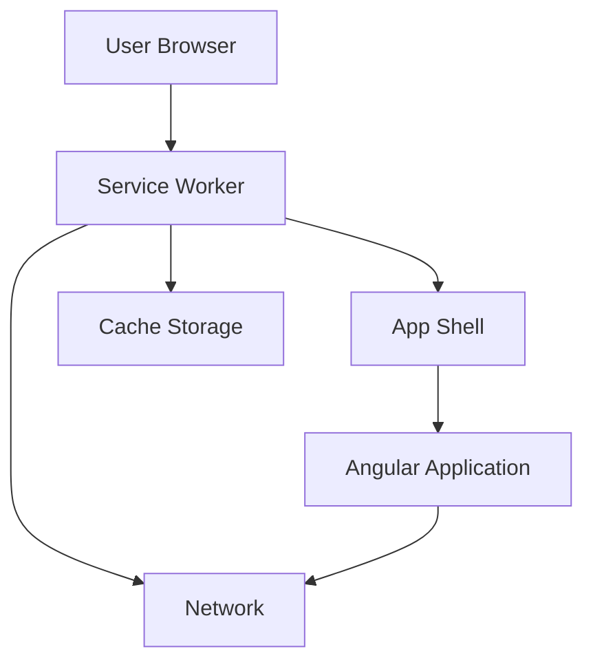

# Design Document: Angular PWA Setup

## Overview

This design outlines the implementation of a Progressive Web App using the latest stable version of Angular. The solution leverages Angular CLI for project scaffolding, @angular/pwa for PWA capabilities, and Angular's built-in service worker support for offline functionality.

The architecture follows Angular's recommended patterns with a focus on:
- Modern standalone components (standard in current Angular)
- Efficient caching strategies using Angular Service Worker
- Optimized build configuration with the latest build tools
- Installable app experience with proper manifest configuration

## Architecture

### High-Level Architecture



### Component Architecture

The application follows a layered architecture:

1. **Presentation Layer**: Angular components using standalone architecture
2. **Service Worker Layer**: Handles caching, offline support, and background sync
3. **Build Layer**: Angular CLI and build optimization tools
4. **Configuration Layer**: Manifest, service worker config, and environment settings

### Technology Stack

- **Framework**: Angular (latest stable version)
- **Build Tool**: Angular CLI with modern build system
- **Service Worker**: @angular/service-worker (ngsw)
- **Package Manager**: yarn
- **Styling**: SCSS (Sass)
- **TypeScript**: Latest compatible version
- **Testing**: Jasmine/Karma for unit tests, Playwright for e2e

## Components and Interfaces

### 1. Project Structure

```
angular-pwa-setup/
├── src/
│   ├── app/
│   │   ├── app.component.ts          # Root standalone component
│   │   ├── app.component.scss        # Component styles
│   │   ├── app.config.ts             # Application configuration
│   │   └── app.routes.ts             # Route definitions
│   ├── assets/
│   │   └── icons/                    # PWA icons
│   ├── environments/
│   │   ├── environment.ts            # Development config
│   │   └── environment.prod.ts       # Production config
│   ├── index.html                    # Main HTML file
│   ├── main.ts                       # Application bootstrap
│   ├── manifest.webmanifest          # PWA manifest
│   ├── ngsw-config.json             # Service worker config
│   └── styles.scss                   # Global styles (SCSS)
├── angular.json                      # Angular CLI configuration
├── package.json                      # Dependencies
└── tsconfig.json                     # TypeScript configuration
```

### 2. Service Worker Configuration Interface

```typescript
// ngsw-config.json structure
interface ServiceWorkerConfig {
  $schema: string;
  index: string;
  assetGroups: AssetGroup[];
  dataGroups?: DataGroup[];
}

interface AssetGroup {
  name: string;
  installMode: 'prefetch' | 'lazy';
  updateMode: 'prefetch' | 'lazy';
  resources: {
    files?: string[];
    urls?: string[];
  };
  cacheQueryOptions?: {
    ignoreSearch?: boolean;
  };
}

interface DataGroup {
  name: string;
  urls: string[];
  cacheConfig: {
    maxSize: number;
    maxAge: string;
    timeout?: string;
    strategy: 'freshness' | 'performance';
  };
}
```

### 3. Web App Manifest Interface

```typescript
// manifest.webmanifest structure
interface WebAppManifest {
  name: string;
  short_name: string;
  theme_color: string;
  background_color: string;
  display: 'standalone' | 'fullscreen' | 'minimal-ui' | 'browser';
  scope: string;
  start_url: string;
  icons: ManifestIcon[];
}

interface ManifestIcon {
  src: string;
  sizes: string;
  type: string;
  purpose?: 'any' | 'maskable' | 'monochrome';
}
```

### 4. PWA Service Interface

```typescript
// Service to handle PWA installation and updates
interface PwaService {
  // Check if app is running as installed PWA
  isInstalled(): boolean;
  
  // Prompt user to install PWA
  promptInstall(): Promise<boolean>;
  
  // Check for service worker updates
  checkForUpdates(): Promise<boolean>;
  
  // Listen for service worker updates
  onUpdateAvailable(): Observable<void>;
  
  // Apply pending updates
  applyUpdate(): Promise<void>;
}
```

### 5. App Configuration

```typescript
// app.config.ts
interface ApplicationConfig {
  providers: Provider[];
}

// Configuration includes:
// - Router with preloading strategy
// - Service worker registration
// - HTTP interceptors
// - Global error handlers
```

## Data Models

### 1. Service Worker Configuration Model

The service worker configuration defines caching strategies:

```typescript
// Default ngsw-config.json
{
  "$schema": "./node_modules/@angular/service-worker/config/schema.json",
  "index": "/index.html",
  "assetGroups": [
    {
      "name": "app",
      "installMode": "prefetch",
      "resources": {
        "files": [
          "/favicon.ico",
          "/index.html",
          "/manifest.webmanifest",
          "/*.css",
          "/*.js"
        ]
      }
    },
    {
      "name": "assets",
      "installMode": "lazy",
      "updateMode": "prefetch",
      "resources": {
        "files": [
          "/assets/**",
          "/*.(svg|cur|jpg|jpeg|png|apng|webp|avif|gif|otf|ttf|woff|woff2)"
        ]
      }
    }
  ]
}
```

### 2. Manifest Configuration Model

```typescript
// manifest.webmanifest
{
  "name": "Angular PWA Application",
  "short_name": "Angular PWA",
  "theme_color": "#1976d2",
  "background_color": "#fafafa",
  "display": "standalone",
  "scope": "./",
  "start_url": "./",
  "icons": [
    {
      "src": "assets/icons/icon-72x72.png",
      "sizes": "72x72",
      "type": "image/png",
      "purpose": "maskable any"
    },
    {
      "src": "assets/icons/icon-96x96.png",
      "sizes": "96x96",
      "type": "image/png",
      "purpose": "maskable any"
    },
    {
      "src": "assets/icons/icon-128x128.png",
      "sizes": "128x128",
      "type": "image/png",
      "purpose": "maskable any"
    },
    {
      "src": "assets/icons/icon-144x144.png",
      "sizes": "144x144",
      "type": "image/png",
      "purpose": "maskable any"
    },
    {
      "src": "assets/icons/icon-152x152.png",
      "sizes": "152x152",
      "type": "image/png",
      "purpose": "maskable any"
    },
    {
      "src": "assets/icons/icon-192x192.png",
      "sizes": "192x192",
      "type": "image/png",
      "purpose": "maskable any"
    },
    {
      "src": "assets/icons/icon-384x384.png",
      "sizes": "384x384",
      "type": "image/png",
      "purpose": "maskable any"
    },
    {
      "src": "assets/icons/icon-512x512.png",
      "sizes": "512x512",
      "type": "image/png",
      "purpose": "maskable any"
    }
  ]
}
```

### 3. Environment Configuration Model

```typescript
// environment.ts
export const environment = {
  production: false,
  enableServiceWorker: false
};

// environment.prod.ts
export const environment = {
  production: true,
  enableServiceWorker: true
};
```

### 4. Build Configuration Model

The angular.json file contains build configurations:

```typescript
{
  "projects": {
    "app-name": {
      "architect": {
        "build": {
          "configurations": {
            "production": {
              "optimization": true,
              "outputHashing": "all",
              "sourceMap": false,
              "namedChunks": false,
              "aot": true,
              "extractLicenses": true,
              "budgets": [
                {
                  "type": "initial",
                  "maximumWarning": "500kb",
                  "maximumError": "1mb"
                }
              ],
              "serviceWorker": true,
              "ngswConfigPath": "ngsw-config.json"
            }
          }
        }
      }
    }
  }
}
```

## Correctness Properties

A property is a characteristic or behavior that should hold true across all valid executions of a system -— essentially, a formal statement about what the system should do. Properties serve as the bridge between human-readable specifications and machine-verifiable correctness guarantees.

For this Angular PWA setup feature, most requirements are configuration-based and are best validated through specific examples rather than universal properties. The following properties and examples ensure the setup is correct:

### Configuration Validation Examples

**Example 1: Project Structure Validation**
Verify that the generated project contains all required directories and files:
- src/ directory exists
- src/app/ directory exists
- src/assets/ directory exists
- src/environments/ directory exists
- angular.json exists
- package.json exists
- tsconfig.json exists
**Validates: Requirements 1.5**

**Example 2: TypeScript Strict Mode Configuration**
Verify that tsconfig.json contains strict mode settings:
- "strict": true is present in compilerOptions
**Validates: Requirements 1.2**

**Example 3: Routing Configuration**
Verify that routing is configured:
- app.routes.ts file exists
- app.config.ts includes provideRouter
**Validates: Requirements 1.3**

**Example 4: PWA Package Installation**
Verify that @angular/pwa is installed:
- package.json contains @angular/pwa in dependencies
- package.json contains @angular/service-worker in dependencies
**Validates: Requirements 2.1**

**Example 5: Service Worker Configuration File**
Verify that ngsw-config.json exists and has correct structure:
- File exists at project root
- Contains $schema, index, and assetGroups fields
- assetGroups is an array with at least one entry
**Validates: Requirements 2.2**

**Example 6: Service Worker Registration**
Verify that service worker is registered in app configuration:
- app.config.ts imports provideServiceWorker
- provideServiceWorker is included in providers array
**Validates: Requirements 2.3**

**Example 7: Production Build Service Worker Configuration**
Verify that angular.json enables service worker in production:
- projects.[app-name].architect.build.configurations.production.serviceWorker is true
- projects.[app-name].architect.build.configurations.production.ngswConfigPath points to ngsw-config.json
**Validates: Requirements 2.4**

**Example 8: Service Worker Environment Configuration**
Verify that service worker is disabled in development:
- environment.ts has enableServiceWorker: false
- environment.prod.ts has enableServiceWorker: true
**Validates: Requirements 2.5**

**Example 9: Manifest Required Fields**
Verify that manifest.webmanifest contains required fields:
- name field exists and is non-empty
- short_name field exists and is non-empty
- theme_color field exists
- background_color field exists
- display field equals "standalone"
- start_url field exists
- icons array exists and is non-empty
**Validates: Requirements 3.1, 3.2, 3.3, 3.5**

**Example 10: Manifest Icon Sizes**
Verify that manifest includes required icon sizes:
- icons array contains entry with sizes "192x192"
- icons array contains entry with sizes "512x512"
**Validates: Requirements 3.4**

**Example 11: Manifest Link in HTML**
Verify that index.html links to manifest:
- index.html contains <link rel="manifest" href="manifest.webmanifest">
**Validates: Requirements 3.6**

**Example 12: Service Worker App Shell Caching**
Verify that ngsw-config.json caches app shell:
- assetGroups contains a group with installMode "prefetch"
- This group's resources.files includes "/index.html"
- This group's resources.files includes patterns for CSS and JS files
**Validates: Requirements 4.1, 6.4**

**Example 13: Service Worker Asset Groups**
Verify that ngsw-config.json defines multiple cache groups:
- assetGroups array has at least 2 entries
- One group for app shell (prefetch)
- One group for assets (lazy)
**Validates: Requirements 4.3**

**Example 14: App Shell HTML Structure**
Verify that index.html contains minimal required structure:
- Contains <app-root> element
- Contains <noscript> fallback message
- Contains meta viewport tag
**Validates: Requirements 6.1**

**Example 15: Production Build Optimization**
Verify that angular.json enables production optimizations:
- production configuration has optimization: true
- production configuration has aot: true
- production configuration has outputHashing: "all"
- production configuration has extractLicenses: true
**Validates: Requirements 7.1, 7.2, 7.4**

**Example 16: Production Build Service Worker Generation**
Verify that production build generates service worker:
- production configuration has serviceWorker: true
**Validates: Requirements 7.3**

**Example 17: Build Output Configuration**
Verify that build outputs to dist directory:
- angular.json projects.[app-name].architect.build.options.outputPath starts with "dist/"
**Validates: Requirements 7.6**

**Example 18: PWA Service Interface**
Verify that PWA service provides installation management:
- Service has promptInstall() method
- Service has isInstalled() method
- Service has checkForUpdates() method
- Service captures beforeinstallprompt event
**Validates: Requirements 8.2, 8.3, 8.4**

**Example 19: Development Server Configuration**
Verify that development server is configured:
- angular.json has serve configuration
- package.json has "start" script that runs ng serve
**Validates: Requirements 9.1**

**Example 20: HTTPS Development Support**
Verify that HTTPS can be enabled for development:
- angular.json serve options support ssl configuration
**Validates: Requirements 9.3**

**Example 21: Test Configuration**
Verify that testing is configured:
- angular.json has test configuration
- package.json has "test" script
- karma.conf.js or similar test config exists
**Validates: Requirements 9.5**

**Example 22: Icon Files Existence**
Verify that all required icon files exist:
- assets/icons/icon-72x72.png exists
- assets/icons/icon-96x96.png exists
- assets/icons/icon-128x128.png exists
- assets/icons/icon-144x144.png exists
- assets/icons/icon-152x152.png exists
- assets/icons/icon-192x192.png exists
- assets/icons/icon-384x384.png exists
- assets/icons/icon-512x512.png exists
**Validates: Requirements 10.1**

**Example 23: Manifest Icon Configuration**
Verify that manifest icons array is properly configured:
- Each icon entry has src, sizes, and type fields
- Icon paths match actual file locations
- Icon sizes match file names
**Validates: Requirements 10.2**

**Example 24: Favicon Configuration**
Verify that favicon is configured:
- favicon.ico exists in src/
- index.html contains <link rel="icon" type="image/x-icon" href="favicon.ico">
**Validates: Requirements 10.3**

**Example 25: Asset Build Configuration**
Verify that assets are configured to be copied during build:
- angular.json build options include assets array
- assets array includes "src/favicon.ico"
- assets array includes "src/assets"
- assets array includes "src/manifest.webmanifest"
**Validates: Requirements 10.4**

## Error Handling

### Build Errors

1. **Missing Dependencies**: If @angular/pwa is not installed, the build will fail. The setup process must verify package installation.

2. **Invalid Configuration**: If ngsw-config.json has syntax errors, the service worker generation will fail. Validate JSON structure during setup.

3. **Missing Icons**: If referenced icons don't exist, the manifest will be invalid. Verify all icon files exist before finalizing setup.

### Runtime Errors

1. **Service Worker Registration Failure**: If the service worker fails to register (e.g., not served over HTTPS), provide clear error messages and fallback to non-PWA mode.

2. **Cache Storage Quota**: If cache storage quota is exceeded, the service worker should handle gracefully by clearing old caches.

3. **Update Failures**: If service worker updates fail, retry with exponential backoff and notify the user if persistent.

### Development Errors

1. **HTTPS Requirement**: Service workers require HTTPS (except localhost). Development setup should support HTTPS or clearly document the localhost exception.

2. **Browser Compatibility**: Not all browsers support all PWA features. Provide feature detection and graceful degradation.

## Testing Strategy

### Unit Testing Approach

Unit tests will focus on verifying configuration files and setup correctness:

1. **Configuration Validation Tests**
   - Test that all configuration files exist
   - Test that configuration files have correct structure
   - Test that required fields are present with correct values

2. **Service Tests**
   - Test PWA service methods (promptInstall, checkForUpdates)
   - Test event handling logic
   - Mock browser APIs (beforeinstallprompt, service worker)

3. **Component Tests**
   - Test that components render correctly
   - Test that routing works as expected
   - Test that service worker updates are handled

### Property-Based Testing Approach

Since this feature is primarily about project setup and configuration, property-based testing is less applicable. However, we can use property-based testing for:

1. **Configuration Validation Properties**
   - *For any* valid Angular project, the configuration files should parse without errors
   - *For any* valid manifest file, all icon paths should resolve to existing files

### Integration Testing

1. **Build Process Testing**
   - Test that `ng build` completes successfully
   - Test that `ng build --configuration=production` generates service worker
   - Test that build output contains all expected files

2. **Service Worker Testing**
   - Test that service worker registers successfully in production build
   - Test that offline functionality works (using tools like Workbox testing utilities)
   - Test that cache strategies work as configured

3. **PWA Criteria Testing**
   - Test that the app meets PWA criteria (using Lighthouse)
   - Test that install prompt appears when criteria are met
   - Test that installed app launches correctly

### End-to-End Testing

1. **Installation Flow**
   - Test complete installation flow from prompt to installed app
   - Test that installed app launches in standalone mode
   - Test that app icon appears correctly

2. **Offline Functionality**
   - Test that app loads when offline
   - Test that cached resources are served
   - Test that app updates when back online

3. **Update Flow**
   - Test that service worker updates are detected
   - Test that users are notified of updates
   - Test that updates are applied correctly

### Testing Tools

- **Unit Tests**: Jasmine/Karma (Angular default)
- **E2E Tests**: Playwright
- **PWA Testing**: Lighthouse CI, Workbox testing utilities
- **Service Worker Testing**: Puppeteer for offline simulation

### Test Configuration

All tests should be configured to run with:
- Minimum 100 iterations for any property-based tests
- Each test tagged with: **Feature: angular-pwa-setup, Example {number}: {description}**
- CI/CD integration for automated testing on every commit
