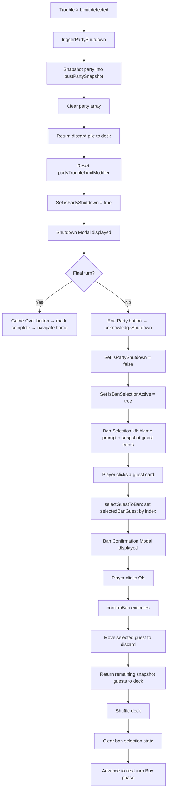
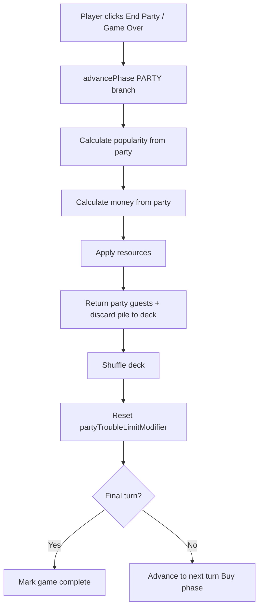

# Design Document: Ban Guest After Bust

## Overview

This feature modifies the existing party shutdown flow to add a guest banning mechanic. After a party bust on a non-final turn, instead of immediately advancing to the next turn, the player must select one attending guest to "blame." That guest is moved to a new discard pile — a third location for guest cards alongside the deck and party. Guests in the discard pile are excluded from future invitations until they are returned to the deck at the start of the next party end.

### Key Design Decisions

1. **Discard Pile as Third Location**: A `discard: Guest[]` array is added to `GameStoreState`. Guest conservation now spans three locations: `deck.length + party.length + discard.length === totalGuests`. The discard pile is never drawn from by `inviteGuest()`.

2. **Snapshot-Based Ban Selection**: When a bust occurs, `triggerPartyShutdown()` no longer returns guests to deck immediately. Instead, it snapshots the current party into `bustPartySnapshot: Guest[]` and sets `isBanSelectionActive: boolean` to false (ban selection hasn't started yet — the shutdown modal shows first). When the player dismisses the shutdown modal via `acknowledgeShutdown()` on a non-final turn, it sets `isBanSelectionActive = true` instead of advancing. The snapshot preserves which guests were at the party for the ban selection UI, even though the party array may be cleared during the process.

3. **Two-Step Ban Confirmation**: The player clicks a guest card to select them (`selectGuestToBan(index)`), which stores the selection and shows a confirmation modal. The index refers to the guest's position in the `bustPartySnapshot` array — names are flavour text and should not be used as identifiers. Clicking "OK" on the confirmation modal calls `confirmBan()`, which executes the actual ban: selected guest → discard, remaining snapshot guests → deck, shuffle deck, advance to next turn Buy phase.

4. **Discard Return Timing**: At the END of any party end (normal or bust), after resource calculations are complete, guests in the discard pile are returned to the deck alongside party guests. For normal party end in `advancePhase()`, calculate resources first (while discard and deck sizes are stable for potential future effects), then return both party guests and discard pile to the deck together and shuffle. For bust via `triggerPartyShutdown()`, snapshot the party first, then return discard pile to deck. This ordering preserves the discard/deck state during scoring, which future guest effects may depend on.

5. **Final Turn Bypass**: On the final turn, `acknowledgeShutdown()` marks the game complete and navigates home — no ban selection occurs. The `bustPartySnapshot` is irrelevant on the final turn.

6. **Status Pane Disabled During Ban Selection**: Both the phase button and invite button are disabled when `isBanSelectionActive` is true, same as during `isPartyShutdown`. The disabled condition becomes `isPartyShutdown() || isBanSelectionActive()`.

## Architecture

### Modified Layers

```
GameState Layer (game-state.interface.ts)
└── No changes needed (discard/ban state is store-only, not core game state)

GameStoreState (game.store.ts)
├── + discard: Guest[]                    (new: discard pile)
├── + isBanSelectionActive: boolean       (new: ban selection sub-phase flag)
├── + bustPartySnapshot: Guest[]          (new: party guests at time of bust)
├── + selectedBanGuest: Guest | null      (new: guest selected for banning)
└── isPartyShutdown: boolean              (existing, unchanged)

GameStore Computed Signals
└── + banConfirmationMessage: computed    (new: formatted ban confirmation text)

GameStore Methods
├── triggerPartyShutdown()                (modified: return discard→deck, snapshot party, don't return party→deck)
├── acknowledgeShutdown()                 (modified: non-final turn enters ban selection instead of advancing)
├── + selectGuestToBan(index: number)     (new: sets selectedBanGuest by snapshot index)
├── + confirmBan()                        (new: executes ban process)
├── advancePhase() PARTY branch           (modified: return discard→deck before resource calc)
├── initializeGame()                      (modified: include discard: [], ban state defaults)
└── resetGame()                           (modified: include discard: [], ban state defaults)

UI Layer
├── PhaseContentComponent                 (modified: ban selection UI + confirmation modal)
├── StatusPaneComponent                   (modified: disable buttons during ban selection)
├── GuestCardComponent                    (unchanged — reused with click handler in parent)
└── GameplayComponent                     (unchanged)
```

### Shutdown + Ban Flow



### Normal Party End Flow (Modified)



### Integration Points

1. **GameStoreState**: Add `discard`, `isBanSelectionActive`, `bustPartySnapshot`, `selectedBanGuest`
2. **GameStore Methods**: Modify `triggerPartyShutdown()`, `acknowledgeShutdown()`, `advancePhase()`, `initializeGame()`, `resetGame()`; add `selectGuestToBan()`, `confirmBan()`
3. **GameStore Computed**: Add `banConfirmationMessage`
4. **PhaseContentComponent**: Add ban selection view (blame prompt + clickable guest cards) and ban confirmation modal
5. **StatusPaneComponent**: Extend disabled condition to include `isBanSelectionActive`
6. **GuestCardComponent**: Unchanged — parent handles click binding

## Components and Interfaces

### Modified Store State

#### GameStoreState

```typescript
export interface GameStoreState extends GameState {
  deck: Guest[];
  party: Guest[];
  discard: Guest[];                       // NEW: discard pile for banned guests
  showEmptyDeckMessage: boolean;
  isPartyShutdown: boolean;
  isBanSelectionActive: boolean;          // NEW: true during ban selection sub-phase
  bustPartySnapshot: Guest[];             // NEW: party guests at time of bust
  selectedBanGuest: Guest | null;         // NEW: guest selected for banning (confirmation pending)
}
```

#### Initial State

```typescript
const initialState: GameStoreState = {
  currentTurn: 1,
  currentPhase: GamePhase.BUY,
  totalTurns: 25,
  isGameComplete: false,
  popularity: 0,
  money: 0,
  baseTroubleLimit: 2,
  partyTroubleLimitModifier: 0,
  deck: [],
  party: [],
  discard: [],                            // NEW
  showEmptyDeckMessage: false,
  isPartyShutdown: false,
  isBanSelectionActive: false,            // NEW
  bustPartySnapshot: [],                  // NEW
  selectedBanGuest: null                  // NEW
};
```

### Shared Guest Type Labels

The `GUEST_TYPE_LABELS` mapping is currently defined inside `GuestCardComponent`. As part of this feature, it should be extracted to `guest.model.ts` as a shared export so it can be reused by both the component and the store's computed signal without duplication.

```typescript
// In guest.model.ts — NEW export
export const GUEST_TYPE_LABELS: Record<GuestType, string> = {
  OLD_FRIEND: 'Old Friend',
  WILD_BUDDY: 'Wild Buddy',
  RICH_PAL: 'Rich Pal'
};
```

`GuestCardComponent` should be updated to import and use this shared constant instead of its local copy.

### New Computed Signal

```typescript
banConfirmationMessage: computed(() => {
  const guest = store.selectedBanGuest();
  if (!guest) return '';
  const typeLabel = GUEST_TYPE_LABELS[guest.type] ?? guest.type;
  return `${typeLabel} ${guest.name} will be banned from the next party.`;
})
```

### Modified Methods

#### triggerPartyShutdown() — Modified

```typescript
triggerPartyShutdown(): void {
  // Step 1: Snapshot the current party for ban selection
  const partySnapshot = [...store.party()];

  // Step 2: Return discard pile to deck (after snapshot, preserving discard state during scoring)
  const currentDiscard = store.discard();
  const currentDeck = store.deck();
  const deckWithReturned = [...currentDeck, ...currentDiscard];

  // Step 3: Clear party, discard; set shutdown flag
  patchState(store, {
    deck: deckWithReturned,
    party: [],
    discard: [],
    bustPartySnapshot: partySnapshot,
    partyTroubleLimitModifier: 0,
    isPartyShutdown: true
  });
}
```

#### acknowledgeShutdown() — Modified

```typescript
acknowledgeShutdown(): void {
  const currentTurn = store.currentTurn();
  const totalTurns = store.totalTurns();

  if (currentTurn === totalTurns) {
    // Final turn: game over, no ban selection
    patchState(store, {
      isPartyShutdown: false,
      isGameComplete: true,
      bustPartySnapshot: [],
      selectedBanGuest: null
    });
  } else {
    // Non-final turn: enter ban selection
    patchState(store, {
      isPartyShutdown: false,
      isBanSelectionActive: true
    });
  }
}
```

### New Methods

#### selectGuestToBan(index: number)

```typescript
selectGuestToBan(index: number): void {
  const snapshot = store.bustPartySnapshot();
  if (index < 0 || index >= snapshot.length) return;
  patchState(store, { selectedBanGuest: snapshot[index] });
}
```

#### confirmBan()

```typescript
confirmBan(): void {
  const selected = store.selectedBanGuest();
  if (!selected) return;

  const snapshot = store.bustPartySnapshot();
  const remaining = snapshot.filter(g => g !== selected);
  const currentDeck = store.deck();
  const updatedDeck = [...currentDeck, ...remaining];

  // Shuffle the deck
  shuffleDeck(updatedDeck);

  const currentTurn = store.currentTurn();

  patchState(store, {
    discard: [selected],
    deck: updatedDeck,
    isBanSelectionActive: false,
    bustPartySnapshot: [],
    selectedBanGuest: null,
    currentTurn: currentTurn + 1,
    currentPhase: GamePhase.BUY
  });
}
```

#### advancePhase() PARTY Branch — Modified

```typescript
// In the PARTY phase branch of advancePhase():

// Step 1: Calculate resources from party (while discard/deck state is stable)
const popularityChange = calculatePopularityChange();
const currentPopularity = store.popularity();
const newPopularity = Math.max(0, currentPopularity + popularityChange);

const moneyChange = calculateMoneyChange();
const currentMoney = store.money();
const newMoney = Math.max(0, currentMoney + moneyChange);

patchState(store, { popularity: newPopularity, money: newMoney });

// Step 2: Return both party guests and discard pile to deck, then shuffle
const party = store.party();
const currentDiscard = store.discard();
const currentDeck = store.deck();
const finalDeck = [...currentDeck, ...party, ...currentDiscard];
shuffleDeck(finalDeck);

patchState(store, {
  deck: finalDeck,
  party: [],
  discard: [],
  partyTroubleLimitModifier: 0
});

// Step 3: Advance turn or complete game
if (currentTurn === totalTurns) {
  patchState(store, { isGameComplete: true });
} else {
  patchState(store, {
    currentTurn: currentTurn + 1,
    currentPhase: GamePhase.BUY
  });
}
```

#### initializeGame() — Modified

```typescript
patchState(store, {
  currentTurn: 1,
  currentPhase: GamePhase.BUY,
  totalTurns: turnCount,
  isGameComplete: false,
  popularity: 0,
  money: 0,
  baseTroubleLimit: 2,
  partyTroubleLimitModifier: 0,
  deck,
  party: [],
  discard: [],                            // NEW
  showEmptyDeckMessage: false,
  isPartyShutdown: false,
  isBanSelectionActive: false,            // NEW
  bustPartySnapshot: [],                  // NEW
  selectedBanGuest: null                  // NEW
});
```

#### resetGame() — Modified

The `initialState` object already includes the new fields, so `resetGame()` (which patches with `initialState`) automatically resets them.

### Modified Components

#### PhaseContentComponent — Ban Selection UI

When `isBanSelectionActive` is true, show the blame prompt and snapshot guests as clickable cards. When `selectedBanGuest` is non-null, show the confirmation modal.

```html
<!-- Existing party content... -->

<!-- Ban Selection Phase -->
@if (gameStore.isBanSelectionActive()) {
  <div class="ban-selection">
    <h3 class="blame-prompt">Who takes the blame?</h3>
    <div class="guest-cards-container">
      @for (guest of gameStore.bustPartySnapshot(); track $index) {
        <button
          class="ban-guest-button"
          (click)="gameStore.selectGuestToBan($index)"
          [attr.aria-label]="'Ban ' + guest.name">
          <app-guest-card [guest]="guest" />
        </button>
      }
    </div>
  </div>
}

<!-- Ban Confirmation Modal -->
@if (gameStore.selectedBanGuest()) {
  <div class="ban-modal-overlay" role="dialog" aria-modal="true" aria-labelledby="ban-title">
    <div class="ban-modal">
      <p id="ban-title">{{ gameStore.banConfirmationMessage() }}</p>
      <button
        class="ban-confirm-button"
        (click)="gameStore.confirmBan()"
        aria-label="OK">
        OK
      </button>
    </div>
  </div>
}
```

#### StatusPaneComponent — Extended Disabled Condition

```html
<button 
  class="invite-button"
  (click)="onInviteGuest()"
  [disabled]="gameStore.isPartyShutdown() || gameStore.isBanSelectionActive()"
  aria-label="Invite Guest">
  Invite Guest
</button>

<button 
  class="phase-button"
  (click)="gameStore.advancePhase()"
  [disabled]="gameStore.isPartyShutdown() || gameStore.isBanSelectionActive()"
  [attr.aria-label]="gameStore.phaseButtonLabel()">
  {{ gameStore.phaseButtonLabel() }}
</button>
```

## Data Models

### Guest Locations

| Location | Type | Description |
|----------|------|-------------|
| `deck` | `Guest[]` | Shuffled draw pile; source for `inviteGuest()` |
| `party` | `Guest[]` | Currently attending guests |
| `discard` | `Guest[]` | Banned guests; excluded from invitations |

### Conservation Invariant

```
deck.length + party.length + discard.length === TOTAL_GUESTS (10)
```

This must hold at all times after initialization. Guest movements:
- `inviteGuest()`: deck → party (1 guest)
- Normal party end: resources calculated first (discard/deck stable), then party + discard → deck (all), shuffle
- Bust: party → snapshot, party cleared, discard → deck
- `confirmBan()`: 1 snapshot guest → discard, remaining snapshot guests → deck

### Ban Selection State

| Field | Type | Default | Description |
|-------|------|---------|-------------|
| `isBanSelectionActive` | `boolean` | `false` | True during ban selection sub-phase |
| `bustPartySnapshot` | `Guest[]` | `[]` | Frozen copy of party at bust time |
| `selectedBanGuest` | `Guest \| null` | `null` | Guest chosen for banning (pending confirmation) |

### State Transitions

| Event | isPartyShutdown | isBanSelectionActive | selectedBanGuest |
|-------|----------------|---------------------|-----------------|
| Bust detected | `true` | `false` | `null` |
| Shutdown modal dismissed (non-final) | `false` | `true` | `null` |
| Shutdown modal dismissed (final) | `false` | `false` | `null` |
| Guest card clicked during ban selection | `false` | `true` | `Guest` |
| Ban confirmed (OK clicked) | `false` | `false` | `null` |

### Guest Type Labels (Shared from guest.model.ts)

```typescript
// Exported from guest.model.ts, imported by GuestCardComponent and GameStore
export const GUEST_TYPE_LABELS: Record<GuestType, string> = {
  OLD_FRIEND: 'Old Friend',
  WILD_BUDDY: 'Wild Buddy',
  RICH_PAL: 'Rich Pal'
};
```

Used in `GuestCardComponent` (refactored to import) and in the `banConfirmationMessage` computed signal in the store.

### Ban Confirmation Message Format

```
"{TypeLabel} {Name} will be banned from the next party."
```

Examples:
- "Old Friend Brian will be banned from the next party."
- "Wild Buddy Anthony will be banned from the next party."
- "Rich Pal Khalil will be banned from the next party."


## Correctness Properties

*A property is a characteristic or behavior that should hold true across all valid executions of a system — essentially, a formal statement about what the system should do. Properties serve as the bridge between human-readable specifications and machine-verifiable correctness guarantees.*

### Property 1: Guest Conservation Invariant

*For any* sequence of game operations (inviteGuest, advancePhase, triggerPartyShutdown, acknowledgeShutdown, selectGuestToBan, confirmBan), the sum `deck.length + party.length + discard.length` SHALL equal the total number of guests initialized at game start (10).

This is the fundamental invariant of the three-location guest system. No operation should create or destroy guests. It subsumes requirements about guests being removed from one location when added to another (8.2, 8.3).

**Validates: Requirements 1.4, 8.1, 8.2, 8.3**

### Property 2: Discard Pile Returned to Deck on Party End

*For any* game state with guests in the discard pile, when a party ends (either normally via `advancePhase()` or via `triggerPartyShutdown()`), the discard pile SHALL be empty afterward, and the deck SHALL contain all previously discarded guests (verified by type and name).

This ensures banned guests rejoin the available pool at the start of every party end, before any ban selection occurs.

**Validates: Requirements 2.1, 2.2, 2.3**

### Property 3: Acknowledge Shutdown Enters Ban Selection If and Only If Non-Final Turn

*For any* game state where `isPartyShutdown` is true, calling `acknowledgeShutdown()` SHALL set `isBanSelectionActive = true` and `isPartyShutdown = false` if the current turn is not the final turn. If the current turn IS the final turn, `isBanSelectionActive` SHALL remain false and `isGameComplete` SHALL be true.

This combines the non-final-turn ban entry (3.2) with the final-turn bypass (4.3) into a single bidirectional property.

**Validates: Requirements 3.2, 4.3**

### Property 4: Ban Selection UI Renders Blame Prompt and Snapshot Guests

*For any* game state where `isBanSelectionActive` is true and `bustPartySnapshot` contains N guests (N > 0), the PhaseContentComponent SHALL render the text "Who takes the blame?" and exactly N guest cards matching the snapshot guests.

**Validates: Requirements 3.3, 3.4**

### Property 5: Status Pane Buttons Disabled During Ban Selection

*For any* game state where `isBanSelectionActive` is true, the phase button and invite button in the StatusPaneComponent SHALL be disabled.

**Validates: Requirements 3.5**

### Property 6: Ban Confirmation Message Format

*For any* guest of type OLD_FRIEND, WILD_BUDDY, or RICH_PAL with any name, the `banConfirmationMessage` computed signal SHALL produce the string `"{TypeLabel} {Name} will be banned from the next party."` where TypeLabel maps OLD_FRIEND→"Old Friend", WILD_BUDDY→"Wild Buddy", RICH_PAL→"Rich Pal".

This single property covers all three type label requirements (9.1, 9.2, 9.3) and the message format requirement (5.2).

**Validates: Requirements 5.2, 9.1, 9.2, 9.3**

### Property 7: Confirm Ban Splits Snapshot Correctly

*For any* bust party snapshot of N guests and any selected guest from that snapshot, calling `confirmBan()` SHALL place exactly the selected guest in the discard pile and all other (N-1) guests from the snapshot in the deck.

This ensures the ban process correctly partitions the snapshot: one guest is banned, the rest return to the deck.

**Validates: Requirements 6.1, 6.2**

### Property 8: Confirm Ban Advances Game State

*For any* game state where ban selection is active on turn T (non-final), calling `confirmBan()` SHALL result in `currentTurn = T + 1`, `currentPhase = BUY`, `party = []`, `isBanSelectionActive = false`, `bustPartySnapshot = []`, and `selectedBanGuest = null`.

**Validates: Requirements 6.4, 6.5**

### Property 9: Invite Guest Does Not Touch Discard Pile

*For any* game state with any number of guests in the discard pile, calling `inviteGuest()` SHALL leave the discard pile unchanged. When the deck is empty, `inviteGuest()` SHALL not draw from the discard pile regardless of its contents.

**Validates: Requirements 7.1, 7.2, 7.3**

### Property 10: Guest Data Integrity Across All Movements

*For any* sequence of game operations, every guest in deck, party, and discard SHALL have a type that is one of OLD_FRIEND, WILD_BUDDY, or RICH_PAL, and a name that matches one of the original INITIAL_GUESTS entries. The multiset of (type, name) pairs across all three locations SHALL equal the multiset of INITIAL_GUESTS.

**Validates: Requirements 2.2, 8.4**

## Error Handling

### confirmBan() Called With No Selection

If `confirmBan()` is called when `selectedBanGuest` is null, the method returns early without modifying state. The UI prevents this by only showing the confirmation modal when a guest is selected.

### selectGuestToBan() With Invalid Index

If `selectGuestToBan(index)` is called with an index outside the bounds of `bustPartySnapshot`, the method returns early without modifying state. No confirmation modal appears. The UI prevents this by only rendering buttons for snapshot guests using `$index`.

### Ban Selection on Empty Snapshot

If `bustPartySnapshot` is empty when `isBanSelectionActive` is true (shouldn't happen in normal flow), the UI renders no guest cards. The player cannot select anyone, so the game would be stuck. This is prevented by the flow: `triggerPartyShutdown()` only sets the snapshot from a non-empty party (trouble > limit requires at least one WILD_BUDDY guest).

### Double Ban Confirmation

`confirmBan()` clears `isBanSelectionActive`, `bustPartySnapshot`, and `selectedBanGuest` atomically in a single `patchState()`. The UI immediately stops rendering the ban selection view, preventing double clicks.

### Discard Pile During Non-Bust Party End

If the discard pile is empty when a normal party ends, the discard-to-deck return is a no-op (spreading an empty array). No special handling needed.

### Game Reset During Ban Selection

`resetGame()` patches with `initialState` which sets `isBanSelectionActive = false`, `bustPartySnapshot = []`, `selectedBanGuest = null`, and `discard = []`. All ban state is cleanly reset.

## Testing Strategy

### Dual Testing Approach

- **Unit tests**: Verify specific examples (initial discard is empty, ban confirmation message for specific guests, shutdown modal button labels, specific ban scenarios), edge cases (ban on turn 24 of 25, empty discard on party end, deck empty with discard full), and DOM structure (blame prompt text, confirmation modal elements, disabled buttons)
- **Property tests**: Verify universal properties across all valid inputs (guest conservation, discard return, ban selection entry, message format, snapshot splitting, invite isolation, data integrity)

Both are complementary — unit tests catch concrete regressions while property tests verify general correctness across the input space.

### Property-Based Testing Configuration

**Library**: fast-check (already installed in the project)

**Configuration**:
- Minimum 100 iterations per property test
- Each test tagged with comment referencing design property
- Tag format: `// Feature: ban-guest-after-bust, Property {number}: {property_text}`
- Each correctness property implemented by a SINGLE property-based test

### Property Test Plan

1. **Property 1 test**: Generate random sequences of game operations (invite, advance, shutdown, ban). After each operation, verify `deck.length + party.length + discard.length === 10`.
   - Tag: `// Feature: ban-guest-after-bust, Property 1: Guest Conservation Invariant`

2. **Property 2 test**: Generate random discard pile contents (1-3 guests) and random party compositions. Trigger party end (both normal and bust paths). Verify discard is empty and deck contains the previously discarded guests by type and name.
   - Tag: `// Feature: ban-guest-after-bust, Property 2: Discard Pile Returned to Deck on Party End`

3. **Property 3 test**: Generate random turn numbers (1 to totalTurns). Set isPartyShutdown = true. Call acknowledgeShutdown(). Verify: if non-final turn, isBanSelectionActive is true and turn unchanged; if final turn, isGameComplete is true and isBanSelectionActive is false.
   - Tag: `// Feature: ban-guest-after-bust, Property 3: Acknowledge Shutdown Enters Ban Selection If and Only If Non-Final Turn`

4. **Property 4 test**: Generate random bustPartySnapshot arrays (1-10 guests). Set isBanSelectionActive = true. Render PhaseContentComponent. Verify blame prompt text is present and the correct number of guest card buttons are rendered.
   - Tag: `// Feature: ban-guest-after-bust, Property 4: Ban Selection UI Renders Blame Prompt and Snapshot Guests`

5. **Property 5 test**: Generate random game states with isBanSelectionActive = true during Party phase. Render StatusPaneComponent. Verify phase button and invite button are disabled.
   - Tag: `// Feature: ban-guest-after-bust, Property 5: Status Pane Buttons Disabled During Ban Selection`

6. **Property 6 test**: Generate random guests with type drawn from {OLD_FRIEND, WILD_BUDDY, RICH_PAL} and random names. Set as selectedBanGuest. Verify banConfirmationMessage matches the expected format with correct type label.
   - Tag: `// Feature: ban-guest-after-bust, Property 6: Ban Confirmation Message Format`

7. **Property 7 test**: Generate random bustPartySnapshot arrays (2-10 guests). Select a random guest from the snapshot. Call confirmBan(). Verify the selected guest is in discard and all other snapshot guests are in the deck.
   - Tag: `// Feature: ban-guest-after-bust, Property 7: Confirm Ban Splits Snapshot Correctly`

8. **Property 8 test**: Generate random non-final turn numbers. Set up ban selection state. Call confirmBan(). Verify currentTurn incremented, currentPhase is BUY, party is empty, and all ban state is cleared.
   - Tag: `// Feature: ban-guest-after-bust, Property 8: Confirm Ban Advances Game State`

9. **Property 9 test**: Generate random game states with various discard pile contents (0-5 guests). Call inviteGuest(). Verify discard pile is unchanged. Also test with empty deck and non-empty discard — verify showEmptyDeckMessage is set and discard is untouched.
   - Tag: `// Feature: ban-guest-after-bust, Property 9: Invite Guest Does Not Touch Discard Pile`

10. **Property 10 test**: Generate random sequences of game operations. After each, collect all guests from deck + party + discard. Verify the multiset of (type, name) pairs equals the original INITIAL_GUESTS multiset.
    - Tag: `// Feature: ban-guest-after-bust, Property 10: Guest Data Integrity Across All Movements`

### Unit Test Plan

**Store tests** (`game.store.spec.ts`):
- After initializeGame(), discard is empty array
- After resetGame(), discard is empty array
- triggerPartyShutdown() sets bustPartySnapshot to current party guests
- triggerPartyShutdown() clears party array
- triggerPartyShutdown() snapshots party then returns discard to deck
- acknowledgeShutdown() on non-final turn sets isBanSelectionActive = true
- acknowledgeShutdown() on final turn does NOT set isBanSelectionActive
- selectGuestToBan() sets selectedBanGuest to guest at given index
- selectGuestToBan() with out-of-bounds index is a no-op
- confirmBan() places selected guest in discard
- confirmBan() returns remaining snapshot guests to deck
- confirmBan() advances to next turn Buy phase
- confirmBan() clears all ban selection state
- confirmBan() with no selection is a no-op
- advancePhase() PARTY branch calculates resources before returning discard and party to deck
- banConfirmationMessage for Old Friend guest
- banConfirmationMessage for Wild Buddy guest
- banConfirmationMessage for Rich Pal guest
- banConfirmationMessage when no guest selected returns empty string

**Component tests** (`phase-content.component.spec.ts`):
- Ban selection view shows "Who takes the blame?" when isBanSelectionActive
- Ban selection view renders guest cards from bustPartySnapshot
- Ban confirmation modal appears when selectedBanGuest is set
- Ban confirmation modal shows correct message text
- Ban confirmation modal has OK button
- Ban selection view is not shown when isBanSelectionActive is false

**Component tests** (`status-pane.component.spec.ts`):
- Invite button disabled when isBanSelectionActive is true
- Phase button disabled when isBanSelectionActive is true
- Buttons enabled when both isPartyShutdown and isBanSelectionActive are false

### Test File Organization

```
src/app/
  stores/
    game.store.spec.ts                     # Unit tests (updated for discard + ban)
    game.store.property.spec.ts            # Properties 1, 2, 3, 6, 7, 8, 9, 10
  components/
    phase-content.component.spec.ts        # Unit tests (updated for ban selection + confirmation)
    phase-content.component.property.spec.ts # Properties 4
    status-pane.component.spec.ts          # Unit tests (updated for ban disabled state)
    status-pane.component.property.spec.ts # Property 5
```
