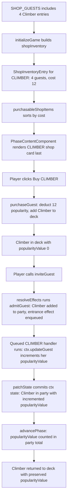

# Design Document: Climber Entrance Effect

## Overview

This feature introduces the Climber guest type and an entrance effect system to the party card game. The Climber is the first guest type with a per-instance entrance effect: each time a specific Climber instance is invited to a party, her `popularityValue` increments by 1 (capped at 9) once she has joined the party. This increment is tracked on the guest object itself, so two different Climbers each maintain their own independent `popularityValue`.

The entrance effect system is designed for extensibility — future guest types can define entirely different entrance effects by adding an entry to `GUEST_TYPE_ENTRANCE_EFFECTS`, without touching the Game Store. Entrance effects run through the store's generic FIFO effect queue (introduced with the overflow feature; see `overflow/design.md`). The system uses an `EffectContext` interface as the universal API for all effect types, so the same interface will serve entrance effects, end-of-party effects, on-discard effects, and any future trigger points without modification.

Climbers cost 12 popularity to purchase, have 4 named instances (Ascella, Skye, Icarus, Vela), and are not in the starting deck.

### Key Design Decisions

1. **EffectContext is the universal effect API**: A new `EffectContext` interface is introduced as the single contract used by ALL guest effects regardless of when they trigger (entrance, end-of-party, on-discard, etc.). This means the interface is defined once and reused across all future trigger points without any changes.

2. **void return, no return value**: Effect handlers return `void`. Effects express all changes through the context object; the store reads back the final state from the context after each effect runs. This avoids the need to thread return values through the dispatch chain.

3. **Resources included in EffectContext**: `popularity` and `money` are direct store state and are included in `EffectContext`. `trouble` and `peace` are derived from party guest properties, so they are not included — effects that want to influence trouble or peace do so via `updateGuest` or `setParty`.

4. **Testable in isolation**: Entrance effects can be tested by constructing a mock `EffectContext` without needing a full NgRx store setup. Handler functions in `GUEST_TYPE_ENTRANCE_EFFECTS` are pure functions over the context interface.

5. **Extensibility**: Adding a new entrance effect requires only adding an entry to `GUEST_TYPE_ENTRANCE_EFFECTS` in `guest.model.ts`. The store never changes. Adding a new trigger point requires adding a new `Partial<Record<GuestType, EffectHandler>>` constant and a corresponding lookup where that trigger happens — the `EffectContext` interface itself does not change.

6. **The effect runs after the guest joins**: `admitGuest(guest)` adds the guest to the party and then enqueues the guest's entrance effect. The store checks for a bust (overflow, then trouble) after every effect, so if the Climber's own arrival busts the party, the queue is discarded and her increment never happens. When the party survives her arrival, the result is identical to incrementing before she joins (Requirement 4.1).

7. **No new state fields**: The existing `Guest` interface and `GuestProperties` interface are sufficient. `popularityValue` already exists on every guest. No new fields are added to `GameStoreState`.

8. **Guest conservation is unaffected**: The entrance effect only mutates a property on the guest object via the context; it does not create or remove guests. The total count across deck + party + discard + shopInventory remains 58.

9. **Shop display order**: The existing `purchasableShopItems()` sort (ascending cost, then alphabetical label) places CLIMBER last at cost 12, after AUCTIONEER at cost 9.

## Architecture

### Modified Files

```
guest.model.ts
├── GuestType union: + 'CLIMBER'
├── GUEST_TYPE_DEFAULTS: + CLIMBER entry (all zeros)
├── GUEST_TYPE_LABELS: + CLIMBER → "Climber"
├── GUEST_TYPE_COSTS: + CLIMBER → 12
├── SHOP_GUESTS: + 4 Climber entries (Ascella, Skye, Icarus, Vela)
├── INITIAL_GUESTS: unchanged
├── EffectHandler [new type alias]: (ctx: EffectContext, guest: Guest) => void
├── GUEST_TYPE_ENTRANCE_EFFECTS [new constant]: Partial<Record<GuestType, EffectHandler>>, CLIMBER entry defined
└── admitGuest(guest): GameEffect — adds the guest to the party, then enqueues its entrance effect (if any)

effect-context.ts
├── GameEffect [type alias]: (ctx: EffectContext) => void
└── EffectContext [interface]: universal effect API

game.store.ts
├── EffectContextImpl [class]: concrete implementation
├── resolveEffects(initialEffect) [private]: runs the FIFO effect queue, commits after each effect, checks for a bust
└── inviteGuest(): draws the top guest and calls resolveEffects(admitGuest(guest))
    (the store has no per-type dispatch; it never changes when an entrance effect is added)

PhaseContentComponent — no changes (renders CLIMBER shop card automatically)
GuestCardComponent — no changes (renders CLIMBER label from GUEST_TYPE_LABELS automatically)
```

### Data Flow for Climber Entrance Effect

```mermaid
sequenceDiagram
    participant Player
    participant inviteGuest
    participant resolveEffects
    participant EffectContextImpl
    participant Store

    Player->>inviteGuest: inviteGuest()
    inviteGuest->>Store: patchState({ deck: remainingDeck })
    inviteGuest->>resolveEffects: resolveEffects(admitGuest(climber))
    Note over resolveEffects: queue = [admitGuest(climber)]
    resolveEffects->>EffectContextImpl: new EffectContextImpl(deck, party, discard, popularity, money, enqueue)
    resolveEffects->>EffectContextImpl: admitGuest(climber)(ctx)
    Note over EffectContextImpl: party += climber; enqueue(c => CLIMBER handler(c, climber))
    resolveEffects->>Store: patchState(ctx state)
    resolveEffects->>resolveEffects: bust check (overflow, then trouble) — none
    resolveEffects->>EffectContextImpl: new context; run CLIMBER handler(ctx, climber)
    Note over EffectContextImpl: ctx.updateGuest(climber, g => popularityValue: min(9, v+1))
    resolveEffects->>Store: patchState(ctx state) — party now holds the incremented Climber
    resolveEffects->>resolveEffects: bust check — none; queue empty, return
```

### How Existing Systems Handle the New Type



## Components and Interfaces

### Modified Type (guest.model.ts)

```typescript
export type GuestType = 'OLD_FRIEND' | 'WILD_BUDDY' | 'RICH_PAL' | 'MONKEY'
  | 'AUCTIONEER' | 'GANGSTER' | 'ROCK_STAR' | 'GAMBLER'
  | 'CUTE_DOG' | 'HIPPY'
  | 'CATERER' | 'TICKET_TAKER'
  | 'CLIMBER';  // NEW
```

### Modified Constants (guest.model.ts)

#### GUEST_TYPE_DEFAULTS

```typescript
CLIMBER: {
  popularityValue: 0,
  troubleValue: 0,
  moneyValue: 0,
  peaceValue: 0
}
```

#### GUEST_TYPE_LABELS

```typescript
CLIMBER: 'Climber'
```

#### GUEST_TYPE_COSTS

```typescript
CLIMBER: 12
```

#### SHOP_GUESTS (48 entries total — 4 new Climbers added)

```typescript
{ type: 'CLIMBER', name: 'Ascella' },
{ type: 'CLIMBER', name: 'Skye' },
{ type: 'CLIMBER', name: 'Icarus' },
{ type: 'CLIMBER', name: 'Vela' },
```

#### INITIAL_GUESTS — Unchanged

No Climber entries. The starting deck remains 10 guests (4 Old Friends, 4 Wild Buddies, 2 Rich Pals).

### New Type Alias and Constant (guest.model.ts)

#### EffectHandler Type Alias

`EffectHandler` is the type for all guest effect handler functions. It follows the same pattern as the existing `GUEST_TYPE_DEFAULTS`, `GUEST_TYPE_LABELS`, and `GUEST_TYPE_COSTS` constants — all guest type metadata lives in `guest.model.ts`.

```typescript
// Runs when a guest joins the party. `guest` is the guest as admitted; use
// ctx.updateGuest(guest, ...) to change it in the party.
export type EffectHandler = (ctx: EffectContext, guest: Guest) => void;
```

The handler receives the guest that triggered it as an argument rather than through the context, so one `EffectContext` shape serves every effect, including effects that have no triggering guest.

#### GUEST_TYPE_ENTRANCE_EFFECTS Constant

`GUEST_TYPE_ENTRANCE_EFFECTS` is a partial record mapping guest types to their entrance effect handler. Only types with entrance effects appear in this map. This follows the same pattern as the existing guest type metadata constants.

```typescript
export const GUEST_TYPE_ENTRANCE_EFFECTS: Partial<Record<GuestType, EffectHandler>> = {
  CLIMBER: (ctx, guest) => {
    ctx.updateGuest(guest, g => ({
      ...g,
      properties: {
        ...g.properties,
        popularityValue: Math.min(9, g.properties.popularityValue + 1)
      }
    }));
  }
};
```

(The overflow feature later adds `MR_POPULAR` and `CELEBRITY` entries to this map.)

#### admitGuest()

`admitGuest` turns "this guest joins the party" into a `GameEffect` for the store's effect queue. Every arrival goes through it — the player's own invite and every auto-invite — so entrance effects are triggered in one place.

```typescript
export function admitGuest(guest: Guest): GameEffect {
  return (ctx) => {
    ctx.setParty([...ctx.getParty(), guest]);

    const entranceEffect = GUEST_TYPE_ENTRANCE_EFFECTS[guest.type];
    if (entranceEffect) {
      ctx.enqueue((c) => entranceEffect(c, guest));
    }
  };
}
```

Future trigger points follow the same pattern:
- `GUEST_TYPE_END_OF_PARTY_EFFECTS: Partial<Record<GuestType, EffectHandler>>`
- `GUEST_TYPE_ON_DISCARD_EFFECTS: Partial<Record<GuestType, EffectHandler>>`

All use the same `EffectHandler` type and `EffectContext` interface.

### New Interface and Implementation

#### GameEffect and EffectContext (effect-context.ts)

`GameEffect` is one unit of work in the store's effect queue. `EffectContext` is the universal effect API used by ALL guest effects regardless of trigger point. It is introduced now for entrance effects and will be reused unchanged for future trigger points (end-of-party, on-discard, etc.).

```typescript
export type GameEffect = (ctx: EffectContext) => void;

export interface EffectContext {
  // Guest zones
  getDeck(): Guest[];
  setDeck(deck: Guest[]): void;
  getParty(): Guest[];
  setParty(party: Guest[]): void;
  getDiscard(): Guest[];
  setDiscard(discard: Guest[]): void;

  // Resources (direct store state — popularity and money are stored;
  // trouble and peace are derived from party guests so are not included here;
  // effects that want to influence trouble/peace do so via updateGuest or setParty)
  getPopularity(): number;
  setPopularity(value: number): void;
  getMoney(): number;
  setMoney(value: number): void;

  // Replaces `guest` in the party with updater(guest) (matched by reference) and returns the updated guest
  updateGuest(guest: Guest, updater: (g: Guest) => Guest): Guest;

  // Adds an effect to the end of the effect queue; it runs after every effect already queued
  enqueue(effect: GameEffect): void;
}
```

#### EffectContextImpl Class (game.store.ts)

`EffectContextImpl` is the concrete implementation. The store's effect loop constructs a fresh one from current store state for each effect. It holds a mutable snapshot of all relevant state that the effect can read and write. After the effect runs, the store reads the final state back out and commits it in a single `patchState` call.

```typescript
class EffectContextImpl implements EffectContext {
  private _deck: Guest[];
  private _party: Guest[];
  private _discard: Guest[];
  private _popularity: number;
  private _money: number;
  private _enqueue: (effect: GameEffect) => void;

  constructor(
    deck: Guest[],
    party: Guest[],
    discard: Guest[],
    popularity: number,
    money: number,
    enqueue: (effect: GameEffect) => void
  ) { /* ... assign all fields ... */ }

  updateGuest(guest: Guest, updater: (g: Guest) => Guest): Guest {
    const updated = updater(guest);
    this._party = this._party.map(g => (g === guest ? updated : g));
    return updated;
  }

  enqueue(effect: GameEffect): void { this._enqueue(effect); }

  getDeck(): Guest[] { return this._deck; }
  setDeck(deck: Guest[]): void { this._deck = deck; }
  getParty(): Guest[] { return this._party; }
  setParty(party: Guest[]): void { this._party = party; }
  getDiscard(): Guest[] { return this._discard; }
  setDiscard(discard: Guest[]): void { this._discard = discard; }

  getPopularity(): number { return this._popularity; }
  setPopularity(value: number): void { this._popularity = value; }
  getMoney(): number { return this._money; }
  setMoney(value: number): void { this._money = value; }
}
```

### Modified Game Store (game.store.ts)

#### Modified `inviteGuest()` Method

`inviteGuest()` draws the top guest and hands `admitGuest(guest)` to the store's effect loop, `resolveEffects()`. The loop runs the effect, which adds the guest and enqueues the Climber's entrance effect; then it runs the entrance effect. `inviteGuest()` knows nothing about guest types or effect kinds, so the store never needs to change when a new entrance effect is added. `resolveEffects()` (FIFO order, bust checks after each effect) is described in `overflow/design.md`.

```typescript
inviteGuest(): void {
  // No inviting while a bust is being resolved (shutdown modal or ban selection)
  if (store.isPartyShutdown() || store.isBanSelectionActive()) {
    return;
  }

  const deck = store.deck();

  if (deck.length === 0) {
    patchState(store, { showEmptyDeckMessage: true });
    return;
  }

  if (store.party().length >= store.houseCapacity()) {
    patchState(store, { showHouseFullMessage: true });
    return;
  }

  patchState(store, { showEmptyDeckMessage: false, showHouseFullMessage: false });

  // Draw the top guest; admitting it (and any effects that follow) is handled by the effect queue
  const [rawGuest, ...remainingDeck] = deck;
  patchState(store, { deck: remainingDeck });

  resolveEffects(admitGuest(rawGuest));
},
```

### Unchanged Components

- **PhaseContentComponent**: Renders shop cards from `purchasableShopItems()`. CLIMBER appears automatically at the end (cost 12, highest). The `Available: {stock}` display uses `item.guests.length`, which reflects the live inventory.

- **GuestCardComponent**: Renders `GUEST_TYPE_LABELS[guest.type]` as the header. Adding `CLIMBER: 'Climber'` to the labels map is sufficient.

## Data Models

### Guest Type Properties (Updated)

| Guest Type   | popularityValue | troubleValue | moneyValue | peaceValue | Shop Cost |
|-------------|----------------|--------------|------------|------------|-----------|
| OLD_FRIEND  | 1              | 0            | 0          | 0          | 2         |
| WILD_BUDDY  | 2              | 1            | 0          | 0          | null      |
| RICH_PAL    | 0              | 0            | 1          | 0          | 3         |
| MONKEY      | 4              | 1            | 0          | 0          | 3         |
| AUCTIONEER  | 0              | 0            | 3          | 0          | 9         |
| GANGSTER    | 0              | 1            | 4          | 0          | 6         |
| ROCK_STAR   | 3              | 1            | 2          | 0          | 5         |
| GAMBLER     | 2              | 1            | 3          | 0          | 7         |
| CUTE_DOG    | 2              | 0            | 0          | 1          | 7         |
| HIPPY       | 1              | 0            | 0          | 1          | 4         |
| CATERER     | 4              | 0            | -1         | 0          | 5         |
| TICKET_TAKER| -1             | 0            | 2          | 0          | 4         |
| **CLIMBER** | **0**          | **0**        | **0**      | **0**      | **12**    |

Note: A Climber's effective `popularityValue` at party time equals the number of times that specific instance has been invited (capped at 9). The default of 0 reflects a freshly purchased Climber that has never been invited.

### Climber Named Instances

| Name    | Type    | Initial popularityValue |
|---------|---------|------------------------|
| Ascella | CLIMBER | 0                      |
| Skye    | CLIMBER | 0                      |
| Icarus  | CLIMBER | 0                      |
| Vela    | CLIMBER | 0                      |

### Shop Display Order (Updated — 13 purchasable types)

With the existing sort (ascending cost, then alphabetical label for ties):

1. Old Friend (cost 2)
2. Monkey (cost 3)
3. Rich Pal (cost 3)
4. Hippy (cost 4)
5. Ticket Taker (cost 4)
6. Caterer (cost 5)
7. Rock Star (cost 5)
8. Gangster (cost 6)
9. Cute Dog (cost 7)
10. Gambler (cost 7)
11. Auctioneer (cost 9)
12. **Climber (cost 12)** ← NEW, placed last

### Guest Conservation (Updated)

```
deck.length + party.length + discard.length + sum(shopInventory[*].guests.length)
  = INITIAL_GUESTS.length + SHOP_GUESTS.length
  = 10 + 48
  = 58
```

The entrance effect only mutates `popularityValue` on a guest object via the context — it does not create or remove guests. Conservation is maintained.

## Correctness Properties

*A property is a characteristic or behavior that should hold true across all valid executions of a system — essentially, a formal statement about what the system should do. Properties serve as the bridge between human-readable specifications and machine-verifiable correctness guarantees.*

### Property 1: Climber Entrance Effect Increments popularityValue

*For any* Climber guest with `popularityValue` in [0, 8], when the handler from `GUEST_TYPE_ENTRANCE_EFFECTS['CLIMBER']` is called with a mock `EffectContext` whose party contains that guest, and with that guest as its `guest` argument, the Climber in the context's party SHALL have `popularityValue` equal to the original value plus 1. When `popularityValue` is 9, it SHALL remain at 9.

**Validates: Requirements 4.1, 4.4**

### Property 2: Non-Climber Guests Are Unaffected by Entrance Effect

*For any* guest type with no entry in `GUEST_TYPE_ENTRANCE_EFFECTS` (every type except CLIMBER, MR_POPULAR and CELEBRITY), running `admitGuest(guest)` SHALL add the guest to the party unchanged and SHALL enqueue no effect.

**Validates: Requirements 4.3, 6.2**

### Property 3: Per-Instance popularityValue Tracking

*For any* two Climber instances with `popularityValue` values v1 and v2 in [0, 8], both in the same party, after invoking the `GUEST_TYPE_ENTRANCE_EFFECTS['CLIMBER']` handler once for each Climber, each Climber in the party SHALL have a `popularityValue` equal to its own original value plus 1, independently of the other (`updateGuest` matches the guest by reference, not by type).

**Validates: Requirements 5.1, 5.2**

### Property 4: popularityValue Preserved Across Party Cycles

*For any* Climber guest with `popularityValue` in [0, 7], after inviting it via `inviteGuest()` (value becomes n+1), ending the party via `advancePhase()` (Climber returns to deck), and inviting it again, the Climber in the party SHALL have `popularityValue` equal to n+2.

**Validates: Requirements 5.3**

### Property 5: Climber Party Contribution

*For any* Climber guest with `popularityValue` v in [0, 9] in the party when `advancePhase()` is called from PARTY phase, the player's popularity SHALL increase by exactly v.

**Validates: Requirements 8.1, 8.2**

### Property 6: Climber Purchase Yields Valid Guest

*For any* game state where the shop has at least 1 Climber remaining and the player's popularity is >= 12, calling `purchaseGuest('CLIMBER')` SHALL return `{ success: true }`, add a guest with type 'CLIMBER', a name from {Ascella, Skye, Icarus, Vela}, and `popularityValue` of 0 to the deck, deduct exactly 12 popularity, and decrement the CLIMBER shop stock by 1.

**Validates: Requirements 7.1, 7.2, 7.3**

### Property 7: Guest Conservation Invariant

*For any* sequence of game operations (purchaseGuest, inviteGuest, advancePhase, triggerPartyShutdown, confirmBan), the sum `deck.length + party.length + discard.length + sum(shopInventory[*].guests.length)` SHALL equal 58 (10 initial guests + 48 purchasable shop guests). The Climber entrance effect, expressed through `EffectContext`, SHALL not change this total.

**Validates: Requirements 11.1, 11.2**

## Error Handling

No new error handling is required. All existing error paths in `purchaseGuest()` apply to CLIMBER:

- **Sold out**: When all 4 Climbers have been purchased, `purchaseGuest('CLIMBER')` returns `{ success: false, error: 'sold_out', message: 'No Climber available!' }`.
- **Insufficient popularity**: When popularity < 12, returns `{ success: false, error: 'insufficient_popularity', message: 'Not enough popularity!' }`.

The entrance effect itself has no error conditions — the cap at 9 is handled silently by `Math.min(9, value + 1)` inside the `updateGuest` updater.

## Testing Strategy

### Dual Testing Approach

- **Unit tests**: Verify specific constant values (defaults, labels, costs, shop names), initialization state, shop display order, guest card rendering, and concrete entrance effect examples
- **Property tests**: Verify universal properties (entrance effect correctness for any popularityValue, non-Climber passthrough, per-instance tracking, party contribution, purchase validity, guest conservation)

Both are complementary — unit tests catch concrete regressions in type-specific values while property tests verify general correctness across the input space.

### Property-Based Testing Configuration

**Library**: fast-check (already installed: `"fast-check": "^4.5.3"`)

**Configuration**:
- Minimum 100 iterations per property test
- Each test tagged with a comment referencing the design property
- Tag format: `// Feature: climber-entrance-effect, Property {number}: {property_text}`
- Each correctness property implemented by a SINGLE property-based test

### Property Test Plan

Properties 1–3 test handler functions from `GUEST_TYPE_ENTRANCE_EFFECTS` in isolation using a **mock `EffectContext`** — no store setup required. This is the key benefit of the registry design: handler functions are pure functions over the context interface, fully testable without NgRx.

1. **Property 1 test** (`game.store.property.spec.ts`): Generate a Climber guest with `popularityValue` in [0, 8] using `fc.integer({ min: 0, max: 8 })`. Construct a mock `EffectContext` whose party holds that guest. Call `const handler = GUEST_TYPE_ENTRANCE_EFFECTS['CLIMBER']; handler(mockCtx, climber)`. Verify `mockCtx.getParty()[0].properties.popularityValue === original + 1`. Also verify the cap: generate `popularityValue = 9`, verify it stays at 9.
   - Tag: `// Feature: climber-entrance-effect, Property 1: Climber Entrance Effect Increments popularityValue`

2. **Property 2 test** (`game.store.property.spec.ts`): Generate a guest type with no entrance effect using `fc.constantFrom(...typesWithoutEntranceEffects)`. Run `admitGuest(guest)` against a mock `EffectContext`. Verify the guest is appended to the party with unchanged properties and `enqueue` was never called.
   - Tag: `// Feature: climber-entrance-effect, Property 2: Non-Climber Guests Are Unaffected by Entrance Effect`

3. **Property 3 test** (`game.store.property.spec.ts`): Generate two `popularityValue` values in [0, 8] using `fc.tuple(fc.integer({ min: 0, max: 8 }), fc.integer({ min: 0, max: 8 }))`. Construct a mock `EffectContext` whose party holds two Climbers with those values. Call `const handler = GUEST_TYPE_ENTRANCE_EFFECTS['CLIMBER']` and invoke it once with each Climber as the `guest` argument. Verify each Climber in the party has its own original value + 1.
   - Tag: `// Feature: climber-entrance-effect, Property 3: Per-Instance popularityValue Tracking`

4. **Property 4 test** (`game.store.property.spec.ts`): Generate a `popularityValue` in [0, 7]. Patch the store deck with a Climber at that value. Call `inviteGuest()` (value → n+1). Call `advancePhase()` (Climber returns to deck). Call `inviteGuest()` again (value → n+2). Verify the party guest has `popularityValue === n+2`.
   - Tag: `// Feature: climber-entrance-effect, Property 4: popularityValue Preserved Across Party Cycles`

5. **Property 5 test** (`game.store.property.spec.ts`): Generate a `popularityValue` in [0, 9]. Patch the store with a Climber at that value in the party and popularity at 0. Call `advancePhase()` from PARTY phase. Verify `store.popularity() === v`.
   - Tag: `// Feature: climber-entrance-effect, Property 5: Climber Party Contribution`

6. **Property 6 test** (`game.store.property.spec.ts`): Generate a popularity value >= 12 using `fc.integer({ min: 12, max: 100 })`. Initialize game, patch popularity. Call `purchaseGuest('CLIMBER')`. Verify success, deck grew by 1, new guest has type CLIMBER, name in valid set, `popularityValue === 0`, popularity decreased by 12, shop stock decreased by 1.
   - Tag: `// Feature: climber-entrance-effect, Property 6: Climber Purchase Yields Valid Guest`

7. **Property 7 test** (`game.store.property.spec.ts`): Generate random sequences of operations including Climber purchases and invites. After each operation, verify `deck.length + party.length + discard.length + sum(shopInventory[*].guests.length) === 58`.
   - Tag: `// Feature: climber-entrance-effect, Property 7: Guest Conservation Invariant`

### Unit Test Plan

**Model tests** (`guest.model.spec.ts`):
- `GUEST_TYPE_DEFAULTS['CLIMBER']` equals `{ popularityValue: 0, troubleValue: 0, moneyValue: 0, peaceValue: 0 }`
- `GUEST_TYPE_LABELS['CLIMBER']` equals `'Climber'`
- `GUEST_TYPE_COSTS['CLIMBER']` equals `12`
- `SHOP_GUESTS` filtered by type `'CLIMBER'` has exactly 4 entries with names Ascella, Skye, Icarus, Vela
- `SHOP_GUESTS.length` equals `48`
- `INITIAL_GUESTS` filtered by type `'CLIMBER'` has length `0`
- `INITIAL_GUESTS.length` equals `10`

**Store tests** (`game.store.spec.ts`):
- After `initializeGame()`, `shopInventory` has a CLIMBER entry with 4 guests and cost 12
- After `initializeGame()`, `deck` contains zero CLIMBER guests
- `purchasableShopItems()` returns CLIMBER last (cost 12, highest)
- Inviting a Climber with `popularityValue` 0 results in party guest with `popularityValue` 1 (concrete example)
- Inviting a Climber with `popularityValue` 9 results in party guest with `popularityValue` 9 (cap edge case)
- Inviting a non-Climber guest does not change its `popularityValue`
- A Climber's `popularityValue` is preserved when it returns to the deck after a party

**Component tests** (`phase-content.component.spec.ts`):
- During BUY phase, a shop card for CLIMBER is rendered with label "Climber" and cost 12
- CLIMBER shop card displays "Available: 4" on a fresh game

**Component tests** (`guest-card.component.spec.ts`):
- `GuestCardComponent` renders "Climber" as the card header and the guest's name as the caption for a CLIMBER guest

### Test File Organization

```
src/app/
  models/
    guest.model.spec.ts                    # Unit tests (extended for CLIMBER constants)
  stores/
    game.store.spec.ts                     # Unit tests (extended for CLIMBER behavior)
    game.store.property.spec.ts            # Properties 1–7 (Properties 1–3 use mock EffectContext)
  components/
    phase-content.component.spec.ts        # Unit tests (extended for CLIMBER shop card)
    guest-card.component.spec.ts           # Unit tests (extended for CLIMBER card rendering)
```
