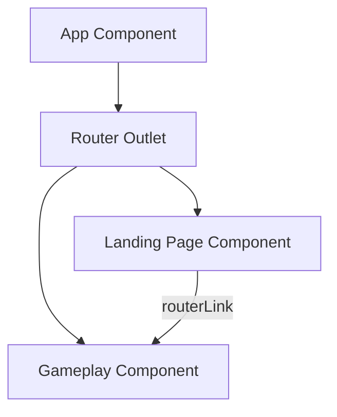

# Design Document: Game Routes - Landing and Gameplay

## Overview

This feature implements the foundational routing structure for the Angular PWA game application. It establishes two primary routes: a landing page that serves as the entry point and a gameplay route for active game sessions. The design leverages Angular's standalone component architecture and routing system to create a clean, maintainable navigation structure.

The landing page provides a simple interface with a "New Game" link that navigates to the gameplay route. The gameplay route initially displays placeholder content, establishing the structure for future game implementation. This minimal approach allows for rapid iteration and provides a solid foundation for adding features like game state management, save/load functionality, and options screens.

## Architecture

### Routing Structure

The application uses Angular's standalone routing configuration with the following route hierarchy:

```
/ (root) → Landing Page Component
/game → Gameplay Component
** (wildcard) → Redirect to Landing Page
```

The routing is configured using Angular's `provideRouter` in the application config, following the modern standalone component pattern already established in the PWA setup.

### Component Architecture



The architecture follows Angular's component-based design:
- **App Component**: Root component containing the router outlet
- **Landing Page Component**: Standalone component for the landing page
- **Gameplay Component**: Standalone component for the gameplay view

Both route components are standalone, eliminating the need for NgModule declarations and keeping the architecture aligned with modern Angular practices.

## Components and Interfaces

### Landing Page Component

**Location**: `src/app/components/landing-page.component.ts`

**Responsibilities**:
- Render the landing page UI
- Provide navigation to gameplay route
- Support keyboard navigation for accessibility

**Template Structure**:
```html
<main>
  <h1>Game Title</h1>
  <nav>
    <a routerLink="/game">New Game</a>
  </nav>
</main>
```

**Styling Approach**:
- Component-scoped SCSS
- Responsive layout using flexbox
- Consistent with PWA demo component styling patterns
- Accessible focus states for keyboard navigation

### Gameplay Component

**Location**: `src/app/components/gameplay.component.ts`

**Responsibilities**:
- Render the gameplay view
- Display placeholder content initially
- Provide structure for future game state integration

**Template Structure**:
```html
<main>
  <div class="gameplay-container">
    <p>Gameplay area - Coming soon</p>
  </div>
</main>
```

### Route Configuration

**Location**: `src/app/app.routes.ts`

**Configuration**:
```typescript
export const routes: Routes = [
  {
    path: '',
    component: LandingPageComponent,
    title: 'Game - Home'
  },
  {
    path: 'game',
    component: GameplayComponent,
    title: 'Game - Play'
  },
  {
    path: '**',
    redirectTo: ''
  }
];
```

The route configuration includes:
- Path definitions for both routes
- Component mappings
- Page titles for browser tab display
- Wildcard redirect for undefined routes

## Data Models

This feature does not require data models as it focuses on navigation structure. Future iterations will introduce:
- Game state models
- Save game data structures
- Player configuration models

These will be defined when game state management is implemented in subsequent features.

## Correctness Properties

*A property is a characteristic or behavior that should hold true across all valid executions of a system—essentially, a formal statement about what the system should do. Properties serve as the bridge between human-readable specifications and machine-verifiable correctness guarantees.*

### Property 1: Wildcard Route Redirect

*For any* undefined route path, the router should redirect to the landing page (root path).

**Validates: Requirements 3.3**

## Error Handling

### Route Navigation Errors

The Angular router handles navigation errors through its built-in error handling mechanisms. For this feature:

- **Invalid Routes**: Handled by wildcard redirect to landing page
- **Component Load Failures**: Angular's default error handling will display errors in development mode
- **Navigation Cancellation**: No special handling required for this basic routing setup

### Future Error Handling Considerations

As the application grows, error handling will be enhanced to include:
- Custom error pages for different error types
- Error logging service integration
- User-friendly error messages for navigation failures
- Retry mechanisms for failed component loads

## Testing Strategy

### Dual Testing Approach

This feature requires both unit tests and property-based tests to ensure comprehensive coverage:

- **Unit Tests**: Verify specific routing behaviors, component rendering, and navigation flows
- **Property Tests**: Verify universal routing properties across all possible inputs

### Unit Testing

Unit tests will focus on:

1. **Route Configuration**
   - Verify landing page route is configured at root path
   - Verify gameplay route is configured at '/game' path
   - Verify wildcard route redirects to root

2. **Component Rendering**
   - Landing page component renders with "New Game" link
   - Gameplay component renders with placeholder content
   - Components have proper accessibility attributes

3. **Navigation Behavior**
   - Clicking "New Game" link navigates to gameplay route
   - Direct URL navigation to '/game' works correctly
   - Browser history is maintained during navigation

4. **Accessibility**
   - Landing page link is keyboard navigable
   - Components have proper ARIA labels
   - Focus management works correctly

### Property-Based Testing

**Library**: fast-check (TypeScript property-based testing library)

**Configuration**: Minimum 100 iterations per property test

**Property Tests**:

1. **Wildcard Redirect Property**
   - Generate random invalid route paths
   - Verify all navigate to landing page
   - Tag: **Feature: game-routes-landing-gameplay, Property 1: For any undefined route path, the router should redirect to the landing page (root path)**

### Test File Organization

```
src/app/components/
  landing-page.component.spec.ts    # Unit tests for landing page
  gameplay.component.spec.ts        # Unit tests for gameplay component
src/app/
  app.routes.spec.ts                # Unit tests for route configuration
  app.routes.property.spec.ts       # Property tests for routing behavior
```

### Testing Tools

- **Jasmine**: Test framework (Angular default)
- **Karma**: Test runner
- **fast-check**: Property-based testing library
- **Angular Testing Library**: Component testing utilities
- **@angular/router/testing**: Router testing utilities
