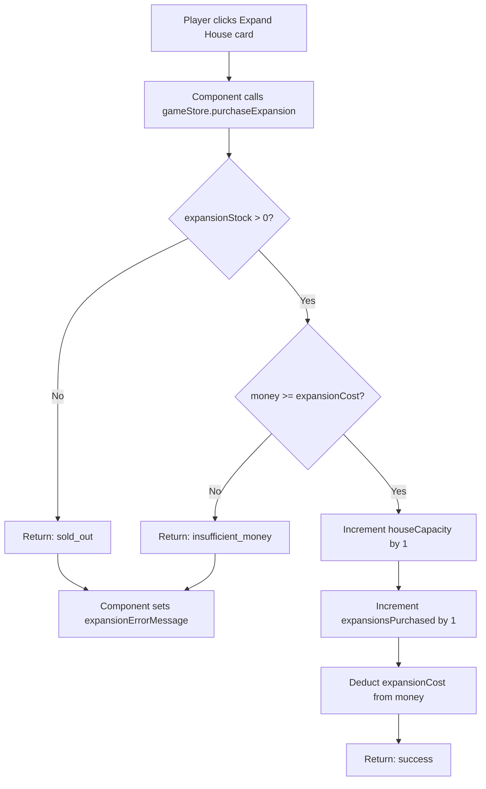
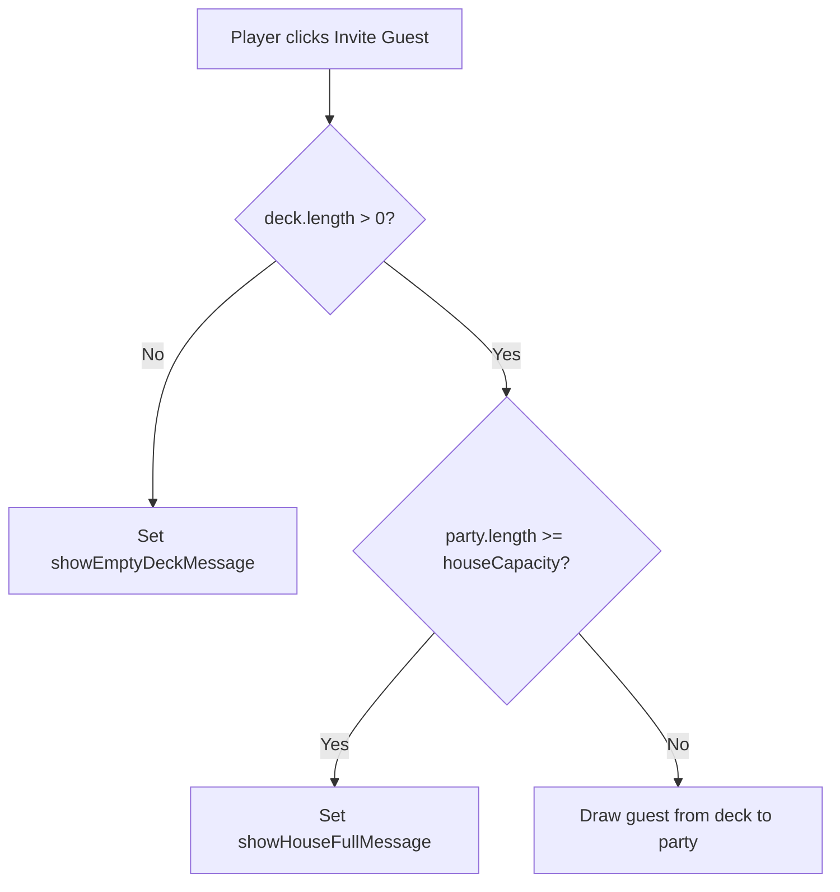

# Design Document: House Size Capacity

## Overview

This feature introduces a house capacity system that limits the number of guests at a party and provides a money-based upgrade path to increase that limit. The game starts with a house capacity of 5. Players can purchase "Expand House" upgrades from the shop using money (not popularity). The shop offers 29 expansions with escalating costs following the formula `min(expansionsPurchased + 2, 12)`. During the party phase, empty guest slots are visualized as card shadows. The main content area scrolls vertically when content overflows, while the right status pane remains fixed.

### Key Design Decisions

1. **House Capacity as Store State**: `houseCapacity` and `expansionsPurchased` are added to `GameStoreState`. The capacity starts at 5 and increments by 1 per expansion. `expansionsPurchased` tracks how many expansions have been bought (starts at 0, max 29), which drives the cost formula and remaining stock computation.

2. **Expansion Cost as Computed Signal**: `expansionCost` is a computed signal derived from `expansionsPurchased`: `Math.min(store.expansionsPurchased() + 2, 12)`. This avoids storing redundant state — the cost is always deterministic from the purchase count.

3. **Expansion Stock as Computed Signal**: `expansionStock` is computed as `29 - store.expansionsPurchased()`. No separate counter needed — the purchase count is the single source of truth for both cost and remaining stock.

4. **Separate `purchaseExpansion()` Method**: The expansion purchase is fundamentally different from guest purchases — it costs money (not popularity), doesn't add a guest to the deck, and modifies `houseCapacity`. A dedicated `purchaseExpansion()` method returns an `ExpansionPurchaseResult` discriminated union, following the same pattern as `purchaseGuest()` returning `PurchaseResult`.

5. **`ExpansionPurchaseResult` Return Type**: Like `PurchaseResult`, the expansion method returns a discriminated union: `{ success: true }` or `{ success: false; error: 'insufficient_money' | 'sold_out'; message: string }`. This keeps transient error state out of the store — the component handles the result locally.

6. **House Full Check in `inviteGuest()`**: The `inviteGuest()` method gains a new guard: if `party.length >= houseCapacity`, it sets a new `showHouseFullMessage` flag and returns early. This is analogous to the existing `showEmptyDeckMessage` pattern. The component displays the House_Full_Modal when this flag is true.

7. **Card Shadows as Computed Signal**: `emptySlots` is a computed signal: `Math.max(0, store.houseCapacity() - store.party().length)`. The template iterates this count to render placeholder card shadows during PARTY phase.

8. **Expand House Item Rendered Last in Shop**: The expansion item is rendered after the `purchasableShopItems` loop, as a separate conditional block. It only appears when `expansionStock() > 0` and the phase is BUY. This keeps it visually distinct and always positioned last.

9. **Money Cost Display with "$" Prefix**: The expansion item displays cost as `$X` (e.g., "$2", "$3") to visually distinguish money costs from popularity costs shown on guest cards.

10. **Reuse Existing Error Modal Pattern**: The "house full" and "not enough money" modals reuse the same overlay + centered box + OK button pattern as the existing shutdown, ban, and shop error modals. Component-local signals drive their visibility.

11. **Layout Overflow Changes**: The main pane gets `overflow-y: auto; overflow-x: hidden`. The right pane gets `overflow: hidden; position: sticky; top: 0; height: 100vh` to remain fixed while the main content scrolls.

## Architecture

### Modified Layers

```
GameStoreState (game.store.ts)
├── + houseCapacity: number                   (new: starts at 5)
└── + expansionsPurchased: number             (new: starts at 0)

GameStore Computed Signals
├── + expansionCost: computed                 (new: min(expansionsPurchased + 2, 12))
├── + expansionStock: computed                (new: 29 - expansionsPurchased)
├── + emptySlots: computed                    (new: max(0, houseCapacity - party.length))
└── + isHouseFull: computed                   (new: party.length >= houseCapacity)

GameStore Methods
├── inviteGuest()                             (modified: add house capacity guard)
├── initializeGame()                          (modified: initialize houseCapacity=5, expansionsPurchased=0)
├── resetGame()                               (modified: reset via initialState)
└── + purchaseExpansion(): ExpansionPurchaseResult  (new: expansion purchase logic)

ExpansionPurchaseResult (game.store.ts)
└── Discriminated union: { success: true } | { success: false; error; message }

UI Layer
├── GameplayComponent                         (modified: layout overflow styles)
├── PhaseContentComponent                     (modified: expansion item in shop, card shadows, house full modal)
│   ├── + houseFullMessage = signal<boolean>(false)          (local)
│   ├── + expansionErrorMessage = signal<string | null>(null) (local)
│   ├── + onPurchaseExpansion()                               (local: calls store, handles result)
│   └── + dismissHouseFullMessage()                           (local: clears flag)
│   └── + dismissExpansionError()                             (local: clears error signal)
└── StatusPaneComponent                       (unchanged)
```

### Expansion Purchase Flow



### Invite Guest Flow (Modified)



### Integration Points

1. **game.store.ts**: Add `houseCapacity` and `expansionsPurchased` to state, add computed signals (`expansionCost`, `expansionStock`, `emptySlots`, `isHouseFull`), add `purchaseExpansion()` method, modify `inviteGuest()` with capacity guard, modify `initializeGame()`
2. **PhaseContentComponent**: Add expansion item after guest shop cards, add card shadows during PARTY phase, add house full modal, add expansion error modal, add local signals and handlers
3. **GameplayComponent**: Update layout styles for overflow behavior

## Components and Interfaces

### New Types (game.store.ts)

```typescript
export type ExpansionPurchaseResult =
  | { success: true }
  | { success: false; error: 'insufficient_money'; message: string }
  | { success: false; error: 'sold_out'; message: string };
```

### Modified Store State

```typescript
export interface GameStoreState extends GameState {
  // ... existing fields ...
  houseCapacity: number;          // NEW: starts at 5
  expansionsPurchased: number;    // NEW: starts at 0
  showHouseFullMessage: boolean;  // NEW: flag for house full modal
}
```

### Initial State Changes

```typescript
const initialState: GameStoreState = {
  // ... existing fields ...
  houseCapacity: 5,
  expansionsPurchased: 0,
  showHouseFullMessage: false
};
```

### New Computed Signals

```typescript
expansionCost: computed(() =>
  Math.min(store.expansionsPurchased() + 2, 12)
),

expansionStock: computed(() =>
  29 - store.expansionsPurchased()
),

emptySlots: computed(() =>
  Math.max(0, store.houseCapacity() - store.party().length)
),

isHouseFull: computed(() =>
  store.party().length >= store.houseCapacity()
)
```

### New Method: purchaseExpansion()

```typescript
purchaseExpansion(): ExpansionPurchaseResult {
  const purchased = store.expansionsPurchased();
  if (purchased >= 29) {
    return { success: false, error: 'sold_out', message: 'No expansions available!' };
  }

  const cost = Math.min(purchased + 2, 12);
  const currentMoney = store.money();

  if (currentMoney < cost) {
    return { success: false, error: 'insufficient_money', message: 'Not enough money!' };
  }

  patchState(store, {
    houseCapacity: store.houseCapacity() + 1,
    expansionsPurchased: purchased + 1,
    money: currentMoney - cost
  });

  return { success: true };
}
```

### Modified Method: inviteGuest()

```typescript
inviteGuest(): void {
  const deck = store.deck();

  if (deck.length === 0) {
    patchState(store, { showEmptyDeckMessage: true });
    return;
  }

  // NEW: House capacity guard
  if (store.party().length >= store.houseCapacity()) {
    patchState(store, { showHouseFullMessage: true });
    return;
  }

  patchState(store, { showEmptyDeckMessage: false, showHouseFullMessage: false });

  const [invitedGuest, ...remainingDeck] = deck;
  const party = [...store.party(), invitedGuest];

  patchState(store, {
    deck: remainingDeck,
    party
  });
}
```

### Modified: PhaseContentComponent

New local signals and methods:

```typescript
houseFullMessage = signal<boolean>(false);
expansionErrorMessage = signal<string | null>(null);

onPurchaseExpansion(): void {
  const result = this.gameStore.purchaseExpansion();
  if (!result.success) {
    this.expansionErrorMessage.set(result.message);
  }
}

dismissHouseFullMessage(): void {
  this.gameStore.patchState({ showHouseFullMessage: false });
}

dismissExpansionError(): void {
  this.expansionErrorMessage.set(null);
}
```

Note: The house full modal is driven by the store's `showHouseFullMessage` signal (not a component-local signal), since the store's `inviteGuest()` sets it. The component reads `gameStore.showHouseFullMessage()` and dismisses by patching the store. Alternatively, the component can call a store method `dismissHouseFullMessage()` that patches the flag to false.

#### Expansion Item in Shop (after guest cards loop)

```html
@if (gameStore.expansionStock() > 0) {
  <button
    class="shop-card expand-house-card"
    (click)="onPurchaseExpansion()"
    aria-label="Expand House">
    <div class="card-header">Expand House</div>
    <div class="card-image">
      <svg xmlns="http://www.w3.org/2000/svg" viewBox="0 0 24 24"
           fill="currentColor" aria-hidden="true">
        <path d="M10 20v-6h4v6h5v-8h3L12 3 2 12h3v8z"/>
      </svg>
    </div>
    <div class="shop-price">${{ gameStore.expansionCost() }}</div>
    <div class="shop-stock">Available: {{ gameStore.expansionStock() }}</div>
  </button>
}
```

#### Card Shadows in Party Phase

```html
@for (i of emptySlotArray(); track i) {
  <div class="card-shadow" aria-hidden="true"></div>
}
```

Where `emptySlotArray` is a helper computed in the component:

```typescript
emptySlotArray = () => Array.from({ length: this.gameStore.emptySlots() }, (_, i) => i);
```

#### House Full Modal

```html
@if (gameStore.showHouseFullMessage()) {
  <div class="house-full-overlay" role="dialog" aria-modal="true" aria-labelledby="house-full-title">
    <div class="house-full-modal">
      <p id="house-full-title">The house is full!</p>
      <button
        class="house-full-button"
        (click)="dismissHouseFullMessage()"
        aria-label="OK">
        OK
      </button>
    </div>
  </div>
}
```

#### Expansion Error Modal

```html
@if (expansionErrorMessage()) {
  <div class="expansion-error-overlay" role="dialog" aria-modal="true" aria-labelledby="expansion-error-title">
    <div class="expansion-error-modal">
      <p id="expansion-error-title">{{ expansionErrorMessage() }}</p>
      <button
        class="expansion-error-button"
        (click)="dismissExpansionError()"
        aria-label="OK">
        OK
      </button>
    </div>
  </div>
}
```

### Modified: GameplayComponent Styles

```css
.main-content {
  flex: 1;
  display: flex;
  flex-direction: column;
  overflow-y: auto;
  overflow-x: hidden;
}

.status-pane {
  flex-shrink: 0;
  overflow: hidden;
  position: sticky;
  top: 0;
  height: 100vh;
}
```

## Data Models

### New State Fields

| Field | Type | Default | Description |
|-------|------|---------|-------------|
| `houseCapacity` | `number` | `5` | Maximum guests allowed in party |
| `expansionsPurchased` | `number` | `0` | Number of expansions bought (0–29) |
| `showHouseFullMessage` | `boolean` | `false` | Flag for house full modal display |

### New Computed Signals

| Signal | Type | Derivation | Description |
|--------|------|------------|-------------|
| `expansionCost` | `number` | `min(expansionsPurchased + 2, 12)` | Money cost of next expansion |
| `expansionStock` | `number` | `29 - expansionsPurchased` | Remaining expansions available |
| `emptySlots` | `number` | `max(0, houseCapacity - party.length)` | Empty party slots for card shadows |
| `isHouseFull` | `boolean` | `party.length >= houseCapacity` | Whether party is at capacity |

### ExpansionPurchaseResult

| Variant | Fields | Description |
|---------|--------|-------------|
| Success | `{ success: true }` | Expansion purchased; houseCapacity, expansionsPurchased, money modified |
| Insufficient Money | `{ success: false; error: 'insufficient_money'; message: string }` | Not enough money; state unchanged |
| Sold Out | `{ success: false; error: 'sold_out'; message: string }` | No expansions left; state unchanged |

### Expansion Cost Table

| Expansions Purchased | Cost Formula | Actual Cost |
|---------------------|-------------|-------------|
| 0 | min(0+2, 12) | $2 |
| 1 | min(1+2, 12) | $3 |
| 2 | min(2+2, 12) | $4 |
| ... | ... | ... |
| 10 | min(10+2, 12) | $12 |
| 11+ | min(N+2, 12) | $12 |

### Capacity Bounds

- Initial capacity: 5
- Maximum expansions: 29
- Maximum capacity: 5 + 29 = 34
- Cost range: $2 – $12

### Component-Local UI Signals (PhaseContentComponent)

| Signal | Type | Default | Description |
|--------|------|---------|-------------|
| `expansionErrorMessage` | `signal<string \| null>` | `null` | Error message for expansion purchase failure |
