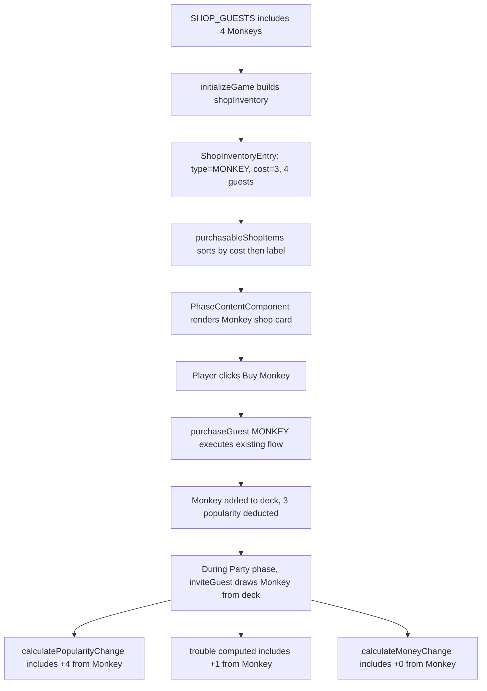

# Design Document: Monkey Guest Type

## Overview

This feature adds a new "MONKEY" guest type to the party game. Monkeys are high-popularity, moderate-trouble guests that are only available through the shop — they do not appear in the starting deck. Each Monkey provides 4 popularity and 1 trouble (0 money) when invited to a party, making them powerful but risky.

The shop stocks exactly 4 named Monkeys (George, Punch, Darwin, Diddy) at a cost of 3 popularity each. This is a purely additive change — no new methods, components, or architectural patterns are introduced. The implementation extends existing constants (`GuestType`, `GUEST_TYPE_DEFAULTS`, `GUEST_TYPE_LABELS`, `GUEST_TYPE_COSTS`, `SHOP_GUESTS`) and relies on the existing shop purchase flow, guest card rendering, and party resource calculations.

### Key Design Decisions

1. **Extend GuestType Union**: Add `'MONKEY'` to the existing `GuestType` union type. All downstream `Record<GuestType, ...>` constants must be updated to include the new key.

2. **Shop-Only Guest**: Monkeys are added to `SHOP_GUESTS` but not to `INITIAL_GUESTS`. The existing `initializeGame()` logic already filters `SHOP_GUESTS` by non-null cost to build shop inventory, so Monkeys will automatically appear in the shop with no code changes to the store.

3. **No New Code Paths**: The existing `purchaseGuest()`, `inviteGuest()`, `advancePhase()`, resource calculations, `GuestCardComponent`, and `PhaseContentComponent` all operate on the `GuestType`/`Guest` abstractions. Adding a new type to the constants is sufficient — no method or template changes are needed.

4. **Shop Display Order**: With cost 3 (same as Rich Pal), the existing sort logic (ascending cost, then alphabetical label for ties) places Monkey before Rich Pal: "Monkey" < "Rich Pal" alphabetically.

5. **Stat Balance**: At 4 popularity / 1 trouble / 0 money for a cost of 3 popularity, Monkeys are the highest-popularity guest type. The 1 trouble makes them contribute to the party trouble limit, creating a risk/reward tradeoff.

## Architecture

### Modified Files

```
Guest Model (guest.model.ts)
├── GuestType union: + 'MONKEY'
├── GUEST_TYPE_DEFAULTS: + MONKEY → { popularityValue: 4, troubleValue: 1, moneyValue: 0 }
├── GUEST_TYPE_LABELS: + MONKEY → 'Monkey'
├── GUEST_TYPE_COSTS: + MONKEY → 3
├── SHOP_GUESTS: + 4 Monkey entries (George, Punch, Darwin, Diddy)
└── INITIAL_GUESTS: unchanged (no Monkeys in starting deck)

GameStore (game.store.ts)
└── No code changes — existing logic handles new type automatically

PhaseContentComponent
└── No code changes — renders from purchasableShopItems computed signal

GuestCardComponent
└── No code changes — renders from GUEST_TYPE_LABELS lookup
```

### How Existing Systems Handle Monkeys



## Components and Interfaces

### Modified Type (guest.model.ts)

```typescript
export type GuestType = 'OLD_FRIEND' | 'WILD_BUDDY' | 'RICH_PAL' | 'MONKEY';
```

### Modified Constants (guest.model.ts)

#### GUEST_TYPE_DEFAULTS

```typescript
export const GUEST_TYPE_DEFAULTS: Record<GuestType, GuestProperties> = {
  OLD_FRIEND: { popularityValue: 1, troubleValue: 0, moneyValue: 0 },
  WILD_BUDDY: { popularityValue: 2, troubleValue: 1, moneyValue: 0 },
  RICH_PAL:   { popularityValue: 0, troubleValue: 0, moneyValue: 1 },
  MONKEY:     { popularityValue: 4, troubleValue: 1, moneyValue: 0 }   // NEW
};
```

#### GUEST_TYPE_LABELS

```typescript
export const GUEST_TYPE_LABELS: Record<GuestType, string> = {
  OLD_FRIEND: 'Old Friend',
  WILD_BUDDY: 'Wild Buddy',
  RICH_PAL: 'Rich Pal',
  MONKEY: 'Monkey'           // NEW
};
```

#### GUEST_TYPE_COSTS

```typescript
export const GUEST_TYPE_COSTS: Record<GuestType, number | null> = {
  OLD_FRIEND: 2,
  WILD_BUDDY: null,
  RICH_PAL: 3,
  MONKEY: 3                  // NEW
};
```

#### SHOP_GUESTS

```typescript
export const SHOP_GUESTS: readonly { type: GuestType; name: string }[] = [
  { type: 'OLD_FRIEND', name: 'Matt' },
  { type: 'OLD_FRIEND', name: 'Chad' },
  { type: 'OLD_FRIEND', name: 'Wes' },
  { type: 'OLD_FRIEND', name: 'Caleb' },
  { type: 'RICH_PAL', name: 'Kevin' },
  { type: 'RICH_PAL', name: 'Arlene' },
  { type: 'RICH_PAL', name: 'Robert' },
  { type: 'RICH_PAL', name: 'Jim' },
  { type: 'MONKEY', name: 'George' },    // NEW
  { type: 'MONKEY', name: 'Punch' },     // NEW
  { type: 'MONKEY', name: 'Darwin' },    // NEW
  { type: 'MONKEY', name: 'Diddy' }      // NEW
];
```

#### INITIAL_GUESTS — Unchanged

No Monkey entries. The starting deck remains 10 guests (4 Old Friends, 4 Wild Buddies, 2 Rich Pals).

### Unchanged Components

- **GameStore**: `initializeGame()` already iterates `SHOP_GUESTS` and builds `ShopInventoryEntry` objects for types with non-null cost. Monkeys (cost 3) will be included automatically. `purchaseGuest()`, `inviteGuest()`, `advancePhase()`, resource calculations, and all other methods operate on the `Guest` interface and require no changes.

- **PhaseContentComponent**: Renders shop cards from `purchasableShopItems()` computed signal, which reads from `shopInventory`. The Monkey entry will appear automatically.

- **GuestCardComponent**: Renders the card header from `GUEST_TYPE_LABELS[guest.type]`. Adding `MONKEY: 'Monkey'` to the labels constant is sufficient.

## Data Models

### Guest Type Properties (Updated)

| Guest Type   | popularityValue | troubleValue | moneyValue | Shop Cost |
|-------------|----------------|--------------|------------|-----------|
| OLD_FRIEND  | 1              | 0            | 0          | 2         |
| WILD_BUDDY  | 2              | 1            | 0          | null      |
| RICH_PAL    | 0              | 0            | 1          | 3         |
| MONKEY      | 4              | 1            | 0          | 3         |

### Shop Guests (Updated)

| Name    | Type       |
|---------|------------|
| Matt    | OLD_FRIEND |
| Chad    | OLD_FRIEND |
| Wes     | OLD_FRIEND |
| Caleb   | OLD_FRIEND |
| Kevin   | RICH_PAL   |
| Arlene  | RICH_PAL   |
| Robert  | RICH_PAL   |
| Jim     | RICH_PAL   |
| George  | MONKEY     |
| Punch   | MONKEY     |
| Darwin  | MONKEY     |
| Diddy   | MONKEY     |

### Shop Display Order (Updated)

With the existing sort (ascending cost, then alphabetical label for ties):

1. Old Friend (cost 2)
2. Monkey (cost 3) — "Monkey" < "Rich Pal" alphabetically
3. Rich Pal (cost 3)

### Guest Conservation (Updated)

The total purchasable shop guests increases from 8 to 12:

```
deck.length + party.length + discard.length + sum(shopInventory[*].guests.length)
  = INITIAL_GUESTS.length + purchasableShopGuestsCount
  = 10 + 12
  = 22
```


## Correctness Properties

*A property is a characteristic or behavior that should hold true across all valid executions of a system — essentially, a formal statement about what the system should do. Properties serve as the bridge between human-readable specifications and machine-verifiable correctness guarantees.*

### Property 1: Monkey Purchase Yields Valid Monkey Guest

*For any* game state where the shop has at least 1 Monkey remaining and the player's popularity is >= 3, calling `purchaseGuest('MONKEY')` SHALL return `{ success: true }` and the newly added guest in the deck SHALL have type `'MONKEY'`, a name that was present in the Monkey shop inventory before the purchase, and properties matching `GUEST_TYPE_DEFAULTS['MONKEY']` (popularityValue: 4, troubleValue: 1, moneyValue: 0).

This property validates that the existing purchase flow correctly handles the new Monkey type — the selected guest has the right type, a valid name from the pool, and correct stat properties.

**Validates: Requirements 5.1, 5.2, 5.3**

### Property 2: Monkey Resource Contributions

*For any* party composition containing one or more Monkey guests, the total popularity change SHALL include exactly 4 per Monkey, the total trouble SHALL include exactly 1 per Monkey, and the total money change SHALL include exactly 0 per Monkey.

This consolidated property validates that `GUEST_TYPE_DEFAULTS['MONKEY']` is correctly wired through all three resource calculation paths (`calculatePopularityChange`, `trouble` computed signal, `calculateMoneyChange`).

**Validates: Requirements 6.1, 6.2, 6.3**

### Property 3: Guest Conservation with Monkeys

*For any* sequence of game operations (purchaseGuest, inviteGuest, advancePhase, triggerPartyShutdown, confirmBan), the sum `deck.length + party.length + discard.length + sum(shopInventory[*].guests.length)` SHALL equal `INITIAL_GUESTS.length + purchasableShopGuestsCount` (10 + 12 = 22).

This extends the existing conservation invariant to account for the 4 additional Monkey guests in the shop pool. No guests are created or destroyed — purchases move Monkeys from shop to deck, and all other operations move guests between deck/party/discard.

**Validates: Requirements 3.2, 4.2, 5.1, 5.3**

## Error Handling

No new error handling is required. The existing error paths in `purchaseGuest()` handle all Monkey-related failure cases:

- **Sold out**: When all 4 Monkeys have been purchased, `purchaseGuest('MONKEY')` returns `{ success: false, error: 'sold_out', message: 'No Monkey available!' }` — the label comes from `GUEST_TYPE_LABELS['MONKEY']`.
- **Insufficient popularity**: When popularity < 3, returns `{ success: false, error: 'insufficient_popularity', message: 'Not enough popularity!' }`.
- **Shop display at 0 stock**: The Monkey shop card shows "Available: 0" and clicking it triggers the sold-out error modal.

All error messages and UI feedback use the existing patterns with no Monkey-specific code paths.

## Testing Strategy

### Dual Testing Approach

- **Unit tests**: Verify specific Monkey constant values (defaults, label, cost, shop names), initialization state (4 Monkeys in shop, 0 in deck), shop display order position, and guest card rendering for Monkey type
- **Property tests**: Verify universal properties (purchase yields valid Monkey, resource contributions are correct, guest conservation holds with expanded pool)

Both are complementary — unit tests catch concrete regressions in Monkey-specific values while property tests verify general correctness across the input space.

### Property-Based Testing Configuration

**Library**: fast-check (already installed in the project)

**Configuration**:
- Minimum 100 iterations per property test
- Each test tagged with comment referencing design property
- Tag format: `// Feature: monkey-guest, Property {number}: {property_text}`
- Each correctness property implemented by a SINGLE property-based test

### Property Test Plan

1. **Property 1 test**: Generate random game states with varying Monkey stock (1–4) and popularity (>= 3). Perform a Monkey purchase. Verify the result is success, the deck grew by 1, the new guest has type MONKEY, a name from the pre-purchase Monkey pool, and properties matching GUEST_TYPE_DEFAULTS['MONKEY'].
   - Tag: `// Feature: monkey-guest, Property 1: Monkey Purchase Yields Valid Monkey Guest`

2. **Property 2 test**: Generate random party compositions containing at least one Monkey (mixed with other types). Calculate expected popularity, trouble, and money. Verify actual resource values match: each Monkey contributes exactly +4 popularity, +1 trouble, +0 money.
   - Tag: `// Feature: monkey-guest, Property 2: Monkey Resource Contributions`

3. **Property 3 test**: Generate random sequences of game operations (purchase Monkeys, invite guests, advance phases, trigger shutdowns, confirm bans). After each operation, verify `deck.length + party.length + discard.length + sum(shopInventory[*].guests.length) === 22`.
   - Tag: `// Feature: monkey-guest, Property 3: Guest Conservation with Monkeys`

### Unit Test Plan

**Model tests** (`guest.model.spec.ts`):
- `GUEST_TYPE_DEFAULTS['MONKEY']` has popularityValue 4, troubleValue 1, moneyValue 0
- `GUEST_TYPE_LABELS['MONKEY']` is 'Monkey'
- `GUEST_TYPE_COSTS['MONKEY']` is 3
- `SHOP_GUESTS` has exactly 4 MONKEY entries
- `SHOP_GUESTS` MONKEY names are George, Punch, Darwin, Diddy
- `INITIAL_GUESTS` has zero MONKEY entries

**Store tests** (`game.store.spec.ts`):
- After `initializeGame()`, shopInventory has a MONKEY entry with 4 guests and cost 3
- After `initializeGame()`, deck contains zero MONKEY guests
- After `initializeGame()`, shopInventory MONKEY guest names are George, Punch, Darwin, Diddy
- `purchasableShopItems()` returns Monkey between Old Friend and Rich Pal (position index 1)

**Component tests** (`phase-content.component.spec.ts`):
- During BUY phase, a shop card with "Monkey" label is rendered
- Monkey shop card shows "Price: 3"
- Monkey shop card shows "Available: 4" initially

**Component tests** (`guest-card.component.spec.ts`):
- GuestCardComponent renders "Monkey" header for a MONKEY guest
- GuestCardComponent renders the Monkey's name as caption

### Test File Organization

```
src/app/
  models/
    guest.model.spec.ts                    # Unit tests (extended for MONKEY)
    guest.model.property.spec.ts           # Property tests (extended if needed)
  stores/
    game.store.spec.ts                     # Unit tests (extended for MONKEY shop entry)
    game.store.property.spec.ts            # Properties 1, 2, 3
  components/
    phase-content.component.spec.ts        # Unit tests (extended for Monkey shop card)
    guest-card.component.spec.ts           # Unit tests (extended for Monkey card)
```
