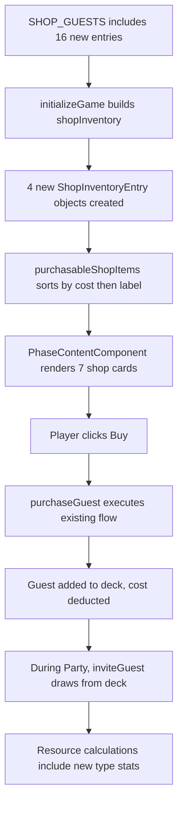

# Design Document: More Guest Types

## Overview

This feature adds four new guest types to the party game: Auctioneer, Gangster, Rock Star, and Gambler. All four are shop-only guests (not in the starting deck) following the same additive pattern established by the Monkey guest type. Each type has 4 named guests in the shop, adding 16 new purchasable guests to the existing 12 (total 28 shop guests). The total guest conservation count rises from 22 to 38 (10 initial + 28 shop).

The new types introduce higher costs and money generation, expanding strategic depth:
- **Auctioneer**: Pure money generator (3 money, 0 popularity, 0 trouble) at the highest cost (9)
- **Gangster**: High money with risk (4 money, 0 popularity, 1 trouble) at cost 6
- **Rock Star**: Balanced all-rounder (2 money, 3 popularity, 1 trouble) at cost 5
- **Gambler**: Money-focused hybrid (3 money, 2 popularity, 1 trouble) at cost 7

This is a purely additive change — only constants in `guest.model.ts` are modified. The store, components, and templates handle new types automatically through existing abstractions.

### Key Design Decisions

1. **Extend GuestType Union**: Add `'AUCTIONEER' | 'GANGSTER' | 'ROCK_STAR' | 'GAMBLER'` to the existing union. All downstream `Record<GuestType, ...>` constants must include the new keys.

2. **Shop-Only Guests**: All four types are added to `SHOP_GUESTS` but not `INITIAL_GUESTS`. The existing `initializeGame()` logic filters by non-null cost, so they appear in the shop automatically.

3. **No New Code Paths**: The existing `purchaseGuest()`, `inviteGuest()`, `advancePhase()`, resource calculations, `GuestCardComponent`, and `PhaseContentComponent` all operate on `GuestType`/`Guest` abstractions. Extending the constants is sufficient.

4. **Shop Display Order**: The existing sort (ascending cost, then alphabetical label) produces: Old Friend (2), Monkey (3), Rich Pal (3), Rock Star (5), Gangster (6), Gambler (7), Auctioneer (9).

5. **Stat Balance**: The new types introduce money generation at higher costs, creating a late-game economy layer. Three of the four types carry 1 trouble, adding risk/reward tension.

## Architecture

### Modified Files

```
Guest Model (guest.model.ts)
├── GuestType union: + 'AUCTIONEER' | 'GANGSTER' | 'ROCK_STAR' | 'GAMBLER'
├── GUEST_TYPE_DEFAULTS: + 4 new entries
├── GUEST_TYPE_LABELS: + 4 new entries
├── GUEST_TYPE_COSTS: + 4 new entries
├── SHOP_GUESTS: + 16 new entries (4 per type)
└── INITIAL_GUESTS: unchanged

GameStore (game.store.ts)
└── No code changes

PhaseContentComponent
└── No code changes

GuestCardComponent
└── No code changes
```

### How Existing Systems Handle New Types



## Components and Interfaces

### Modified Type (guest.model.ts)

```typescript
export type GuestType = 'OLD_FRIEND' | 'WILD_BUDDY' | 'RICH_PAL' | 'MONKEY'
  | 'AUCTIONEER' | 'GANGSTER' | 'ROCK_STAR' | 'GAMBLER';
```

### Modified Constants (guest.model.ts)

#### GUEST_TYPE_DEFAULTS

```typescript
export const GUEST_TYPE_DEFAULTS: Record<GuestType, GuestProperties> = {
  OLD_FRIEND: { popularityValue: 1, troubleValue: 0, moneyValue: 0 },
  WILD_BUDDY: { popularityValue: 2, troubleValue: 1, moneyValue: 0 },
  RICH_PAL:   { popularityValue: 0, troubleValue: 0, moneyValue: 1 },
  MONKEY:     { popularityValue: 4, troubleValue: 1, moneyValue: 0 },
  AUCTIONEER: { popularityValue: 0, troubleValue: 0, moneyValue: 3 },   // NEW
  GANGSTER:   { popularityValue: 0, troubleValue: 1, moneyValue: 4 },   // NEW
  ROCK_STAR:  { popularityValue: 3, troubleValue: 1, moneyValue: 2 },   // NEW
  GAMBLER:    { popularityValue: 2, troubleValue: 1, moneyValue: 3 }    // NEW
};
```

#### GUEST_TYPE_LABELS

```typescript
export const GUEST_TYPE_LABELS: Record<GuestType, string> = {
  OLD_FRIEND: 'Old Friend',
  WILD_BUDDY: 'Wild Buddy',
  RICH_PAL: 'Rich Pal',
  MONKEY: 'Monkey',
  AUCTIONEER: 'Auctioneer',   // NEW
  GANGSTER: 'Gangster',       // NEW
  ROCK_STAR: 'Rock Star',     // NEW
  GAMBLER: 'Gambler'          // NEW
};
```

#### GUEST_TYPE_COSTS

```typescript
export const GUEST_TYPE_COSTS: Record<GuestType, number | null> = {
  OLD_FRIEND: 2,
  WILD_BUDDY: null,
  RICH_PAL: 3,
  MONKEY: 3,
  AUCTIONEER: 9,   // NEW
  GANGSTER: 6,     // NEW
  ROCK_STAR: 5,    // NEW
  GAMBLER: 7       // NEW
};
```

#### SHOP_GUESTS (28 entries total)

```typescript
export const SHOP_GUESTS: readonly { type: GuestType; name: string }[] = [
  // Existing 12 entries...
  { type: 'OLD_FRIEND', name: 'Matt' },
  { type: 'OLD_FRIEND', name: 'Chad' },
  { type: 'OLD_FRIEND', name: 'Wes' },
  { type: 'OLD_FRIEND', name: 'Caleb' },
  { type: 'RICH_PAL', name: 'Kevin' },
  { type: 'RICH_PAL', name: 'Arlene' },
  { type: 'RICH_PAL', name: 'Robert' },
  { type: 'RICH_PAL', name: 'Jim' },
  { type: 'MONKEY', name: 'George' },
  { type: 'MONKEY', name: 'Punch' },
  { type: 'MONKEY', name: 'Darwin' },
  { type: 'MONKEY', name: 'Diddy' },
  // 16 new entries...
  { type: 'AUCTIONEER', name: 'Christie' },    // NEW
  { type: 'AUCTIONEER', name: 'Sotheby' },     // NEW
  { type: 'AUCTIONEER', name: 'Phillip' },     // NEW
  { type: 'AUCTIONEER', name: 'Bonham' },      // NEW
  { type: 'GANGSTER', name: 'Tony' },           // NEW
  { type: 'GANGSTER', name: 'Legs' },           // NEW
  { type: 'GANGSTER', name: 'Louie' },          // NEW
  { type: 'GANGSTER', name: 'Johnny' },         // NEW
  { type: 'ROCK_STAR', name: 'Alanis' },        // NEW
  { type: 'ROCK_STAR', name: 'Gord' },          // NEW
  { type: 'ROCK_STAR', name: 'Neil' },          // NEW
  { type: 'ROCK_STAR', name: 'Randy' },         // NEW
  { type: 'GAMBLER', name: 'Kenny' },           // NEW
  { type: 'GAMBLER', name: 'Ace' },             // NEW
  { type: 'GAMBLER', name: 'Jack' },            // NEW
  { type: 'GAMBLER', name: 'Raymond' }          // NEW
];
```

#### INITIAL_GUESTS — Unchanged

No new type entries. The starting deck remains 10 guests (4 Old Friends, 4 Wild Buddies, 2 Rich Pals).

### Unchanged Components

- **GameStore**: `initializeGame()` iterates `SHOP_GUESTS` and builds `ShopInventoryEntry` objects for types with non-null cost. All four new types have non-null costs and will be included automatically. `purchaseGuest()`, `inviteGuest()`, `advancePhase()`, resource calculations, and all other methods operate on the `Guest` interface.

- **PhaseContentComponent**: Renders shop cards from `purchasableShopItems()` computed signal. The four new entries appear automatically in cost-sorted order.

- **GuestCardComponent**: Renders card header from `GUEST_TYPE_LABELS[guest.type]`. Adding the four new label entries is sufficient.

## Data Models

### Guest Type Properties (Updated)

| Guest Type   | popularityValue | troubleValue | moneyValue | Shop Cost |
|-------------|----------------|--------------|------------|-----------|
| OLD_FRIEND  | 1              | 0            | 0          | 2         |
| WILD_BUDDY  | 2              | 1            | 0          | null      |
| RICH_PAL    | 0              | 0            | 1          | 3         |
| MONKEY      | 4              | 1            | 0          | 3         |
| AUCTIONEER  | 0              | 0            | 3          | 9         |
| GANGSTER    | 0              | 1            | 4          | 6         |
| ROCK_STAR   | 3              | 1            | 2          | 5         |
| GAMBLER     | 2              | 1            | 3          | 7         |

### Shop Guests (Updated — 28 entries)

| Name     | Type       |
|----------|------------|
| Matt     | OLD_FRIEND |
| Chad     | OLD_FRIEND |
| Wes      | OLD_FRIEND |
| Caleb    | OLD_FRIEND |
| Kevin    | RICH_PAL   |
| Arlene   | RICH_PAL   |
| Robert   | RICH_PAL   |
| Jim      | RICH_PAL   |
| George   | MONKEY     |
| Punch    | MONKEY     |
| Darwin   | MONKEY     |
| Diddy    | MONKEY     |
| Christie | AUCTIONEER |
| Sotheby  | AUCTIONEER |
| Phillip  | AUCTIONEER |
| Bonham   | AUCTIONEER |
| Tony     | GANGSTER   |
| Legs     | GANGSTER   |
| Louie    | GANGSTER   |
| Johnny   | GANGSTER   |
| Alanis   | ROCK_STAR  |
| Gord     | ROCK_STAR  |
| Neil     | ROCK_STAR  |
| Randy    | ROCK_STAR  |
| Kenny    | GAMBLER    |
| Ace      | GAMBLER    |
| Jack     | GAMBLER    |
| Raymond  | GAMBLER    |

### Shop Display Order (Updated)

With the existing sort (ascending cost, then alphabetical label for ties):

1. Old Friend (cost 2)
2. Monkey (cost 3)
3. Rich Pal (cost 3)
4. Rock Star (cost 5)
5. Gangster (cost 6)
6. Gambler (cost 7)
7. Auctioneer (cost 9)

### Guest Conservation (Updated)

Total guest count across all zones:

```
deck.length + party.length + discard.length + sum(shopInventory[*].guests.length)
  = INITIAL_GUESTS.length + purchasableShopGuestsCount
  = 10 + 28
  = 38
```

## Correctness Properties

*A property is a characteristic or behavior that should hold true across all valid executions of a system — essentially, a formal statement about what the system should do. Properties serve as the bridge between human-readable specifications and machine-verifiable correctness guarantees.*

### Property 1: New-Type Purchase Yields Valid Guest

*For any* new guest type (AUCTIONEER, GANGSTER, ROCK_STAR, GAMBLER) and any game state where the shop has at least 1 guest of that type remaining and the player's popularity is >= the type's cost, calling `purchaseGuest(type)` SHALL return `{ success: true }` and the newly added guest in the deck SHALL have the correct type, a name that was present in that type's shop inventory before the purchase, and properties matching `GUEST_TYPE_DEFAULTS[type]`. The shop inventory for that type SHALL decrease by 1, and the player's popularity SHALL decrease by exactly `GUEST_TYPE_COSTS[type]`.

This consolidates requirements 7.1–7.5 into a single property that validates the purchase flow works correctly for all four new types. The existing `purchaseGuest()` logic is generic, so this property verifies the new type constants are correctly wired through it.

**Validates: Requirements 7.1, 7.2, 7.3, 7.4, 7.5**

### Property 2: New-Type Resource Contributions

*For any* party composition containing one or more guests of the new types, the total popularity change SHALL include exactly `GUEST_TYPE_DEFAULTS[type].popularityValue` per guest, the total trouble SHALL include exactly `GUEST_TYPE_DEFAULTS[type].troubleValue` per guest, and the total money change SHALL include exactly `GUEST_TYPE_DEFAULTS[type].moneyValue` per guest.

This consolidates requirements 8.1–8.4 into a single property. Rather than testing each type individually, we generate random party compositions with mixed guest types and verify the aggregate resource calculations match the sum of individual defaults.

**Validates: Requirements 8.1, 8.2, 8.3, 8.4**

### Property 3: Guest Conservation with Expanded Pool

*For any* sequence of game operations (purchaseGuest, inviteGuest, advancePhase, triggerPartyShutdown, confirmBan), the sum `deck.length + party.length + discard.length + sum(shopInventory[*].guests.length)` SHALL equal 38 (10 initial guests + 28 purchasable shop guests).

This extends the existing conservation invariant to account for the 16 additional guests in the shop pool. No guests are created or destroyed — purchases move guests from shop to deck, and all other operations move guests between deck/party/discard.

**Validates: Requirements 5.6, 6.2, 7.5, 11.1**

## Error Handling

No new error handling is required. The existing error paths in `purchaseGuest()` handle all new-type failure cases:

- **Sold out**: When all 4 guests of a type have been purchased, `purchaseGuest(type)` returns `{ success: false, error: 'sold_out', message: 'No {label} available!' }` using `GUEST_TYPE_LABELS[type]`.
- **Insufficient popularity**: When popularity < cost, returns `{ success: false, error: 'insufficient_popularity', message: 'Not enough popularity!' }`.
- **Shop display at 0 stock**: The shop card shows "Available: 0" and clicking it triggers the sold-out error modal.

All error messages and UI feedback use the existing patterns with no type-specific code paths.

## Testing Strategy

### Dual Testing Approach

- **Unit tests**: Verify specific constant values (defaults, labels, costs, shop names) for all four new types, initialization state (4 guests per type in shop, 0 in deck), shop display order with all 7 types, and guest card rendering for each new type
- **Property tests**: Verify universal properties (purchase yields valid guest for any new type, resource contributions are correct for any party composition, guest conservation holds at 38 with expanded pool)

Both are complementary — unit tests catch concrete regressions in type-specific values while property tests verify general correctness across the input space.

### Property-Based Testing Configuration

**Library**: fast-check (already installed in the project)

**Configuration**:
- Minimum 100 iterations per property test
- Each test tagged with comment referencing design property
- Tag format: `// Feature: more-guest-types, Property {number}: {property_text}`
- Each correctness property implemented by a SINGLE property-based test

### Property Test Plan

1. **Property 1 test**: Generate a random new guest type from the four new types. Initialize the game, set popularity high enough to afford the type. Perform a purchase. Verify the result is success, the deck grew by 1, the new guest has the correct type, a name from the pre-purchase pool, and properties matching GUEST_TYPE_DEFAULTS. Verify popularity decreased by the type's cost and shop stock decreased by 1.
   - Tag: `// Feature: more-guest-types, Property 1: New-Type Purchase Yields Valid Guest`

2. **Property 2 test**: Generate random party compositions containing at least one guest of a new type (mixed with other types). Calculate expected popularity, trouble, and money from GUEST_TYPE_DEFAULTS. Verify actual resource values match the expected sums.
   - Tag: `// Feature: more-guest-types, Property 2: New-Type Resource Contributions`

3. **Property 3 test**: Generate random sequences of game operations including purchases of new types. After each operation, verify `deck.length + party.length + discard.length + sum(shopInventory[*].guests.length) === 38`.
   - Tag: `// Feature: more-guest-types, Property 3: Guest Conservation with Expanded Pool`

### Unit Test Plan

**Model tests** (`guest.model.spec.ts`):
- `GUEST_TYPE_DEFAULTS` has correct values for all four new types
- `GUEST_TYPE_LABELS` has correct labels for all four new types
- `GUEST_TYPE_COSTS` has correct costs for all four new types
- `SHOP_GUESTS` has exactly 4 entries per new type with correct names
- `SHOP_GUESTS` has exactly 28 total entries
- `INITIAL_GUESTS` has zero entries for any new type
- `INITIAL_GUESTS` remains at exactly 10 entries

**Store tests** (`game.store.spec.ts`):
- After `initializeGame()`, shopInventory has entries for each new type with 4 guests and correct cost
- After `initializeGame()`, deck contains zero guests of any new type
- `purchasableShopItems()` returns all 7 types in correct order: Old Friend, Monkey, Rich Pal, Rock Star, Gangster, Gambler, Auctioneer

**Component tests** (`phase-content.component.spec.ts`):
- During BUY phase, shop cards for all four new types are rendered with correct labels and costs

**Component tests** (`guest-card.component.spec.ts`):
- GuestCardComponent renders correct header and name for each new type

### Test File Organization

```
src/app/
  models/
    guest.model.spec.ts                    # Unit tests (extended for 4 new types)
    guest.model.property.spec.ts           # Property tests (extended if needed)
  stores/
    game.store.spec.ts                     # Unit tests (extended for new shop entries)
    game.store.property.spec.ts            # Properties 1, 2, 3
  components/
    phase-content.component.spec.ts        # Unit tests (extended for new shop cards)
    guest-card.component.spec.ts           # Unit tests (extended for new card types)
```
