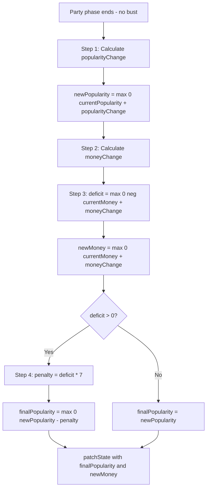

# Design Document: Negative Resources

## Overview

This feature introduces negative resource values to the party card game. Two new guest types — Caterer and Ticket Taker — have negative `moneyValue` and `popularityValue` respectively, creating strategic tradeoffs. The core mechanic change is a money deficit penalty: when a party's money contribution would push the player's money below 0, each deficit point costs 7 popularity.

The key logic change is in `advancePhase()` during the Party→BUY transition. The current implementation calculates popularity and money independently with simple `Math.max(0, ...)` clamping. The new implementation introduces a specific calculation order where popularity is applied first, then money is calculated, and if a money deficit exists, a steep popularity penalty is applied to the already-updated popularity.

Two new guest types are added:
- **Caterer**: 4 popularity, 0 trouble, -1 money, 0 peace — cost 5
- **Ticket Taker**: -1 popularity, 0 trouble, 2 money, 0 peace — cost 4

Neither appears in the starting deck. Both are shop-only with 4 named guests each, adding 8 new shop guests (36 existing → 44 shop, 54 total with 10 initial).

### Key Design Decisions

1. **No new state fields**: The existing `popularity` and `money` fields in `GameState` are sufficient. The money deficit penalty is a transient calculation within `advancePhase()`, not stored state.

2. **Calculation order matters**: Popularity from guests is applied first (step 1), then money is calculated (step 2), then the deficit penalty reduces the already-updated popularity (step 3). This means a Caterer's +4 popularity is counted before its -1 money potentially triggers a deficit penalty.

3. **No cascading penalties**: If the money deficit penalty drives popularity below 0, popularity simply floors at 0. There is no further penalty for "negative popularity" — the cascade stops.

4. **Penalty rate of 7**: Each point of money deficit costs 7 popularity. This is a constant, not configurable state. It lives as a local constant in the `advancePhase()` method.

5. **Existing components auto-render**: `GuestCardComponent` reads from `GUEST_TYPE_LABELS`, `PhaseContentComponent` renders shop cards from `purchasableShopItems()`. Adding the new types to the model constants is sufficient — no component template or logic changes needed.

6. **Shop display order**: With the existing sort (ascending cost, then alphabetical label for ties), the new order is: Old Friend (2), Monkey (3), Rich Pal (3), Hippy (4), Ticket Taker (4), Caterer (5), Rock Star (5), Gangster (6), Cute Dog (7), Gambler (7), Auctioneer (9).

## Architecture

### Modified Files

```
Guest Model (guest.model.ts)
├── GuestType union: + 'CATERER' | 'TICKET_TAKER'
├── GUEST_TYPE_DEFAULTS: + 2 new entries (with negative values)
├── GUEST_TYPE_LABELS: + 2 new entries
├── GUEST_TYPE_COSTS: + 2 new entries
└── SHOP_GUESTS: + 8 new entries (4 per type), total 44

GameStore (game.store.ts)
└── advancePhase() Party branch: rewrite resource calculation
    ├── Step 1: newPopularity = max(0, currentPopularity + popularityChange)
    ├── Step 2: moneyChange = sum of moneyValue across party
    ├── Step 3: deficit = max(0, -(currentMoney + moneyChange))
    │           newMoney = max(0, currentMoney + moneyChange)
    └── Step 4: finalPopularity = max(0, newPopularity - deficit * 7)

No changes needed:
├── GameState interface (no new fields)
├── GuestCardComponent (auto-renders from GUEST_TYPE_LABELS)
├── PhaseContentComponent (auto-renders from purchasableShopItems)
├── StatusPaneComponent (reads existing popularity/money signals)
└── INITIAL_GUESTS (unchanged at 10 entries)
```

### Money Deficit Penalty Flow



### Integration Points

1. **GuestType**: Extend union with `'CATERER' | 'TICKET_TAKER'`
2. **GUEST_TYPE_DEFAULTS**: Add entries with negative resource values
3. **GUEST_TYPE_LABELS**: Add `'Caterer'` and `'Ticket Taker'`
4. **GUEST_TYPE_COSTS**: Add `5` and `4` respectively
5. **SHOP_GUESTS**: Add 8 named entries (4 Caterers, 4 Ticket Takers)
6. **advancePhase()**: Rewrite Party branch resource calculation with deficit penalty logic

## Components and Interfaces

### Modified Type: GuestType (guest.model.ts)

```typescript
export type GuestType = 'OLD_FRIEND' | 'WILD_BUDDY' | 'RICH_PAL' | 'MONKEY'
  | 'AUCTIONEER' | 'GANGSTER' | 'ROCK_STAR' | 'GAMBLER'
  | 'CUTE_DOG' | 'HIPPY'
  | 'CATERER' | 'TICKET_TAKER';     // NEW
```

### Modified Constants (guest.model.ts)

#### GUEST_TYPE_DEFAULTS — New Entries

```typescript
CATERER: {
  popularityValue: 4,
  troubleValue: 0,
  moneyValue: -1,        // NEGATIVE
  peaceValue: 0
},
TICKET_TAKER: {
  popularityValue: -1,   // NEGATIVE
  troubleValue: 0,
  moneyValue: 2,
  peaceValue: 0
}
```

#### GUEST_TYPE_LABELS — New Entries

```typescript
CATERER: 'Caterer',
TICKET_TAKER: 'Ticket Taker'
```

#### GUEST_TYPE_COSTS — New Entries

```typescript
CATERER: 5,
TICKET_TAKER: 4
```

#### SHOP_GUESTS — New Entries (8 added, 44 total)

```typescript
{ type: 'CATERER', name: 'Ronald' },
{ type: 'CATERER', name: 'Wendy' },
{ type: 'CATERER', name: 'Mario' },
{ type: 'CATERER', name: 'Tim' },
{ type: 'TICKET_TAKER', name: 'Val' },
{ type: 'TICKET_TAKER', name: 'Grant' },
{ type: 'TICKET_TAKER', name: 'Mark' },
{ type: 'TICKET_TAKER', name: 'Stubby' },
```

#### INITIAL_GUESTS — Unchanged

No new type entries. The starting deck remains 10 guests with zero CATERER or TICKET_TAKER entries.

### Modified Store: advancePhase() Party Branch (game.store.ts)

The current implementation:

```typescript
// CURRENT (to be replaced)
const popularityChange = calculatePopularityChange();
const currentPopularity = store.popularity();
const newPopularity = Math.max(0, currentPopularity + popularityChange);

const moneyChange = calculateMoneyChange();
const currentMoney = store.money();
const newMoney = Math.max(0, currentMoney + moneyChange);

patchState(store, { popularity: newPopularity, money: newMoney });
```

The new implementation:

```typescript
// NEW: Resource calculation with money deficit penalty
const MONEY_DEFICIT_PENALTY_RATE = 7;

// Step 1: Calculate and apply popularity from party guests
const popularityChange = calculatePopularityChange();
const currentPopularity = store.popularity();
const newPopularity = Math.max(0, currentPopularity + popularityChange);

// Step 2: Calculate money change from party guests
const moneyChange = calculateMoneyChange();
const currentMoney = store.money();

// Step 3: Compute money deficit and clamp money to 0
const moneyDeficit = Math.max(0, -(currentMoney + moneyChange));
const newMoney = Math.max(0, currentMoney + moneyChange);

// Step 4: Apply money deficit penalty to already-updated popularity
const finalPopularity = moneyDeficit > 0
  ? Math.max(0, newPopularity - moneyDeficit * MONEY_DEFICIT_PENALTY_RATE)
  : newPopularity;

patchState(store, { popularity: finalPopularity, money: newMoney });
```

### Unchanged Components

- **GuestCardComponent**: Reads `GUEST_TYPE_LABELS[guest.type]` for the header. Adding the two new label entries is sufficient — no template changes.

- **PhaseContentComponent**: Renders shop cards from `purchasableShopItems()`. The two new types appear automatically in cost-sorted order. The existing template displays label, cost, and stock count.

- **StatusPaneComponent**: Displays `popularity()` and `money()` signals. The deficit penalty modifies these values before they reach the store, so the display is automatically correct.

- **GameplayComponent**: The shutdown effect reads `trouble()` and `effectiveTroubleLimit()`. Neither Caterer nor Ticket Taker has trouble or peace values, so shutdown behavior is unaffected.

## Data Models

### Guest Type Properties (Updated)

| Guest Type    | popularityValue | troubleValue | moneyValue | peaceValue | Shop Cost |
|--------------|----------------|--------------|------------|------------|-----------|
| OLD_FRIEND   | 1              | 0            | 0          | 0          | 2         |
| WILD_BUDDY   | 2              | 1            | 0          | 0          | null      |
| RICH_PAL     | 0              | 0            | 1          | 0          | 3         |
| MONKEY       | 4              | 1            | 0          | 0          | 3         |
| AUCTIONEER   | 0              | 0            | 3          | 0          | 9         |
| GANGSTER     | 0              | 1            | 4          | 0          | 6         |
| ROCK_STAR    | 3              | 1            | 2          | 0          | 5         |
| GAMBLER      | 2              | 1            | 3          | 0          | 7         |
| CUTE_DOG     | 2              | 0            | 0          | 1          | 7         |
| HIPPY        | 1              | 0            | 0          | 1          | 4         |
| **CATERER**  | **4**          | **0**        | **-1**     | **0**      | **5**     |
| **TICKET_TAKER** | **-1**    | **0**        | **2**      | **0**      | **4**     |

### Shop Guests (Updated — 44 entries)

Existing 36 entries plus:

| Name    | Type          |
|---------|---------------|
| Ronald  | CATERER       |
| Wendy   | CATERER       |
| Mario   | CATERER       |
| Tim     | CATERER       |
| Val     | TICKET_TAKER  |
| Grant   | TICKET_TAKER  |
| Mark    | TICKET_TAKER  |
| Stubby  | TICKET_TAKER  |

### Shop Display Order (Updated — 11 types)

With the existing sort (ascending cost, then alphabetical label for ties):

1. Old Friend (cost 2)
2. Monkey (cost 3)
3. Rich Pal (cost 3)
4. Hippy (cost 4)
5. Ticket Taker (cost 4)
6. Caterer (cost 5)
7. Rock Star (cost 5)
8. Gangster (cost 6)
9. Cute Dog (cost 7)
10. Gambler (cost 7)
11. Auctioneer (cost 9)

### Money Deficit Penalty Calculation

```
moneyDeficit = max(0, -(currentMoney + moneyChange))
moneyDeficitPenalty = moneyDeficit * 7
finalPopularity = max(0, newPopularity - moneyDeficitPenalty)
```

#### Worked Examples

**Example 1**: Player has 3 money, party total moneyChange = -7
- moneyDeficit = max(0, -(3 + (-7))) = max(0, -(-4)) = max(0, 4) = 4
- newMoney = max(0, 3 + (-7)) = max(0, -4) = 0
- penalty = 4 × 7 = 28
- If newPopularity was 30: finalPopularity = max(0, 30 - 28) = 2
- If newPopularity was 20: finalPopularity = max(0, 20 - 28) = 0

**Example 2**: Player has 0 money, party total moneyChange = -3
- moneyDeficit = max(0, -(0 + (-3))) = max(0, 3) = 3
- newMoney = max(0, 0 + (-3)) = 0
- penalty = 3 × 7 = 21

**Example 3**: Player has 5 money, party total moneyChange = -2
- moneyDeficit = max(0, -(5 + (-2))) = max(0, -3) = 0
- newMoney = max(0, 5 + (-2)) = 3
- penalty = 0 (no deficit)

**Example 4**: Player has 5 popularity, party grants +2 popularity (newPopularity = 7), moneyDeficit = 4
- penalty = 4 × 7 = 28
- finalPopularity = max(0, 7 - 28) = 0 (floored, no cascading)

### Guest Conservation (Updated)

```
deck.length + party.length + discard.length + sum(shopInventory[*].guests.length)
  = INITIAL_GUESTS.length + SHOP_GUESTS.length
  = 10 + 44
  = 54
```


## Correctness Properties

*A property is a characteristic or behavior that should hold true across all valid executions of a system — essentially, a formal statement about what the system should do. Properties serve as the bridge between human-readable specifications and machine-verifiable correctness guarantees.*

### Property 1: Party Resource Contribution Sums

*For any* party composition containing any mix of guest types (including Caterers with moneyValue -1 and Ticket Takers with popularityValue -1), the raw popularity change SHALL equal the sum of `popularityValue` across all party guests, and the raw money change SHALL equal the sum of `moneyValue` across all party guests.

This verifies that negative resource values are included in the summation without being filtered or clamped at the per-guest level. The clamping happens at the total level, not per-guest.

**Validates: Requirements 5.1, 5.2, 5.3, 5.4, 11.1, 11.2**

### Property 2: End-of-Party Resource Calculation Formula

*For any* starting popularity, starting money, and party composition, when the Party phase ends without a bust, the final money SHALL equal `max(0, currentMoney + moneyChange)` and the final popularity SHALL equal `max(0, max(0, currentPopularity + popularityChange) - max(0, -(currentMoney + moneyChange)) * 7)`.

This single formula encodes the entire calculation order: popularity applied first, then money calculated, then deficit penalty applied to the already-updated popularity, with both resources floored at 0 and no cascading penalty. The zero-deficit case is subsumed (when deficit = 0, the penalty term is 0, so finalPopularity = newPopularity).

**Validates: Requirements 6.1, 6.2, 7.1, 7.2, 7.3, 7.4, 8.1, 8.2, 8.3, 9.1, 9.2, 9.3, 9.4, 9.5**

### Property 3: Negative Resource Guest Purchase Flow

*For any* negative resource guest type (CATERER or TICKET_TAKER) and any game state where the shop has at least 1 guest of that type remaining and the player's popularity is >= the type's cost, calling `purchaseGuest(type)` SHALL return `{ success: true }`, the deck SHALL grow by 1 with a guest of the correct type whose name was in the pre-purchase inventory, the shop inventory for that type SHALL decrease by 1, and the player's popularity SHALL decrease by exactly `GUEST_TYPE_COSTS[type]`.

**Validates: Requirements 10.1, 10.2, 10.3**

### Property 4: Shop Display Order with Negative Resource Types

*For any* shop inventory state, `purchasableShopItems()` SHALL return entries sorted by ascending cost, then alphabetical label for ties. With all 11 types present, the order SHALL be: Old Friend (2), Monkey (3), Rich Pal (3), Hippy (4), Ticket Taker (4), Caterer (5), Rock Star (5), Gangster (6), Cute Dog (7), Gambler (7), Auctioneer (9).

**Validates: Requirements 12.2**

### Property 5: Guest Conservation at 54

*For any* sequence of game operations (purchaseGuest, inviteGuest, advancePhase, triggerPartyShutdown, confirmBan), the sum `deck.length + party.length + discard.length + sum(shopInventory[*].guests.length)` SHALL equal 54 (10 initial guests + 44 purchasable shop guests).

**Validates: Requirements 14.1**

## Error Handling

### Existing Error Paths Cover New Types

No new error handling is required. The existing error paths in `purchaseGuest()` handle all negative-resource-type failure cases:

- **Sold out**: When all 4 guests of a type have been purchased, `purchaseGuest(type)` returns `{ success: false, error: 'sold_out', message: 'No {label} available!' }` using `GUEST_TYPE_LABELS[type]`.
- **Insufficient popularity**: When popularity < cost, returns `{ success: false, error: 'insufficient_popularity', message: 'Not enough popularity!' }`.

### Money Deficit Penalty Edge Cases

1. **Zero deficit**: When `currentMoney + moneyChange >= 0`, deficit is 0 and no penalty is applied. The `moneyDeficit > 0` guard ensures this.
2. **Large deficit**: When the deficit is very large, the penalty can exceed the updated popularity. The `Math.max(0, ...)` clamp prevents negative popularity.
3. **Zero starting money with negative moneyChange**: Deficit equals the absolute value of moneyChange. Money stays at 0.
4. **Positive moneyChange with low starting money**: No deficit occurs even if starting money is 0, because the party contributes positive money.

### No Cascading Penalty

The design explicitly prevents cascading: if the money deficit penalty drives popularity to 0, there is no "popularity deficit" that triggers further penalties. The calculation terminates after step 4.

## Testing Strategy

### Dual Testing Approach

- **Unit tests**: Verify specific constant values (defaults, labels, costs, shop names for CATERER and TICKET_TAKER), initialization state (4 guests per type in shop, 0 in deck), specific worked examples of the deficit penalty (e.g., 3 money with -7 change → deficit 4 → penalty 28), shop display order with all 11 types, and guest card rendering for each new type
- **Property tests**: Verify universal properties (resource contribution sums, end-of-party formula, purchase flow, shop sort order, guest conservation at 54)

Both are complementary — unit tests catch concrete regressions in type-specific values and specific penalty scenarios, while property tests verify general correctness across the full input space including edge cases like zero deficit, large deficits, and mixed positive/negative contributions.

### Property-Based Testing Configuration

**Library**: fast-check (already installed in the project)

**Configuration**:
- Minimum 100 iterations per property test
- Each test tagged with comment referencing design property
- Tag format: `// Feature: negative-resources, Property {number}: {property_text}`
- Each correctness property implemented by a SINGLE property-based test

### Property Test Plan

1. **Property 1 test**: Generate random party compositions with varying guest types (including CATERER and TICKET_TAKER). Set the party in the store. Verify that the raw popularity change equals the sum of `popularityValue` and the raw money change equals the sum of `moneyValue` across all party guests, including negative values.
   - Tag: `// Feature: negative-resources, Property 1: Party Resource Contribution Sums`

2. **Property 2 test**: Generate random starting popularity (0–100), starting money (0–50), and random party compositions including guests with negative resource values. Set the store state, advance from Party phase, and verify that the final popularity equals `max(0, max(0, startPop + popChange) - max(0, -(startMoney + moneyChange)) * 7)` and final money equals `max(0, startMoney + moneyChange)`.
   - Tag: `// Feature: negative-resources, Property 2: End-of-Party Resource Calculation Formula`

3. **Property 3 test**: Generate a random negative resource guest type (CATERER or TICKET_TAKER). Initialize the game, set popularity high enough to afford the type. Perform a purchase. Verify the result is success, the deck grew by 1, the new guest has the correct type and a name from the pre-purchase pool, popularity decreased by the type's cost, and shop stock decreased by 1.
   - Tag: `// Feature: negative-resources, Property 3: Negative Resource Guest Purchase Flow`

4. **Property 4 test**: Initialize the game and verify that `purchasableShopItems()` returns all 11 types in the correct order: Old Friend, Monkey, Rich Pal, Hippy, Ticket Taker, Caterer, Rock Star, Gangster, Cute Dog, Gambler, Auctioneer. Also generate random subsets of inventory (simulating some types sold out) and verify the remaining items maintain the sort order.
   - Tag: `// Feature: negative-resources, Property 4: Shop Display Order with Negative Resource Types`

5. **Property 5 test**: Generate random sequences of game operations including purchases of CATERER and TICKET_TAKER types. After each operation, verify `deck.length + party.length + discard.length + sum(shopInventory[*].guests.length) === 54`.
   - Tag: `// Feature: negative-resources, Property 5: Guest Conservation at 54`

### Unit Test Plan

**Model tests** (`guest.model.spec.ts`):
- `GUEST_TYPE_DEFAULTS['CATERER']` has correct values (4, 0, -1, 0)
- `GUEST_TYPE_DEFAULTS['TICKET_TAKER']` has correct values (-1, 0, 2, 0)
- `GUEST_TYPE_LABELS['CATERER']` is 'Caterer'
- `GUEST_TYPE_LABELS['TICKET_TAKER']` is 'Ticket Taker'
- `GUEST_TYPE_COSTS['CATERER']` is 5
- `GUEST_TYPE_COSTS['TICKET_TAKER']` is 4
- `SHOP_GUESTS` has exactly 4 CATERER entries with names Ronald, Wendy, Mario, Tim
- `SHOP_GUESTS` has exactly 4 TICKET_TAKER entries with names Val, Grant, Mark, Stubby
- `SHOP_GUESTS` has exactly 44 total entries
- `INITIAL_GUESTS` has zero CATERER or TICKET_TAKER entries
- `INITIAL_GUESTS` has exactly 10 entries

**Store tests** (`game.store.spec.ts`):
- After `initializeGame()`, shopInventory has entries for CATERER (4 guests, cost 5) and TICKET_TAKER (4 guests, cost 4)
- After `initializeGame()`, deck contains zero CATERER or TICKET_TAKER guests
- Worked example: 3 money, moneyChange -7 → money 0, popularity penalty 28
- Worked example: 0 money, moneyChange -3 → money 0, popularity penalty 21
- Worked example: 5 popularity, +2 popChange, deficit 4 → popularity max(0, 7 - 28) = 0
- No deficit case: 5 money, moneyChange -2 → money 3, no penalty
- Zero deficit: moneyChange >= 0 → no penalty applied

**Component tests** (`phase-content.component.spec.ts`):
- During BUY phase, shop cards for CATERER and TICKET_TAKER are rendered with correct labels and costs

**Component tests** (`guest-card.component.spec.ts`):
- GuestCardComponent renders "Caterer" header and guest name for a CATERER guest
- GuestCardComponent renders "Ticket Taker" header and guest name for a TICKET_TAKER guest

### Test File Organization

```
src/app/
  models/
    guest.model.spec.ts                    # Unit tests (extended for CATERER + TICKET_TAKER)
    guest.model.property.spec.ts           # Extended if needed
  stores/
    game.store.spec.ts                     # Unit tests (extended for deficit penalty worked examples)
    game.store.property.spec.ts            # Properties 1, 2, 3, 5
  components/
    phase-content.component.spec.ts        # Unit tests (extended for new shop cards)
    phase-content.component.property.spec.ts # Property 4
    guest-card.component.spec.ts           # Unit tests (extended for new card rendering)
    guest-card.component.property.spec.ts  # Extended if needed
```
