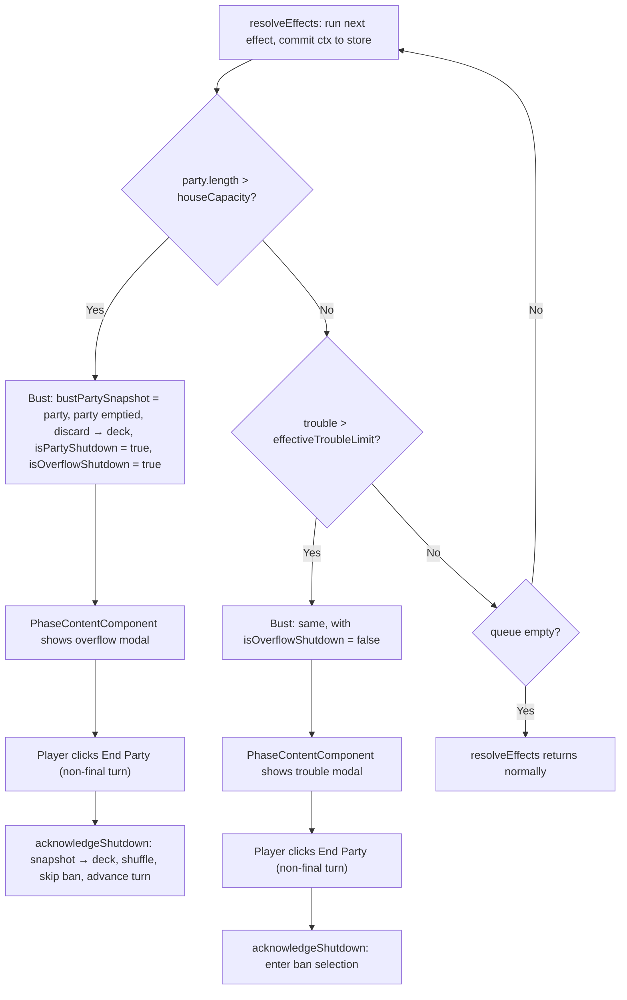

# Design Document: Overflow

## Overview

This feature introduces the overflow mechanic and two new guest types — Mr. Popular and Celebrity — to the party card game. Both guest types have entrance effects that perform Auto_Invites: drawing the top guest from the deck and adding them to the party even if doing so exceeds the house capacity. When an Auto_Invite pushes the party beyond capacity, an Overflow_Shutdown occurs immediately: no scoring, no ban, all guests return to the deck. If an Auto_Invite instead pushes trouble over the limit (without overflow), the normal Trouble_Limit_Shutdown applies. When both conditions are triggered simultaneously, overflow takes priority.

### Key Design Decisions

1. **Generic FIFO effect queue in the store**: All effect resolution happens in a private store method, `resolveEffects(initialEffect)`. It holds a local queue of `GameEffect`s (`(ctx: EffectContext) => void`). Effects can add follow-up effects with `ctx.enqueue(...)`. The loop takes the next effect, builds a fresh `EffectContextImpl` from store state, runs the effect, commits the context back with `patchState`, and checks for a bust before running the next effect. Neither `inviteGuest()` nor the loop knows what kinds of effects exist.

2. **Every arrival is an effect**: `admitGuest(guest)` returns an effect that adds the guest to the party and enqueues the guest's entrance effect (if its type has one). The player's invite and every Auto_Invite go through `admitGuest`, so all arrivals are checked for a bust the same way.

3. **autoInvite() enqueues a draw**: `autoInvite(ctx)` (a helper in `guest.model.ts`, not a context method) enqueues one effect that draws the top guest from the deck and admits it. The draw happens when that effect runs, not when it is enqueued. If an earlier effect busts the party, the queue is discarded, the draw never happens, and the guest stays in the deck. An empty deck makes the draw a no-op.

4. **Sequencing falls out of FIFO order**: Celebrity's handler enqueues two draws. Each draw, when it runs, admits a guest and enqueues that guest's entrance effect at the back of the queue. So both of Celebrity's guests arrive before either of their entrance effects runs, and entrance effects run in arrival order (Requirement 6). **Superseded by the `entrance-effect-order` spec:** effects are now resolved depth-first, so an arriving guest's entrance effect runs before Celebrity's second draw.

5. **isOverflowShutdown State Flag**: A new `isOverflowShutdown: boolean` field is added to `GameStoreState`. When true, `acknowledgeShutdown()` skips ban selection and advances directly to the next turn Buy phase (or marks game complete on the final turn). The existing `isPartyShutdown` flag remains the primary "shutdown modal is showing" signal; `isOverflowShutdown` is the discriminator between the two shutdown types.

6. **Two Distinct Shutdown Modals**: The trouble shutdown modal ("The party has gotten out of control...") and the overflow modal ("Party exceeded capacity! Fire department has shut it down!") are rendered separately in `PhaseContentComponent`. Both modals use the same button label logic: "End Party" on non-final turns and "Game Over" on the final turn. The two modals are distinguished only by their message text and CSS styling.

7. **Bust checked after every effect, overflow first**: After each effect is committed, `resolveEffects()` checks overflow (`party.length > houseCapacity`), then trouble (`trouble > effectiveTroubleLimit`). On either, it shuts the party down inline: the party is moved to `bustPartySnapshot`, the discard pile returns to the deck, `isPartyShutdown` is set, `isOverflowShutdown` records which kind of bust it was, and the loop returns, discarding any effects still queued. This covers the player's own invite as well as Auto_Invites.

8. **Busted guests wait in the snapshot**: Busted guests stay in `bustPartySnapshot` until the player dismisses the modal. For an overflow on a non-final turn, `acknowledgeShutdown()` returns the whole snapshot to the deck and shuffles it. For a trouble bust, they stay there through ban selection, and `confirmBan()` returns all but the banned guest.

9. **Guard against inviting during a bust**: `inviteGuest()` returns immediately while `isPartyShutdown` or `isBanSelectionActive` is true, and `canInviteGuest` is false in those states.

10. **Shop sort order**: `purchasableShopItems()` already sorts by cost ascending then label alphabetically. MR_POPULAR (cost 5) slots between CATERER/ROCK_STAR (cost 5) alphabetically: Caterer → Mr. Popular → Rock Star. CELEBRITY (cost 11) slots between AUCTIONEER (cost 9) and CLIMBER (cost 12).

## Architecture

### Modified and New Layers

```
guest.model.ts
├── GuestType union: + 'MR_POPULAR' | 'CELEBRITY'
├── GUEST_TYPE_DEFAULTS: + MR_POPULAR, CELEBRITY entries
├── GUEST_TYPE_LABELS: + MR_POPULAR → "Mr. Popular", CELEBRITY → "Celebrity"
├── GUEST_TYPE_COSTS: + MR_POPULAR → 5, CELEBRITY → 11
├── SHOP_GUESTS: + 4 MR_POPULAR entries, + 4 CELEBRITY entries
├── EffectHandler: (ctx: EffectContext, guest: Guest) => void
├── GUEST_TYPE_ENTRANCE_EFFECTS: + MR_POPULAR (1 autoInvite), CELEBRITY (2 autoInvites)
├── admitGuest(guest): GameEffect — add to party, enqueue entrance effect
└── autoInvite(ctx): enqueue an effect that draws the top guest and admits it

effect-context.ts
├── GameEffect: (ctx: EffectContext) => void
└── EffectContext: + enqueue(effect: GameEffect): void
                   + updateGuest(guest, updater): Guest  (replaces the per-guest context)

game.store.ts
├── GameStoreState: + isOverflowShutdown: boolean
├── EffectContextImpl: built per effect; enqueue() pushes onto the resolveEffects queue
├── + resolveEffects(initialEffect) [private]: FIFO loop — run effect → commit → check bust → repeat
├── inviteGuest(): guard → empty-deck / house-full checks → draw → resolveEffects(admitGuest(guest))
├── canInviteGuest: + false while isPartyShutdown or isBanSelectionActive
├── acknowledgeShutdown(): overflow → return snapshot to deck, shuffle, skip ban selection
└── initializeGame() / resetGame(): include isOverflowShutdown: false

PhaseContentComponent
└── + overflow modal (separate from trouble modal)
```

### Effect Chain Flow

Example: the player invites a Celebrity; her first auto-invite draws a Mr. Popular.

```mermaid
sequenceDiagram
    participant Player
    participant inviteGuest
    participant resolveEffects
    participant Store

    Player->>inviteGuest: inviteGuest()
    inviteGuest->>Store: patchState({ deck: remainingDeck })  (Celebrity drawn)
    inviteGuest->>resolveEffects: resolveEffects(admitGuest(celebrity))
    Note over resolveEffects: queue = [admit Celebrity]

    loop until queue is empty or a bust
        resolveEffects->>resolveEffects: effect = queue.shift(); ctx = new EffectContextImpl(store state, enqueue)
        resolveEffects->>resolveEffects: effect(ctx)  (may call ctx.enqueue)
        resolveEffects->>Store: patchState(deck, party, discard, popularity, money from ctx)
        alt party.length > houseCapacity
            resolveEffects->>Store: bust: snapshot party, isPartyShutdown, isOverflowShutdown = true
            Note over resolveEffects: return (remaining queue discarded)
        else trouble > effectiveTroubleLimit
            resolveEffects->>Store: bust: snapshot party, isPartyShutdown, isOverflowShutdown = false
            Note over resolveEffects: return (remaining queue discarded)
        end
    end

    Note over resolveEffects: Queue over time:<br/>1. admit Celebrity → enqueues Celebrity's effect<br/>2. Celebrity's effect → enqueues draw A, draw B<br/>3. draw A → admits Mr. Popular → enqueues his effect<br/>4. draw B → admits the next guest<br/>5. Mr. Popular's effect → enqueues draw C<br/>6. draw C → admits the next guest
```

### Overflow Shutdown Flow



## Components and Interfaces

### Modified Type: GuestType (guest.model.ts)

```typescript
export type GuestType = 'OLD_FRIEND' | 'WILD_BUDDY' | 'RICH_PAL' | 'MONKEY'
  | 'AUCTIONEER' | 'GANGSTER' | 'ROCK_STAR' | 'GAMBLER'
  | 'CUTE_DOG' | 'HIPPY'
  | 'CATERER' | 'TICKET_TAKER'
  | 'CLIMBER'
  | 'MR_POPULAR' | 'CELEBRITY';  // NEW
```

### New Constants (guest.model.ts)

#### GUEST_TYPE_DEFAULTS additions

```typescript
MR_POPULAR: {
  popularityValue: 3,
  troubleValue: 0,
  moneyValue: 0,
  peaceValue: 0
},
CELEBRITY: {
  popularityValue: 2,
  troubleValue: 0,
  moneyValue: 3,
  peaceValue: 0
}
```

#### GUEST_TYPE_LABELS additions

```typescript
MR_POPULAR: 'Mr. Popular',
CELEBRITY: 'Celebrity'
```

#### GUEST_TYPE_COSTS additions

```typescript
MR_POPULAR: 5,
CELEBRITY: 11
```

#### SHOP_GUESTS additions (8 new entries, 56 total)

```typescript
{ type: 'MR_POPULAR', name: 'Rowan' },
{ type: 'MR_POPULAR', name: 'Oscar' },
{ type: 'MR_POPULAR', name: 'Lawrence' },
{ type: 'MR_POPULAR', name: 'McDougall' },
{ type: 'CELEBRITY', name: 'Troy' },
{ type: 'CELEBRITY', name: 'Rainier' },
{ type: 'CELEBRITY', name: 'Pedro' },
{ type: 'CELEBRITY', name: 'Kent' },
```

#### GUEST_TYPE_ENTRANCE_EFFECTS additions

```typescript
MR_POPULAR: (ctx) => {
  autoInvite(ctx);
},
CELEBRITY: (ctx) => {
  autoInvite(ctx);
  autoInvite(ctx);
}
```

### New Functions: admitGuest() and autoInvite() (guest.model.ts)

`admitGuest` is the single path by which any guest joins the party. `autoInvite` is how an entrance effect brings in another guest. Neither checks capacity or trouble — the store's effect loop checks for a bust after every effect.

```typescript
// Adds a guest to the party, then enqueues its entrance effect (if any).
export function admitGuest(guest: Guest): GameEffect {
  return (ctx) => {
    ctx.setParty([...ctx.getParty(), guest]);

    const entranceEffect = GUEST_TYPE_ENTRANCE_EFFECTS[guest.type];
    if (entranceEffect) {
      ctx.enqueue((c) => entranceEffect(c, guest));
    }
  };
}

// Enqueues an effect that draws the top guest from the deck and admits it to the party.
// The draw happens when the effect runs, not when it is enqueued, so if a bust discards
// the queue first, the guest is never drawn and stays in the deck.
export function autoInvite(ctx: EffectContext): void {
  ctx.enqueue((c) => {
    const [guest, ...remainingDeck] = c.getDeck();
    if (!guest) return;

    c.setDeck(remainingDeck);
    admitGuest(guest)(c);
  });
}
```

Note that the draw effect calls `admitGuest(guest)(c)` directly instead of enqueueing it. The arrival is part of the draw, so the bust check that follows the draw sees the new guest. The arriving guest's own entrance effect is still enqueued at the back of the queue.

### Modified Interface: EffectContext (effect-context.ts)

```typescript
export type GameEffect = (ctx: EffectContext) => void;

export interface EffectContext {
  getDeck(): Guest[];
  setDeck(deck: Guest[]): void;
  getParty(): Guest[];
  setParty(party: Guest[]): void;
  getDiscard(): Guest[];
  setDiscard(discard: Guest[]): void;
  getPopularity(): number;
  setPopularity(value: number): void;
  getMoney(): number;
  setMoney(value: number): void;

  // Replaces `guest` in the party with updater(guest) (matched by reference) and returns the updated guest
  updateGuest(guest: Guest, updater: (g: Guest) => Guest): Guest;

  // NEW: adds an effect to the end of the effect queue; it runs after every effect already queued
  enqueue(effect: GameEffect): void;
}
```

The context no longer carries a triggering guest. Entrance effect handlers receive the guest as a second argument (`EffectHandler = (ctx, guest) => void`), so the same context type serves effects that have no triggering guest, such as the draw effect above.

### Modified Class: EffectContextImpl (game.store.ts)

A fresh `EffectContextImpl` is built from store state for each effect. Its `enqueue` pushes onto the queue owned by `resolveEffects()`.

```typescript
class EffectContextImpl implements EffectContext {
  private _deck: Guest[];
  private _party: Guest[];
  private _discard: Guest[];
  private _popularity: number;
  private _money: number;
  private _enqueue: (effect: GameEffect) => void;

  constructor(
    deck: Guest[],
    party: Guest[],
    discard: Guest[],
    popularity: number,
    money: number,
    enqueue: (effect: GameEffect) => void
  ) { /* ... assign all fields ... */ }

  // ... getters/setters for deck, party, discard, popularity, money ...

  updateGuest(guest: Guest, updater: (g: Guest) => Guest): Guest {
    const updated = updater(guest);
    this._party = this._party.map(g => (g === guest ? updated : g));
    return updated;
  }

  enqueue(effect: GameEffect): void { this._enqueue(effect); }
}
```

### New Private Method: resolveEffects() (game.store.ts)

`resolveEffects()` runs an effect and every effect it enqueues, in FIFO order. State is committed after each effect, then checked for a bust. A bust shuts the party down and discards any effects still queued.

```typescript
const resolveEffects = (initialEffect: GameEffect): void => {
  const queue: GameEffect[] = [initialEffect];

  while (queue.length > 0) {
    const effect = queue.shift()!;
    const ctx = new EffectContextImpl(
      store.deck(),
      store.party(),
      store.discard(),
      store.popularity(),
      store.money(),
      (next) => queue.push(next)
    );

    effect(ctx);

    patchState(store, {
      deck: ctx.getDeck(),
      party: ctx.getParty(),
      discard: ctx.getDiscard(),
      popularity: ctx.getPopularity(),
      money: ctx.getMoney()
    });

    // Check overflow first (priority over trouble)
    const isOverflow = store.party().length > store.houseCapacity();
    if (isOverflow || store.trouble() > store.effectiveTroubleLimit()) {
      const partySnapshot = [...store.party()];
      patchState(store, {
        deck: [...store.deck(), ...store.discard()],
        party: [],
        discard: [],
        bustPartySnapshot: partySnapshot,
        isPartyShutdown: true,
        isOverflowShutdown: isOverflow
      });
      return;
    }
  }
};
```

### Modified Method: inviteGuest() (game.store.ts)

`inviteGuest()` knows nothing about effect kinds. It validates the invite, draws the top guest and hands `admitGuest(guest)` to the effect loop.

```typescript
inviteGuest(): void {
  // No inviting while a bust is being resolved (shutdown modal or ban selection)
  if (store.isPartyShutdown() || store.isBanSelectionActive()) {
    return;
  }

  const deck = store.deck();

  if (deck.length === 0) {
    patchState(store, { showEmptyDeckMessage: true });
    return;
  }

  if (store.party().length >= store.houseCapacity()) {
    patchState(store, { showHouseFullMessage: true });
    return;
  }

  patchState(store, { showEmptyDeckMessage: false, showHouseFullMessage: false });

  // Draw the top guest; admitting it (and any effects that follow) is handled by the effect queue
  const [rawGuest, ...remainingDeck] = deck;
  patchState(store, { deck: remainingDeck });

  resolveEffects(admitGuest(rawGuest));
}
```

### Store Methods: triggerOverflowShutdown() and triggerPartyShutdown()

`resolveEffects()` performs the bust inline and does not call these methods. Both still exist on the store with the same state changes (snapshot the party, return the discard pile to the deck, set the shutdown flags; `triggerOverflowShutdown()` also sets `isOverflowShutdown: true`). Nothing in the app calls them; tests use them to put the store into a trouble or overflow shutdown directly.

### Modified Method: acknowledgeShutdown() (game.store.ts)

```typescript
acknowledgeShutdown(): void {
  const currentTurn = store.currentTurn();
  const totalTurns = store.totalTurns();
  const isOverflow = store.isOverflowShutdown();

  if (currentTurn === totalTurns) {
    // Final turn: game over regardless of shutdown type
    patchState(store, {
      isPartyShutdown: false,
      isOverflowShutdown: false,
      isGameComplete: true,
      bustPartySnapshot: [],
      selectedBanGuest: null
    });
  } else if (isOverflow) {
    // Non-final turn with overflow: return every bust party guest to the deck (no ban),
    // shuffle, skip ban selection and advance to next turn Buy phase
    const updatedDeck = [...store.deck(), ...store.bustPartySnapshot()];
    shuffleDeck(updatedDeck);

    patchState(store, {
      deck: updatedDeck,
      isPartyShutdown: false,
      isOverflowShutdown: false,
      bustPartySnapshot: [],
      selectedBanGuest: null,
      currentTurn: currentTurn + 1,
      currentPhase: GamePhase.BUY
    });
  } else {
    // Trouble shutdown: enter ban selection (existing behavior)
    patchState(store, {
      isPartyShutdown: false,
      isBanSelectionActive: true
    });
  }
}
```

### Modified State: GameStoreState (game.store.ts)

```typescript
export interface GameStoreState extends GameState {
  deck: Guest[];
  party: Guest[];
  discard: Guest[];
  showEmptyDeckMessage: boolean;
  isPartyShutdown: boolean;
  isOverflowShutdown: boolean;    // NEW: true when shutdown was caused by overflow
  isBanSelectionActive: boolean;
  bustPartySnapshot: Guest[];
  selectedBanGuest: Guest | null;
  shopInventory: ShopInventoryEntry[];
  houseCapacity: number;
  expansionsPurchased: number;
  showHouseFullMessage: boolean;
}
```

Initial state addition:

```typescript
const initialState: GameStoreState = {
  // ... existing fields ...
  isOverflowShutdown: false   // NEW
};
```

### Modified Component: PhaseContentComponent

The overflow modal is added as a separate conditional block. It renders when `isPartyShutdown() && isOverflowShutdown()`. The existing trouble modal renders when `isPartyShutdown() && !isOverflowShutdown()`.

```html
<!-- Existing trouble shutdown modal — now conditional on NOT overflow -->
@if (gameStore.isPartyShutdown() && !gameStore.isOverflowShutdown()) {
  <div class="shutdown-modal-overlay" role="dialog" aria-modal="true" aria-labelledby="shutdown-title">
    <div class="shutdown-modal">
      <p id="shutdown-title">The party has gotten out of control and has been shut down!</p>
      <button
        class="shutdown-button"
        (click)="gameStore.acknowledgeShutdown()"
        [attr.aria-label]="gameStore.isFinalTurn() ? 'Game Over' : 'End Party'">
        {{ gameStore.isFinalTurn() ? 'Game Over' : 'End Party' }}
      </button>
    </div>
  </div>
}

<!-- NEW: Overflow shutdown modal — "End Party" on non-final turn, "Game Over" on final turn -->
@if (gameStore.isPartyShutdown() && gameStore.isOverflowShutdown()) {
  <div class="overflow-modal-overlay" role="dialog" aria-modal="true" aria-labelledby="overflow-title">
    <div class="overflow-modal">
      <p id="overflow-title">Party exceeded capacity! Fire department has shut it down!</p>
      <button
        class="overflow-button"
        (click)="gameStore.acknowledgeShutdown()"
        [attr.aria-label]="gameStore.isFinalTurn() ? 'Game Over' : 'End Party'">
        {{ gameStore.isFinalTurn() ? 'Game Over' : 'End Party' }}
      </button>
    </div>
  </div>
}
```

CSS for the overflow modal follows the same pattern as the existing shutdown modal:

```css
.overflow-modal-overlay {
  position: fixed;
  top: 0;
  left: 0;
  width: 100%;
  height: 100%;
  background-color: rgba(0, 0, 0, 0.5);
  display: flex;
  align-items: center;
  justify-content: center;
  z-index: 1000;
}

.overflow-modal {
  background: white;
  padding: 2rem;
  border-radius: 8px;
  max-width: 400px;
  text-align: center;
  box-shadow: 0 4px 20px rgba(0, 0, 0, 0.3);
}

.overflow-modal p {
  font-size: 1.2rem;
  margin-bottom: 1.5rem;
  color: #333;
}

.overflow-button {
  padding: 0.75rem 2rem;
  font-size: 1rem;
  font-weight: 600;
  color: white;
  background-color: #fd7e14;
  border: none;
  border-radius: 4px;
  cursor: pointer;
}

.overflow-button:hover {
  background-color: #e8690a;
}

.overflow-button:focus {
  outline: 2px solid #e8690a;
  outline-offset: 2px;
}
```

## Data Models

### New Guest Type Properties

| Guest Type   | popularityValue | troubleValue | moneyValue | peaceValue | Shop Cost |
|-------------|----------------|--------------|------------|------------|-----------|
| MR_POPULAR  | 3              | 0            | 0          | 0          | 5         |
| CELEBRITY   | 2              | 0            | 3          | 0          | 11        |

### Updated Shop Display Order (15 purchasable types)

With the existing sort (ascending cost, then alphabetical label for ties):

1. Old Friend (cost 2)
2. Monkey (cost 3), Rich Pal (cost 3)
3. Hippy (cost 4), Ticket Taker (cost 4)
4. Caterer (cost 5), **Mr. Popular (cost 5)**, Rock Star (cost 5)
5. Gangster (cost 6)
6. Cute Dog (cost 7), Gambler (cost 7)
7. Auctioneer (cost 9)
8. **Celebrity (cost 11)**
9. Climber (cost 12)

### New State Fields

| Field | Type | Default | Description |
|-------|------|---------|-------------|
| `isOverflowShutdown` | `boolean` | `false` | True when the active shutdown was caused by overflow (not trouble) |

### Guest Conservation (Updated)

```
deck.length + party.length + discard.length + bustPartySnapshot.length
  + sum(shopInventory[*].guests.length)
  = INITIAL_GUESTS.length + SHOP_GUESTS.length
  = 10 + 56
  = 66
```

(10 initial + 48 existing shop + 4 Mr. Popular + 4 Celebrity = 66)

### Shutdown Type Comparison

| Aspect | Trouble_Limit_Shutdown | Overflow_Shutdown |
|--------|----------------------|-------------------|
| Trigger | trouble > effectiveTroubleLimit (and no overflow) | party.length > houseCapacity (only an Auto_Invite can cause it) |
| Detection point | `resolveEffects()` after any effect | `resolveEffects()` after any effect |
| isPartyShutdown | true | true |
| isOverflowShutdown | false | true |
| Modal message | "The party has gotten out of control and has been shut down!" | "Party exceeded capacity! Fire department has shut it down!" |
| Modal button (non-final) | "End Party" | "End Party" |
| Modal button (final) | "Game Over" | "Game Over" |
| After acknowledge (non-final) | Enter ban selection | Advance to next turn Buy phase |
| After acknowledge (final) | Mark game complete | Mark game complete |
| Scoring | Forfeited | Forfeited |
| Guests returned to deck (non-final turn) | All but the banned guest, by `confirmBan()` | All, by `acknowledgeShutdown()`, then the deck is shuffled |
| Guests returned to deck (final turn) | None — the game ends and `bustPartySnapshot` is cleared | None — the game ends and `bustPartySnapshot` is cleared |

### Effect Queue State Machine

The effect queue is a local variable inside `resolveEffects()` and is never stored in `GameStoreState`. It exists only for the duration of a single `resolveEffects()` call.

| State | Description |
|-------|-------------|
| Queue seeded | `inviteGuest()` passes `admitGuest(drawnGuest)` as the initial effect |
| Effect runs | A fresh `EffectContextImpl` is built from store state; the effect reads and writes it and may call `ctx.enqueue()` |
| Effect committed | Deck, party, discard, popularity and money are patched from the context |
| Bust detected | Party moved to `bustPartySnapshot`, shutdown flags set, loop returns; queued effects are discarded |
| Queue exhausted | `resolveEffects()` returns normally |

Effect kinds currently enqueued:

| Effect | Enqueued by | What it does |
|--------|-------------|--------------|
| `admitGuest(guest)` | `inviteGuest()` (as the initial effect) | Adds the guest to the party; enqueues its entrance effect |
| Entrance effect | `admitGuest` | Runs `GUEST_TYPE_ENTRANCE_EFFECTS[type](ctx, guest)` |
| Draw-and-admit | `autoInvite(ctx)` | Draws the top deck guest (no-op if the deck is empty) and admits it |

### Named Guest Instances

#### Mr. Popular (4 instances)

| Name | Type | popularityValue | troubleValue | moneyValue | peaceValue |
|------|------|----------------|--------------|------------|------------|
| Rowan | MR_POPULAR | 3 | 0 | 0 | 0 |
| Oscar | MR_POPULAR | 3 | 0 | 0 | 0 |
| Lawrence | MR_POPULAR | 3 | 0 | 0 | 0 |
| McDougall | MR_POPULAR | 3 | 0 | 0 | 0 |

#### Celebrity (4 instances)

| Name | Type | popularityValue | troubleValue | moneyValue | peaceValue |
|------|------|----------------|--------------|------------|------------|
| Troy | CELEBRITY | 2 | 0 | 3 | 0 |
| Rainier | CELEBRITY | 2 | 0 | 3 | 0 |
| Pedro | CELEBRITY | 2 | 0 | 3 | 0 |
| Kent | CELEBRITY | 2 | 0 | 3 | 0 |

## Correctness Properties

*A property is a characteristic or behavior that should hold true across all valid executions of a system — essentially, a formal statement about what the system should do. Properties serve as the bridge between human-readable specifications and machine-verifiable correctness guarantees.*

**Property Reflection**: Before writing properties, reviewing the prework for redundancy:
- 4.1 (MR_POPULAR auto-invite) and 5.1 (CELEBRITY auto-invites) are both about "N auto-invites draw N guests from deck" — they share the same pattern but differ in N. They can be combined into one property parameterized by guest type.
- 4.4 / 5.5 / 6.1 / 6.2 / 6.3 are all about effect sequencing. The Celebrity chain (Celebrity → MR_POPULAR → guest) is the most comprehensive test of sequencing. One property covers all of them.
- 7.3 (overflow forfeits resources, returns guests) and 11.3 (overflow preserves guest data) can be combined into one comprehensive overflow shutdown state property.
- 7.4 (no ban after overflow) and 9.2 (advance to next turn) are the same behavioral outcome — one property.
- 6.4 / 7.2 / 8.2 (pending effects cancelled on shutdown) are all the same invariant — one property.
- 8.1 and 8.3 (trouble shutdown during chain) can be combined into one property.
- 10.2 (manual invite cannot overflow) is a standalone invariant.
- 11.1 / 11.2 (guest conservation) is one property.
- 8.4 (overflow priority over trouble) is a standalone property.
- 9.1 (overflow modal content) is a UI property.

After reflection: 8 distinct properties remain.

### Property 1: Auto_Invite Draws Correct Number of Guests From Deck

*For any* game state in the PARTY phase where the deck contains at least N guests (N ≥ 1) and the top guest is MR_POPULAR (N=1) or CELEBRITY (N=2), after calling `inviteGuest()` with no shutdown triggered, the party SHALL contain the invited guest plus the next N guests from the deck (in arrival order), and the deck SHALL be shorter by N+1 total.

This covers both MR_POPULAR (1 auto-invite) and CELEBRITY (2 auto-invites), and subsumes the edge cases where the deck runs out mid-chain (the auto-invite silently skips when deck is empty).

**Validates: Requirements 4.1, 4.2, 4.3, 5.1, 5.2, 5.3, 5.4**

### Property 2: Effect Sequencing — Current Effect Completes Before Chained Effects Fire

> **Superseded by the `entrance-effect-order` spec.** The arrival order below still holds, but the third guest is now MR_POPULAR's auto-invite and the fourth is Celebrity's second auto-invite.

*For any* deck where CELEBRITY is first, a guest with an entrance effect (e.g., MR_POPULAR) is second, and at least two more guests follow, after calling `inviteGuest()` with no shutdown triggered, the party SHALL contain CELEBRITY, the second guest, the third guest (Celebrity's second auto-invite), and the fourth guest (MR_POPULAR's auto-invite) — in that arrival order. The fourth guest SHALL have arrived after Celebrity's second auto-invite completed.

This is the most comprehensive sequencing test: Celebrity's two auto-invites must both complete before MR_POPULAR's entrance effect fires, and MR_POPULAR's auto-invite fires after Celebrity's second auto-invite.

**Validates: Requirements 6.1, 6.2, 6.3, 5.5, 4.4**

### Property 3: Overflow Shutdown State and Guest Preservation

*For any* game state where the party size equals House_Capacity and an Auto_Invite is performed (via MR_POPULAR or CELEBRITY), the Game_Store SHALL have `isPartyShutdown = true`, `isOverflowShutdown = true`, `party = []`, and `bustPartySnapshot` SHALL contain every guest in the party at the moment of overflow. After `acknowledgeShutdown()` on a non-final turn, the deck SHALL contain all of those guests, each with their type, name, and properties intact, and `bustPartySnapshot` SHALL be empty. The shopInventory SHALL be unchanged; any discarded guest SHALL have returned to the deck.

**Validates: Requirements 7.1, 7.3, 11.3**

### Property 4: Overflow Shutdown Skips Ban Selection and Advances Turn

*For any* Overflow_Shutdown on a non-final turn, after the player calls `acknowledgeShutdown()`, the Game_Store SHALL have `isBanSelectionActive = false`, `currentTurn = previousTurn + 1`, `currentPhase = BUY`, `isPartyShutdown = false`, and `isOverflowShutdown = false`. On the final turn, `isGameComplete` SHALL be true instead.

**Validates: Requirements 7.4, 9.2, 9.3, 9.4, 9.5**

### Property 5: Pending Effects Cancelled on Any Shutdown

*For any* effect chain where a shutdown (overflow or trouble) is triggered during an Auto_Invite, the Game_Store SHALL NOT execute any effect still in the queue when the shutdown was triggered. This includes pending draws, so a guest whose Auto_Invite had not yet run SHALL remain in the deck. `bustPartySnapshot` SHALL contain only the guests that had arrived up to and including the shutdown-triggering arrival.

**Validates: Requirements 6.4, 7.2, 8.2**

### Property 6: Trouble Shutdown During Effect Chain Behaves Normally

*For any* game state where an Auto_Invite draws a guest whose troubleValue pushes total trouble above the Effective_Trouble_Limit AND the resulting party size does NOT exceed House_Capacity, the Game_Store SHALL have `isPartyShutdown = true`, `isOverflowShutdown = false`, and on non-final turns SHALL enter ban selection after `acknowledgeShutdown()` is called.

**Validates: Requirements 8.1, 8.2, 8.3**

### Property 7: Overflow Takes Priority Over Trouble Limit

*For any* game state where an Auto_Invite simultaneously causes `party.length > houseCapacity` AND `trouble > effectiveTroubleLimit`, the Game_Store SHALL set `isOverflowShutdown = true` (not false), and after `acknowledgeShutdown()` on a non-final turn, `isBanSelectionActive` SHALL be false.

**Validates: Requirements 8.4**

### Property 8: Guest Conservation Invariant

*For any* sequence of game operations including `purchaseGuest`, `inviteGuest` (with Auto_Invites), `advancePhase`, `triggerPartyShutdown`, `triggerOverflowShutdown`, and `confirmBan`, the sum `deck.length + party.length + discard.length + bustPartySnapshot.length + sum(shopInventory[*].guests.length)` SHALL remain constant and equal to 66 (10 initial + 56 shop guests) until the game ends. Auto_Invites move guests from deck to party; a bust moves the party into `bustPartySnapshot`; `acknowledgeShutdown()` (overflow) or `confirmBan()` (trouble) moves them back to the deck or discard pile. No operation creates or destroys guests.

**Validates: Requirements 11.1, 11.2, 11.3**

## Error Handling

### Empty Deck During Auto_Invite

When a draw effect enqueued by `autoInvite()` runs and the deck is empty, it returns without modifying any state. Because the deck is checked when the draw runs, not when it is enqueued, this handles:
- MR_POPULAR invited when deck has only 1 guest (himself) — his draw finds an empty deck
- CELEBRITY invited when the deck is otherwise empty — both draws find an empty deck
- CELEBRITY invited when the deck has exactly 1 other guest — the first draw admits that guest, the second finds an empty deck

### Shutdown During Effect Chain

When `resolveEffects()` detects overflow or trouble after committing an effect, it shuts the party down and returns immediately. Any effects still in the local queue are simply abandoned — they are never stored in `GameStoreState` and are garbage-collected with the local variable.

### Pending Effects After Shutdown

Because the bust check runs after every effect and before the next one is taken from the queue, no effect ever runs after a shutdown. That covers entrance effects and pending draws alike, so a guest whose Auto_Invite had not run yet is never drawn and stays in the deck.

### Inviting During a Shutdown

`inviteGuest()` returns immediately while `isPartyShutdown` or `isBanSelectionActive` is true, so no guest can be drawn while a bust is being resolved, and `canInviteGuest` is false in those states.

### acknowledgeShutdown() on Non-Shutdown State

If called when `isPartyShutdown` is false, the method still executes its state transitions. The UI prevents this by only rendering the modal buttons when `isPartyShutdown` is true.

### initializeGame() and resetGame()

Both reset `isOverflowShutdown: false` alongside all other state. `resetGame()` uses `initialState` which includes the new field.

## Testing Strategy

### Dual Testing Approach

- **Unit tests**: Verify specific constant values (MR_POPULAR and CELEBRITY defaults, labels, costs, shop names), concrete effect examples (MR_POPULAR invites 1 extra, CELEBRITY invites 2 extra), specific shutdown scenarios (overflow on capacity-1 party, trouble during chain), modal text content, and edge cases (empty deck during auto-invite, overflow on final turn)
- **Property tests**: Verify universal properties across all valid inputs (auto-invite count, effect sequencing, overflow shutdown state, no-ban-after-overflow, pending effect cancellation, trouble-during-chain, overflow priority, guest conservation)

### Property-Based Testing Configuration

**Library**: fast-check (already installed: `"fast-check": "^4.5.3"`)

**Configuration**:
- Minimum 100 iterations per property test
- Each test tagged with a comment referencing the design property
- Tag format: `// Feature: overflow, Property {number}: {property_text}`
- Each correctness property implemented by a SINGLE property-based test

### Property Test Plan

1. **Property 1 test** (`game.store.property.spec.ts`): Generate random decks with MR_POPULAR or CELEBRITY on top and varying numbers of following guests. Set party size below capacity. Call `inviteGuest()`. Verify party grew by the correct number (2 for MR_POPULAR, up to 3 for CELEBRITY), deck shrank accordingly, and no shutdown occurred. Also generate cases where deck has fewer guests than needed (empty after first auto-invite) to verify graceful handling.
   - Tag: `// Feature: overflow, Property 1: Auto_Invite Draws Correct Number of Guests From Deck`

2. **Property 2 test** (`game.store.property.spec.ts`): Generate decks where CELEBRITY is first, MR_POPULAR is second, and at least 2 more guests follow. Set party size well below capacity and trouble limit high enough to avoid shutdown. Call `inviteGuest()`. Verify party contains all 4 guests in arrival order: Celebrity, guest-2 (Celebrity's first auto-invite), guest-3 (Celebrity's second auto-invite), guest-4 (MR_POPULAR's auto-invite).
   - Tag: `// Feature: overflow, Property 2: Effect Sequencing — Current Effect Completes Before Chained Effects Fire`

3. **Property 3 test** (`game.store.property.spec.ts`): Generate random party compositions where `party.length === houseCapacity - 1` and deck has MR_POPULAR on top followed by at least 1 guest. Call `inviteGuest()`. Verify `isPartyShutdown = true`, `isOverflowShutdown = true`, `party = []`, and `bustPartySnapshot` holds all original party guests plus MR_POPULAR plus the auto-invited guest. Call `acknowledgeShutdown()` on a non-final turn and verify all of them are in the deck. Verify shopInventory is unchanged.
   - Tag: `// Feature: overflow, Property 3: Overflow Shutdown State and Guest Preservation`

4. **Property 4 test** (`game.store.property.spec.ts`): Generate random turn numbers (non-final and final). Trigger overflow shutdown. Call `acknowledgeShutdown()`. Verify: non-final → `isBanSelectionActive = false`, `currentTurn = T+1`, `currentPhase = BUY`; final → `isGameComplete = true`.
   - Tag: `// Feature: overflow, Property 4: Overflow Shutdown Skips Ban Selection and Advances Turn`

5. **Property 5 test** (`game.store.property.spec.ts`): Generate decks where CELEBRITY is first and at least two guests follow, with the party at capacity-1 so Celebrity fills the house and her first auto-invite overflows it. Call `inviteGuest()`. Verify `isOverflowShutdown = true`, the second deck guest (her first auto-invite) is in `bustPartySnapshot`, and the third deck guest (her second auto-invite, still queued at the bust) is NOT in `bustPartySnapshot` — it remains in the deck.
   - Tag: `// Feature: overflow, Property 5: Pending Effects Cancelled on Any Shutdown`

6. **Property 6 test** (`game.store.property.spec.ts`): Generate states where auto-invite draws a high-trouble guest that pushes trouble over the limit, but party size stays below capacity. Call `inviteGuest()`. Verify `isPartyShutdown = true`, `isOverflowShutdown = false`. Then call `acknowledgeShutdown()` on a non-final turn and verify `isBanSelectionActive = true`.
   - Tag: `// Feature: overflow, Property 6: Trouble Shutdown During Effect Chain Behaves Normally`

7. **Property 7 test** (`game.store.property.spec.ts`): Generate states where party is at capacity-1, trouble limit is 0 (so any trouble guest triggers trouble shutdown), and deck has MR_POPULAR on top followed by a trouble guest. Call `inviteGuest()`. Verify `isOverflowShutdown = true` (overflow wins over trouble). Call `acknowledgeShutdown()` on non-final turn. Verify `isBanSelectionActive = false`.
   - Tag: `// Feature: overflow, Property 7: Overflow Takes Priority Over Trouble Limit`

8. **Property 8 test** (`game.store.property.spec.ts`): Generate random sequences of game operations including purchases, invites (with MR_POPULAR and CELEBRITY), party ends, and shutdowns. After each operation, verify `deck.length + party.length + discard.length + bustPartySnapshot.length + sum(shopInventory[*].guests.length) === 66`.
   - Tag: `// Feature: overflow, Property 8: Guest Conservation Invariant`

### Unit Test Plan

**Model tests** (`guest.model.spec.ts`):
- `GUEST_TYPE_DEFAULTS['MR_POPULAR']` equals `{ popularityValue: 3, troubleValue: 0, moneyValue: 0, peaceValue: 0 }`
- `GUEST_TYPE_DEFAULTS['CELEBRITY']` equals `{ popularityValue: 2, troubleValue: 0, moneyValue: 3, peaceValue: 0 }`
- `GUEST_TYPE_LABELS['MR_POPULAR']` equals `'Mr. Popular'`
- `GUEST_TYPE_LABELS['CELEBRITY']` equals `'Celebrity'`
- `GUEST_TYPE_COSTS['MR_POPULAR']` equals `5`
- `GUEST_TYPE_COSTS['CELEBRITY']` equals `11`
- `SHOP_GUESTS` filtered by `'MR_POPULAR'` has exactly 4 entries with names Rowan, Oscar, Lawrence, McDougall
- `SHOP_GUESTS` filtered by `'CELEBRITY'` has exactly 4 entries with names Troy, Rainier, Pedro, Kent
- `SHOP_GUESTS.length` equals `56`

**Store tests** (`game.store.spec.ts`):
- After `initializeGame()`, shopInventory has MR_POPULAR entry with 4 guests and cost 5
- After `initializeGame()`, shopInventory has CELEBRITY entry with 4 guests and cost 11
- After `initializeGame()`, `isOverflowShutdown` is false
- Inviting MR_POPULAR with 2+ guests in deck results in party containing MR_POPULAR + next deck guest
- Inviting CELEBRITY with 3+ guests in deck results in party containing CELEBRITY + next 2 deck guests
- Inviting MR_POPULAR when deck has only MR_POPULAR results in party containing only MR_POPULAR (no auto-invite)
- Inviting CELEBRITY when deck has CELEBRITY + 1 guest results in party containing CELEBRITY + 1 guest (second auto-invite skipped)
- Overflow shutdown sets `isPartyShutdown = true` and `isOverflowShutdown = true`
- Trouble shutdown during effect chain sets `isPartyShutdown = true` and `isOverflowShutdown = false`
- `acknowledgeShutdown()` with `isOverflowShutdown = true` on non-final turn advances to next turn Buy phase without ban selection
- `acknowledgeShutdown()` with `isOverflowShutdown = true` on final turn marks game complete
- `acknowledgeShutdown()` with `isOverflowShutdown = false` on non-final turn enters ban selection (existing behavior)
- Overflow takes priority: simultaneous overflow + trouble → `isOverflowShutdown = true`
- `purchasableShopItems()` places MR_POPULAR between Caterer and Rock Star (all cost 5, alphabetical)
- `purchasableShopItems()` places CELEBRITY between Auctioneer (cost 9) and Climber (cost 12)

**Component tests** (`phase-content.component.spec.ts`):
- Overflow modal is rendered when `isPartyShutdown = true` AND `isOverflowShutdown = true`
- Overflow modal contains the exact message "Party exceeded capacity! Fire department has shut it down!"
- Overflow modal button is labelled "End Party" on a non-final turn
- Overflow modal button is labelled "Game Over" on the final turn
- Trouble modal is rendered when `isPartyShutdown = true` AND `isOverflowShutdown = false`
- Trouble modal is NOT rendered when `isOverflowShutdown = true`
- Overflow modal is NOT rendered when `isOverflowShutdown = false`

**Component property tests** (`phase-content.component.property.spec.ts`):
- For any overflow shutdown state, the overflow modal is rendered with correct text and button
- For any trouble shutdown state, the trouble modal is rendered (not the overflow modal)

### Test File Organization

```
src/app/
  models/
    guest.model.spec.ts                         # Unit tests (extended for MR_POPULAR, CELEBRITY)
  stores/
    game.store.spec.ts                          # Unit tests (extended for overflow behavior)
    game.store.property.spec.ts                 # Properties 1–8
  components/
    phase-content.component.spec.ts             # Unit tests (extended for overflow modal)
    phase-content.component.property.spec.ts    # Overflow/trouble modal rendering properties
```
