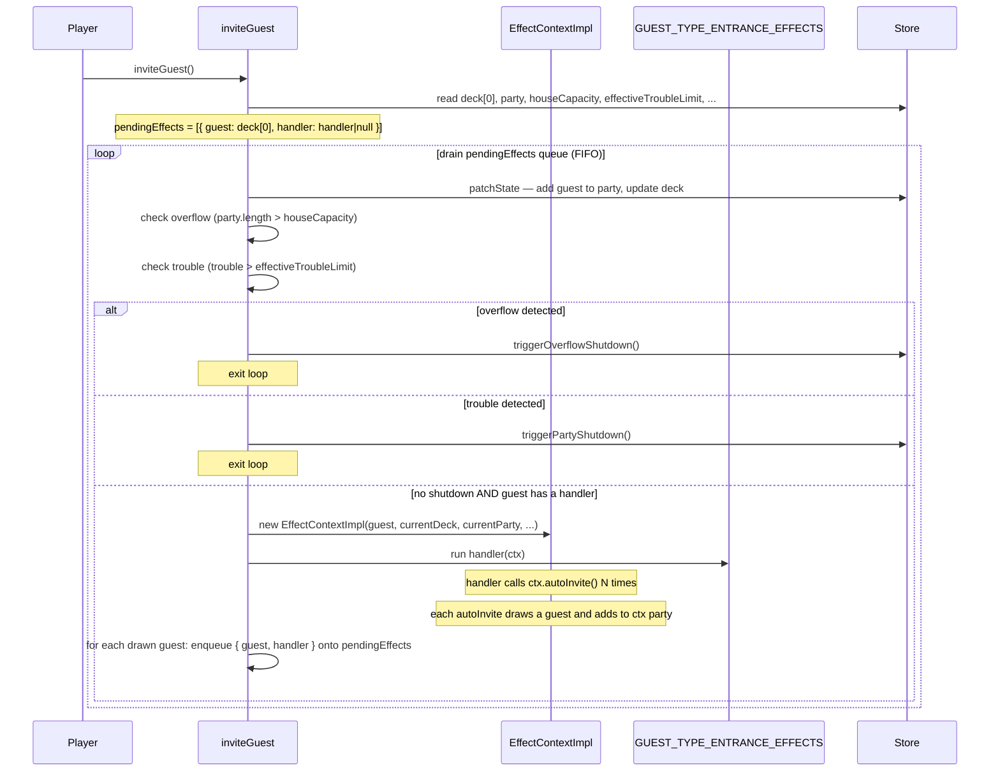
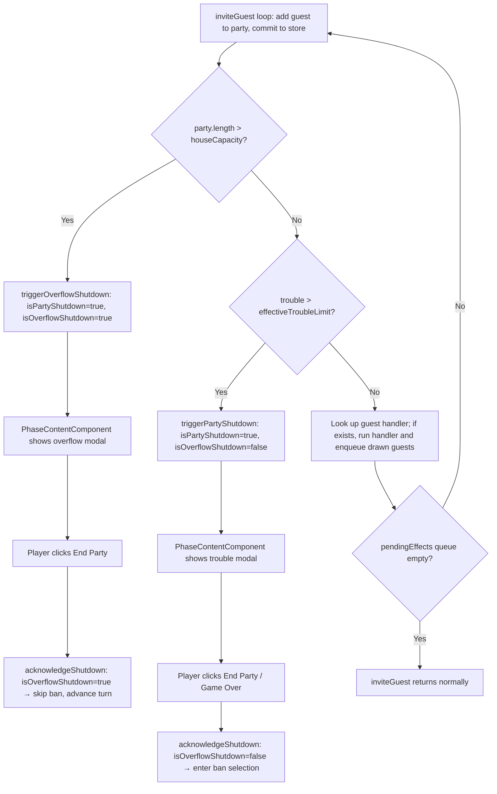

# Design Document: Overflow

## Overview

This feature introduces the overflow mechanic and two new guest types — Mr. Popular and Celebrity — to the party card game. Both guest types have entrance effects that perform Auto_Invites: drawing the top guest from the deck and adding them to the party even if doing so exceeds the house capacity. When an Auto_Invite pushes the party beyond capacity, an Overflow_Shutdown occurs immediately: no scoring, no ban, all guests return to the deck. If an Auto_Invite instead pushes trouble over the limit (without overflow), the normal Trouble_Limit_Shutdown applies. When both conditions are triggered simultaneously, overflow takes priority.

### Key Design Decisions

1. **Effect Queue in inviteGuest()**: The current `EffectContext` is synchronous and single-guest. To support chained effects (Celebrity's two Auto_Invites, then the newly-arrived guest's effect), `inviteGuest()` maintains a local `pendingEffects` queue of `{ guest: Guest; handler: EffectHandler }` pairs. Every guest arrival — whether from the player's initial invite or an Auto_Invite — goes through the same loop: add guest to party → commit to store → check shutdown → look up handler → enqueue if one exists → repeat. This keeps all queue management in one place and makes `EffectContext` a thinner object.

2. **autoInvite() Only Draws and Adds**: `autoInvite()` on `EffectContext` is responsible only for drawing the top guest from the deck and adding it to the party. It does not check for shutdown conditions and does not queue the drawn guest's entrance effect. After `autoInvite()` returns, `inviteGuest()` commits the state to the store, checks overflow and trouble, and enqueues the drawn guest's handler if one exists. This mirrors exactly what `inviteGuest()` does for the initial guest.

3. **isOverflowShutdown State Flag**: A new `isOverflowShutdown: boolean` field is added to `GameStoreState`. When true, `acknowledgeShutdown()` skips ban selection and advances directly to the next turn Buy phase (or marks game complete on the final turn). The existing `isPartyShutdown` flag remains the primary "shutdown modal is showing" signal; `isOverflowShutdown` is the discriminator between the two shutdown types.

4. **Two Distinct Shutdown Modals**: The trouble shutdown modal ("The party has gotten out of control...") and the overflow modal ("Party exceeded capacity! Fire department has shut it down!") are rendered separately in `PhaseContentComponent`. Both modals use the same button label logic: "End Party" on non-final turns and "Game Over" on the final turn. The two modals are distinguished only by their message text and CSS styling.

5. **triggerOverflowShutdown() vs triggerPartyShutdown()**: A new `triggerOverflowShutdown()` store method handles the overflow case. It performs the same guest-return-to-deck logic as `triggerPartyShutdown()` but sets `isOverflowShutdown: true` alongside `isPartyShutdown: true`. The `acknowledgeShutdown()` method reads `isOverflowShutdown` to decide whether to enter ban selection.

6. **Overflow and Trouble Checked in inviteGuest() Loop**: After each guest is added to the party and committed to the store, `inviteGuest()` checks: overflow first (party.length > houseCapacity), then trouble (trouble > effectiveTroubleLimit). If either condition is met, the appropriate shutdown method is called and the loop exits. The `GameplayComponent` `effect()` that watches trouble continues to handle the manual-invite trouble case; the loop handles the Auto_Invite case synchronously before any further queue entries are processed.

7. **Shop sort order**: `purchasableShopItems()` already sorts by cost ascending then label alphabetically. MR_POPULAR (cost 5) slots between CATERER/ROCK_STAR (cost 5) alphabetically: Caterer → Mr. Popular → Rock Star. CELEBRITY (cost 11) slots between AUCTIONEER (cost 9) and CLIMBER (cost 12).

## Architecture

### Modified and New Layers

```
guest.model.ts
├── GuestType union: + 'MR_POPULAR' | 'CELEBRITY'
├── GUEST_TYPE_DEFAULTS: + MR_POPULAR, CELEBRITY entries
├── GUEST_TYPE_LABELS: + MR_POPULAR → "Mr. Popular", CELEBRITY → "Celebrity"
├── GUEST_TYPE_COSTS: + MR_POPULAR → 5, CELEBRITY → 11
├── SHOP_GUESTS: + 4 MR_POPULAR entries, + 4 CELEBRITY entries
└── GUEST_TYPE_ENTRANCE_EFFECTS: + MR_POPULAR (1 autoInvite), CELEBRITY (2 autoInvites)

effect-context.ts
└── EffectContext interface: + autoInvite(): void
                               (draws top deck guest, adds to party; no shutdown checking)

game.store.ts
├── GameStoreState: + isOverflowShutdown: boolean
├── EffectContextImpl: + autoInvite() implementation (draw + add only)
├── inviteGuest(): owns effect queue loop — add guest → commit → check shutdown → enqueue handler → repeat
├── + triggerOverflowShutdown(): new method
├── acknowledgeShutdown(): check isOverflowShutdown to skip ban selection
└── initializeGame() / resetGame(): include isOverflowShutdown: false

PhaseContentComponent
└── + overflow modal (separate from trouble modal)
```

### Effect Chain Flow



### Overflow Shutdown Flow



## Components and Interfaces

### Modified Type: GuestType (guest.model.ts)

```typescript
export type GuestType = 'OLD_FRIEND' | 'WILD_BUDDY' | 'RICH_PAL' | 'MONKEY'
  | 'AUCTIONEER' | 'GANGSTER' | 'ROCK_STAR' | 'GAMBLER'
  | 'CUTE_DOG' | 'HIPPY'
  | 'CATERER' | 'TICKET_TAKER'
  | 'CLIMBER'
  | 'MR_POPULAR' | 'CELEBRITY';  // NEW
```

### New Constants (guest.model.ts)

#### GUEST_TYPE_DEFAULTS additions

```typescript
MR_POPULAR: {
  popularityValue: 3,
  troubleValue: 0,
  moneyValue: 0,
  peaceValue: 0
},
CELEBRITY: {
  popularityValue: 2,
  troubleValue: 0,
  moneyValue: 3,
  peaceValue: 0
}
```

#### GUEST_TYPE_LABELS additions

```typescript
MR_POPULAR: 'Mr. Popular',
CELEBRITY: 'Celebrity'
```

#### GUEST_TYPE_COSTS additions

```typescript
MR_POPULAR: 5,
CELEBRITY: 11
```

#### SHOP_GUESTS additions (8 new entries, 56 total)

```typescript
{ type: 'MR_POPULAR', name: 'Rowan' },
{ type: 'MR_POPULAR', name: 'Oscar' },
{ type: 'MR_POPULAR', name: 'Lawrence' },
{ type: 'MR_POPULAR', name: 'McDougall' },
{ type: 'CELEBRITY', name: 'Troy' },
{ type: 'CELEBRITY', name: 'Rainier' },
{ type: 'CELEBRITY', name: 'Pedro' },
{ type: 'CELEBRITY', name: 'Kent' },
```

#### GUEST_TYPE_ENTRANCE_EFFECTS additions

```typescript
MR_POPULAR: (ctx) => {
  ctx.autoInvite();
},
CELEBRITY: (ctx) => {
  ctx.autoInvite();
  ctx.autoInvite();
}
```

### Modified Interface: EffectContext (effect-context.ts)

```typescript
export interface EffectContext {
  readonly guest: Guest;
  updateGuest(updater: (g: Guest) => Guest): void;
  getDeck(): Guest[];
  setDeck(deck: Guest[]): void;
  getParty(): Guest[];
  setParty(party: Guest[]): void;
  getDiscard(): Guest[];
  setDiscard(discard: Guest[]): void;
  getPopularity(): number;
  setPopularity(value: number): void;
  getMoney(): number;
  setMoney(value: number): void;
  // NEW: Auto_Invite — draws top deck guest and adds it to the party.
  // Does NOT check shutdown conditions or queue entrance effects.
  // inviteGuest() is responsible for those steps after autoInvite() returns.
  autoInvite(): void;
}
```

### Modified Class: EffectContextImpl (game.store.ts)

The implementation gains the `autoInvite()` method. Unlike the previous design, `autoInvite()` is a thin operation: it draws the top guest from the deck and appends it to the party. It does not check shutdown conditions, does not queue entrance effects, and carries no `_shutdownType` or `pendingEffects` state. All of that logic lives in `inviteGuest()`.

```typescript
class EffectContextImpl implements EffectContext {
  private _guest: Guest;
  private _deck: Guest[];
  private _party: Guest[];
  private _discard: Guest[];
  private _popularity: number;
  private _money: number;

  constructor(
    guest: Guest,
    deck: Guest[],
    party: Guest[],
    discard: Guest[],
    popularity: number,
    money: number
  ) { /* ... assign all fields ... */ }

  // ... existing getters/setters unchanged ...

  autoInvite(): void {
    // If deck is empty, skip silently
    if (this._deck.length === 0) return;

    // Draw top guest from deck and add to party
    const [drawnGuest, ...remainingDeck] = this._deck;
    this._deck = remainingDeck;
    this._party = [...this._party, drawnGuest];
  }
}
```

### Modified Method: inviteGuest() (game.store.ts)

`inviteGuest()` now owns the full effect chain loop. Every guest arrival — the initial player-invited guest and every Auto_Invited guest — goes through the same steps: add to party, commit to store, check shutdown, look up handler, run it (which may call `autoInvite()` N times), then enqueue each drawn guest for the next iteration. The loop is FIFO, so Celebrity's two auto-invites are processed before any guest drawn by those auto-invites.

```typescript
inviteGuest(): void {
  const deck = store.deck();

  if (deck.length === 0) {
    patchState(store, { showEmptyDeckMessage: true });
    return;
  }

  if (store.party().length >= store.houseCapacity()) {
    patchState(store, { showHouseFullMessage: true });
    return;
  }

  patchState(store, { showEmptyDeckMessage: false, showHouseFullMessage: false });

  const [rawGuest, ...remainingDeck] = deck;

  // Seed the queue with the initial guest (handler may be null for guests without effects)
  const initialHandler = GUEST_TYPE_ENTRANCE_EFFECTS[rawGuest.type] ?? null;
  const pendingEffects: Array<{ guest: Guest; handler: EffectHandler | null }> = [
    { guest: rawGuest, handler: initialHandler }
  ];

  // Update deck immediately (rawGuest has been drawn)
  patchState(store, { deck: remainingDeck });

  // Process queue in FIFO order
  for (const pending of pendingEffects) {
    // Add this guest to the party and commit
    patchState(store, { party: [...store.party(), pending.guest] });

    // Check overflow first (priority over trouble)
    if (store.party().length > store.houseCapacity()) {
      store.triggerOverflowShutdown();
      return;
    }

    // Check trouble
    if (store.trouble() > store.effectiveTroubleLimit()) {
      store.triggerPartyShutdown();
      return;
    }

    // No shutdown — run this guest's entrance effect if it has one
    if (pending.handler) {
      const ctx = new EffectContextImpl(
        pending.guest,
        store.deck(),
        store.party(),
        store.discard(),
        store.popularity(),
        store.money()
      );

      pending.handler(ctx);

      // Commit any state changes the handler made (e.g. popularity, money, guest mutations)
      patchState(store, {
        deck: ctx.getDeck(),
        party: ctx.getParty(),
        discard: ctx.getDiscard(),
        popularity: ctx.getPopularity(),
        money: ctx.getMoney()
      });

      // Enqueue each guest drawn by autoInvite() calls in the handler
      // The drawn guests are now in ctx.getParty() but not yet processed through
      // the shutdown-check + handler-lookup steps — find them by diffing party sizes.
      // More precisely: the handler's autoInvite() calls moved guests from ctx._deck
      // to ctx._party. We need to enqueue those guests with their own handlers.
      // We identify them as the guests appended to the party beyond pending.guest.
      const partyAfter = ctx.getParty();
      const partyBefore = store.party(); // already committed above
      // The newly drawn guests are the ones appended after pending.guest's position
      // Since pending.guest was already committed to the store party before running
      // the handler, the ctx was initialized with that party. Any guests added to
      // ctx._party by autoInvite() are the drawn guests.
      const drawnGuests = partyAfter.slice(partyBefore.length);
      for (const drawn of drawnGuests) {
        pendingEffects.push({
          guest: drawn,
          handler: GUEST_TYPE_ENTRANCE_EFFECTS[drawn.type] ?? null
        });
      }
    }
  }
}
```

**Note on the drawn-guest identification**: Because `autoInvite()` appends drawn guests to `ctx._party`, and the context was initialized with the current store party (which already includes `pending.guest`), the drawn guests are simply the tail of `ctx.getParty()` beyond the pre-handler party length. The loop then processes each drawn guest through the same add → check shutdown → run handler → enqueue cycle, preserving FIFO arrival order.

### New Method: triggerOverflowShutdown() (game.store.ts)

```typescript
triggerOverflowShutdown(): void {
  // Same guest-return logic as triggerPartyShutdown()
  const partySnapshot = [...store.party()];
  const currentDiscard = store.discard();
  const currentDeck = store.deck();
  const deckWithReturned = [...currentDeck, ...currentDiscard];

  patchState(store, {
    deck: deckWithReturned,
    party: [],
    discard: [],
    bustPartySnapshot: partySnapshot,
    isPartyShutdown: true,
    isOverflowShutdown: true   // NEW: distinguishes from trouble shutdown
  });
}
```

### Modified Method: acknowledgeShutdown() (game.store.ts)

```typescript
acknowledgeShutdown(): void {
  const currentTurn = store.currentTurn();
  const totalTurns = store.totalTurns();
  const isOverflow = store.isOverflowShutdown();

  if (currentTurn === totalTurns) {
    // Final turn: game over regardless of shutdown type
    patchState(store, {
      isPartyShutdown: false,
      isOverflowShutdown: false,
      isGameComplete: true,
      bustPartySnapshot: [],
      selectedBanGuest: null
    });
  } else if (isOverflow) {
    // Overflow: skip ban selection, advance directly to next turn Buy phase
    patchState(store, {
      isPartyShutdown: false,
      isOverflowShutdown: false,
      bustPartySnapshot: [],
      selectedBanGuest: null,
      currentTurn: currentTurn + 1,
      currentPhase: GamePhase.BUY
    });
  } else {
    // Trouble shutdown: enter ban selection (existing behavior)
    patchState(store, {
      isPartyShutdown: false,
      isBanSelectionActive: true
    });
  }
}
```

### Modified State: GameStoreState (game.store.ts)

```typescript
export interface GameStoreState extends GameState {
  deck: Guest[];
  party: Guest[];
  discard: Guest[];
  showEmptyDeckMessage: boolean;
  isPartyShutdown: boolean;
  isOverflowShutdown: boolean;    // NEW: true when shutdown was caused by overflow
  isBanSelectionActive: boolean;
  bustPartySnapshot: Guest[];
  selectedBanGuest: Guest | null;
  shopInventory: ShopInventoryEntry[];
  houseCapacity: number;
  expansionsPurchased: number;
  showHouseFullMessage: boolean;
}
```

Initial state addition:

```typescript
const initialState: GameStoreState = {
  // ... existing fields ...
  isOverflowShutdown: false   // NEW
};
```

### Modified Component: PhaseContentComponent

The overflow modal is added as a separate conditional block. It renders when `isPartyShutdown() && isOverflowShutdown()`. The existing trouble modal renders when `isPartyShutdown() && !isOverflowShutdown()`.

```html
<!-- Existing trouble shutdown modal — now conditional on NOT overflow -->
@if (gameStore.isPartyShutdown() && !gameStore.isOverflowShutdown()) {
  <div class="shutdown-modal-overlay" role="dialog" aria-modal="true" aria-labelledby="shutdown-title">
    <div class="shutdown-modal">
      <p id="shutdown-title">The party has gotten out of control and has been shut down!</p>
      <button
        class="shutdown-button"
        (click)="gameStore.acknowledgeShutdown()"
        [attr.aria-label]="gameStore.isFinalTurn() ? 'Game Over' : 'End Party'">
        {{ gameStore.isFinalTurn() ? 'Game Over' : 'End Party' }}
      </button>
    </div>
  </div>
}

<!-- NEW: Overflow shutdown modal — "End Party" on non-final turn, "Game Over" on final turn -->
@if (gameStore.isPartyShutdown() && gameStore.isOverflowShutdown()) {
  <div class="overflow-modal-overlay" role="dialog" aria-modal="true" aria-labelledby="overflow-title">
    <div class="overflow-modal">
      <p id="overflow-title">Party exceeded capacity! Fire department has shut it down!</p>
      <button
        class="overflow-button"
        (click)="gameStore.acknowledgeShutdown()"
        [attr.aria-label]="gameStore.isFinalTurn() ? 'Game Over' : 'End Party'">
        {{ gameStore.isFinalTurn() ? 'Game Over' : 'End Party' }}
      </button>
    </div>
  </div>
}
```

CSS for the overflow modal follows the same pattern as the existing shutdown modal:

```css
.overflow-modal-overlay {
  position: fixed;
  top: 0;
  left: 0;
  width: 100%;
  height: 100%;
  background-color: rgba(0, 0, 0, 0.5);
  display: flex;
  align-items: center;
  justify-content: center;
  z-index: 1000;
}

.overflow-modal {
  background: white;
  padding: 2rem;
  border-radius: 8px;
  max-width: 400px;
  text-align: center;
  box-shadow: 0 4px 20px rgba(0, 0, 0, 0.3);
}

.overflow-modal p {
  font-size: 1.2rem;
  margin-bottom: 1.5rem;
  color: #333;
}

.overflow-button {
  padding: 0.75rem 2rem;
  font-size: 1rem;
  font-weight: 600;
  color: white;
  background-color: #fd7e14;
  border: none;
  border-radius: 4px;
  cursor: pointer;
}

.overflow-button:hover {
  background-color: #e8690a;
}

.overflow-button:focus {
  outline: 2px solid #e8690a;
  outline-offset: 2px;
}
```

## Data Models

### New Guest Type Properties

| Guest Type   | popularityValue | troubleValue | moneyValue | peaceValue | Shop Cost |
|-------------|----------------|--------------|------------|------------|-----------|
| MR_POPULAR  | 3              | 0            | 0          | 0          | 5         |
| CELEBRITY   | 2              | 0            | 3          | 0          | 11        |

### Updated Shop Display Order (15 purchasable types)

With the existing sort (ascending cost, then alphabetical label for ties):

1. Old Friend (cost 2)
2. Monkey (cost 3), Rich Pal (cost 3)
3. Hippy (cost 4), Ticket Taker (cost 4)
4. Caterer (cost 5), **Mr. Popular (cost 5)**, Rock Star (cost 5)
5. Gangster (cost 6)
6. Cute Dog (cost 7), Gambler (cost 7)
7. Auctioneer (cost 9)
8. **Celebrity (cost 11)**
9. Climber (cost 12)

### New State Fields

| Field | Type | Default | Description |
|-------|------|---------|-------------|
| `isOverflowShutdown` | `boolean` | `false` | True when the active shutdown was caused by overflow (not trouble) |

### Guest Conservation (Updated)

```
deck.length + party.length + discard.length + sum(shopInventory[*].guests.length)
  = INITIAL_GUESTS.length + SHOP_GUESTS.length
  = 10 + 56
  = 66
```

(10 initial + 48 existing shop + 4 Mr. Popular + 4 Celebrity = 66)

### Shutdown Type Comparison

| Aspect | Trouble_Limit_Shutdown | Overflow_Shutdown |
|--------|----------------------|-------------------|
| Trigger | trouble > effectiveTroubleLimit | party.length > houseCapacity after Auto_Invite |
| Detection point | GameplayComponent effect() OR autoInvite() | autoInvite() only |
| isPartyShutdown | true | true |
| isOverflowShutdown | false | true |
| Modal message | "The party has gotten out of control and has been shut down!" | "Party exceeded capacity! Fire department has shut it down!" |
| Modal button (non-final) | "End Party" | "End Party" |
| Modal button (final) | "Game Over" | "Game Over" |
| After acknowledge (non-final) | Enter ban selection | Advance to next turn Buy phase |
| After acknowledge (final) | Mark game complete | Mark game complete |
| Scoring | Forfeited | Forfeited |
| Guests returned to deck | Yes | Yes |

### Effect Queue State Machine

The `pendingEffects` queue is a local variable inside `inviteGuest()` and is never stored in `GameStoreState`. It is a transient structure that exists only for the duration of a single `inviteGuest()` call.

| State | Description |
|-------|-------------|
| Queue seeded | Initial guest + handler (or null) pushed onto queue |
| Guest processed | Guest added to party, committed to store, shutdown checked |
| Shutdown detected | Store shutdown method called immediately, loop exits |
| Handler runs | `EffectContextImpl` created from current store state; handler calls `autoInvite()` N times |
| Drawn guests enqueued | Each guest appended to ctx party by `autoInvite()` is pushed onto queue with its own handler |
| Queue exhausted | `inviteGuest()` returns normally |

### Named Guest Instances

#### Mr. Popular (4 instances)

| Name | Type | popularityValue | troubleValue | moneyValue | peaceValue |
|------|------|----------------|--------------|------------|------------|
| Rowan | MR_POPULAR | 3 | 0 | 0 | 0 |
| Oscar | MR_POPULAR | 3 | 0 | 0 | 0 |
| Lawrence | MR_POPULAR | 3 | 0 | 0 | 0 |
| McDougall | MR_POPULAR | 3 | 0 | 0 | 0 |

#### Celebrity (4 instances)

| Name | Type | popularityValue | troubleValue | moneyValue | peaceValue |
|------|------|----------------|--------------|------------|------------|
| Troy | CELEBRITY | 2 | 0 | 3 | 0 |
| Rainier | CELEBRITY | 2 | 0 | 3 | 0 |
| Pedro | CELEBRITY | 2 | 0 | 3 | 0 |
| Kent | CELEBRITY | 2 | 0 | 3 | 0 |

## Correctness Properties

*A property is a characteristic or behavior that should hold true across all valid executions of a system — essentially, a formal statement about what the system should do. Properties serve as the bridge between human-readable specifications and machine-verifiable correctness guarantees.*

**Property Reflection**: Before writing properties, reviewing the prework for redundancy:
- 4.1 (MR_POPULAR auto-invite) and 5.1 (CELEBRITY auto-invites) are both about "N auto-invites draw N guests from deck" — they share the same pattern but differ in N. They can be combined into one property parameterized by guest type.
- 4.4 / 5.5 / 6.1 / 6.2 / 6.3 are all about effect sequencing. The Celebrity chain (Celebrity → MR_POPULAR → guest) is the most comprehensive test of sequencing. One property covers all of them.
- 7.3 (overflow forfeits resources, returns guests) and 11.3 (overflow preserves guest data) can be combined into one comprehensive overflow shutdown state property.
- 7.4 (no ban after overflow) and 9.2 (advance to next turn) are the same behavioral outcome — one property.
- 6.4 / 7.2 / 8.2 (pending effects cancelled on shutdown) are all the same invariant — one property.
- 8.1 and 8.3 (trouble shutdown during chain) can be combined into one property.
- 10.2 (manual invite cannot overflow) is a standalone invariant.
- 11.1 / 11.2 (guest conservation) is one property.
- 8.4 (overflow priority over trouble) is a standalone property.
- 9.1 (overflow modal content) is a UI property.

After reflection: 8 distinct properties remain.

### Property 1: Auto_Invite Draws Correct Number of Guests From Deck

*For any* game state in the PARTY phase where the deck contains at least N guests (N ≥ 1) and the top guest is MR_POPULAR (N=1) or CELEBRITY (N=2), after calling `inviteGuest()` with no shutdown triggered, the party SHALL contain the invited guest plus the next N guests from the deck (in arrival order), and the deck SHALL be shorter by N+1 total.

This covers both MR_POPULAR (1 auto-invite) and CELEBRITY (2 auto-invites), and subsumes the edge cases where the deck runs out mid-chain (the auto-invite silently skips when deck is empty).

**Validates: Requirements 4.1, 4.2, 4.3, 5.1, 5.2, 5.3, 5.4**

### Property 2: Effect Sequencing — Current Effect Completes Before Chained Effects Fire

*For any* deck where CELEBRITY is first, a guest with an entrance effect (e.g., MR_POPULAR) is second, and at least two more guests follow, after calling `inviteGuest()` with no shutdown triggered, the party SHALL contain CELEBRITY, the second guest, the third guest (Celebrity's second auto-invite), and the fourth guest (MR_POPULAR's auto-invite) — in that arrival order. The fourth guest SHALL have arrived after Celebrity's second auto-invite completed.

This is the most comprehensive sequencing test: Celebrity's two auto-invites must both complete before MR_POPULAR's entrance effect fires, and MR_POPULAR's auto-invite fires after Celebrity's second auto-invite.

**Validates: Requirements 6.1, 6.2, 6.3, 5.5, 4.4**

### Property 3: Overflow Shutdown State and Guest Preservation

*For any* game state where the party size equals House_Capacity and an Auto_Invite is performed (via MR_POPULAR or CELEBRITY), after the shutdown is processed, the Game_Store SHALL have `isPartyShutdown = true`, `isOverflowShutdown = true`, `party = []`, and the deck SHALL contain all guests that were in the party before the shutdown, each with their original type, name, and properties intact. The discard pile and shopInventory SHALL be unchanged.

**Validates: Requirements 7.1, 7.3, 11.3**

### Property 4: Overflow Shutdown Skips Ban Selection and Advances Turn

*For any* Overflow_Shutdown on a non-final turn, after the player calls `acknowledgeShutdown()`, the Game_Store SHALL have `isBanSelectionActive = false`, `currentTurn = previousTurn + 1`, `currentPhase = BUY`, `isPartyShutdown = false`, and `isOverflowShutdown = false`. On the final turn, `isGameComplete` SHALL be true instead.

**Validates: Requirements 7.4, 9.2, 9.3, 9.4, 9.5**

### Property 5: Pending Effects Cancelled on Any Shutdown

*For any* effect chain where a shutdown (overflow or trouble) is triggered during an Auto_Invite, the Game_Store SHALL NOT execute any entrance effects that were queued as Pending_Effects after the shutdown was triggered. The party state after shutdown SHALL reflect only the guests added before the shutdown-triggering Auto_Invite completed.

**Validates: Requirements 6.4, 7.2, 8.2**

### Property 6: Trouble Shutdown During Effect Chain Behaves Normally

*For any* game state where an Auto_Invite draws a guest whose troubleValue pushes total trouble above the Effective_Trouble_Limit AND the resulting party size does NOT exceed House_Capacity, the Game_Store SHALL have `isPartyShutdown = true`, `isOverflowShutdown = false`, and on non-final turns SHALL enter ban selection after `acknowledgeShutdown()` is called.

**Validates: Requirements 8.1, 8.2, 8.3**

### Property 7: Overflow Takes Priority Over Trouble Limit

*For any* game state where an Auto_Invite simultaneously causes `party.length > houseCapacity` AND `trouble > effectiveTroubleLimit`, the Game_Store SHALL set `isOverflowShutdown = true` (not false), and after `acknowledgeShutdown()` on a non-final turn, `isBanSelectionActive` SHALL be false.

**Validates: Requirements 8.4**

### Property 8: Guest Conservation Invariant

*For any* sequence of game operations including `purchaseGuest`, `inviteGuest` (with Auto_Invites), `advancePhase`, `triggerPartyShutdown`, `triggerOverflowShutdown`, and `confirmBan`, the sum `deck.length + party.length + discard.length + sum(shopInventory[*].guests.length)` SHALL remain constant and equal to 66 (10 initial + 56 shop guests). Auto_Invites move guests from deck to party; overflow shutdowns move guests from party back to deck. No operation creates or destroys guests.

**Validates: Requirements 11.1, 11.2, 11.3**

## Error Handling

### Empty Deck During Auto_Invite

If `autoInvite()` is called when the deck is empty, it returns silently without modifying any state. This handles:
- MR_POPULAR invited when deck has only 1 guest (himself) — no auto-invite occurs
- CELEBRITY's first auto-invite when deck is empty — neither auto-invite occurs
- CELEBRITY's second auto-invite when deck has exactly 1 guest — first auto-invite succeeds, second is skipped

Because `autoInvite()` is a no-op on an empty deck, no guest is appended to the context party, so `inviteGuest()` finds no new drawn guests to enqueue.

### Shutdown During Effect Chain

When `inviteGuest()` detects overflow or trouble after committing a guest to the store, it calls the appropriate shutdown method and returns immediately. Any remaining entries in the local `pendingEffects` queue are simply abandoned — they are never stored in `GameStoreState` and are garbage-collected with the local variable.

### Pending Effects After Shutdown

Because shutdown detection happens in `inviteGuest()` before the next queue entry is processed, no entrance effect handler is ever called after a shutdown. The queue is checked after every guest addition, so the shutdown is caught at the earliest possible point.

### triggerOverflowShutdown() Called Outside Effect Chain

If `triggerOverflowShutdown()` is called when `isPartyShutdown` is already true (shouldn't happen in normal flow), it would overwrite the existing shutdown state. The `inviteGuest()` method guards against this by returning immediately after calling any shutdown method, and the `GameplayComponent` effect() guards against double-triggering by checking `!isShutdown` before calling `triggerPartyShutdown()`.

### acknowledgeShutdown() on Non-Shutdown State

If called when `isPartyShutdown` is false, the method still executes its state transitions. The UI prevents this by only rendering the modal buttons when `isPartyShutdown` is true.

### initializeGame() and resetGame()

Both reset `isOverflowShutdown: false` alongside all other state. `resetGame()` uses `initialState` which includes the new field.

## Testing Strategy

### Dual Testing Approach

- **Unit tests**: Verify specific constant values (MR_POPULAR and CELEBRITY defaults, labels, costs, shop names), concrete effect examples (MR_POPULAR invites 1 extra, CELEBRITY invites 2 extra), specific shutdown scenarios (overflow on capacity-1 party, trouble during chain), modal text content, and edge cases (empty deck during auto-invite, overflow on final turn)
- **Property tests**: Verify universal properties across all valid inputs (auto-invite count, effect sequencing, overflow shutdown state, no-ban-after-overflow, pending effect cancellation, trouble-during-chain, overflow priority, guest conservation)

### Property-Based Testing Configuration

**Library**: fast-check (already installed: `"fast-check": "^4.5.3"`)

**Configuration**:
- Minimum 100 iterations per property test
- Each test tagged with a comment referencing the design property
- Tag format: `// Feature: overflow, Property {number}: {property_text}`
- Each correctness property implemented by a SINGLE property-based test

### Property Test Plan

1. **Property 1 test** (`game.store.property.spec.ts`): Generate random decks with MR_POPULAR or CELEBRITY on top and varying numbers of following guests. Set party size below capacity. Call `inviteGuest()`. Verify party grew by the correct number (2 for MR_POPULAR, up to 3 for CELEBRITY), deck shrank accordingly, and no shutdown occurred. Also generate cases where deck has fewer guests than needed (empty after first auto-invite) to verify graceful handling.
   - Tag: `// Feature: overflow, Property 1: Auto_Invite Draws Correct Number of Guests From Deck`

2. **Property 2 test** (`game.store.property.spec.ts`): Generate decks where CELEBRITY is first, MR_POPULAR is second, and at least 2 more guests follow. Set party size well below capacity and trouble limit high enough to avoid shutdown. Call `inviteGuest()`. Verify party contains all 4 guests in arrival order: Celebrity, guest-2 (Celebrity's first auto-invite), guest-3 (Celebrity's second auto-invite), guest-4 (MR_POPULAR's auto-invite).
   - Tag: `// Feature: overflow, Property 2: Effect Sequencing — Current Effect Completes Before Chained Effects Fire`

3. **Property 3 test** (`game.store.property.spec.ts`): Generate random party compositions where `party.length === houseCapacity - 1` and deck has MR_POPULAR on top followed by at least 1 guest. Call `inviteGuest()`. Verify `isPartyShutdown = true`, `isOverflowShutdown = true`, `party = []`, and all original party guests plus MR_POPULAR plus the auto-invited guest are in the deck. Verify discard and shopInventory are unchanged.
   - Tag: `// Feature: overflow, Property 3: Overflow Shutdown State and Guest Preservation`

4. **Property 4 test** (`game.store.property.spec.ts`): Generate random turn numbers (non-final and final). Trigger overflow shutdown. Call `acknowledgeShutdown()`. Verify: non-final → `isBanSelectionActive = false`, `currentTurn = T+1`, `currentPhase = BUY`; final → `isGameComplete = true`.
   - Tag: `// Feature: overflow, Property 4: Overflow Shutdown Skips Ban Selection and Advances Turn`

5. **Property 5 test** (`game.store.property.spec.ts`): Generate decks where CELEBRITY is first, a guest that would trigger overflow is second (party at capacity-2 so Celebrity's first auto-invite fills it, second overflows), and more guests follow. Call `inviteGuest()`. Verify the third deck guest (which would have been Celebrity's second auto-invite) is NOT in the party — it remains in the deck.
   - Tag: `// Feature: overflow, Property 5: Pending Effects Cancelled on Any Shutdown`

6. **Property 6 test** (`game.store.property.spec.ts`): Generate states where auto-invite draws a high-trouble guest that pushes trouble over the limit, but party size stays below capacity. Call `inviteGuest()`. Verify `isPartyShutdown = true`, `isOverflowShutdown = false`. Then call `acknowledgeShutdown()` on a non-final turn and verify `isBanSelectionActive = true`.
   - Tag: `// Feature: overflow, Property 6: Trouble Shutdown During Effect Chain Behaves Normally`

7. **Property 7 test** (`game.store.property.spec.ts`): Generate states where party is at capacity-1, trouble limit is 0 (so any trouble guest triggers trouble shutdown), and deck has MR_POPULAR on top followed by a trouble guest. Call `inviteGuest()`. Verify `isOverflowShutdown = true` (overflow wins over trouble). Call `acknowledgeShutdown()` on non-final turn. Verify `isBanSelectionActive = false`.
   - Tag: `// Feature: overflow, Property 7: Overflow Takes Priority Over Trouble Limit`

8. **Property 8 test** (`game.store.property.spec.ts`): Generate random sequences of game operations including purchases, invites (with MR_POPULAR and CELEBRITY), party ends, and shutdowns. After each operation, verify `deck.length + party.length + discard.length + sum(shopInventory[*].guests.length) === 66`.
   - Tag: `// Feature: overflow, Property 8: Guest Conservation Invariant`

### Unit Test Plan

**Model tests** (`guest.model.spec.ts`):
- `GUEST_TYPE_DEFAULTS['MR_POPULAR']` equals `{ popularityValue: 3, troubleValue: 0, moneyValue: 0, peaceValue: 0 }`
- `GUEST_TYPE_DEFAULTS['CELEBRITY']` equals `{ popularityValue: 2, troubleValue: 0, moneyValue: 3, peaceValue: 0 }`
- `GUEST_TYPE_LABELS['MR_POPULAR']` equals `'Mr. Popular'`
- `GUEST_TYPE_LABELS['CELEBRITY']` equals `'Celebrity'`
- `GUEST_TYPE_COSTS['MR_POPULAR']` equals `5`
- `GUEST_TYPE_COSTS['CELEBRITY']` equals `11`
- `SHOP_GUESTS` filtered by `'MR_POPULAR'` has exactly 4 entries with names Rowan, Oscar, Lawrence, McDougall
- `SHOP_GUESTS` filtered by `'CELEBRITY'` has exactly 4 entries with names Troy, Rainier, Pedro, Kent
- `SHOP_GUESTS.length` equals `56`

**Store tests** (`game.store.spec.ts`):
- After `initializeGame()`, shopInventory has MR_POPULAR entry with 4 guests and cost 5
- After `initializeGame()`, shopInventory has CELEBRITY entry with 4 guests and cost 11
- After `initializeGame()`, `isOverflowShutdown` is false
- Inviting MR_POPULAR with 2+ guests in deck results in party containing MR_POPULAR + next deck guest
- Inviting CELEBRITY with 3+ guests in deck results in party containing CELEBRITY + next 2 deck guests
- Inviting MR_POPULAR when deck has only MR_POPULAR results in party containing only MR_POPULAR (no auto-invite)
- Inviting CELEBRITY when deck has CELEBRITY + 1 guest results in party containing CELEBRITY + 1 guest (second auto-invite skipped)
- Overflow shutdown sets `isPartyShutdown = true` and `isOverflowShutdown = true`
- Trouble shutdown during effect chain sets `isPartyShutdown = true` and `isOverflowShutdown = false`
- `acknowledgeShutdown()` with `isOverflowShutdown = true` on non-final turn advances to next turn Buy phase without ban selection
- `acknowledgeShutdown()` with `isOverflowShutdown = true` on final turn marks game complete
- `acknowledgeShutdown()` with `isOverflowShutdown = false` on non-final turn enters ban selection (existing behavior)
- Overflow takes priority: simultaneous overflow + trouble → `isOverflowShutdown = true`
- `purchasableShopItems()` places MR_POPULAR between Caterer and Rock Star (all cost 5, alphabetical)
- `purchasableShopItems()` places CELEBRITY between Auctioneer (cost 9) and Climber (cost 12)

**Component tests** (`phase-content.component.spec.ts`):
- Overflow modal is rendered when `isPartyShutdown = true` AND `isOverflowShutdown = true`
- Overflow modal contains the exact message "Party exceeded capacity! Fire department has shut it down!"
- Overflow modal button is labelled "End Party" on a non-final turn
- Overflow modal button is labelled "Game Over" on the final turn
- Trouble modal is rendered when `isPartyShutdown = true` AND `isOverflowShutdown = false`
- Trouble modal is NOT rendered when `isOverflowShutdown = true`
- Overflow modal is NOT rendered when `isOverflowShutdown = false`

**Component property tests** (`phase-content.component.property.spec.ts`):
- For any overflow shutdown state, the overflow modal is rendered with correct text and button
- For any trouble shutdown state, the trouble modal is rendered (not the overflow modal)

### Test File Organization

```
src/app/
  models/
    guest.model.spec.ts                         # Unit tests (extended for MR_POPULAR, CELEBRITY)
  stores/
    game.store.spec.ts                          # Unit tests (extended for overflow behavior)
    game.store.property.spec.ts                 # Properties 1–8
  components/
    phase-content.component.spec.ts             # Unit tests (extended for overflow modal)
    phase-content.component.property.spec.ts    # Overflow/trouble modal rendering properties
```
