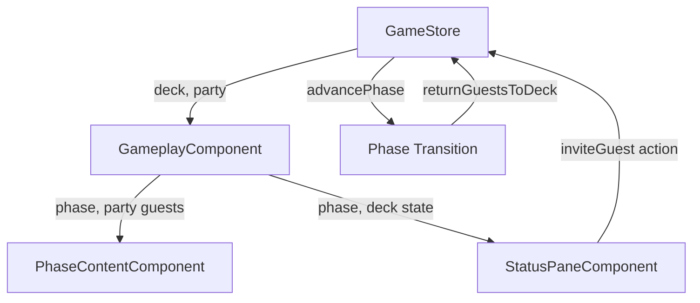

# Design Document: Party Guest Deck System

## Overview

The party guest deck system introduces a deck-based mechanic for managing party guests in the Angular PWA game. The system manages a collection of 6 unique "Old Friend" guests that can be invited during the Party phase. The deck operates as a shuffled stack where guests are drawn from the top and returned to the bottom, ensuring variety across multiple game turns.

This feature integrates with the existing NgRx SignalStore-based game state management and the component architecture. The deck and party collections will be added to the GameStore, and the UI will be extended to display guest cards and an invite button in the appropriate phase.

### Key Design Decisions

1. **State Management**: Extend the existing GameStore with deck and party state rather than creating a separate store, maintaining consistency with the current architecture
2. **Guest Representation**: Use a simple interface with type and name properties, allowing for future extensibility to other guest types
3. **Deck Operations**: Implement deck as an array with operations that maintain stack semantics (draw from index 0, return to end)
4. **UI Integration**: Add guest card display to PhaseContentComponent and invite button to StatusPaneComponent
5. **Shuffle Strategy**: Use Fisher-Yates shuffle algorithm for cryptographically fair randomization

## Architecture

### Component Structure

```
GameplayComponent (container)
├── PhaseContentComponent (main content area)
│   └── GuestCardComponent (repeated for each party guest)
└── StatusPaneComponent (side panel)
    └── Invite Guest button (Party phase only)
```

### State Flow



### Data Flow

1. **Initialization**: GameStore creates and shuffles initial deck of 6 Old Pal guests
2. **Invite Action**: User clicks "Invite Guest" → GameStore removes top guest from deck → GameStore adds guest to party
3. **Display**: PhaseContentComponent receives party array → renders GuestCardComponent for each guest (newest first)
4. **Phase Transition**: GameStore detects Party phase end → moves all party guests to bottom of deck → clears party array

## Components and Interfaces

### New Components

#### GuestCardComponent

Displays a single guest card with Old Friend header, placeholder image, and guest name.

**Inputs:**
- `guest: Guest` - The guest object to display

**Template Structure:**
```html
<div class="guest-card">
  <div class="card-header">{{ guest.type === 'OLD_FRIEND' ? 'Old Friend' : guest.type }}</div>
  <div class="card-image">
    <!-- Person placeholder icon/image -->
  </div>
  <div class="card-caption">{{ guest.name }}</div>
</div>
```

**Styling:**
- Card layout with border and shadow
- Responsive sizing
- Accessible focus states

### Modified Components

#### PhaseContentComponent

Extended to display guest cards during Party phase.

**Changes:**
- Inject GameStore to access party state and canInviteGuest signal
- Add conditional rendering for party guests
- Display guest cards in reverse chronological order (newest first)
- Show "No more guests!" message when button clicked and canInviteGuest is false

#### StatusPaneComponent

Extended to display "Invite Guest" button during Party phase.

**Changes:**
- Add "Invite Guest" button below existing phase button
- Show button only when `currentPhase === GamePhase.PARTY`
- Button always enabled (empty deck handling done via message display in PhaseContentComponent)
- Wire button click to check canInviteGuest and either call inviteGuest() or trigger message display

### Store Extensions

#### GameStore State

```typescript
interface GameStoreState extends GameState {
  deck: Guest[];           // Guests available to invite
  party: Guest[];          // Guests currently in party
}
```

#### GameStore Methods

**initializeGame(turnCount?: number): void**
- Extended to initialize deck with 6 Old Friend guests
- Shuffle deck after creation
- Reset party to empty array

**inviteGuest(): void**
- Check if deck is empty
- If empty: return early (no-op)
- If not empty: remove first guest from deck, add to party

**advancePhase(): void**
- Extended to call returnGuestsToDeck() when transitioning from Party phase
- Existing phase transition logic remains unchanged

**returnGuestsToDeck(): void** (private)
- Move all guests from party to end of deck (maintaining party order)
- Clear party array

**shuffleDeck(): void** (private)
- Implement Fisher-Yates shuffle on deck array
- Called only during initialization

#### GameStore Computed Signals

**canInviteGuest: Signal<boolean>**
- Returns `deck.length > 0`
- Used by component to determine whether to show "No more guests!" message

## Data Models

### Guest Interface

```typescript
interface Guest {
  type: 'OLD_FRIEND';
  name: string;
}
```

**Properties:**
- `type`: Guest type identifier (currently only 'OLD_FRIEND', extensible for future guest types)
- `name`: Unique name of the guest (Brian, Colin, Anthony, Emily, Rachelle, Teresa)

### Initial Deck Configuration

```typescript
const INITIAL_OLD_FRIENDS: readonly string[] = [
  'Brian',
  'Colin', 
  'Anthony',
  'Emily',
  'Rachelle',
  'Teresa'
] as const;
```

This constant defines the 6 Old Friend guests that will be created during game initialization.

### State Shape

The GameStore state will be extended as follows:

```typescript
{
  // Existing state
  currentTurn: number;
  currentPhase: GamePhase;
  totalTurns: number;
  isGameComplete: boolean;
  
  // New state
  deck: Guest[];
  party: Guest[];
}
```

## Correctness Properties

*A property is a characteristic or behavior that should hold true across all valid executions of a system—essentially, a formal statement about what the system should do. Properties serve as the bridge between human-readable specifications and machine-verifiable correctness guarantees.*

### Property 1: Guest Conservation

*For any* game state, the total count of guests in the deck plus the party SHALL always equal 6.

**Validates: Requirements 8.4**

This is a critical invariant ensuring guests are never created or destroyed, only moved between collections. This property should hold after initialization, after any invite operation, and after any phase transition.

### Property 2: Unique Guest Names

*For any* game state, all guests in the deck and party combined SHALL have unique names from the set {"Brian", "Colin", "Anthony", "Emily", "Rachelle", "Teresa"}.

**Validates: Requirements 1.4**

This ensures that each Old Pal maintains a distinct identity throughout the game, with no duplicates and no invalid names.

### Property 3: Deck Order Stability

*For any* deck state, when no deck operations are performed, the order of guests in the deck SHALL remain unchanged.

**Validates: Requirements 2.1**

This ensures the deck doesn't spontaneously reorder itself - order changes only occur through explicit operations (draw, return, shuffle).

### Property 4: Draw from Top

*For any* non-empty deck state, when a guest is drawn, the guest removed SHALL be the guest that was at index 0 of the deck.

**Validates: Requirements 2.2**

This ensures stack semantics are maintained - we always draw from the top of the deck.

### Property 5: Return to Bottom

*For any* deck state and any guest, when that guest is returned to the deck, the guest SHALL be added at the end of the deck array.

**Validates: Requirements 2.3**

This ensures returned guests go to the bottom of the stack, maintaining the deck's circulation pattern.

### Property 6: Remaining Order Preservation

*For any* deck state, when a guest is drawn from the deck, the relative order of all remaining guests SHALL be unchanged.

**Validates: Requirements 2.4**

This ensures that drawing a guest doesn't shuffle or reorder the remaining guests - only the drawn guest is removed.

### Property 7: Button Visibility Matches Phase

*For any* game state, the "Invite Guest" button SHALL be visible if and only if the current phase is PARTY.

**Validates: Requirements 3.1, 3.2**

This ensures the invite button appears only during the appropriate game phase.

### Property 8: Invite Decreases Deck and Increases Party

*For any* game state where the deck is not empty, when a guest is invited, the deck size SHALL decrease by 1 and the party size SHALL increase by 1.

**Validates: Requirements 4.4**

This is a metamorphic property ensuring the invite operation correctly transfers a guest between collections.

### Property 9: Invited Guest Appears in Party

*For any* non-empty deck state, when a guest is invited, the guest that was at the top of the deck SHALL appear in the party.

**Validates: Requirements 4.1, 4.2**

This ensures the specific guest drawn from the deck is the same guest added to the party - no guest substitution occurs.

### Property 10: Guest Identity Preservation

*For any* Old Friend guest, the guest's name SHALL remain constant throughout all deck operations, party operations, and phase transitions.

**Validates: Requirements 7.4, 7.1, 7.2, 7.3, 4.3**

This is a comprehensive invariant ensuring guest identity is never mutated during any operation.

### Property 11: All Party Guests Displayed

*For any* party state, the number of guest cards rendered SHALL equal the number of guests in the party.

**Validates: Requirements 5.1**

This ensures every guest in the party has a corresponding visual representation.

### Property 12: Guest Card Header

*For any* rendered guest card, the card header SHALL display "Old Friend".

**Validates: Requirements 5.2**

This ensures consistent card labeling for all Old Friend guests.

### Property 13: Guest Card Name Display

*For any* rendered guest card for a guest with name N, the card caption SHALL display N.

**Validates: Requirements 5.4**

This ensures each card correctly displays the name of the guest it represents.

### Property 14: Guest Card Reverse Chronological Order

*For any* party state with multiple guests, the guest cards SHALL be displayed in reverse chronological order, with the most recently invited guest first.

**Validates: Requirements 5.5**

This ensures the UI presents guests in the expected order, with newest additions most prominent.

### Property 15: Party Empty After Phase Transition

*For any* game state where the current phase is PARTY, when the phase advances, the party SHALL be empty after the transition.

**Validates: Requirements 6.4, 6.1**

This ensures all guests are returned to the deck when the Party phase ends.

### Property 16: Guests Return to Deck on Phase Transition

*For any* game state where the current phase is PARTY and the party contains N guests, when the phase advances, the deck size SHALL increase by N.

**Validates: Requirements 6.2, 6.3**

This ensures all party guests are moved back to the deck (specifically to the bottom) when the phase ends.

## Error Handling

### Empty Deck Handling

When the deck is empty and the user clicks "Invite Guest":
- The component SHALL check canInviteGuest before calling inviteGuest()
- If canInviteGuest is false: display "No more guests!" message
- If canInviteGuest is true: call GameStore.inviteGuest()
- The GameStore.inviteGuest() method SHALL return early (no-op) if deck is empty
- The button SHALL remain enabled (per requirements)

**Implementation:**
```typescript
// In component
onInviteGuest(): void {
  if (!this.gameStore.canInviteGuest()) {
    // Show "No more guests!" message
    this.showEmptyDeckMessage = true;
    return;
  }
  this.gameStore.inviteGuest();
  this.showEmptyDeckMessage = false;
}

// In store
inviteGuest(): void {
  if (this.deck.length === 0) {
    return; // No-op
  }
  // ... normal invite logic
}
```

### Invalid State Prevention

The system prevents invalid states through:

1. **Initialization Validation**: Ensure exactly 6 guests are created with valid names
2. **Deck Bounds Checking**: Verify deck is not empty before drawing
3. **Phase Validation**: Only show invite button during PARTY phase
4. **Conservation Invariant**: Maintain total guest count of 6 at all times

### Error Scenarios

| Scenario | Handling | User Feedback |
|----------|----------|---------------|
| Empty deck invite | Set message flag, no-op | Display "No more guests!" |
| Invalid phase | Button hidden | N/A - button not visible |
| Corrupted guest data | Log error, skip guest | Console warning |
| Invalid guest name | Validation on creation | Throw error during init |

## Testing Strategy

### Dual Testing Approach

This feature will be tested using both unit tests and property-based tests:

- **Unit tests**: Verify specific examples, edge cases, and error conditions
- **Property tests**: Verify universal properties across all inputs
- Both approaches are complementary and necessary for comprehensive coverage

### Unit Testing

Unit tests will focus on:

1. **Specific Examples**:
   - Game initialization creates 6 guests with correct names
   - Deck is shuffled after initialization (order differs from input)
   - Guest card renders with correct structure (header, image, caption)
   - Empty deck message displays when appropriate

2. **Edge Cases**:
   - Inviting from empty deck (no-op, message shown)
   - All guests in party when phase ends (all return to deck)
   - Single guest in deck (can be invited, deck becomes empty)

3. **Integration Points**:
   - Phase transition triggers guest return
   - Button visibility changes with phase
   - Component receives and displays store state correctly

4. **Error Conditions**:
   - Invalid initialization parameters
   - Corrupted guest data handling

### Property-Based Testing

Property-based tests will verify the correctness properties defined above using **fast-check** (JavaScript/TypeScript property-based testing library).

**Configuration**:
- Minimum 100 iterations per property test
- Each test tagged with feature name and property reference
- Tag format: `Feature: party-guest-deck-system, Property {number}: {property_text}`

**Test Organization**:
```
game.store.property.spec.ts          // Properties 1-10, 15-16 (store logic)
gameplay.component.property.spec.ts  // Properties 7, 11-14 (UI rendering)
```

**Example Property Test Structure**:
```typescript
// Feature: party-guest-deck-system, Property 1: Guest Conservation
it('should maintain total guest count of 6 across all operations', () => {
  fc.assert(
    fc.property(
      fc.array(fc.constantFrom('invite', 'advancePhase'), { minLength: 0, maxLength: 20 }),
      (operations) => {
        const store = TestBed.inject(GameStore);
        store.initializeGame();
        
        operations.forEach(op => {
          if (op === 'invite') store.inviteGuest();
          else store.advancePhase();
        });
        
        const totalGuests = store.deck().length + store.party().length;
        expect(totalGuests).toBe(6);
      }
    ),
    { numRuns: 100 }
  );
});
```

**Property Test Coverage**:
- Each of the 16 correctness properties will have a corresponding property-based test
- Tests will generate random sequences of operations and verify properties hold
- Generators will create valid game states, operation sequences, and guest configurations

### Test Balance

- Unit tests handle concrete examples and specific edge cases
- Property tests handle comprehensive input coverage through randomization
- Together they provide both specific validation and general correctness guarantees
- Avoid writing excessive unit tests for scenarios covered by property tests

### Testing Tools

- **Jasmine**: Unit test framework (existing in Angular project)
- **fast-check**: Property-based testing library
- **Angular TestBed**: Component and service testing utilities
- **@ngrx/signals**: Store testing support

### Coverage Goals

- 100% coverage of store methods (initializeGame, inviteGuest, advancePhase, returnGuestsToDeck)
- 100% coverage of component rendering logic
- All 16 correctness properties validated via property-based tests
- All edge cases validated via unit tests
