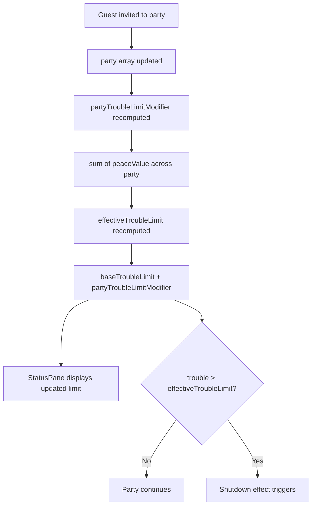
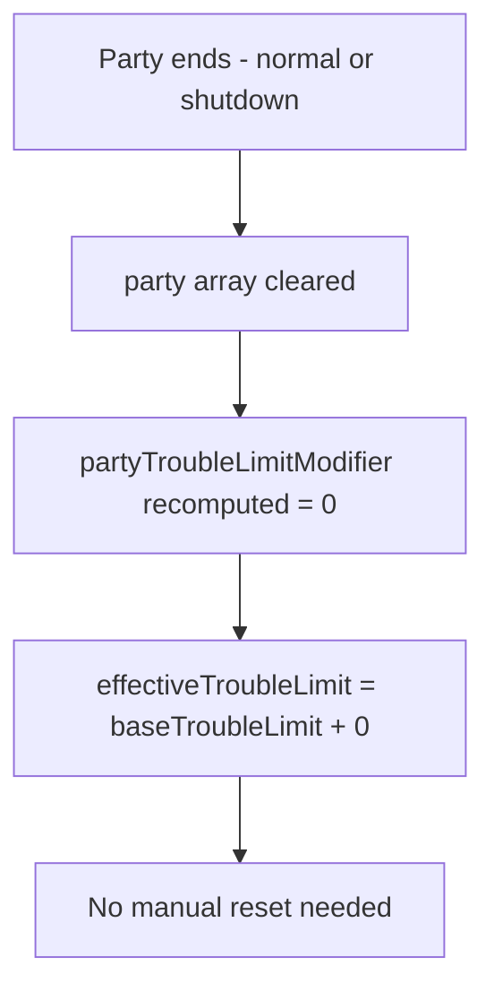

# Design Document: Peace & Trouble Limit

## Overview

This feature introduces the "peace" resource to the party card game. Peace is a new guest property (`peaceValue`) added to the `GuestProperties` interface. Each point of peace in the party raises the effective trouble limit by 1, allowing the player to invite more troublesome guests without triggering a shutdown.

The key architectural insight is that peace drives the **existing** `partyTroubleLimitModifier`. Rather than introducing a separate `totalPeaceInParty` concept, the `partyTroubleLimitModifier` changes from a manually-set stored field to a **computed signal** derived from the sum of `peaceValue` across all party guests. This means:

- The `effectiveTroubleLimit` formula stays the same: `Math.max(0, baseTroubleLimit + partyTroubleLimitModifier)`
- `partyTroubleLimitModifier` is removed from the `GameState` interface (no longer stored state)
- The `modifyPartyTroubleLimitModifier()` method is removed
- Manual resets of `partyTroubleLimitModifier` in `advancePhase()` and `triggerPartyShutdown()` are no longer needed — it's computed from the party array, which gets cleared on party end

Two new guest types are added:
- **Cute Dog**: 2 popularity, 0 trouble, 0 money, 1 peace — cost 7
- **Hippy**: 1 popularity, 0 trouble, 0 money, 1 peace — cost 4

Neither appears in the starting deck. Both are shop-only with 4 named guests each, adding 8 new shop guests (28 existing → 36 shop, 46 total with 10 initial).

### Key Design Decisions

1. **Computed partyTroubleLimitModifier**: The modifier becomes a computed signal (`sum of peaceValue across party`), not stored state. This eliminates manual reset logic and ensures the modifier is always in sync with the party composition. The `effectiveTroubleLimit` formula is unchanged.

2. **Remove modifyPartyTroubleLimitModifier()**: Since the modifier is derived, the mutation method is deleted. Any code calling it would be a bug.

3. **Remove partyTroubleLimitModifier from GameState interface and initialState**: It's no longer stored state. It moves from `withState` to `withComputed`. The `GameStoreState` interface no longer extends a field for it.

4. **Remove manual resets**: `advancePhase()` and `triggerPartyShutdown()` currently reset `partyTroubleLimitModifier: 0`. These lines are removed — the modifier is automatically 0 when the party is empty because `sum([]) === 0`.

5. **peaceValue defaults to 0 for all existing types**: Every existing `GUEST_TYPE_DEFAULTS` entry gets `peaceValue: 0`, so existing resource calculations are unaffected.

6. **Shop display order**: With the existing sort (ascending cost, then alphabetical label for ties), the new order is: Old Friend (2), Monkey (3), Rich Pal (3), Hippy (4), Rock Star (5), Gangster (6), Cute Dog (7), Gambler (7), Auctioneer (9).

## Architecture

### Modified Files

```
Guest Model (guest.model.ts)
├── GuestProperties interface: + peaceValue: number
├── GuestType union: + 'CUTE_DOG' | 'HIPPY'
├── GUEST_TYPE_DEFAULTS: + peaceValue for all types, + 2 new entries
├── GUEST_TYPE_LABELS: + 2 new entries
├── GUEST_TYPE_COSTS: + 2 new entries
└── SHOP_GUESTS: + 8 new entries (4 per type)

GameState Interface (game-state.interface.ts)
└── REMOVE partyTroubleLimitModifier field

GameStore (game.store.ts)
├── GameStoreState: REMOVE partyTroubleLimitModifier from initialState
├── Computed: partyTroubleLimitModifier becomes computed (sum of party peaceValue)
│            effectiveTroubleLimit unchanged (still uses partyTroubleLimitModifier)
├── Methods: REMOVE modifyPartyTroubleLimitModifier()
│            advancePhase() REMOVE partyTroubleLimitModifier reset
│            triggerPartyShutdown() REMOVE partyTroubleLimitModifier reset
│            initializeGame() REMOVE partyTroubleLimitModifier from patchState
│            resetGame() inherits from initialState (no modifier field)
└── No new methods needed

Components (no template/logic changes)
├── StatusPaneComponent: already displays effectiveTroubleLimit — auto-updates
├── PhaseContentComponent: shop cards render automatically for new types
├── GuestCardComponent: renders labels from GUEST_TYPE_LABELS — auto-updates
└── GameplayComponent: shutdown effect unchanged (reads effectiveTroubleLimit)
```

### How Peace Flows Through the System





### Integration Points

1. **GuestProperties**: Add `peaceValue` field — all existing types get 0, new types get 1
2. **GuestType**: Extend union with `'CUTE_DOG' | 'HIPPY'`
3. **GameState interface**: Remove `partyTroubleLimitModifier` field
4. **GameStore state**: Remove `partyTroubleLimitModifier` from `initialState`
5. **GameStore computed**: Move `partyTroubleLimitModifier` to `withComputed` as `party.reduce((sum, g) => sum + g.properties.peaceValue, 0)`
6. **GameStore methods**: Remove `modifyPartyTroubleLimitModifier()`, remove manual resets from `advancePhase()` and `triggerPartyShutdown()`
7. **Shutdown effect** (GameplayComponent): No change — it reads `effectiveTroubleLimit` which now reflects peace

## Components and Interfaces

### Modified Interface: GuestProperties (guest.model.ts)

```typescript
export interface GuestProperties {
  popularityValue: number;
  troubleValue: number;
  moneyValue: number;
  peaceValue: number;          // NEW
}
```

### Modified Type: GuestType (guest.model.ts)

```typescript
export type GuestType = 'OLD_FRIEND' | 'WILD_BUDDY' | 'RICH_PAL' | 'MONKEY'
  | 'AUCTIONEER' | 'GANGSTER' | 'ROCK_STAR' | 'GAMBLER'
  | 'CUTE_DOG' | 'HIPPY';     // NEW
```

### Modified Constants (guest.model.ts)

#### GUEST_TYPE_DEFAULTS

```typescript
export const GUEST_TYPE_DEFAULTS: Record<GuestType, GuestProperties> = {
  OLD_FRIEND:  { popularityValue: 1, troubleValue: 0, moneyValue: 0, peaceValue: 0 },
  WILD_BUDDY:  { popularityValue: 2, troubleValue: 1, moneyValue: 0, peaceValue: 0 },
  RICH_PAL:    { popularityValue: 0, troubleValue: 0, moneyValue: 1, peaceValue: 0 },
  MONKEY:      { popularityValue: 4, troubleValue: 1, moneyValue: 0, peaceValue: 0 },
  AUCTIONEER:  { popularityValue: 0, troubleValue: 0, moneyValue: 3, peaceValue: 0 },
  GANGSTER:    { popularityValue: 0, troubleValue: 1, moneyValue: 4, peaceValue: 0 },
  ROCK_STAR:   { popularityValue: 3, troubleValue: 1, moneyValue: 2, peaceValue: 0 },
  GAMBLER:     { popularityValue: 2, troubleValue: 1, moneyValue: 3, peaceValue: 0 },
  CUTE_DOG:    { popularityValue: 2, troubleValue: 0, moneyValue: 0, peaceValue: 1 },  // NEW
  HIPPY:       { popularityValue: 1, troubleValue: 0, moneyValue: 0, peaceValue: 1 }   // NEW
};
```

#### GUEST_TYPE_LABELS

```typescript
export const GUEST_TYPE_LABELS: Record<GuestType, string> = {
  // ... existing entries ...
  CUTE_DOG: 'Cute Dog',    // NEW
  HIPPY: 'Hippy'           // NEW
};
```

#### GUEST_TYPE_COSTS

```typescript
export const GUEST_TYPE_COSTS: Record<GuestType, number | null> = {
  // ... existing entries ...
  CUTE_DOG: 7,    // NEW
  HIPPY: 4         // NEW
};
```

#### SHOP_GUESTS (36 entries total)

```typescript
export const SHOP_GUESTS: readonly { type: GuestType; name: string }[] = [
  // ... existing 28 entries ...
  { type: 'CUTE_DOG', name: 'Oreo' },      // NEW
  { type: 'CUTE_DOG', name: 'Lily' },       // NEW
  { type: 'CUTE_DOG', name: 'Pearl' },      // NEW
  { type: 'CUTE_DOG', name: 'Ronnie' },     // NEW
  { type: 'HIPPY', name: 'Bob' },           // NEW
  { type: 'HIPPY', name: 'Joni' },          // NEW
  { type: 'HIPPY', name: 'Joan' },          // NEW
  { type: 'HIPPY', name: 'Jerry' }          // NEW
];
```

#### INITIAL_GUESTS — Unchanged

No new type entries. The starting deck remains 10 guests.

### Modified Interface: GameState (game-state.interface.ts)

```typescript
export interface GameState {
  currentTurn: number;
  currentPhase: GamePhase;
  totalTurns: number;
  isGameComplete: boolean;
  popularity: number;
  money: number;
  baseTroubleLimit: number;
  // REMOVED: partyTroubleLimitModifier — now a computed signal in the store
}
```

### Modified Store: GameStore (game.store.ts)

#### Updated GameStoreState

```typescript
export interface GameStoreState extends GameState {
  deck: Guest[];
  party: Guest[];
  discard: Guest[];
  showEmptyDeckMessage: boolean;
  isPartyShutdown: boolean;
  isBanSelectionActive: boolean;
  bustPartySnapshot: Guest[];
  selectedBanGuest: Guest | null;
  shopInventory: ShopInventoryEntry[];
  houseCapacity: number;
  expansionsPurchased: number;
  showHouseFullMessage: boolean;
  // REMOVED: partyTroubleLimitModifier — no longer stored state
}
```

#### Updated initialState

```typescript
const initialState: GameStoreState = {
  currentTurn: 1,
  currentPhase: GamePhase.BUY,
  totalTurns: 25,
  isGameComplete: false,
  popularity: 0,
  money: 0,
  baseTroubleLimit: 2,
  // REMOVED: partyTroubleLimitModifier: 0
  deck: [],
  party: [],
  discard: [],
  showEmptyDeckMessage: false,
  isPartyShutdown: false,
  isBanSelectionActive: false,
  bustPartySnapshot: [],
  selectedBanGuest: null,
  shopInventory: [],
  houseCapacity: 5,
  expansionsPurchased: 0,
  showHouseFullMessage: false
};
```

#### New Computed Signal: partyTroubleLimitModifier

```typescript
withComputed((store) => ({
  // ... existing computed signals ...

  partyTroubleLimitModifier: computed(() => {
    const party = store.party();
    return party.reduce((sum, guest) => sum + guest.properties.peaceValue, 0);
  }),

  // effectiveTroubleLimit stays the same — it references partyTroubleLimitModifier()
  effectiveTroubleLimit: computed(() =>
    Math.max(0, store.baseTroubleLimit() + store.partyTroubleLimitModifier())
  ),
}))
```

Note: `partyTroubleLimitModifier` must be defined before `effectiveTroubleLimit` in the `withComputed` block so the latter can reference it.

#### Removed Method

```typescript
// REMOVED: modifyPartyTroubleLimitModifier(delta: number)
```

#### Updated advancePhase() — Party Phase Branch

```typescript
// REMOVE this line from the Party phase branch:
// partyTroubleLimitModifier: 0
// The modifier is now computed from party, which is cleared to []
```

#### Updated triggerPartyShutdown()

```typescript
// REMOVE this line:
// partyTroubleLimitModifier: 0
// The modifier is now computed from party, which is cleared to []
```

#### Updated initializeGame()

```typescript
// REMOVE partyTroubleLimitModifier: 0 from the patchState call
```

### Unchanged Components

- **StatusPaneComponent**: Already displays `{{ gameStore.trouble() }} / {{ gameStore.effectiveTroubleLimit() }}`. Since `effectiveTroubleLimit` now reflects peace via the computed `partyTroubleLimitModifier`, the display updates automatically.

- **PhaseContentComponent**: Renders shop cards from `purchasableShopItems()`. The two new types appear automatically in cost-sorted order.

- **GuestCardComponent**: Renders card header from `GUEST_TYPE_LABELS[guest.type]`. Adding the two new label entries is sufficient.

- **GameplayComponent**: The shutdown effect reads `trouble()` and `effectiveTroubleLimit()`. Since `effectiveTroubleLimit` now accounts for peace, the shutdown threshold is automatically raised when peace guests are present.

## Data Models

### Guest Type Properties (Updated)

| Guest Type   | popularityValue | troubleValue | moneyValue | peaceValue | Shop Cost |
|-------------|----------------|--------------|------------|------------|-----------|
| OLD_FRIEND  | 1              | 0            | 0          | 0          | 2         |
| WILD_BUDDY  | 2              | 1            | 0          | 0          | null      |
| RICH_PAL    | 0              | 0            | 1          | 0          | 3         |
| MONKEY      | 4              | 1            | 0          | 0          | 3         |
| AUCTIONEER  | 0              | 0            | 3          | 0          | 9         |
| GANGSTER    | 0              | 1            | 4          | 0          | 6         |
| ROCK_STAR   | 3              | 1            | 2          | 0          | 5         |
| GAMBLER     | 2              | 1            | 3          | 0          | 7         |
| CUTE_DOG    | 2              | 0            | 0          | 1          | 7         |
| HIPPY       | 1              | 0            | 0          | 1          | 4         |

### Shop Guests (Updated — 36 entries)

| Name     | Type       |
|----------|------------|
| Matt     | OLD_FRIEND |
| Chad     | OLD_FRIEND |
| Wes      | OLD_FRIEND |
| Caleb    | OLD_FRIEND |
| Kevin    | RICH_PAL   |
| Arlene   | RICH_PAL   |
| Robert   | RICH_PAL   |
| Jim      | RICH_PAL   |
| George   | MONKEY     |
| Punch    | MONKEY     |
| Darwin   | MONKEY     |
| Diddy    | MONKEY     |
| Christie | AUCTIONEER |
| Sotheby  | AUCTIONEER |
| Phillip  | AUCTIONEER |
| Bonham   | AUCTIONEER |
| Tony     | GANGSTER   |
| Legs     | GANGSTER   |
| Louie    | GANGSTER   |
| Johnny   | GANGSTER   |
| Alanis   | ROCK_STAR  |
| Gord     | ROCK_STAR  |
| Neil     | ROCK_STAR  |
| Randy    | ROCK_STAR  |
| Kenny    | GAMBLER    |
| Ace      | GAMBLER    |
| Jack     | GAMBLER    |
| Raymond  | GAMBLER    |
| Oreo     | CUTE_DOG   |
| Lily     | CUTE_DOG   |
| Pearl    | CUTE_DOG   |
| Ronnie   | CUTE_DOG   |
| Bob      | HIPPY      |
| Joni     | HIPPY      |
| Joan     | HIPPY      |
| Jerry    | HIPPY      |

### Shop Display Order (Updated)

With the existing sort (ascending cost, then alphabetical label for ties):

1. Old Friend (cost 2)
2. Monkey (cost 3)
3. Rich Pal (cost 3)
4. Hippy (cost 4)
5. Rock Star (cost 5)
6. Gangster (cost 6)
7. Cute Dog (cost 7)
8. Gambler (cost 7)
9. Auctioneer (cost 9)

### partyTroubleLimitModifier — From Stored to Computed

| Aspect | Before (stored) | After (computed) |
|--------|-----------------|------------------|
| Source | Manually set via `modifyPartyTroubleLimitModifier(delta)` | Derived from `party.reduce((sum, g) => sum + g.properties.peaceValue, 0)` |
| Type | Stored integer in `GameStoreState` | Computed signal in `withComputed` |
| Reset | Manual `patchState({ partyTroubleLimitModifier: 0 })` in `advancePhase()` and `triggerPartyShutdown()` | Automatic — party is cleared, so sum is 0 |
| Can go negative | Yes (delta could be negative) | No — peaceValue is non-negative, sum of non-negatives is non-negative |
| effectiveTroubleLimit formula | `Math.max(0, baseTroubleLimit + partyTroubleLimitModifier)` | Same — unchanged |

### Effective Trouble Limit Examples

- Default (empty party): `max(0, 2 + 0) = 2`
- One Hippy in party: `max(0, 2 + 1) = 3`
- One Cute Dog + one Hippy: `max(0, 2 + 2) = 4`
- Three peace guests: `max(0, 2 + 3) = 5`

### Guest Conservation (Updated)

```
deck.length + party.length + discard.length + sum(shopInventory[*].guests.length)
  = INITIAL_GUESTS.length + purchasableShopGuestsCount
  = 10 + 36
  = 46
```

## Correctness Properties

*A property is a characteristic or behavior that should hold true across all valid executions of a system — essentially, a formal statement about what the system should do. Properties serve as the bridge between human-readable specifications and machine-verifiable correctness guarantees.*

### Property 1: partyTroubleLimitModifier Equals Sum of Party Peace

*For any* party composition (including the empty party), the `partyTroubleLimitModifier` computed signal SHALL equal the sum of `peaceValue` for all guests currently in the party.

This is the core property of the feature. Since the modifier is now a computed signal derived from the party array, it must always reflect the current party's total peace. This subsumes the empty-party case (sum of empty array = 0), the removal case (removing a guest decreases the sum), and the reset-on-party-end case (clearing the party makes the sum 0).

**Validates: Requirements 6.1, 6.2, 6.3, 7.4, 8.1, 8.2, 8.3**

### Property 2: Effective Trouble Limit Reflects Peace

*For any* party composition and any `baseTroubleLimit` value, the `effectiveTroubleLimit` SHALL equal `Math.max(0, baseTroubleLimit + sum of peaceValue across party guests)`.

This is the end-to-end property verifying that peace flows correctly through the modifier into the effective limit. It combines the modifier computation (Property 1) with the existing limit formula.

**Validates: Requirements 7.1, 7.2, 7.3**

### Property 3: Peace Guest Purchase Flow

*For any* peace guest type (CUTE_DOG or HIPPY) and any game state where the shop has at least 1 guest of that type remaining and the player's popularity is >= the type's cost, calling `purchaseGuest(type)` SHALL return `{ success: true }`, the deck SHALL grow by 1 with a guest of the correct type whose name was in the pre-purchase inventory, the shop inventory for that type SHALL decrease by 1, and the player's popularity SHALL decrease by exactly `GUEST_TYPE_COSTS[type]`.

**Validates: Requirements 9.1, 9.2, 9.3**

### Property 4: Peace Guest Resource Contributions

*For any* party composition containing one or more peace guest types, the total popularity change SHALL include exactly `GUEST_TYPE_DEFAULTS[type].popularityValue` per guest, the total trouble SHALL include exactly `GUEST_TYPE_DEFAULTS[type].troubleValue` per guest, the total money change SHALL include exactly `GUEST_TYPE_DEFAULTS[type].moneyValue` per guest, and the `partyTroubleLimitModifier` SHALL include exactly `GUEST_TYPE_DEFAULTS[type].peaceValue` per guest.

This consolidates both Cute Dog and Hippy resource contribution requirements into a single property that verifies all four resource dimensions.

**Validates: Requirements 10.1, 10.2**

### Property 5: Guest Conservation at 46

*For any* sequence of game operations (purchaseGuest, inviteGuest, advancePhase, triggerPartyShutdown, confirmBan), the sum `deck.length + party.length + discard.length + sum(shopInventory[*].guests.length)` SHALL equal 46 (10 initial guests + 36 purchasable shop guests).

**Validates: Requirements 14.1**

### Property 6: Trouble Display Reflects Peace-Adjusted Limit

*For any* game state during the Party phase with peace guests present, the StatusPaneComponent SHALL display trouble in the format "{trouble} / {effectiveTroubleLimit}" where the effective trouble limit includes the peace contribution from all party guests.

**Validates: Requirements 13.1, 13.2**

## Error Handling

### Existing Error Paths Cover New Types

No new error handling is required. The existing error paths in `purchaseGuest()` handle all peace-type failure cases:

- **Sold out**: When all 4 guests of a type have been purchased, `purchaseGuest(type)` returns `{ success: false, error: 'sold_out', message: 'No {label} available!' }` using `GUEST_TYPE_LABELS[type]`.
- **Insufficient popularity**: When popularity < cost, returns `{ success: false, error: 'insufficient_popularity', message: 'Not enough popularity!' }`.

### Removing modifyPartyTroubleLimitModifier()

Any existing code that calls `modifyPartyTroubleLimitModifier()` will fail at compile time since the method is removed. This is intentional — the modifier is now derived, so mutation is a bug. The TypeScript compiler enforces this.

### Computed Signal Ordering

The `partyTroubleLimitModifier` computed signal must be defined before `effectiveTroubleLimit` in the `withComputed` block, since the latter references the former. NgRx SignalStore evaluates computed signals in declaration order within a single `withComputed` call.

### Peace Value Invariant

Since `peaceValue` is always non-negative (all types have 0 or 1), the `partyTroubleLimitModifier` is always non-negative. This means the effective trouble limit can only increase from peace — it can never decrease below `baseTroubleLimit` due to peace. The `Math.max(0, ...)` clamp in `effectiveTroubleLimit` is still needed for cases where `baseTroubleLimit` itself is 0, but peace cannot cause a negative modifier.

## Testing Strategy

### Dual Testing Approach

- **Unit tests**: Verify specific constant values (defaults, labels, costs, shop names for CUTE_DOG and HIPPY), initialization state (4 guests per peace type in shop, 0 in deck), shop display order with all 9 types, guest card rendering for each peace type, and the removal of `partyTroubleLimitModifier` from stored state
- **Property tests**: Verify universal properties (modifier = sum of peace, effective limit formula with peace, purchase flow for peace types, resource contributions, guest conservation at 46, trouble display with peace)

Both are complementary — unit tests catch concrete regressions in type-specific values while property tests verify general correctness across the input space.

### Property-Based Testing Configuration

**Library**: fast-check (already installed in the project)

**Configuration**:
- Minimum 100 iterations per property test
- Each test tagged with comment referencing design property
- Tag format: `// Feature: peace-trouble-limit, Property {number}: {property_text}`
- Each correctness property implemented by a SINGLE property-based test

### Property Test Plan

1. **Property 1 test**: Generate random party compositions (varying guest types and counts, including peace types with peaceValue > 0 and non-peace types with peaceValue 0). Set the party in the store. Verify `partyTroubleLimitModifier()` equals the sum of `peaceValue` across all party guests.
   - Tag: `// Feature: peace-trouble-limit, Property 1: partyTroubleLimitModifier Equals Sum of Party Peace`

2. **Property 2 test**: Generate random party compositions and random `baseTroubleLimit` values. Set both in the store. Verify `effectiveTroubleLimit()` equals `Math.max(0, baseTroubleLimit + sum of party peaceValues)`.
   - Tag: `// Feature: peace-trouble-limit, Property 2: Effective Trouble Limit Reflects Peace`

3. **Property 3 test**: Generate a random peace guest type (CUTE_DOG or HIPPY). Initialize the game, set popularity high enough to afford the type. Perform a purchase. Verify the result is success, the deck grew by 1, the new guest has the correct type and a name from the pre-purchase pool, popularity decreased by the type's cost, and shop stock decreased by 1.
   - Tag: `// Feature: peace-trouble-limit, Property 3: Peace Guest Purchase Flow`

4. **Property 4 test**: Generate random party compositions containing at least one peace guest type (mixed with other types). Verify the store's computed `trouble()`, popularity calculation, money calculation, and `partyTroubleLimitModifier()` all include the correct per-guest contributions matching `GUEST_TYPE_DEFAULTS`.
   - Tag: `// Feature: peace-trouble-limit, Property 4: Peace Guest Resource Contributions`

5. **Property 5 test**: Generate random sequences of game operations including purchases of peace types. After each operation, verify `deck.length + party.length + discard.length + sum(shopInventory[*].guests.length) === 46`.
   - Tag: `// Feature: peace-trouble-limit, Property 5: Guest Conservation at 46`

6. **Property 6 test**: Generate random party compositions with at least one peace guest during Party phase. Render StatusPaneComponent. Verify the displayed text matches "{trouble} / {effectiveTroubleLimit}" where the limit includes peace contributions.
   - Tag: `// Feature: peace-trouble-limit, Property 6: Trouble Display Reflects Peace-Adjusted Limit`

### Unit Test Plan

**Model tests** (`guest.model.spec.ts`):
- `GuestProperties` includes `peaceValue` field
- `GUEST_TYPE_DEFAULTS` has `peaceValue: 0` for all 8 existing types
- `GUEST_TYPE_DEFAULTS['CUTE_DOG']` has correct values (2, 0, 0, 1)
- `GUEST_TYPE_DEFAULTS['HIPPY']` has correct values (1, 0, 0, 1)
- `GUEST_TYPE_LABELS['CUTE_DOG']` is 'Cute Dog'
- `GUEST_TYPE_LABELS['HIPPY']` is 'Hippy'
- `GUEST_TYPE_COSTS['CUTE_DOG']` is 7
- `GUEST_TYPE_COSTS['HIPPY']` is 4
- `SHOP_GUESTS` has exactly 4 CUTE_DOG entries with names Oreo, Lily, Pearl, Ronnie
- `SHOP_GUESTS` has exactly 4 HIPPY entries with names Bob, Joni, Joan, Jerry
- `SHOP_GUESTS` has exactly 36 total entries
- `INITIAL_GUESTS` has zero CUTE_DOG or HIPPY entries
- `INITIAL_GUESTS` has exactly 10 entries

**Store tests** (`game.store.spec.ts`):
- After `initializeGame()`, shopInventory has entries for CUTE_DOG (4 guests, cost 7) and HIPPY (4 guests, cost 4)
- After `initializeGame()`, deck contains zero CUTE_DOG or HIPPY guests
- `partyTroubleLimitModifier()` is 0 when party is empty
- `partyTroubleLimitModifier()` is 1 when party has one guest with peaceValue 1
- `partyTroubleLimitModifier()` is 2 when party has two guests with peaceValue 1
- `effectiveTroubleLimit()` is 3 when baseTroubleLimit is 2 and one peace guest is in party
- `modifyPartyTroubleLimitModifier` method does not exist on the store
- `purchasableShopItems()` returns 9 types in correct order: Old Friend, Monkey, Rich Pal, Hippy, Rock Star, Gangster, Cute Dog, Gambler, Auctioneer

**Component tests** (`phase-content.component.spec.ts`):
- During BUY phase, shop cards for CUTE_DOG and HIPPY are rendered with correct labels and costs

**Component tests** (`guest-card.component.spec.ts`):
- GuestCardComponent renders "Cute Dog" header and guest name for a CUTE_DOG guest
- GuestCardComponent renders "Hippy" header and guest name for a HIPPY guest

**Component tests** (`status-pane.component.spec.ts`):
- During Party phase with one peace guest, trouble displays as "0 / 3" (baseTroubleLimit 2 + 1 peace)

### Test File Organization

```
src/app/
  models/
    guest.model.spec.ts                    # Unit tests (extended for peace types + peaceValue)
    guest.model.property.spec.ts           # Extended if needed
  stores/
    game.store.spec.ts                     # Unit tests (extended for computed modifier, peace types)
    game.store.property.spec.ts            # Properties 1, 2, 3, 4, 5
  components/
    phase-content.component.spec.ts        # Unit tests (extended for peace shop cards)
    guest-card.component.spec.ts           # Unit tests (extended for peace card rendering)
    status-pane.component.spec.ts          # Unit tests (extended for peace-adjusted display)
    status-pane.component.property.spec.ts # Property 6
```
