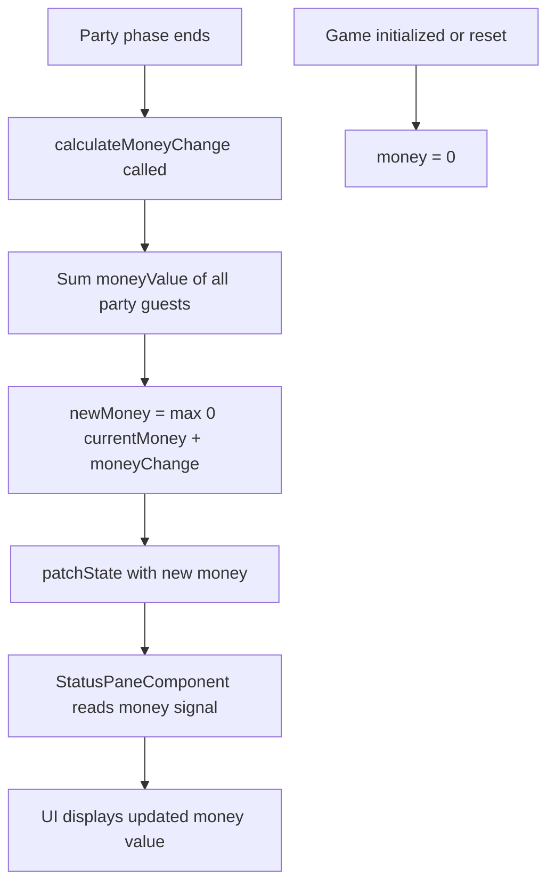

# Design Document: Rich Pal & Money Resource

## Overview

This feature introduces the "Rich Pal" guest type and the "money" resource to the party game. Rich Pals are wealth-focused guests that grant 1 money, 0 popularity, and 0 trouble. Money is a persistent, non-negative integer resource that accumulates across turns — identical in lifecycle to popularity. It is calculated at the end of the Party phase by summing the `moneyValue` of all party guests, then added to the player's current money (clamped to 0 if negative).

The starting deck expands from 8 to 10 guests: 4 Old Friends, 4 Wild Buddies, and 2 Rich Pals (Khalil and Renata). The guest card header displays "Rich Pal" for the new type. Money is displayed in the status pane between popularity and turns remaining.

### Key Design Decisions

1. **Money as Stored State**: Like popularity, money is stored in the GameStore state and persists across phases and turns. This follows the exact same pattern as popularity — calculated at Party phase end, accumulated, and clamped to 0.

2. **Extend GuestProperties with `moneyValue`**: Add a `moneyValue: number` field to the existing `GuestProperties` interface. All guest types define `moneyValue` in their defaults (0 for Old Friends and Wild Buddies, 1 for Rich Pals).

3. **Extend GuestType Union**: Add `'RICH_PAL'` to the existing union and extend `GUEST_TYPE_DEFAULTS` with the new type's properties.

4. **Money Display Always Visible**: Unlike trouble (which is computed and only shown during Party phase), money is persistent state and is always displayed in the status pane — same as popularity.

5. **Deck Composition Change**: `INITIAL_GUESTS` expands from 8 to 10 entries, adding 2 Rich Pal entries.

## Architecture

### Modified Layers

```
Guest Model Layer
├── GuestType union: 'OLD_FRIEND' | 'WILD_BUDDY' | 'RICH_PAL'
├── GuestProperties: { popularityValue, troubleValue, moneyValue }
├── GUEST_TYPE_DEFAULTS: defaults for all three types
└── INITIAL_GUESTS: 10 entries (4 Old Friends + 4 Wild Buddies + 2 Rich Pals)

GameState Layer
├── GameState interface: + money: number
└── GameStoreState: inherits money from GameState

GameStore Layer
├── State: + money (stored, initialized to 0)
├── Methods: initializeGame() updated for 10-guest deck
│            advancePhase() updated to calculate money change
│            resetGame() resets money to 0
└── Private: + calculateMoneyChange()

UI Layer
├── StatusPaneComponent: + money display (between popularity and turns remaining)
└── GuestCardComponent: + 'RICH_PAL' → 'Rich Pal' in GUEST_TYPE_LABELS
```

### Data Flow for Money



### Integration Points

1. **Guest Model**: Extend `GuestType`, `GuestProperties`, `GUEST_TYPE_DEFAULTS`, expand `INITIAL_GUESTS` to 10
2. **GameState Interface**: Add `money: number` property
3. **GameStore**: Add `money` to initial state, add `calculateMoneyChange()`, update `advancePhase()` and `initializeGame()`
4. **StatusPaneComponent**: Add money display between popularity and turns remaining
5. **GuestCardComponent**: Add `RICH_PAL: 'Rich Pal'` to `GUEST_TYPE_LABELS`

## Components and Interfaces

### Modified Interfaces

#### GuestType (guest.model.ts)

```typescript
export type GuestType = 'OLD_FRIEND' | 'WILD_BUDDY' | 'RICH_PAL';
```

#### GuestProperties (guest.model.ts)

```typescript
export interface GuestProperties {
  popularityValue: number;
  troubleValue: number;
  moneyValue: number;    // NEW: integer (can be negative in future)
}
```

#### GUEST_TYPE_DEFAULTS (guest.model.ts)

```typescript
export const GUEST_TYPE_DEFAULTS: Record<GuestType, GuestProperties> = {
  OLD_FRIEND: {
    popularityValue: 1,
    troubleValue: 0,
    moneyValue: 0
  },
  WILD_BUDDY: {
    popularityValue: 2,
    troubleValue: 1,
    moneyValue: 0
  },
  RICH_PAL: {
    popularityValue: 0,
    troubleValue: 0,
    moneyValue: 1
  }
};
```

#### INITIAL_GUESTS (guest.model.ts)

Expands from 8 to 10 entries:

```typescript
export const INITIAL_GUESTS: readonly { type: GuestType; name: string }[] = [
  { type: 'OLD_FRIEND', name: 'Brian' },
  { type: 'OLD_FRIEND', name: 'Colin' },
  { type: 'OLD_FRIEND', name: 'Emily' },
  { type: 'OLD_FRIEND', name: 'Rachelle' },
  { type: 'WILD_BUDDY', name: 'Anthony' },
  { type: 'WILD_BUDDY', name: 'Teresa' },
  { type: 'WILD_BUDDY', name: 'Jacco' },
  { type: 'WILD_BUDDY', name: 'Jodie' },
  { type: 'RICH_PAL', name: 'Khalil' },
  { type: 'RICH_PAL', name: 'Renata' }
];
```

#### GameState Interface (game-state.interface.ts)

```typescript
export interface GameState {
  currentTurn: number;
  currentPhase: GamePhase;
  totalTurns: number;
  isGameComplete: boolean;
  popularity: number;
  money: number;           // NEW: Non-negative integer tracking wealth
}
```

### Modified Store

#### GameStore — Initial State

```typescript
const initialState: GameStoreState = {
  currentTurn: 1,
  currentPhase: GamePhase.BUY,
  totalTurns: 25,
  isGameComplete: false,
  popularity: 0,
  money: 0,               // NEW
  deck: [],
  party: [],
  showEmptyDeckMessage: false
};
```

#### GameStore — New Private Method

```typescript
const calculateMoneyChange = (): number => {
  const party = store.party();
  return party.reduce((sum, guest) => sum + guest.properties.moneyValue, 0);
};
```

#### GameStore — Updated advancePhase()

In the `PARTY` phase branch, after calculating popularity and before returning guests to deck:

```typescript
// Calculate and apply money change
const moneyChange = calculateMoneyChange();
const currentMoney = store.money();
const newMoney = Math.max(0, currentMoney + moneyChange);

// Update both popularity and money
patchState(store, { popularity: newPopularity, money: newMoney });
```

#### GameStore — Updated initializeGame()

```typescript
initializeGame(turnCount: number = 25): void {
  // ... validation ...
  
  // Create 10 guests from INITIAL_GUESTS (4 Old Friends + 4 Wild Buddies + 2 Rich Pals)
  const deck: Guest[] = INITIAL_GUESTS.map((entry) => ({
    type: entry.type,
    name: entry.name,
    properties: { ...GUEST_TYPE_DEFAULTS[entry.type] }
  }));
  
  shuffleDeck(deck);
  
  patchState(store, {
    currentTurn: 1,
    currentPhase: GamePhase.BUY,
    totalTurns: turnCount,
    isGameComplete: false,
    popularity: 0,
    money: 0,             // NEW
    deck,
    party: [],
    showEmptyDeckMessage: false
  });
}
```

### Modified Components

#### GuestCardComponent — Updated Labels

```typescript
protected readonly GUEST_TYPE_LABELS: Record<string, string> = {
  OLD_FRIEND: 'Old Friend',
  WILD_BUDDY: 'Wild Buddy',
  RICH_PAL: 'Rich Pal'       // NEW
};
```

#### StatusPaneComponent — Money Display

Money is inserted between popularity and turns remaining:

```html
<aside class="status-pane">
  <div class="status-info">
    <h3>Popularity</h3>
    <p class="popularity-count">{{ gameStore.popularity() }}</p>
  </div>
  <div class="status-info">
    <h3>Money</h3>
    <p class="money-count">{{ gameStore.money() }}</p>
  </div>
  <div class="status-info">
    <h3>Turns Remaining</h3>
    <p class="turn-count">{{ gameStore.remainingTurns() }}</p>
  </div>
  @if (gameStore.currentPhase() === GamePhase.PARTY) {
    <div class="status-info">
      <h3>Trouble</h3>
      <p class="trouble-count">{{ gameStore.trouble() }}</p>
    </div>
    <button 
      class="invite-button"
      (click)="onInviteGuest()"
      aria-label="Invite Guest">
      Invite Guest
    </button>
  }
  <button 
    class="phase-button"
    (click)="gameStore.advancePhase()"
    [attr.aria-label]="gameStore.phaseButtonLabel()">
    {{ gameStore.phaseButtonLabel() }}
  </button>
</aside>
```

Add CSS for the money display:

```css
.status-info .money-count {
  margin: 0;
  font-size: 2rem;
  font-weight: bold;
  color: #007bff;
}
```

## Data Models

### Guest Type Properties

| Guest Type   | popularityValue | troubleValue | moneyValue |
|-------------|----------------|--------------|------------|
| OLD_FRIEND  | 1              | 0            | 0          |
| WILD_BUDDY  | 2              | 1            | 0          |
| RICH_PAL    | 0              | 0            | 1          |

### Starting Deck (10 guests)

| Name      | Type        |
|-----------|-------------|
| Brian     | OLD_FRIEND  |
| Colin     | OLD_FRIEND  |
| Emily     | OLD_FRIEND  |
| Rachelle  | OLD_FRIEND  |
| Anthony   | WILD_BUDDY  |
| Teresa    | WILD_BUDDY  |
| Jacco     | WILD_BUDDY  |
| Jodie     | WILD_BUDDY  |
| Khalil    | RICH_PAL    |
| Renata    | RICH_PAL    |

### Money Computation

Money is calculated at the end of the Party phase, following the same pattern as popularity:

```
moneyChange = Σ guest.properties.moneyValue for all guests in party
newMoney = max(0, currentMoney + moneyChange)
```

- When party has 0 Rich Pals: moneyChange = 0
- When party has 1 Rich Pal: moneyChange = 1
- When party has 2 Rich Pals: moneyChange = 2
- Future guests with negative moneyValue: handled by the non-negative clamp

### State Shape

```typescript
interface GameStoreState extends GameState {
  deck: Guest[];
  party: Guest[];
  showEmptyDeckMessage: boolean;
  // money inherited from GameState
}
```

### Guest Conservation Update

The total guest count changes from 8 to 10. The conservation invariant becomes:
```
deck.length + party.length === 10
```

## Correctness Properties

*A property is a characteristic or behavior that should hold true across all valid executions of a system — essentially, a formal statement about what the system should do. Properties serve as the bridge between human-readable specifications and machine-verifiable correctness guarantees.*

### Property 1: Money Non-Negative Invariant

*For any* sequence of game operations (initialization, phase advances, guest invitations, resets), the money value SHALL always be a non-negative integer (>= 0).

This invariant ensures that money never becomes negative regardless of guest compositions or game states. Even when guests with negative `moneyValue` are introduced in future, the system clamps the result to zero.

**Validates: Requirements 4.1, 4.2, 5.4**

### Property 2: Money Calculation Formula

*For any* party composition at the end of Party phase, the money change SHALL equal the sum of each guest's `properties.moneyValue`, and the new money SHALL equal `max(0, currentMoney + moneyChange)`.

More formally: if the party contains guests g₁, g₂, ..., gₙ, then:
- moneyChange = g₁.properties.moneyValue + g₂.properties.moneyValue + ... + gₙ.properties.moneyValue
- newMoney = max(0, currentMoney + moneyChange)

**Validates: Requirements 5.1, 5.2, 5.3**

### Property 3: Money Preservation During Non-Party Transitions

*For any* game state where `advancePhase()` is called during Buy phase (transitioning to Party phase), the money value SHALL remain unchanged.

This ensures money only changes at the specific moment when Party phase ends, not during other phase transitions.

**Validates: Requirements 6.1, 6.2**

### Property 4: Money Accumulation Across Turns

*For any* sequence of complete turns (Buy → Party → next Buy), the final money SHALL equal the result of applying each turn's money change sequentially to the initial money (with non-negative clamping after each calculation).

This integration property validates that money correctly accumulates over multiple turns.

**Validates: Requirements 6.3**

### Property 5: Status Pane Displays Current Money

*For any* game state with a money value, the StatusPaneComponent SHALL display that exact money value in its rendered output.

**Validates: Requirements 7.1, 7.3**

### Property 6: Guest Card Header Matches Type Label

*For any* guest of any type (`OLD_FRIEND`, `WILD_BUDDY`, or `RICH_PAL`), the GuestCardComponent SHALL display a header that maps the guest's type to its human-readable label: `'OLD_FRIEND'` → `"Old Friend"`, `'WILD_BUDDY'` → `"Wild Buddy"`, `'RICH_PAL'` → `"Rich Pal"`.

**Validates: Requirements 8.1, 8.2, 8.3**

### Property 7: All Guest Names Unique

*For any* game state, all guests across the deck and party combined SHALL have unique names — no two guests share the same name regardless of guest type.

**Validates: Requirements 9.1, 9.2**

### Property 8: All Guest Types Define Money Value

*For any* guest type in the `GuestType` union, `GUEST_TYPE_DEFAULTS` SHALL define a `moneyValue` that is an integer.

**Validates: Requirements 2.1, 2.2**

### Property 9: Resource Independence

*For any* party composition, the money change at Party phase end SHALL depend only on the sum of `moneyValue` properties, the popularity change SHALL depend only on the sum of `popularityValue` properties, and the trouble value SHALL depend only on the sum of `troubleValue` properties. No resource calculation SHALL reference another resource's value or another property of the guest.

**Validates: Requirements 11.1, 11.2, 11.3**

## Error Handling

### Invalid States

The money system prevents invalid states through type safety and constraints:

1. **Negative Money**: Prevented by applying `Math.max(0, newMoney)` after each calculation
2. **Non-Integer Money**: Prevented by TypeScript type system and integer arithmetic from guest properties
3. **Undefined Guest Type**: Prevented by TypeScript's `GuestType` union type and `Record<GuestType, GuestProperties>` typing

### Edge Cases

1. **Empty Party**: When party is empty at end of Party phase, money change is 0 (sum of empty array)
2. **No Rich Pals in Party**: Money change is 0 since Old Friends and Wild Buddies have `moneyValue: 0`
3. **All Rich Pals in Party**: Money change equals the count of Rich Pals (each contributes 1)
4. **Future Negative moneyValue**: Handled by the non-negative clamp — money cannot go below 0

### Guest Conservation

The total guest count changes from 8 to 10. Existing tests that assert `deck.length + party.length === 8` must be updated to assert `=== 10`. The conservation invariant is maintained by the same invite/return mechanics.

## Testing Strategy

### Dual Testing Approach

- **Unit tests**: Verify specific examples (RICH_PAL defaults, starting deck composition, specific names, DOM structure), edge cases (empty party money = 0), and initialization/reset behavior
- **Property tests**: Verify universal properties across all valid inputs (money calculation, non-negative invariant, name uniqueness, resource independence, type label mapping)

Both are complementary — unit tests catch concrete regressions while property tests verify general correctness across the input space.

### Property-Based Testing Configuration

**Library**: fast-check (already installed in the project)

**Configuration**:
- Minimum 100 iterations per property test
- Each test tagged with comment referencing design property
- Tag format: `// Feature: rich-pal-money-resource, Property {number}: {property_text}`
- Each correctness property implemented by a SINGLE property-based test

### Property Test Plan

1. **Property 1 test**: Generate random sequences of operations (invite, advancePhase, reset), verify money >= 0 after each operation.
   - Tag: `// Feature: rich-pal-money-resource, Property 1: Money Non-Negative Invariant`

2. **Property 2 test**: Generate random party compositions (varying guest counts and types), calculate expected money change, advance phase, verify actual matches expected.
   - Tag: `// Feature: rich-pal-money-resource, Property 2: Money Calculation Formula`

3. **Property 3 test**: Generate random game states in Buy phase, capture money, advance to Party phase, verify money unchanged.
   - Tag: `// Feature: rich-pal-money-resource, Property 3: Money Preservation During Non-Party Transitions`

4. **Property 4 test**: Generate random sequences of complete turns with varying party compositions, verify final money equals sequential application of changes with clamping.
   - Tag: `// Feature: rich-pal-money-resource, Property 4: Money Accumulation Across Turns`

5. **Property 5 test**: Generate random money values, set store state, render component, verify displayed value matches store.
   - Tag: `// Feature: rich-pal-money-resource, Property 5: Status Pane Displays Current Money`

6. **Property 6 test**: Generate random guests of any type with random names, render GuestCardComponent, verify header text matches the type label map.
   - Tag: `// Feature: rich-pal-money-resource, Property 6: Guest Card Header Matches Type Label`

7. **Property 7 test**: Generate random sequences of game operations (invite, advancePhase), verify all guest names across deck + party are unique after each operation.
   - Tag: `// Feature: rich-pal-money-resource, Property 7: All Guest Names Unique`

8. **Property 8 test**: Iterate over all keys of `GUEST_TYPE_DEFAULTS`, verify each has a `moneyValue` that is an integer.
   - Tag: `// Feature: rich-pal-money-resource, Property 8: All Guest Types Define Money Value`

9. **Property 9 test**: Generate random party compositions, invite guests, advance phase, verify that money change equals sum of `moneyValue`, popularity change equals sum of `popularityValue`, and trouble equals sum of `troubleValue` — with no cross-resource interference.
   - Tag: `// Feature: rich-pal-money-resource, Property 9: Resource Independence`

### Unit Test Plan

**Model tests** (`guest.model.spec.ts`):
- RICH_PAL exists in GUEST_TYPE_DEFAULTS
- RICH_PAL has popularityValue 0, troubleValue 0, moneyValue 1
- OLD_FRIEND has moneyValue 0
- WILD_BUDDY has moneyValue 0
- INITIAL_GUESTS has 10 entries: 4 OLD_FRIEND, 4 WILD_BUDDY, 2 RICH_PAL
- Specific Rich Pal names: Khalil, Renata
- All names in INITIAL_GUESTS are unique

**Store tests** (`game.store.spec.ts`):
- After initializeGame(), deck has 10 guests
- After initializeGame(), money is 0
- After resetGame(), money is 0
- Money is 0 when party has no Rich Pals at phase end
- Money increases by 1 when party has 1 Rich Pal at phase end

**Component tests**:
- StatusPaneComponent: money element present with correct value
- StatusPaneComponent: money display appears after popularity and before turns remaining in DOM order
- GuestCardComponent: "Rich Pal" header for RICH_PAL type

### Test File Organization

```
src/app/
  models/
    guest.model.spec.ts                    # Unit tests (updated for RICH_PAL)
    guest.model.property.spec.ts           # Property 8 (type defaults)
  stores/
    game.store.spec.ts                     # Unit tests (updated for money + 10-guest deck)
    game.store.property.spec.ts            # Properties 1, 2, 3, 4, 7, 9
  components/
    status-pane.component.spec.ts          # Unit tests (updated for money display)
    status-pane.component.property.spec.ts # Property 5
    guest-card.component.spec.ts           # Unit tests (updated for Rich Pal header)
    guest-card.component.property.spec.ts  # Property 6
```
