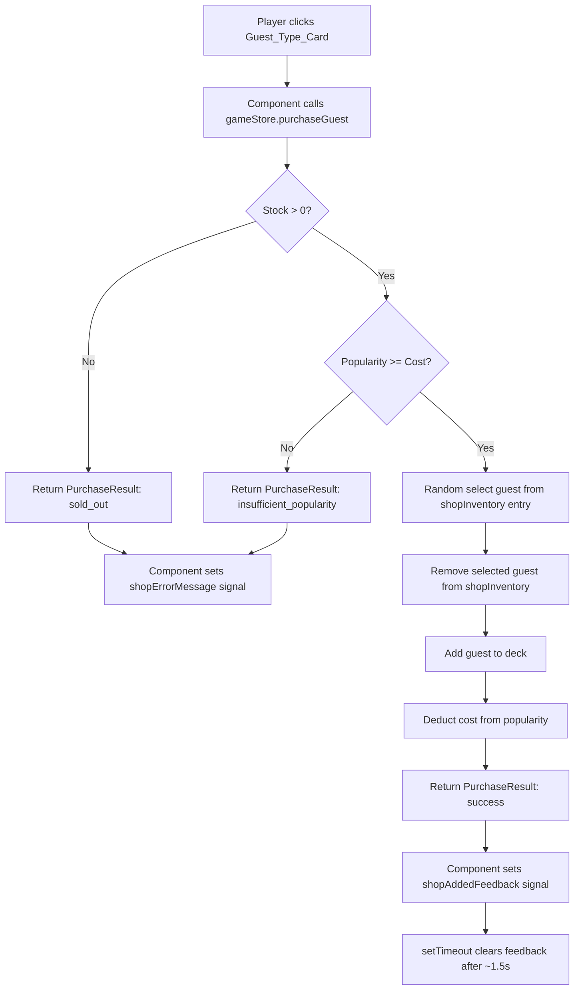

# Design Document: Shop Buy Guests

## Overview

This feature adds a guest shop to the BUY phase, allowing the player to spend popularity to permanently add new named guests to their deck. The shop offers a fixed, non-replenishing inventory of Old Friends and Rich Pals. Each guest type has a popularity cost, and the player selects a type to purchase — receiving a randomly chosen named guest from the remaining stock of that type.

### Key Design Decisions

1. **Shop Inventory as Guest Arrays**: The shop inventory stores actual `Guest[]` arrays per type (not just counts). This supports named guests and random selection — when a purchase occurs, a random guest is spliced from the array and appended to the deck. The array length naturally tracks remaining stock.

2. **GUEST_TYPE_COSTS Constant**: A `Record<GuestType, number | null>` maps each guest type to its popularity cost. `null` means the type is not purchasable (Wild Buddy). This cleanly separates cost configuration from shop inventory and allows the computed signal to filter out non-purchasable types.

3. **SHOP_GUESTS Constant**: A readonly array of `{ type: GuestType; name: string }` entries defines the named guests available in the shop. This mirrors the pattern of `INITIAL_GUESTS` for the starting deck. Old Friends: Matt, Chad, Wes, Caleb. Rich Pals: Kevin, Arlene, Robert, Jim.

4. **Random Selection via Math.random()**: `purchaseGuest()` picks a random index from the remaining guests array for the selected type using `Math.floor(Math.random() * guests.length)`. When only 1 guest remains, the selection is deterministic.

5. **PurchaseResult Return Type Instead of Store State for Errors/Feedback**: `purchaseGuest()` returns a `PurchaseResult` discriminated union instead of setting error/feedback state in the store. On success it returns `{ success: true, guestType }` after modifying deck, popularity, and shopInventory. On failure it returns `{ success: false, error, message }` without modifying any store state. This keeps transient UI concerns (error messages, "Added!" feedback) out of the persisted store.

6. **Component-Local Signals for Error and Feedback**: `shopErrorMessage` and `shopAddedFeedback` are `signal()` instances local to `PhaseContentComponent`. The component's `onPurchaseGuest()` method calls `gameStore.purchaseGuest()`, inspects the result, and sets the appropriate local signal. This avoids polluting the store with ephemeral UI state.

7. **"Added!" Feedback via Local Signal + setTimeout**: On successful purchase, the component sets `shopAddedFeedback` to the purchased `GuestType`. A `setTimeout` clears it after ~1.5s. The template conditionally renders "Added!" text with a CSS fade animation on the matching card.

8. **Error Modal as Component-Local Concern**: The shop error modal follows the same overlay + centered box + OK button pattern used by the shutdown and ban modals. `shopErrorMessage` signal in the component holds the message string; a local `dismissShopError()` method clears it.

9. **Computed Shop Display Order**: `purchasableShopItems` is a computed signal that filters out types with `null` cost, then sorts by ascending cost and alphabetically by label for ties. This produces a stable display order: Old Friend (cost 2) before Rich Pal (cost 3).

10. **Shop Inventory Persists Across Turns**: `advancePhase()` and `triggerPartyShutdown()` do not modify `shopInventory`. Only `purchaseGuest()` modifies it. `initializeGame()` initializes it; `resetGame()` resets it to empty (the initial state default).

## Architecture

### Modified Layers

```
Guest Model (guest.model.ts)
├── + GUEST_TYPE_COSTS: Record<GuestType, number | null>   (new: cost per type)
└── + SHOP_GUESTS: readonly { type: GuestType; name: string }[]  (new: shop guest pool)

GameStoreState (game.store.ts)
└── + shopInventory: ShopInventoryEntry[]     (new: shop stock per type)

GameStore Computed Signals
└── + purchasableShopItems: computed          (new: sorted, filtered shop entries)

GameStore Methods
├── initializeGame()                          (modified: initialize shopInventory)
├── resetGame()                               (modified: reset shop state via initialState)
└── + purchaseGuest(type: GuestType): PurchaseResult  (new: purchase logic, returns result)

PurchaseResult (game.store.ts)
└── Discriminated union: { success: true; guestType } | { success: false; error; message }

UI Layer
├── PhaseContentComponent                     (modified: shop cards in BUY phase, local signals for error/feedback)
│   ├── shopErrorMessage = signal<string | null>(null)       (local)
│   ├── shopAddedFeedback = signal<GuestType | null>(null)   (local)
│   ├── onPurchaseGuest(type)                                (local: calls store, handles result)
│   └── dismissShopError()                                   (local: clears error signal)
└── GuestCardComponent                        (unchanged — shop uses its own card rendering)
```

### Purchase Flow



### Integration Points

1. **guest.model.ts**: Add `GUEST_TYPE_COSTS` and `SHOP_GUESTS` constants
2. **game.store.ts**: Add `ShopInventoryEntry` interface, add `PurchaseResult` type, extend `GameStoreState` with `shopInventory` only, add `purchasableShopItems` computed, add `purchaseGuest()` method (returns `PurchaseResult`), modify `initializeGame()`
3. **PhaseContentComponent**: Add local `shopErrorMessage` and `shopAddedFeedback` signals, render shop cards during BUY phase, handle click → `onPurchaseGuest()` → inspect result → set local signals, show error modal, show "Added!" feedback
4. **GuestCardComponent**: Unchanged — shop cards are rendered inline in PhaseContentComponent

## Components and Interfaces

### New Constants (guest.model.ts)

```typescript
export const GUEST_TYPE_COSTS: Record<GuestType, number | null> = {
  OLD_FRIEND: 2,
  WILD_BUDDY: null,
  RICH_PAL: 3
};

export const SHOP_GUESTS: readonly { type: GuestType; name: string }[] = [
  { type: 'OLD_FRIEND', name: 'Matt' },
  { type: 'OLD_FRIEND', name: 'Chad' },
  { type: 'OLD_FRIEND', name: 'Wes' },
  { type: 'OLD_FRIEND', name: 'Caleb' },
  { type: 'RICH_PAL', name: 'Kevin' },
  { type: 'RICH_PAL', name: 'Arlene' },
  { type: 'RICH_PAL', name: 'Robert' },
  { type: 'RICH_PAL', name: 'Jim' },
];
```

### New Types (game.store.ts)

```typescript
export interface ShopInventoryEntry {
  type: GuestType;
  guests: Guest[];
  cost: number;
}

export type PurchaseResult =
  | { success: true; guestType: GuestType }
  | { success: false; error: 'sold_out'; message: string }
  | { success: false; error: 'insufficient_popularity'; message: string };
```

### Modified Store State

```typescript
export interface GameStoreState extends GameState {
  deck: Guest[];
  party: Guest[];
  discard: Guest[];
  showEmptyDeckMessage: boolean;
  isPartyShutdown: boolean;
  isBanSelectionActive: boolean;
  bustPartySnapshot: Guest[];
  selectedBanGuest: Guest | null;
  shopInventory: ShopInventoryEntry[];      // NEW
}
```

### Initial State

```typescript
const initialState: GameStoreState = {
  // ... existing fields ...
  shopInventory: []
};
```

### New Computed Signal

```typescript
purchasableShopItems: computed(() => {
  const inventory = store.shopInventory();
  return [...inventory].sort((a, b) => {
    if (a.cost !== b.cost) return a.cost - b.cost;
    const labelA = GUEST_TYPE_LABELS[a.type] ?? a.type;
    const labelB = GUEST_TYPE_LABELS[b.type] ?? b.type;
    return labelA.localeCompare(labelB);
  });
})
```

### New Methods

#### purchaseGuest(type: GuestType): PurchaseResult

```typescript
purchaseGuest(type: GuestType): PurchaseResult {
  const inventory = store.shopInventory();
  const entry = inventory.find(e => e.type === type);

  if (!entry || entry.guests.length === 0) {
    const label = GUEST_TYPE_LABELS[type] ?? type;
    return { success: false, error: 'sold_out', message: `No ${label} available!` };
  }

  const cost = entry.cost;
  const currentPopularity = store.popularity();

  if (currentPopularity < cost) {
    return { success: false, error: 'insufficient_popularity', message: 'Not enough popularity!' };
  }

  // Random selection from remaining guests
  const randomIndex = Math.floor(Math.random() * entry.guests.length);
  const selectedGuest = entry.guests[randomIndex];

  // Build updated inventory
  const updatedInventory = inventory.map(e => {
    if (e.type !== type) return e;
    return {
      ...e,
      guests: e.guests.filter((_, i) => i !== randomIndex)
    };
  });

  // Add guest to deck, deduct cost
  const updatedDeck = [...store.deck(), selectedGuest];

  patchState(store, {
    shopInventory: updatedInventory,
    deck: updatedDeck,
    popularity: currentPopularity - cost
  });

  return { success: true, guestType: type };
}
```

### Modified Methods

#### initializeGame() — Modified

```typescript
initializeGame(turnCount: number = 25): void {
  // ... existing deck creation and shuffle ...

  // Build shop inventory from SHOP_GUESTS, filtering to purchasable types
  const shopMap = new Map<GuestType, Guest[]>();
  for (const entry of SHOP_GUESTS) {
    const cost = GUEST_TYPE_COSTS[entry.type];
    if (cost === null) continue; // Skip non-purchasable types
    if (!shopMap.has(entry.type)) shopMap.set(entry.type, []);
    shopMap.get(entry.type)!.push({
      type: entry.type,
      name: entry.name,
      properties: { ...GUEST_TYPE_DEFAULTS[entry.type] }
    });
  }

  const shopInventory: ShopInventoryEntry[] = [];
  for (const [type, guests] of shopMap) {
    shopInventory.push({ type, guests, cost: GUEST_TYPE_COSTS[type]! });
  }

  patchState(store, {
    // ... existing fields ...
    shopInventory
  });
}
```

#### resetGame() — No Code Change Needed

`resetGame()` patches with `initialState`, which already includes `shopInventory: []`.

### Modified PhaseContentComponent

The component adds local signals for transient UI state and a method to handle purchase results:

```typescript
import { Component, Input, inject, signal } from '@angular/core';
import { GamePhase } from '../models';
import { GameStore } from '../stores/game.store';
import { GuestType, GUEST_TYPE_LABELS } from '../models/guest.model';
import { GuestCardComponent } from './guest-card.component';

@Component({ /* ... */ })
export class PhaseContentComponent {
  @Input({ required: true }) phase!: GamePhase;
  readonly GamePhase = GamePhase;
  readonly GUEST_TYPE_LABELS = GUEST_TYPE_LABELS;

  protected readonly gameStore = inject(GameStore);

  // Local signals for transient shop UI state
  shopErrorMessage = signal<string | null>(null);
  shopAddedFeedback = signal<GuestType | null>(null);

  // ... existing fields ...

  onPurchaseGuest(type: GuestType): void {
    const result = this.gameStore.purchaseGuest(type);
    if (result.success) {
      this.shopAddedFeedback.set(result.guestType);
      setTimeout(() => {
        this.shopAddedFeedback.set(null);
      }, 1500);
    } else {
      this.shopErrorMessage.set(result.message);
    }
  }

  dismissShopError(): void {
    this.shopErrorMessage.set(null);
  }
}
```

During BUY phase, render shop cards from `purchasableShopItems`:

```html
@if (phase === GamePhase.BUY) {
  <h2>Shop</h2>
  <div class="shop-cards-container">
    @for (item of gameStore.purchasableShopItems(); track item.type) {
      <button
        class="shop-card"
        (click)="onPurchaseGuest(item.type)"
        [attr.aria-label]="'Buy ' + GUEST_TYPE_LABELS[item.type]">
        <div class="card-header">{{ GUEST_TYPE_LABELS[item.type] }}</div>
        <div class="card-image">
          <svg xmlns="http://www.w3.org/2000/svg" viewBox="0 0 24 24"
               fill="currentColor" aria-hidden="true">
            <path d="M12 12c2.21 0 4-1.79 4-4s-1.79-4-4-4-4 1.79-4 4 1.79 4 4 4zm0 2c-2.67 0-8 1.34-8 4v2h16v-2c0-2.66-5.33-4-8-4z"/>
          </svg>
        </div>
        <div class="shop-price">Price: {{ item.cost }}</div>
        <div class="shop-stock">Available: {{ item.guests.length }}</div>
        @if (shopAddedFeedback() === item.type) {
          <div class="added-feedback">Added!</div>
        }
      </button>
    }
  </div>
}
```

#### Error Modal

```html
@if (shopErrorMessage()) {
  <div class="shop-error-overlay" role="dialog" aria-modal="true" aria-labelledby="shop-error-title">
    <div class="shop-error-modal">
      <p id="shop-error-title">{{ shopErrorMessage() }}</p>
      <button
        class="shop-error-button"
        (click)="dismissShopError()"
        aria-label="OK">
        OK
      </button>
    </div>
  </div>
}
```

## Data Models

### Shop Constants

| Constant | Type | Description |
|----------|------|-------------|
| `GUEST_TYPE_COSTS` | `Record<GuestType, number \| null>` | Cost per type: OLD_FRIEND=2, RICH_PAL=3, WILD_BUDDY=null |
| `SHOP_GUESTS` | `readonly { type: GuestType; name: string }[]` | Named guests available in shop |

### ShopInventoryEntry

| Field | Type | Description |
|-------|------|-------------|
| `type` | `GuestType` | The guest type for this entry |
| `guests` | `Guest[]` | Remaining named guests available for purchase |
| `cost` | `number` | Popularity cost to purchase one guest of this type |

### PurchaseResult

| Variant | Fields | Description |
|---------|--------|-------------|
| Success | `{ success: true; guestType: GuestType }` | Purchase succeeded; store state (deck, popularity, shopInventory) was modified |
| Sold Out | `{ success: false; error: 'sold_out'; message: string }` | No stock remaining; store state unchanged |
| Insufficient Popularity | `{ success: false; error: 'insufficient_popularity'; message: string }` | Not enough popularity; store state unchanged |

### Shop State Fields (Store)

| Field | Type | Default | Description |
|-------|------|---------|-------------|
| `shopInventory` | `ShopInventoryEntry[]` | `[]` | Current shop stock per type |

### Shop UI State Fields (Component-Local Signals)

| Field | Type | Default | Description |
|-------|------|---------|-------------|
| `shopErrorMessage` | `signal<string \| null>` | `null` | Error modal message, null when no error |
| `shopAddedFeedback` | `signal<GuestType \| null>` | `null` | Type showing "Added!" feedback, null when inactive |

### Guest Conservation (Extended)

After shop purchases, the total guest count across all locations increases:

```
deck.length + party.length + discard.length = INITIAL_GUESTS.length + total_purchased
```

Where `total_purchased = initial_shop_size - current_shop_size`:

```
deck.length + party.length + discard.length + sum(shopInventory[*].guests.length) 
  = INITIAL_GUESTS.length + SHOP_GUESTS.length (filtered to purchasable)
```

### Shop Display Order

Computed from `purchasableShopItems`:
1. Sort by `cost` ascending
2. Break ties alphabetically by `GUEST_TYPE_LABELS[type]`

Result: Old Friend (cost 2) → Rich Pal (cost 3)


## Correctness Properties

*A property is a characteristic or behavior that should hold true across all valid executions of a system — essentially, a formal statement about what the system should do. Properties serve as the bridge between human-readable specifications and machine-verifiable correctness guarantees.*

### Property 1: Shop + Game Guest Conservation Invariant

*For any* sequence of game operations (purchaseGuest, inviteGuest, advancePhase, triggerPartyShutdown, confirmBan), the sum `deck.length + party.length + discard.length + sum(shopInventory[*].guests.length)` SHALL equal `INITIAL_GUESTS.length + purchasableShopGuestsCount` (where purchasableShopGuestsCount is the number of SHOP_GUESTS entries with non-null cost).

This is the fundamental conservation invariant. No operation creates or destroys guests — purchases move guests from shop to deck, and all other operations move guests between deck/party/discard.

**Validates: Requirements 3.1, 3.3, 3.6, 8.2**

### Property 2: Popularity Deduction Equals Cost on Successful Purchase

*For any* game state where `shopInventory` has at least 1 guest of a given type and `popularity >= cost` for that type, calling `purchaseGuest(type)` SHALL return `{ success: true }` and result in `newPopularity === oldPopularity - cost`.

This validates that the exact cost is deducted — no more, no less — on every successful purchase regardless of the specific guest selected or the current game state.

**Validates: Requirements 3.2**

### Property 3: Shop Stock Decrements by Exactly 1 on Successful Purchase

*For any* game state where a purchase of type T succeeds (returns `{ success: true }`), the shop inventory entry for type T SHALL have exactly one fewer guest afterward, and all other type entries SHALL be unchanged.

Combined with Property 1, this ensures the purchased guest moved from shop to deck without duplication or loss.

**Validates: Requirements 3.3, 8.2**

### Property 4: Purchase Rejected When Stock Is 0 — Store State Unchanged

*For any* game state where `shopInventory` has 0 guests of a given type, calling `purchaseGuest(type)` SHALL return `{ success: false, error: 'sold_out' }` and SHALL NOT modify `deck`, `popularity`, or `shopInventory`.

This validates the sold-out guard: no store state mutation occurs on rejection. The error message string is returned in the result and handled by the component locally.

**Validates: Requirements 4.1**

### Property 5: Purchase Rejected When Popularity < Cost — Store State Unchanged

*For any* game state where `shopInventory` has at least 1 guest of a given type but `popularity < cost`, calling `purchaseGuest(type)` SHALL return `{ success: false, error: 'insufficient_popularity' }` and SHALL NOT modify `deck`, `popularity`, or `shopInventory`.

This validates the insufficient-popularity guard with no side effects on the store. The error message is returned in the result for the component to display.

**Validates: Requirements 5.1**

### Property 6: Purchased Guest Has Valid Name from Shop Pool

*For any* successful purchase of type T (where `purchaseGuest(type)` returns `{ success: true }`), the guest added to the deck SHALL have type T and a name that was present in the shop inventory entry for type T before the purchase.

This ensures random selection always picks from the correct pool and the guest identity is preserved.

**Validates: Requirements 3.1, 7.3, 8.1**

### Property 7: Shop Display Order Is Sorted by Cost Then Alphabetically

*For any* set of `ShopInventoryEntry` items in `shopInventory`, the `purchasableShopItems` computed signal SHALL return them sorted by ascending `cost`, with ties broken alphabetically by `GUEST_TYPE_LABELS[type]`.

**Validates: Requirements 9.1, 9.2**

### Property 8: Shop Inventory Persists Across Turn Transitions

*For any* game state with a non-empty shop inventory, calling `advancePhase()` from PARTY phase (normal party end) SHALL leave `shopInventory` unchanged. Similarly, `triggerPartyShutdown()` and `confirmBan()` SHALL not modify `shopInventory`.

**Validates: Requirements 6.1, 6.2**


## Error Handling

### Sold Out Purchase Attempt

When `purchaseGuest(type)` is called and the shop inventory entry for that type has 0 guests remaining, the method returns `{ success: false, error: 'sold_out', message: 'No {typeLabel} available!' }` without modifying deck, popularity, or inventory. The component receives this result, sets its local `shopErrorMessage` signal, and displays an error modal with an OK button. The OK button calls the component's `dismissShopError()` method which clears the local signal.

### Insufficient Popularity Purchase Attempt

When `purchaseGuest(type)` is called and the player's popularity is less than the cost, the method returns `{ success: false, error: 'insufficient_popularity', message: 'Not enough popularity!' }` without modifying state. The sold-out check runs first — if stock is 0, the sold-out result takes priority. The component handles the result identically to the sold-out case: sets `shopErrorMessage` and shows the modal.

### Purchase of Non-Purchasable Type

If `purchaseGuest('WILD_BUDDY')` is called, the inventory lookup finds no entry (Wild Buddy is excluded during initialization), so it falls into the sold-out path and returns the appropriate error result. No special handling needed.

### shopAddedFeedback Timeout Race

If the player purchases another guest before the previous "Added!" timeout fires, the component's `shopAddedFeedback` signal is overwritten to the new type. When the old timeout fires, it sets the signal to `null` — but the new purchase may have already set a new timeout. This is acceptable: the worst case is the "Added!" text disappears slightly early. The UX impact is negligible.

### Empty Shop After All Purchases

When all guests of all types are purchased, `purchasableShopItems` still returns the entries (with `guests.length === 0`). The cards show "Available: 0". Clicking any card triggers the sold-out error result, which the component displays as a modal. The shop remains visible but non-functional.

### Game Reset During BUY Phase

`resetGame()` patches with `initialState` which sets `shopInventory: []`. The component's local signals (`shopErrorMessage`, `shopAddedFeedback`) are naturally reset when the component is destroyed/recreated on navigation. The next `initializeGame()` call rebuilds the shop from `SHOP_GUESTS`.


## Testing Strategy

### Dual Testing Approach

- **Unit tests**: Verify specific examples (initialization creates 4 Old Friends and 4 Rich Pals, specific cost values, specific error messages in returned results, specific display order), edge cases (purchase last guest of a type, purchase with exactly enough popularity, purchase with 0 popularity), and DOM structure (shop cards rendered during BUY, error modal elements from local signals, "Added!" text from local signal)
- **Property tests**: Verify universal properties across all valid inputs (conservation invariant, cost deduction, stock decrement, rejection guards with store state unchanged, sort order, persistence)

Both are complementary — unit tests catch concrete regressions while property tests verify general correctness across the input space.

### Property-Based Testing Configuration

**Library**: fast-check (already installed in the project)

**Configuration**:
- Minimum 100 iterations per property test
- Each test tagged with comment referencing design property
- Tag format: `// Feature: shop-buy-guests, Property {number}: {property_text}`
- Each correctness property implemented by a SINGLE property-based test

### Property Test Plan

1. **Property 1 test**: Generate random sequences of game operations (purchase, invite, advancePhase, shutdown, ban). After each operation, verify `deck.length + party.length + discard.length + sum(shopInventory[*].guests.length) === INITIAL_GUESTS.length + initialShopSize`.
   - Tag: `// Feature: shop-buy-guests, Property 1: Shop + Game Guest Conservation Invariant`

2. **Property 2 test**: Generate random game states with varying popularity and shop stock. Perform a valid purchase. Verify `newPopularity === oldPopularity - cost`.
   - Tag: `// Feature: shop-buy-guests, Property 2: Popularity Deduction Equals Cost on Successful Purchase`

3. **Property 3 test**: Generate random shop inventories with varying stock levels. Perform a valid purchase of a random type. Verify the purchased type's stock decreased by 1 and all other types are unchanged.
   - Tag: `// Feature: shop-buy-guests, Property 3: Shop Stock Decrements by Exactly 1 on Successful Purchase`

4. **Property 4 test**: Generate random game states where a specific type has 0 stock. Call purchaseGuest for that type. Verify the result is `{ success: false, error: 'sold_out' }` and deck/popularity/inventory are unchanged.
   - Tag: `// Feature: shop-buy-guests, Property 4: Purchase Rejected When Stock Is 0 — Store State Unchanged`

5. **Property 5 test**: Generate random game states where stock > 0 but popularity < cost. Call purchaseGuest. Verify the result is `{ success: false, error: 'insufficient_popularity' }` and deck/popularity/inventory are unchanged.
   - Tag: `// Feature: shop-buy-guests, Property 5: Purchase Rejected When Popularity < Cost — Store State Unchanged`

6. **Property 6 test**: Generate random valid purchase scenarios. After purchase, verify the new guest in the deck has the correct type and a name that existed in the shop pool before purchase.
   - Tag: `// Feature: shop-buy-guests, Property 6: Purchased Guest Has Valid Name from Shop Pool`

7. **Property 7 test**: Generate random ShopInventoryEntry arrays with varying costs and types. Compute the sorted order. Verify entries are sorted by cost ascending, then alphabetically by type label.
   - Tag: `// Feature: shop-buy-guests, Property 7: Shop Display Order Is Sorted by Cost Then Alphabetically`

8. **Property 8 test**: Generate random game states with non-empty shop inventories. Call advancePhase() from PARTY phase. Verify shopInventory is deeply equal before and after.
   - Tag: `// Feature: shop-buy-guests, Property 8: Shop Inventory Persists Across Turn Transitions`


### Unit Test Plan

**Store tests** (`game.store.spec.ts`):
- After initializeGame(), shopInventory has 2 entries (OLD_FRIEND, RICH_PAL)
- After initializeGame(), OLD_FRIEND entry has 4 guests named Matt, Chad, Wes, Caleb
- After initializeGame(), RICH_PAL entry has 4 guests named Kevin, Arlene, Robert, Jim
- After initializeGame(), OLD_FRIEND entry cost is 2
- After initializeGame(), RICH_PAL entry cost is 3
- After initializeGame(), no WILD_BUDDY entry exists
- purchaseGuest() with valid state returns `{ success: true, guestType }` and adds guest to deck
- purchaseGuest() with 0 stock returns `{ success: false, error: 'sold_out' }` with correct message
- purchaseGuest() with insufficient popularity returns `{ success: false, error: 'insufficient_popularity' }` with correct message
- purchaseGuest() with exactly enough popularity returns success
- purchaseGuest() last guest of a type succeeds deterministically
- After resetGame(), shopInventory is empty array

**Model tests** (`guest.model.spec.ts`):
- GUEST_TYPE_COSTS has OLD_FRIEND = 2
- GUEST_TYPE_COSTS has RICH_PAL = 3
- GUEST_TYPE_COSTS has WILD_BUDDY = null
- SHOP_GUESTS has 4 OLD_FRIEND entries
- SHOP_GUESTS has 4 RICH_PAL entries
- SHOP_GUESTS has no WILD_BUDDY entries

**Component tests** (`phase-content.component.spec.ts`):
- During BUY phase, shop cards are rendered for each purchasable type
- Shop cards show type label but not guest name
- Shop cards show "Price: X" text
- Shop cards show "Available: Y" text
- During PARTY phase, shop is not displayed
- Error modal appears when component's shopErrorMessage signal is set (after a failed purchase)
- Error modal has OK button that calls component's dismissShopError() and clears the signal
- "Added!" text appears when component's shopAddedFeedback signal matches card type (after a successful purchase)
- After successful purchase, onPurchaseGuest sets shopAddedFeedback from the result
- After failed purchase, onPurchaseGuest sets shopErrorMessage from the result

### Test Organization

```
src/app/
  stores/
    game.store.spec.ts                    # Unit tests (extended)
    game.store.property.spec.ts           # Property tests (extended)
  components/
    phase-content.component.spec.ts       # Unit tests (extended)
    phase-content.component.property.spec.ts  # Property tests (extended)
  models/
    guest.model.spec.ts                   # Unit tests (extended)
    guest.model.property.spec.ts          # Property tests (extended)
```
