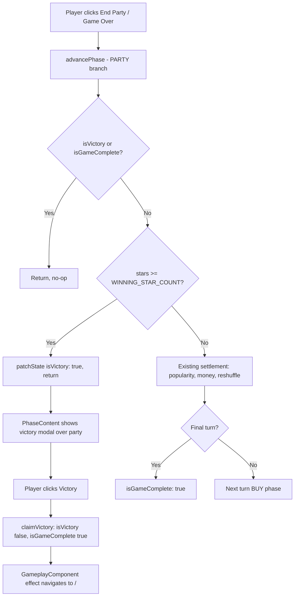
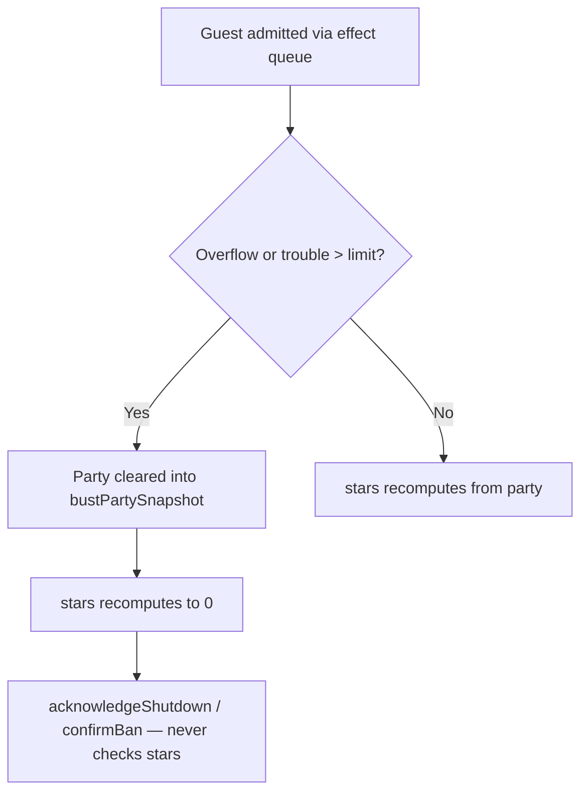

# Design Document: Star Guests & Winning

## Overview

This feature adds the game's win condition. A new guest property, `starValue`, is summed across the current party into a computed `stars` signal, the same way `troubleValue` drives `trouble` and `peaceValue` drives `partyTroubleLimitModifier`. When the player ends a party normally with `stars() >= WINNING_STAR_COUNT` (4), `advancePhase()` sets a new `isVictory` flag instead of settling resources and advancing the turn. `PhaseContentComponent` renders a victory modal while `isVictory` is true; its "Victory" button calls a new `claimVictory()` store method that sets `isGameComplete`, and the existing `GameplayComponent` effect navigates home.

Seven shop-only star guest types are added (4 named guests each, 28 new shop guests):

| Type       | Cost | Pop | Trouble | Money | Peace | Stars | Entrance effect |
|------------|------|-----|---------|-------|-------|-------|-----------------|
| DINOSAUR   | 25   | 0   | 1       | 0     | 0     | 1     | —               |
| DRAGON     | 30   | 0   | 0       | -3    | 0     | 1     | —               |
| MERMAID    | 35   | 0   | 0       | 0     | 0     | 1     | `autoInvite` ×1 |
| ALIEN      | 40   | 0   | 0       | 0     | 0     | 1     | —               |
| UNICORN    | 45   | 0   | 0       | 0     | 1     | 1     | —               |
| LEPRECHAUN | 50   | 0   | 0       | 3     | 0     | 1     | —               |
| SUPERHERO  | 50   | 3   | 0       | 0     | 0     | 1     | —               |

### Key Design Decisions

1. **Stars are computed, not stored.** `stars` is a `withComputed` signal over `party`, so it is automatically 0 after any party end or shutdown (both clear `party`). No reset code is needed, and Requirement 12.4 holds by construction.

2. **Win check happens only in `advancePhase()` (PARTY branch).** This is the only path for a Normal_Party_End. Trouble and overflow shutdowns go through `resolveEffects()` → `acknowledgeShutdown()` / `confirmBan()`, which never call `advancePhase()`, and they clear `party` before the player can act, so a shutdown can never produce a victory. Reaching 4 stars mid-party does not win on its own: the player still has to choose to end the party, and can keep inviting (and risk busting).

3. **Victory short-circuits before settlement.** When the win condition holds, `advancePhase()` sets `isVictory: true` and returns before applying popularity/money, returning guests to the deck, or advancing the turn. The party stays in `party`, so the winning guests stay visible behind the modal (Requirement 15.4). Since the game ends right after, skipping settlement has no gameplay effect, and it avoids applying a Dragon's money deficit on the winning turn.

4. **Victory beats final-turn Game Over.** The win check runs before the `currentTurn === totalTurns` branch, so winning on the last turn shows the victory dialog rather than silently completing the game.

5. **Victory is a separate flag from `isGameComplete`.** `isGameComplete` immediately triggers navigation in `GameplayComponent`, so it cannot be used to show a dialog. `isVictory` holds the "dialog showing" state; `claimVictory()` clears it and sets `isGameComplete`, reusing the existing navigation effect unchanged.

6. **Mermaid reuses `autoInvite`.** Its entrance effect is `(ctx) => { autoInvite(ctx); }`, identical to `MR_POPULAR`. The effect queue's per-effect overflow and trouble checks apply automatically.

7. **`WINNING_STAR_COUNT` is an exported constant** in `guest.model.ts`, so the store, status pane and tests share one source of truth.

8. **Signed `starValue`.** The type is `number` with no clamping in `stars`, so future guests with multiple or negative stars work without model changes. The win check is `>=`, so negative stars simply make the goal harder.

## Architecture

### Modified Files

```
Guest Model (guest.model.ts)
├── GuestProperties: + starValue: number
├── GuestType: + 'ALIEN' | 'LEPRECHAUN' | 'DRAGON' | 'DINOSAUR' | 'MERMAID' | 'UNICORN' | 'SUPERHERO'
├── GUEST_TYPE_DEFAULTS: + starValue: 0 on all 15 existing types, + 7 new entries
├── GUEST_TYPE_LABELS: + 7 entries
├── GUEST_TYPE_COSTS: + 7 entries
├── SHOP_GUESTS: + 28 entries (84 total)
├── GUEST_TYPE_ENTRANCE_EFFECTS: + MERMAID (one autoInvite)
└── + export const WINNING_STAR_COUNT = 4

GameStore (game.store.ts)
├── GameStoreState: + isVictory: boolean (initialState false)
├── Computed: + stars (sum of party starValue)
│             canInviteGuest: + !isVictory
├── Methods: advancePhase() — PARTY branch checks stars() >= WINNING_STAR_COUNT first
│            advancePhase() / inviteGuest() — return early while isVictory
│            + claimVictory()
│            initializeGame() — patch isVictory: false
│            resetGame() — inherits from initialState

StatusPaneComponent (status-pane.component.ts)
├── + "Stars" status-info block during PARTY: "{stars} / {WINNING_STAR_COUNT}"
└── Invite and phase buttons: also disabled while isVictory

PhaseContentComponent (phase-content.component.ts)
└── + victory modal (overlay, message, "Victory" button → claimVictory())

Unchanged
├── GameplayComponent: existing isGameComplete → navigate(['/']) effect handles the exit
├── GuestCardComponent: labels come from GUEST_TYPE_LABELS
└── EffectContext / resolveEffects: Mermaid uses existing autoInvite
```

### Victory Flow





## Components and Interfaces

### GuestProperties (guest.model.ts)

```typescript
export interface GuestProperties {
  popularityValue: number;
  troubleValue: number;
  moneyValue: number;
  peaceValue: number;
  starValue: number;          // NEW
}
```

### GuestType (guest.model.ts)

```typescript
export type GuestType = 'OLD_FRIEND' | 'WILD_BUDDY' | 'RICH_PAL' | 'MONKEY'
  | 'AUCTIONEER' | 'GANGSTER' | 'ROCK_STAR' | 'GAMBLER'
  | 'CUTE_DOG' | 'HIPPY'
  | 'CATERER' | 'TICKET_TAKER'
  | 'CLIMBER'
  | 'MR_POPULAR' | 'CELEBRITY'
  | 'ALIEN' | 'LEPRECHAUN' | 'DRAGON' | 'DINOSAUR' | 'MERMAID' | 'UNICORN' | 'SUPERHERO';  // NEW
```

### Constants (guest.model.ts)

```typescript
export const WINNING_STAR_COUNT = 4;   // NEW

export const GUEST_TYPE_LABELS: Record<GuestType, string> = {
  // ... existing entries ...
  ALIEN: 'Alien',
  LEPRECHAUN: 'Leprechaun',
  DRAGON: 'Dragon',
  DINOSAUR: 'Dinosaur',
  MERMAID: 'Mermaid',
  UNICORN: 'Unicorn',
  SUPERHERO: 'Superhero'
};

export const GUEST_TYPE_DEFAULTS: Record<GuestType, GuestProperties> = {
  // ... existing entries, each gaining starValue: 0 ...
  ALIEN:      { popularityValue: 0, troubleValue: 0, moneyValue: 0,  peaceValue: 0, starValue: 1 },
  LEPRECHAUN: { popularityValue: 0, troubleValue: 0, moneyValue: 3,  peaceValue: 0, starValue: 1 },
  DRAGON:     { popularityValue: 0, troubleValue: 0, moneyValue: -3, peaceValue: 0, starValue: 1 },
  DINOSAUR:   { popularityValue: 0, troubleValue: 1, moneyValue: 0,  peaceValue: 0, starValue: 1 },
  MERMAID:    { popularityValue: 0, troubleValue: 0, moneyValue: 0,  peaceValue: 0, starValue: 1 },
  UNICORN:    { popularityValue: 0, troubleValue: 0, moneyValue: 0,  peaceValue: 1, starValue: 1 },
  SUPERHERO:  { popularityValue: 3, troubleValue: 0, moneyValue: 0,  peaceValue: 0, starValue: 1 }
};

export const GUEST_TYPE_COSTS: Record<GuestType, number | null> = {
  // ... existing entries ...
  ALIEN: 40,
  LEPRECHAUN: 50,
  DRAGON: 30,
  DINOSAUR: 25,
  MERMAID: 35,
  UNICORN: 45,
  SUPERHERO: 50
};

export const SHOP_GUESTS = [
  // ... existing 56 entries ...
  { type: 'ALIEN', name: 'ET' },
  { type: 'ALIEN', name: 'Rocky' },
  { type: 'ALIEN', name: 'Olimar' },
  { type: 'ALIEN', name: 'Alf' },
  { type: 'LEPRECHAUN', name: 'Lucky' },
  { type: 'LEPRECHAUN', name: 'Liam' },
  { type: 'LEPRECHAUN', name: 'Seamus' },
  { type: 'LEPRECHAUN', name: 'Patrick' },
  { type: 'DRAGON', name: 'Smaug' },
  { type: 'DRAGON', name: 'Clay' },
  { type: 'DRAGON', name: 'Malathrax' },
  { type: 'DRAGON', name: 'Toothless' },
  { type: 'DINOSAUR', name: 'Barney' },
  { type: 'DINOSAUR', name: 'Blue' },
  { type: 'DINOSAUR', name: 'Dino' },
  { type: 'DINOSAUR', name: 'Rex' },
  { type: 'MERMAID', name: 'Ariel' },
  { type: 'MERMAID', name: 'Marina' },
  { type: 'MERMAID', name: 'Calypso' },
  { type: 'MERMAID', name: 'Oceana' },
  { type: 'UNICORN', name: 'Sparkles' },
  { type: 'UNICORN', name: 'Glitter' },
  { type: 'UNICORN', name: 'Stardust' },
  { type: 'UNICORN', name: 'Moonbeam' },
  { type: 'SUPERHERO', name: 'Superman' },
  { type: 'SUPERHERO', name: 'Spider-man' },
  { type: 'SUPERHERO', name: 'Batman' },
  { type: 'SUPERHERO', name: 'Iron Man' },
];

export const GUEST_TYPE_ENTRANCE_EFFECTS: Partial<Record<GuestType, EffectHandler>> = {
  // ... CLIMBER, MR_POPULAR, CELEBRITY unchanged ...
  MERMAID: (ctx) => {
    autoInvite(ctx);
  }
};
```

All guest names stay unique across `INITIAL_GUESTS` and `SHOP_GUESTS`. This matters because the party `@for` in `PhaseContentComponent` tracks by `guest.name`.

### GameStore (game.store.ts)

#### State

```typescript
export interface GameStoreState extends GameState {
  // ... existing fields ...
  isVictory: boolean;          // NEW — victory dialog is showing
}

const initialState: GameStoreState = {
  // ... existing fields ...
  isVictory: false
};
```

#### Computed

```typescript
// first withComputed block, next to trouble
stars: computed(() =>
  store.party().reduce((sum, guest) => sum + guest.properties.starValue, 0)
),

canInviteGuest: computed(() =>
  store.deck().length > 0 &&
  store.party().length < store.houseCapacity() &&
  !store.isPartyShutdown() &&
  !store.isBanSelectionActive() &&
  !store.isVictory()                       // NEW
),
```

#### advancePhase()

```typescript
advancePhase(): void {
  if (store.isGameComplete() || store.isVictory()) {   // isVictory NEW
    console.warn('Cannot advance phase: game is already complete');
    return;
  }
  // ...
  } else if (currentPhase === GamePhase.PARTY) {
    // NEW: ending a party with enough stars wins immediately
    if (store.stars() >= WINNING_STAR_COUNT) {
      patchState(store, { isVictory: true });
      return;
    }
    // ... existing settlement, reshuffle and turn advance unchanged ...
  }
}
```

#### inviteGuest()

```typescript
// existing guard extended
if (store.isPartyShutdown() || store.isBanSelectionActive() || store.isVictory()) {
  return;
}
```

#### claimVictory() — new

```typescript
claimVictory(): void {
  if (!store.isVictory()) return;
  patchState(store, { isVictory: false, isGameComplete: true });
},
```

`initializeGame()` adds `isVictory: false` to its `patchState`. `resetGame()` already restores `initialState`.

### StatusPaneComponent

```html
@if (gameStore.currentPhase() === GamePhase.PARTY) {
  <div class="status-info">
    <h3>Trouble</h3>
    <p class="trouble-count">{{ gameStore.trouble() }} / {{ gameStore.effectiveTroubleLimit() }}</p>
  </div>
  <div class="status-info">                                           <!-- NEW -->
    <h3>Stars</h3>
    <p class="star-count">{{ gameStore.stars() }} / {{ WINNING_STAR_COUNT }}</p>
  </div>
  <button class="invite-button" ...
    [disabled]="gameStore.isPartyShutdown() || gameStore.isBanSelectionActive() || gameStore.isVictory()">
}
<button class="phase-button" ...
  [disabled]="gameStore.isPartyShutdown() || gameStore.isBanSelectionActive() || gameStore.isVictory()">
```

`.star-count` joins the existing big-number selector list. The component exposes `protected readonly WINNING_STAR_COUNT = WINNING_STAR_COUNT`.

### PhaseContentComponent

```html
@if (gameStore.isVictory()) {
  <div class="victory-modal-overlay" role="dialog" aria-modal="true" aria-labelledby="victory-title">
    <div class="victory-modal">
      <p id="victory-title">Congrats! You threw the ultimate party!</p>
      <button class="victory-button" (click)="gameStore.claimVictory()" aria-label="Victory">
        Victory
      </button>
    </div>
  </div>
}
```

The styles follow the existing `.shutdown-modal-overlay` / `.shutdown-modal` / `.shutdown-button` pattern (fixed full-screen overlay, z-index 1000, centered white card).

## Data Models

### Shop Display Order (21 purchasable types)

Sorted by ascending cost, then label:

1. Old Friend (2)
2. Monkey (3)
3. Rich Pal (3)
4. Hippy (4)
5. Ticket Taker (4)
6. Caterer (5)
7. Mr. Popular (5)
8. Rock Star (5)
9. Gangster (6)
10. Cute Dog (7)
11. Gambler (7)
12. Auctioneer (9)
13. Celebrity (11)
14. Climber (12)
15. Dinosaur (25)
16. Dragon (30)
17. Mermaid (35)
18. Alien (40)
19. Unicorn (45)
20. Leprechaun (50)
21. Superhero (50)

### Guest Conservation

```
deck.length + party.length + discard.length + bustPartySnapshot.length
  + sum(shopInventory[*].guests.length)
  = INITIAL_GUESTS.length + SHOP_GUESTS.length
  = 10 + 84
  = 94
```

`bustPartySnapshot` is included because guests sit there between a shutdown and its acknowledgement. Victory does not move guests: the winning party stays in `party`.

## Correctness Properties

*A property is a characteristic or behavior that should hold true across all valid executions of a system — essentially, a formal statement about what the system should do. Properties serve as the bridge between human-readable specifications and machine-verifiable correctness guarantees.*

### Property 1: Stars Equal Sum of Party starValue

*For any* party composition (including the empty party), `stars()` SHALL equal the sum of `starValue` across all guests in the party.

**Validates: Requirements 1.4, 12.1, 12.2, 12.4**

### Property 2: Ending a Party With Enough Stars Wins

*For any* PARTY-phase state with no active shutdown, ban selection or victory, on any turn (including the final turn), and any party with `stars() >= WINNING_STAR_COUNT`, calling `advancePhase()` SHALL set `isVictory` to true and leave `currentTurn`, `currentPhase`, `popularity`, `money`, `deck`, `party` and `discard` unchanged, and `isGameComplete` false.

**Validates: Requirements 14.2, 14.3, 14.4, 15.4**

### Property 3: Ending a Party Without Enough Stars Is Unchanged

*For any* PARTY-phase state with `stars() < WINNING_STAR_COUNT`, calling `advancePhase()` SHALL leave `isVictory` false and produce the same popularity, money, turn, phase and guest-location results as the pre-feature party-end behavior.

**Validates: Requirements 13.3, 14.5**

### Property 4: Shutdowns Never Win

*For any* sequence of `inviteGuest()` calls that ends in a trouble-limit or overflow shutdown, regardless of how many star guests were in the party before the shutdown, `isVictory` SHALL remain false through the shutdown, `acknowledgeShutdown()`, and (for trouble) `confirmBan()`.

**Validates: Requirements 12.3, 14.6**

### Property 5: Victory Freezes Gameplay Until Claimed

*For any* state where `isVictory` is true, calling `inviteGuest()` or `advancePhase()` SHALL leave the store state unchanged, and calling `claimVictory()` SHALL set `isVictory` to false and `isGameComplete` to true.

**Validates: Requirements 14.8, 15.5**

### Property 6: Star Guest Purchase Flow

*For any* Star_Guest type and any BUY-phase state where its stock is at least 1 and popularity is at least its cost, `purchaseGuest(type)` SHALL succeed, add one guest of that type (with a name from the pre-purchase stock) to the deck, decrease that type's stock by 1, and decrease popularity by exactly `GUEST_TYPE_COSTS[type]`.

**Validates: Requirements 9.9, 17.1**

### Property 7: Star Guest Resource Contributions

*For any* party composition containing star guests, `trouble()`, `partyTroubleLimitModifier()`, `stars()` and the party-end popularity and money changes SHALL include exactly `GUEST_TYPE_DEFAULTS[type]`'s values for each star guest.

**Validates: Requirements 13.1**

### Property 8: Mermaid Auto-Invites Exactly One Guest

*For any* deck with at least one guest and enough house capacity and trouble headroom, inviting a Mermaid SHALL leave the party with the Mermaid followed by exactly the next deck guest (plus any guests that guest's own entrance effect admits), and the deck reduced accordingly. With an empty remaining deck, the Mermaid SHALL be admitted alone.

**Validates: Requirements 6.5, 6.6**

### Property 9: Guest Conservation at 94

*For any* sequence of game operations (purchaseGuest, inviteGuest, advancePhase, acknowledgeShutdown, selectGuestToBan, confirmBan, claimVictory), `deck.length + party.length + discard.length + bustPartySnapshot.length + sum(shopInventory[*].guests.length)` SHALL equal 94.

**Validates: Requirements 19.1**

### Property 10: Star Display Reflects Party Stars

*For any* PARTY-phase party composition, StatusPaneComponent SHALL render the Stars section as "{stars} / 4".

**Validates: Requirements 16.1**

## Error Handling

- **Purchasing**: The existing `sold_out` and `insufficient_popularity` paths in `purchaseGuest()` cover all star guest types. No new errors are needed.
- **Calls during victory**: `inviteGuest()` and `advancePhase()` return early while `isVictory` is true. The status pane buttons are also disabled, so this is a second safeguard and not something a player should hit in normal play.
- **`claimVictory()` without victory**: no-op, so a stray call cannot end a game in progress.
- **Navigation**: If the player leaves the `/game` route without clicking Victory, the next visit runs `initializeGame()`, which resets `isVictory`.
- **Negative stars (future)**: `stars()` is not clamped. A party can go below 0 and still win only by reaching 4.

## Testing Strategy

### Dual Testing Approach

- **Unit tests**: constant values for the 7 new types, `starValue: 0` on existing types, shop names and counts, `WINNING_STAR_COUNT`, initialization (stock 4 each, none in deck), shop order, victory transitions (including the final turn), modal rendering, status pane Stars display, button disabling.
- **Property tests**: Properties 1–10 above, using fast-check with at least 100 runs each.

### Property-Based Testing Configuration

- Library: fast-check (already installed)
- Tag format: `// Feature: star-guests-winning, Property {number}: {property_text}`
- Each correctness property is implemented by a single property-based test
- Tests that call `advancePhase()` or `purchaseGuest()` stub `Math.random` where outcomes depend on the shuffle or random pick, as in the existing shuffle-dependent tests

### Unit Test Plan

**Model tests** (`guest.model.spec.ts`)
- `GUEST_TYPE_DEFAULTS` has `starValue: 0` for all 15 existing types
- Each of the 7 new types has the defaults, label and cost given in the Overview table
- `SHOP_GUESTS` has 4 entries with the specified names for each new type, and 84 entries total
- `INITIAL_GUESTS` has no star guests and still has 10 entries
- Guest names are unique across `INITIAL_GUESTS` and `SHOP_GUESTS`
- `GUEST_TYPE_ENTRANCE_EFFECTS.MERMAID` is defined; the other 6 star types have no entrance effect
- `WINNING_STAR_COUNT === 4`
- Every star type costs more than every non-star purchasable type

**Store tests** (`game.store.spec.ts`)
- After `initializeGame()`: `isVictory` is false, each star type has 4 in stock at the correct cost, and the deck has no star guests
- `stars()` is 0 for an empty party, 3 for three Aliens, 4 for four mixed star guests
- `advancePhase()` with 4 stars in the party sets `isVictory`, keeps the party, and does not change turn or phase
- `advancePhase()` with 3 stars follows the normal party end
- `advancePhase()` on the final turn with 4 stars sets `isVictory`, not `isGameComplete`
- `advancePhase()` with 5 stars also wins (`>=`)
- A trouble-limit shutdown with 4 star guests in the bust snapshot → `acknowledgeShutdown()` + `confirmBan()` → `isVictory` false
- An overflow shutdown via Mermaid with 4+ stars → `isVictory` false
- While `isVictory`: `inviteGuest()` and `advancePhase()` are no-ops, and `canInviteGuest()` is false
- `claimVictory()` sets `isGameComplete` and clears `isVictory`; calling it when there's no victory is a no-op
- `resetGame()` clears `isVictory`
- `purchasableShopItems()` returns the 21 types in the order listed under Data Models
- Mermaid admission auto-invites the next deck guest

**Component tests**
- `status-pane.component.spec.ts`: Stars shows "0 / 4" during PARTY with an empty party and "2 / 4" with two star guests; it is hidden in BUY; both buttons are disabled while `isVictory`
- `phase-content.component.spec.ts`: the victory modal shows the exact message and one "Victory" button only while `isVictory`; clicking it calls `claimVictory()`; party cards stay rendered under the modal; shop cards for star types show label, price and stock
- `guest-card.component.spec.ts`: header and caption render for a guest of each new type
- `gameplay.component.spec.ts`: after `claimVictory()`, the router navigates to `/`

**Integration test** (`gameplay.integration.spec.ts`)
- Buy four star guests, start a party, invite until they are all in, click End Party, see the victory dialog, click Victory, and land on the home route

### Test File Organization

```
src/app/
  models/
    guest.model.spec.ts                     # constants for star types
    guest.model.property.spec.ts            # conservation count update if asserted there
  stores/
    game.store.spec.ts                      # victory transitions, stars, Mermaid
    game.store.property.spec.ts             # Properties 1–9
  components/
    status-pane.component.spec.ts           # Stars display, button disabling
    status-pane.component.property.spec.ts  # Property 10
    phase-content.component.spec.ts         # victory modal, star shop cards
    guest-card.component.spec.ts            # star guest cards
    gameplay.component.spec.ts              # navigation after claimVictory
  gameplay.integration.spec.ts              # end-to-end win
```

Existing tests that assert old totals (66 total guests, 56 shop guests, 14 shop types, the 14-type shop order) or build `GuestProperties` literals without `starValue` will need updating. TypeScript will flag the missing-field cases.
