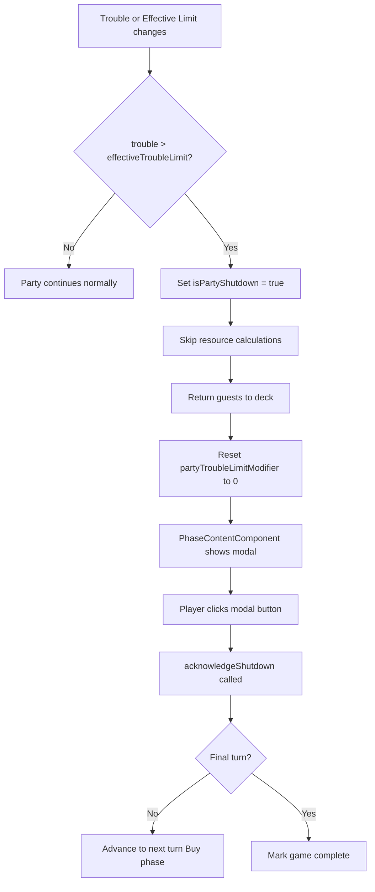

# Design Document: Trouble Limit & Party Shutdown

## Overview

This feature introduces a trouble limit system that triggers a party shutdown when accumulated trouble exceeds the limit. The trouble limit has two components: a permanent `baseTroubleLimit` (default 2) and a temporary `partyTroubleLimitModifier` (default 0, resets each party). The effective limit is their sum, exposed as a computed signal.

When trouble exceeds the effective limit for any reason (guest invited, effect applied, limit decreased), the party is immediately shut down. Shutdown forfeits popularity and money gains from that party's guests, but guests still return to the deck. A modal dialog informs the player, and the game advances to the next turn or completes.

The trouble display in the status pane changes from showing just the current value to a "{current} / {limit}" format (e.g., "0 / 2").

### Key Design Decisions

1. **Two-Component Trouble Limit**: Splitting the limit into `baseTroubleLimit` (permanent) and `partyTroubleLimitModifier` (temporary, per-party) allows future game effects to modify the limit in both scopes without complex state management. The effective limit is a computed signal derived from both.

2. **Angular `effect()` for Shutdown Detection**: Rather than checking the limit at specific action points (invite, modifier change), an Angular `effect()` watches both `trouble` and `effectiveTroubleLimit` signals. This ensures shutdown is triggered regardless of what caused the threshold to be crossed — guest invitation, a game effect reducing the limit, or any other state change.

3. **Shutdown as Store State + Modal in PhaseContentComponent**: The store tracks `isPartyShutdown` as a boolean flag. When the effect detects trouble > limit, it sets this flag, skips resource calculations, returns guests to deck, and advances game state. The PhaseContentComponent reads this flag to show the shutdown modal. The modal button click calls a store method to clear the flag and finalize the transition.

4. **Modal Blocks Status Pane Controls**: While the shutdown modal is displayed, the status pane's phase button and invite button are disabled. This is achieved by the store exposing `isPartyShutdown` which the StatusPaneComponent reads to conditionally disable buttons.

5. **Modifier Reset on Any Party End**: The `partyTroubleLimitModifier` resets to 0 whenever the party ends — whether normally (player clicks End Party / Game Over) or via shutdown. This happens in the same state transition that returns guests to deck.

## Architecture

### Modified Layers

```
GameState Layer
├── GameState interface: + baseTroubleLimit: number
│                        + partyTroubleLimitModifier: number
└── GameStoreState: + isPartyShutdown: boolean

GameStore Layer
├── State: + baseTroubleLimit (stored, default 2)
│          + partyTroubleLimitModifier (stored, default 0)
│          + isPartyShutdown (stored, default false)
├── Computed: + effectiveTroubleLimit (baseTroubleLimit + partyTroubleLimitModifier)
├── Methods: + modifyBaseTroubleLimit(delta: number)
│            + modifyPartyTroubleLimitModifier(delta: number)
│            + acknowledgeShutdown()
│            advancePhase() updated to reset modifier
│            initializeGame() updated for new state
│            resetGame() updated for new state
└── Effect: watches trouble & effectiveTroubleLimit, triggers shutdown

UI Layer
├── StatusPaneComponent: trouble display → "{current} / {limit}" format
│                        buttons disabled when isPartyShutdown
├── PhaseContentComponent: + shutdown modal overlay
└── GameplayComponent: + shutdown detection effect
```

### Shutdown Flow



### Integration Points

1. **GameState Interface**: Add `baseTroubleLimit` and `partyTroubleLimitModifier`
2. **GameStore State**: Add `isPartyShutdown` flag, new stored state for limits
3. **GameStore Computed**: Add `effectiveTroubleLimit` signal
4. **GameStore Methods**: Add limit modification methods, `acknowledgeShutdown()`, update `advancePhase()` and `initializeGame()`
5. **GameplayComponent**: Add `effect()` that watches trouble vs limit and triggers shutdown
6. **StatusPaneComponent**: Update trouble display format, disable buttons during shutdown
7. **PhaseContentComponent**: Add shutdown modal overlay

## Components and Interfaces

### Modified Interfaces

#### GameState (game-state.interface.ts)

```typescript
export interface GameState {
  currentTurn: number;
  currentPhase: GamePhase;
  totalTurns: number;
  isGameComplete: boolean;
  popularity: number;
  money: number;
  baseTroubleLimit: number;              // NEW: permanent limit (default 2)
  partyTroubleLimitModifier: number;     // NEW: temporary per-party modifier (default 0)
}
```

### Modified Store

#### GameStoreState

```typescript
export interface GameStoreState extends GameState {
  deck: Guest[];
  party: Guest[];
  showEmptyDeckMessage: boolean;
  isPartyShutdown: boolean;              // NEW: true while shutdown modal is displayed
}
```

#### Initial State

```typescript
const initialState: GameStoreState = {
  currentTurn: 1,
  currentPhase: GamePhase.BUY,
  totalTurns: 25,
  isGameComplete: false,
  popularity: 0,
  money: 0,
  baseTroubleLimit: 2,                   // NEW
  partyTroubleLimitModifier: 0,          // NEW
  deck: [],
  party: [],
  showEmptyDeckMessage: false,
  isPartyShutdown: false                 // NEW
};
```

#### New Computed Signal

```typescript
effectiveTroubleLimit: computed(() =>
  Math.max(0, store.baseTroubleLimit() + store.partyTroubleLimitModifier())
)
```

#### New Methods

```typescript
modifyBaseTroubleLimit(delta: number): void {
  const current = store.baseTroubleLimit();
  patchState(store, { baseTroubleLimit: Math.max(0, current + delta) });
}

modifyPartyTroubleLimitModifier(delta: number): void {
  const current = store.partyTroubleLimitModifier();
  patchState(store, { partyTroubleLimitModifier: current + delta });
}

acknowledgeShutdown(): void {
  const currentTurn = store.currentTurn();
  const totalTurns = store.totalTurns();

  if (currentTurn === totalTurns) {
    patchState(store, { isPartyShutdown: false, isGameComplete: true });
  } else {
    patchState(store, {
      isPartyShutdown: false,
      currentTurn: currentTurn + 1,
      currentPhase: GamePhase.BUY
    });
  }
}
```

#### Updated advancePhase() — Party Phase Branch

When the party ends normally (not shutdown), the modifier resets:

```typescript
// In the PARTY phase branch of advancePhase():
// Calculate and apply popularity change
const popularityChange = calculatePopularityChange();
const currentPopularity = store.popularity();
const newPopularity = Math.max(0, currentPopularity + popularityChange);

// Calculate and apply money change
const moneyChange = calculateMoneyChange();
const currentMoney = store.money();
const newMoney = Math.max(0, currentMoney + moneyChange);

// Update resources
patchState(store, { popularity: newPopularity, money: newMoney });

// Return guests to deck
returnGuestsToDeck();

// Reset party trouble limit modifier
patchState(store, { partyTroubleLimitModifier: 0 });

// Advance turn or complete game
if (currentTurn === totalTurns) {
  patchState(store, { isGameComplete: true });
} else {
  patchState(store, {
    currentTurn: currentTurn + 1,
    currentPhase: GamePhase.BUY
  });
}
```

#### Updated initializeGame()

```typescript
patchState(store, {
  currentTurn: 1,
  currentPhase: GamePhase.BUY,
  totalTurns: turnCount,
  isGameComplete: false,
  popularity: 0,
  money: 0,
  baseTroubleLimit: 2,                   // NEW
  partyTroubleLimitModifier: 0,          // NEW
  deck,
  party: [],
  showEmptyDeckMessage: false,
  isPartyShutdown: false                 // NEW
});
```

### Shutdown Detection Effect (in GameplayComponent)

```typescript
// In GameplayComponent constructor, alongside existing game completion effect:
effect(() => {
  const trouble = this.gameStore.trouble();
  const limit = this.gameStore.effectiveTroubleLimit();
  const phase = this.gameStore.currentPhase();
  const isShutdown = this.gameStore.isPartyShutdown();

  if (phase === GamePhase.PARTY && !isShutdown && trouble > limit) {
    this.gameStore.triggerPartyShutdown();
  }
});
```

#### triggerPartyShutdown() Store Method

```typescript
triggerPartyShutdown(): void {
  // Return guests to deck WITHOUT calculating resources
  returnGuestsToDeck();

  // Reset party trouble limit modifier
  patchState(store, {
    partyTroubleLimitModifier: 0,
    isPartyShutdown: true
  });
}
```

### Modified Components

#### StatusPaneComponent — Updated Trouble Display

The trouble display changes to show "{current} / {limit}" format:

```html
@if (gameStore.currentPhase() === GamePhase.PARTY) {
  <div class="status-info">
    <h3>Trouble</h3>
    <p class="trouble-count">{{ gameStore.trouble() }} / {{ gameStore.effectiveTroubleLimit() }}</p>
  </div>
  <button 
    class="invite-button"
    (click)="onInviteGuest()"
    [disabled]="gameStore.isPartyShutdown()"
    aria-label="Invite Guest">
    Invite Guest
  </button>
}
<button 
  class="phase-button"
  (click)="gameStore.advancePhase()"
  [disabled]="gameStore.isPartyShutdown()"
  [attr.aria-label]="gameStore.phaseButtonLabel()">
  {{ gameStore.phaseButtonLabel() }}
</button>
```

#### PhaseContentComponent — Shutdown Modal

Add a modal overlay that appears when `isPartyShutdown` is true:

```html
@if (gameStore.isPartyShutdown()) {
  <div class="shutdown-modal-overlay" role="dialog" aria-modal="true" aria-labelledby="shutdown-title">
    <div class="shutdown-modal">
      <p id="shutdown-title">The party has gotten out of control and has been shut down!</p>
      <button 
        class="shutdown-button"
        (click)="gameStore.acknowledgeShutdown()"
        [attr.aria-label]="gameStore.isFinalTurn() ? 'Game Over' : 'End Party'">
        {{ gameStore.isFinalTurn() ? 'Game Over' : 'End Party' }}
      </button>
    </div>
  </div>
}
```

Modal CSS:

```css
.shutdown-modal-overlay {
  position: fixed;
  top: 0;
  left: 0;
  width: 100%;
  height: 100%;
  background-color: rgba(0, 0, 0, 0.5);
  display: flex;
  align-items: center;
  justify-content: center;
  z-index: 1000;
}

.shutdown-modal {
  background: white;
  padding: 2rem;
  border-radius: 8px;
  max-width: 400px;
  text-align: center;
  box-shadow: 0 4px 20px rgba(0, 0, 0, 0.3);
}

.shutdown-modal p {
  font-size: 1.2rem;
  margin-bottom: 1.5rem;
  color: #333;
}

.shutdown-button {
  padding: 0.75rem 2rem;
  font-size: 1rem;
  font-weight: 600;
  color: white;
  background-color: #dc3545;
  border: none;
  border-radius: 4px;
  cursor: pointer;
}

.shutdown-button:hover {
  background-color: #c82333;
}

.shutdown-button:focus {
  outline: 2px solid #c82333;
  outline-offset: 2px;
}
```

## Data Models

### Trouble Limit Components

| Component | Type | Default | Scope | Reset Behavior |
|-----------|------|---------|-------|----------------|
| baseTroubleLimit | stored integer | 2 | Permanent (persists across parties) | Reset on game init/reset |
| partyTroubleLimitModifier | stored integer | 0 | Per-party (temporary) | Reset to 0 when any party ends |
| effectiveTroubleLimit | computed integer | 2 | Derived (base + modifier) | N/A — always derived |

### Effective Trouble Limit Computation

```
effectiveTroubleLimit = max(0, baseTroubleLimit + partyTroubleLimitModifier)
```

Both `baseTroubleLimit` and `effectiveTroubleLimit` are clamped to a minimum of 0. The `partyTroubleLimitModifier` has no minimum — it can be negative.

Examples:
- Default: max(0, 2 + 0) = 2
- After +1 party modifier: max(0, 2 + 1) = 3
- After -1 base limit change: max(0, 1 + 0) = 1
- After -3 party modifier: max(0, 2 + (-3)) = 0
- Base cannot go below 0: modifyBaseTroubleLimit(-5) on base=2 → base=0

### Shutdown Condition

```
partyShutdown = (currentPhase === PARTY) && (trouble > effectiveTroubleLimit)
```

The shutdown check uses strict greater-than (`>`), not greater-than-or-equal. A party with trouble equal to the limit is still allowed.

### State Shape Update

```typescript
interface GameStoreState extends GameState {
  deck: Guest[];
  party: Guest[];
  showEmptyDeckMessage: boolean;
  isPartyShutdown: boolean;    // NEW: true while shutdown modal is displayed
  // baseTroubleLimit and partyTroubleLimitModifier inherited from GameState
}
```

### Normal Party End vs Shutdown

| Aspect | Normal End | Shutdown |
|--------|-----------|----------|
| Popularity gained | Yes (sum of popularityValue) | No (forfeited) |
| Money gained | Yes (sum of moneyValue) | No (forfeited) |
| Guests return to deck | Yes | Yes |
| partyTroubleLimitModifier reset | Yes (to 0) | Yes (to 0) |
| Modal shown | No | Yes |
| Triggered by | Player clicks End Party / Game Over | effect() detects trouble > limit |

## Correctness Properties

*A property is a characteristic or behavior that should hold true across all valid executions of a system — essentially, a formal statement about what the system should do. Properties serve as the bridge between human-readable specifications and machine-verifiable correctness guarantees.*

### Property 1: Effective Trouble Limit Equals Clamped Base Plus Modifier

*For any* values of `baseTroubleLimit` and `partyTroubleLimitModifier` in the store, the `effectiveTroubleLimit` computed signal SHALL equal `max(0, baseTroubleLimit + partyTroubleLimitModifier)`.

This is the core derivation property. The effective limit is always non-negative. This subsumes requirements 8.3 and 8.4 — if the formula always holds, any change to either component is immediately reflected.

**Validates: Requirements 1.3, 8.3, 8.4**

### Property 2: Party Trouble Limit Modifier Resets on Any Party End

*For any* value of `partyTroubleLimitModifier` and any party ending (normal via `advancePhase()` or via `triggerPartyShutdown()`), the `partyTroubleLimitModifier` SHALL be 0 after the party ends.

This combines both normal and shutdown party endings into a single property. The modifier is temporary and must not carry over to the next party regardless of how the current party ended.

**Validates: Requirements 2.1, 2.2**

### Property 3: Shutdown If and Only If Trouble Exceeds Limit During Party

*For any* game state during the Party phase, a party shutdown SHALL be triggered if and only if `trouble > effectiveTroubleLimit`. When `trouble <= effectiveTroubleLimit`, the party SHALL continue normally without shutdown.

This is the central shutdown detection property. It combines the trigger condition (3.1), the reactivity requirement (3.2), and the safe condition (3.3) into a single bidirectional property.

**Validates: Requirements 3.1, 3.2, 3.3**

### Property 4: Shutdown Forfeits Popularity and Money

*For any* party composition and any current popularity and money values, when a party shutdown occurs, both `popularity` and `money` SHALL remain unchanged from their values before the shutdown.

This ensures the penalty is applied — no resources are gained from a shut-down party. The guests' `popularityValue` and `moneyValue` contributions are completely forfeited.

**Validates: Requirements 4.1, 4.2**

### Property 5: Shutdown Preserves Guest Conservation and Empties Party

*For any* party shutdown, all guests from the party SHALL be returned to the deck, the party SHALL be empty, and the total guest count (deck + party) SHALL remain unchanged.

This ensures shutdown doesn't destroy or duplicate guests — it only moves them back to the deck, same as a normal party end.

**Validates: Requirements 4.3**

### Property 6: Shutdown Acknowledgment Advances Game State

*For any* game state where `isPartyShutdown` is true, calling `acknowledgeShutdown()` SHALL advance to the Buy phase of the next turn if the current turn is not the final turn, or mark the game as complete if it is the final turn.

This property covers the full lifecycle of shutdown resolution — the modal button click triggers the correct state transition based on turn number.

**Validates: Requirements 5.1, 5.2, 6.5**

### Property 7: Shutdown Modal Displayed When isPartyShutdown Is True

*For any* game state where `isPartyShutdown` is true, the PhaseContentComponent SHALL render the shutdown modal overlay in the DOM.

**Validates: Requirements 6.1**

### Property 8: Shutdown Modal Button Label Matches Turn State

*For any* game state where the shutdown modal is displayed, the modal button SHALL be labeled "Game Over" if the current turn is the final turn, and "End Party" otherwise.

**Validates: Requirements 6.3, 6.4**

### Property 9: Status Pane Buttons Disabled During Shutdown

*For any* game state where `isPartyShutdown` is true, the phase button and invite button in the StatusPaneComponent SHALL be disabled.

**Validates: Requirements 6.6**

### Property 10: Trouble Display Format During Party Phase

*For any* game state during the Party phase with trouble value T and effective trouble limit L, the StatusPaneComponent SHALL display the trouble as "{T} / {L}".

This ensures the player always sees both the current trouble and the limit, formatted consistently.

**Validates: Requirements 7.1, 7.3**

### Property 11: Limit Modification Methods Apply Delta With Clamping

*For any* current `baseTroubleLimit` value and any integer delta, calling `modifyBaseTroubleLimit(delta)` SHALL result in `baseTroubleLimit` equal to `max(0, previousValue + delta)`. For `modifyPartyTroubleLimitModifier(delta)`, the result SHALL equal `previousValue + delta` (no clamping).

**Validates: Requirements 8.1, 8.2**

## Error Handling

### Shutdown During Empty Party

If the effective trouble limit is reduced below 0 while the party is empty (trouble = 0), no shutdown occurs because 0 is not greater than any non-negative limit. If the limit goes negative (e.g., base=2, modifier=-3, effective=-1), then trouble (0) > effective limit (-1) would trigger shutdown. The effect handles this correctly — it simply checks `trouble > effectiveTroubleLimit` regardless of the values.

### Multiple Rapid State Changes

The Angular `effect()` runs after each signal change. If multiple state changes happen in quick succession (e.g., inviting a guest that pushes trouble over the limit), the effect will fire after the state settles. Since `triggerPartyShutdown()` checks `isPartyShutdown` is false before acting, duplicate triggers are prevented.

### Shutdown on Game Already Complete

If `isGameComplete` is true, `advancePhase()` already returns early. The shutdown effect only fires during `PARTY` phase, so it won't trigger on a completed game. The `acknowledgeShutdown()` method independently checks `isFinalTurn` to determine whether to complete the game or advance.

### Negative Trouble Limit

The `baseTroubleLimit` is clamped to a minimum of 0 via `Math.max(0, ...)` in the modification method. The `effectiveTroubleLimit` is also clamped to 0 via `Math.max(0, ...)` in the computed signal. The `partyTroubleLimitModifier` has no minimum — a sufficiently negative modifier will bring the effective limit to 0, meaning any trouble > 0 triggers shutdown.

### Acknowledge Without Shutdown

If `acknowledgeShutdown()` is called when `isPartyShutdown` is false, it still advances the game state. This is a defensive edge case — the UI should prevent this by only showing the modal button when `isPartyShutdown` is true.

## Testing Strategy

### Dual Testing Approach

- **Unit tests**: Verify specific examples (default limit values, specific shutdown scenarios, modal text content, "0 / 2" initial display), edge cases (shutdown on final turn, empty party with negative limit), and DOM structure (modal elements, button disabled states)
- **Property tests**: Verify universal properties across all valid inputs (effective limit computation, shutdown trigger condition, resource forfeiture, modifier reset, display format, delta modification)

Both are complementary — unit tests catch concrete regressions while property tests verify general correctness across the input space.

### Property-Based Testing Configuration

**Library**: fast-check (already installed in the project)

**Configuration**:
- Minimum 100 iterations per property test
- Each test tagged with comment referencing design property
- Tag format: `// Feature: trouble-limit-party-shutdown, Property {number}: {property_text}`
- Each correctness property implemented by a SINGLE property-based test

### Property Test Plan

1. **Property 1 test**: Generate random pairs of (baseTroubleLimit, partyTroubleLimitModifier), set them in the store, verify `effectiveTroubleLimit()` equals their sum.
   - Tag: `// Feature: trouble-limit-party-shutdown, Property 1: Effective Trouble Limit Equals Base Plus Modifier`

2. **Property 2 test**: Generate random modifier values, set them, then end the party (both normally via advancePhase and via triggerPartyShutdown), verify modifier is 0 after each.
   - Tag: `// Feature: trouble-limit-party-shutdown, Property 2: Party Trouble Limit Modifier Resets on Any Party End`

3. **Property 3 test**: Generate random party compositions and limit values. For each, set up the state and verify: if trouble > effectiveTroubleLimit, shutdown is triggered; if trouble <= effectiveTroubleLimit, no shutdown.
   - Tag: `// Feature: trouble-limit-party-shutdown, Property 3: Shutdown If and Only If Trouble Exceeds Limit During Party`

4. **Property 4 test**: Generate random party compositions with random initial popularity and money. Trigger shutdown, verify popularity and money are unchanged.
   - Tag: `// Feature: trouble-limit-party-shutdown, Property 4: Shutdown Forfeits Popularity and Money`

5. **Property 5 test**: Generate random party states, trigger shutdown, verify party is empty and deck.length + party.length equals the total guest count.
   - Tag: `// Feature: trouble-limit-party-shutdown, Property 5: Shutdown Preserves Guest Conservation and Empties Party`

6. **Property 6 test**: Generate random turn numbers and total turns, set isPartyShutdown to true, call acknowledgeShutdown, verify correct state transition (next turn Buy phase or game complete).
   - Tag: `// Feature: trouble-limit-party-shutdown, Property 6: Shutdown Acknowledgment Advances Game State`

7. **Property 7 test**: Generate random game states with isPartyShutdown true, render PhaseContentComponent, verify shutdown modal is present in DOM.
   - Tag: `// Feature: trouble-limit-party-shutdown, Property 7: Shutdown Modal Displayed When isPartyShutdown Is True`

8. **Property 8 test**: Generate random turn/totalTurns combinations with shutdown active, render PhaseContentComponent, verify button label is "Game Over" iff final turn, "End Party" otherwise.
   - Tag: `// Feature: trouble-limit-party-shutdown, Property 8: Shutdown Modal Button Label Matches Turn State`

9. **Property 9 test**: Generate random game states with isPartyShutdown true during Party phase, render StatusPaneComponent, verify phase button and invite button are disabled.
   - Tag: `// Feature: trouble-limit-party-shutdown, Property 9: Status Pane Buttons Disabled During Shutdown`

10. **Property 10 test**: Generate random trouble values and effective limits, set store state to Party phase, render StatusPaneComponent, verify displayed text matches "{trouble} / {limit}" format.
    - Tag: `// Feature: trouble-limit-party-shutdown, Property 10: Trouble Display Format During Party Phase`

11. **Property 11 test**: Generate random current values and deltas for both baseTroubleLimit and partyTroubleLimitModifier, call the modify methods, verify the result equals old + delta.
    - Tag: `// Feature: trouble-limit-party-shutdown, Property 11: Limit Modification Methods Apply Delta`

### Unit Test Plan

**Store tests** (`game.store.spec.ts`):
- After initializeGame(), baseTroubleLimit is 2 and partyTroubleLimitModifier is 0
- After resetGame(), baseTroubleLimit is 2 and partyTroubleLimitModifier is 0
- effectiveTroubleLimit is 2 with default values
- triggerPartyShutdown() sets isPartyShutdown to true
- triggerPartyShutdown() does not change popularity or money
- triggerPartyShutdown() returns guests to deck and empties party
- acknowledgeShutdown() on non-final turn advances to next turn Buy phase
- acknowledgeShutdown() on final turn marks game complete
- advancePhase() from Party resets partyTroubleLimitModifier to 0
- Shutdown on final turn (edge case)

**Component tests** (`phase-content.component.spec.ts`):
- Shutdown modal is rendered when isPartyShutdown is true
- Shutdown modal contains the exact message text
- Shutdown modal button says "End Party" on non-final turn
- Shutdown modal button says "Game Over" on final turn
- Shutdown modal is not rendered when isPartyShutdown is false

**Component tests** (`status-pane.component.spec.ts`):
- Trouble displays as "0 / 2" at party start with defaults
- Phase button is disabled when isPartyShutdown is true
- Invite button is disabled when isPartyShutdown is true
- Buttons are enabled when isPartyShutdown is false

### Test File Organization

```
src/app/
  stores/
    game.store.spec.ts                     # Unit tests (updated for trouble limit + shutdown)
    game.store.property.spec.ts            # Properties 1, 2, 3, 4, 5, 6, 11
  components/
    phase-content.component.spec.ts        # Unit tests (updated for shutdown modal)
    phase-content.component.property.spec.ts # Properties 7, 8
    status-pane.component.spec.ts          # Unit tests (updated for trouble format + disabled buttons)
    status-pane.component.property.spec.ts # Properties 9, 10
```
