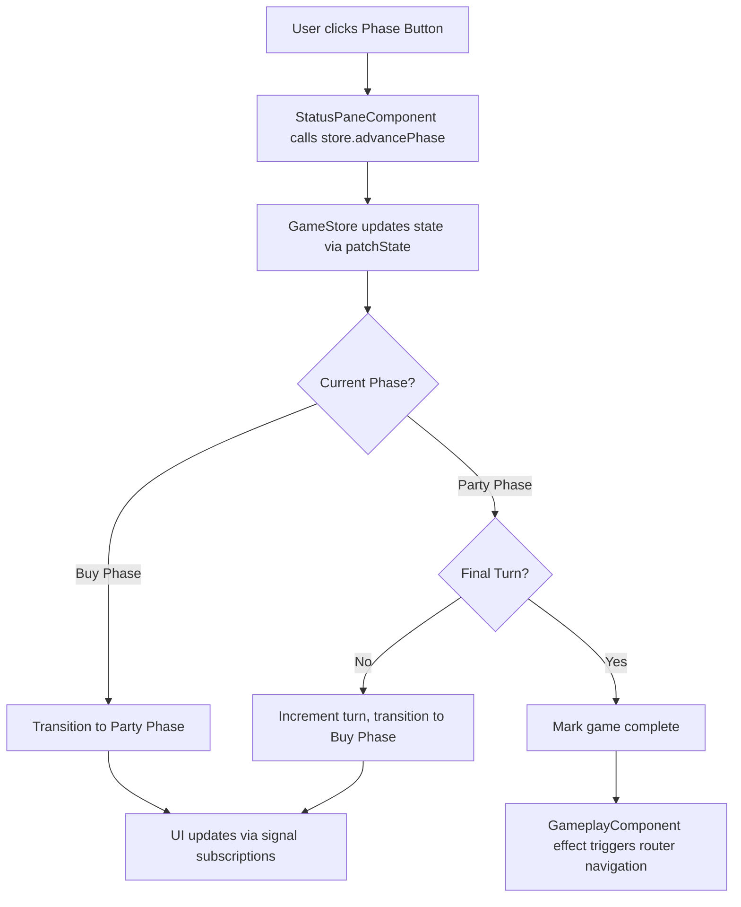

# Design Document: Turn-Based Gameplay Phases

## Overview

This design implements a turn-based gameplay system for an Angular PWA game. The system manages game state through a configurable number of turns (default 25), with each turn consisting of two sequential phases: Buy phase (Shop) and Party phase. The implementation follows Angular's reactive patterns using signals for state management, ensuring efficient change detection and a responsive user interface.

The design emphasizes separation of concerns with a dedicated game state service managing business logic and a component layer handling UI presentation. The architecture supports future extensibility, particularly the ability to skip the Buy phase under specific conditions.

### Key Design Decisions

1. **NgRx SignalStore for State Management**: Using NgRx SignalStore provides a structured, scalable approach to state management with built-in support for computed values, methods, and future extensibility. SignalStore offers fine-grained reactivity through Angular signals while providing a clear pattern for organizing state logic that can grow with application complexity.

2. **Store-Based Game Logic**: Centralizing game state and phase transition logic in a SignalStore separates concerns, provides a single source of truth, and makes the system testable independent of UI components. The store pattern facilitates future additions like middleware, effects, or complex state derivations.

3. **Component Composition**: Breaking the gameplay UI into logical sub-components (status pane, phase content) improves maintainability and reusability.

4. **Enum-Based Phase Representation**: Using TypeScript enums for phases provides type safety and makes the code self-documenting.

## Architecture

### Component Structure

```
GameplayComponent (Container)
├── StatusPaneComponent (Right sidebar)
│   ├── Turn counter display
│   └── Phase button
└── PhaseContentComponent (Main area)
    ├── BuyPhaseView (Shop heading)
    └── PartyPhaseView (Party heading)
```

### Store Layer

```
GameStore (NgRx SignalStore)
├── State (signals via withState)
│   ├── currentTurn: Signal<number>
│   ├── currentPhase: Signal<GamePhase>
│   ├── totalTurns: Signal<number>
│   └── isGameComplete: Signal<boolean>
├── Computed Values (via withComputed)
│   ├── remainingTurns: Signal<number>
│   ├── isFinalTurn: Signal<boolean>
│   └── phaseButtonLabel: Signal<string>
└── Methods (via withMethods)
    ├── initializeGame(turnCount?: number)
    ├── advancePhase()
    └── resetGame()
```

### Data Flow



## Components and Interfaces

### GamePhase Enum

```typescript
export enum GamePhase {
  BUY = 'BUY',
  PARTY = 'PARTY'
}
```

### GameState Interface

```typescript
export interface GameState {
  currentTurn: number;      // 1-indexed current turn
  currentPhase: GamePhase;  // Current phase in the turn
  totalTurns: number;       // Total turns configured for game
  isGameComplete: boolean;  // Whether game has ended
}
```

### GameStore (NgRx SignalStore)

The store manages all game state using NgRx SignalStore patterns and provides reactive signals for components to consume:

```typescript
import { signalStore, withState, withComputed, withMethods } from '@ngrx/signals';
import { computed } from '@angular/core';

interface GameStoreState {
  currentTurn: number;      // 1-indexed current turn
  currentPhase: GamePhase;  // Current phase in the turn
  totalTurns: number;       // Total turns configured for game
  isGameComplete: boolean;  // Whether game has ended
}

const initialState: GameStoreState = {
  currentTurn: 1,
  currentPhase: GamePhase.BUY,
  totalTurns: 25,
  isGameComplete: false
};

export const GameStore = signalStore(
  { providedIn: 'root' },
  
  // State definition
  withState(initialState),
  
  // Computed signals
  withComputed((store) => ({
    remainingTurns: computed(() => 
      store.totalTurns() - store.currentTurn() + 1
    ),
    
    isFinalTurn: computed(() => 
      store.currentTurn() === store.totalTurns()
    ),
    
    phaseButtonLabel: computed(() => {
      if (store.currentPhase() === GamePhase.BUY) {
        return 'Start Party';
      }
      return store.isFinalTurn() ? 'Game Over' : 'End Party';
    })
  })),
  
  // Methods for state updates
  withMethods((store) => ({
    initializeGame(turnCount: number = 25): void {
      if (turnCount <= 0) {
        throw new Error('Turn count must be greater than zero');
      }
      patchState(store, {
        currentTurn: 1,
        currentPhase: GamePhase.BUY,
        totalTurns: turnCount,
        isGameComplete: false
      });
    },
    
    advancePhase(): void {
      if (store.isGameComplete()) {
        console.warn('Cannot advance phase: game is already complete');
        return;
      }
      
      const currentPhase = store.currentPhase();
      const currentTurn = store.currentTurn();
      const totalTurns = store.totalTurns();
      
      if (currentPhase === GamePhase.BUY) {
        // Buy → Party (same turn)
        patchState(store, { currentPhase: GamePhase.PARTY });
      } else if (currentPhase === GamePhase.PARTY) {
        if (currentTurn === totalTurns) {
          // Final turn completed
          patchState(store, { isGameComplete: true });
        } else {
          // Advance to next turn
          patchState(store, {
            currentTurn: currentTurn + 1,
            currentPhase: GamePhase.BUY
          });
        }
      }
    },
    
    resetGame(): void {
      patchState(store, initialState);
    }
  }))
);
```

### GameplayComponent

The container component orchestrates the gameplay UI using the GameStore:

**Location**: `src/app/components/gameplay.component.ts`

```typescript
@Component({
  selector: 'app-gameplay',
  imports: [StatusPaneComponent, PhaseContentComponent],
  templateUrl: './gameplay.component.html',
  styleUrl: './gameplay.component.scss'
})
export class GameplayComponent implements OnInit {
  protected readonly gameStore = inject(GameStore);
  private readonly router = inject(Router);
  
  ngOnInit(): void {
    this.gameStore.initializeGame();
    
    // Watch for game completion
    effect(() => {
      if (this.gameStore.isGameComplete()) {
        this.router.navigate(['/']);
      }
    });
  }
}
```

**Template** (`gameplay.component.html`):
```html
<main class="gameplay-layout">
  <app-phase-content 
    [phase]="gameStore.currentPhase()" 
    class="main-content" />
  <app-status-pane class="status-pane" />
</main>
```
```

### StatusPaneComponent

Displays game status and phase advancement button by directly injecting the GameStore:

**Location**: `src/app/components/status-pane.component.ts`

```typescript
@Component({
  selector: 'app-status-pane',
  templateUrl: './status-pane.component.html',
  styleUrl: './status-pane.component.scss'
})
export class StatusPaneComponent {
  protected readonly gameStore = inject(GameStore);
}
```

**Template** (`status-pane.component.html`):
```html
<aside class="status-pane">
  <div class="status-info">
    <h3>Turns Remaining</h3>
    <p class="turn-count">{{ gameStore.remainingTurns() }}</p>
  </div>
  <button 
    class="phase-button"
    (click)="gameStore.advancePhase()"
    [attr.aria-label]="gameStore.phaseButtonLabel()">
    {{ gameStore.phaseButtonLabel() }}
  </button>
</aside>
```
```

### PhaseContentComponent

Displays phase-specific content:

**Location**: `src/app/components/phase-content.component.ts`

```typescript
@Component({
  selector: 'app-phase-content',
  templateUrl: './phase-content.component.html',
  styleUrl: './phase-content.component.scss'
})
export class PhaseContentComponent {
  @Input({ required: true }) phase!: GamePhase;
  readonly GamePhase = GamePhase;
}
```

**Template** (`phase-content.component.html`):
```html
<div class="phase-content">
  @if (phase === GamePhase.BUY) {
    <h2>Shop</h2>
  } @else {
    <h2>Party</h2>
  }
</div>
```
```

## Data Models

### State Transitions

The game state follows a strict finite state machine:

```
Initial State: Turn 1, Buy Phase
├── Buy Phase → Party Phase (same turn)
├── Party Phase (not final) → Buy Phase (next turn)
└── Party Phase (final) → Game Complete
```

### Turn Progression Logic

```typescript
// Pseudo-code for phase advancement
function advancePhase(state: GameState): GameState {
  if (state.currentPhase === BUY) {
    return { ...state, currentPhase: PARTY };
  }
  
  if (state.currentPhase === PARTY) {
    if (state.currentTurn === state.totalTurns) {
      return { ...state, isGameComplete: true };
    }
    return {
      ...state,
      currentTurn: state.currentTurn + 1,
      currentPhase: BUY
    };
  }
}
```

### Future Extensibility: Skip Buy Phase

The design supports future implementation of skipping the Buy phase on a per-turn basis. This would be determined by game state conditions (e.g., player has no resources to spend):

```typescript
// Future enhancement - player resources interface
interface PlayerResources {
  gold: number;
  // ... other resource types
}

// Future enhancement - add to GameStore state
interface GameStoreState {
  currentTurn: number;
  currentPhase: GamePhase;
  totalTurns: number;
  isGameComplete: boolean;
  playerResources?: PlayerResources;  // Future: track player resources
}

// Future enhancement - modify advancePhase logic
advancePhase(): void {
  // ... existing validation ...
  
  if (currentPhase === GamePhase.PARTY) {
    if (currentTurn === totalTurns) {
      patchState(store, { isGameComplete: true });
    } else {
      // Check if buy phase should be skipped for next turn
      const shouldSkipBuy = this.shouldSkipBuyPhase();
      
      if (shouldSkipBuy) {
        // Skip buy phase, go directly to party phase of next turn
        patchState(store, {
          currentTurn: currentTurn + 1,
          currentPhase: GamePhase.PARTY
        });
      } else {
        // Normal flow: advance to buy phase of next turn
        patchState(store, {
          currentTurn: currentTurn + 1,
          currentPhase: GamePhase.BUY
        });
      }
    }
  }
}

// Method to determine if buy phase should be skipped
// Currently always returns false; will be enhanced in future features
private shouldSkipBuyPhase(): boolean {
  return false;
}
```

## Correctness Properties

*A property is a characteristic or behavior that should hold true across all valid executions of a system—essentially, a formal statement about what the system should do. Properties serve as the bridge between human-readable specifications and machine-verifiable correctness guarantees.*

### Property Reflection

After analyzing all acceptance criteria, I identified several redundancies:
- Properties 2.3 and 4.3 both test Buy→Party transition (consolidated into Property 3)
- Properties 2.4 and 5.3 both test Party→Buy transition on non-final turns (consolidated into Property 4)
- Properties 2.5 and 6.2 both test game completion on final turn (consolidated into Property 5)

The following properties represent the unique, non-redundant correctness guarantees for this system.

### Property 1: Configurable Turn Count Initialization

*For any* positive integer turn count, initializing the game with that value should result in the game state having that exact turn count configured.

**Validates: Requirements 1.1, 1.3**

### Property 2: Turn Start Phase Invariant

*For any* turn number in a game, when that turn begins, the current phase should always be Buy_Phase.

**Validates: Requirements 2.2**

### Property 3: Buy Phase Advancement Transition

*For any* game state where the current phase is Buy_Phase, advancing the phase should transition to Party_Phase while maintaining the same turn number.

**Validates: Requirements 2.3, 4.3**

### Property 4: Party Phase Advancement on Non-Final Turn

*For any* game state where the current phase is Party_Phase and the current turn is not the final turn, advancing the phase should increment the turn number by 1 and transition to Buy_Phase.

**Validates: Requirements 2.4, 5.3**

### Property 5: Game Completion on Final Turn

*For any* game state where the current phase is Party_Phase and the current turn equals the total turn count, advancing the phase should mark the game as complete.

**Validates: Requirements 2.5, 6.2**

### Property 6: Status Pane Visibility Invariant

*For any* game state in either Buy_Phase or Party_Phase, the status pane component should be present in the rendered DOM.

**Validates: Requirements 3.2**

### Property 7: Remaining Turns Display Accuracy

*For any* game state, the remaining turns displayed in the status pane should equal (totalTurns - currentTurn + 1).

**Validates: Requirements 3.3**

### Property 8: Remaining Turns Update on Turn Completion

*For any* game state where a turn completes (Party phase advances), the displayed remaining turn count should decrease by exactly 1.

**Validates: Requirements 3.4**

### Property 9: Buy Phase Heading Display

*For any* game state where the current phase is Buy_Phase, the rendered page heading should contain the text "Shop".

**Validates: Requirements 4.1**

### Property 10: Buy Phase Button Label

*For any* game state where the current phase is Buy_Phase, the phase button label should be "Start Party".

**Validates: Requirements 4.2**

### Property 11: Party Phase Heading Display

*For any* game state where the current phase is Party_Phase, the rendered page heading should contain the text "Party".

**Validates: Requirements 5.1**

### Property 12: Party Phase Button Label on Non-Final Turn

*For any* game state where the current phase is Party_Phase and the current turn is not the final turn, the phase button label should be "End Party".

**Validates: Requirements 5.2**

### Property 13: Final Turn Button Label

*For any* game state where the current phase is Party_Phase and the current turn is the final turn, the phase button label should be "Game Over".

**Validates: Requirements 6.1**

### Property 14: Navigation on Game Completion

*For any* game state that transitions to isGameComplete = true, the application should navigate to the landing page route ('/').

**Validates: Requirements 6.3**

### Property 15: Initialization Round Trip

*For any* game state, resetting and reinitializing the game should return to the initial state (turn 1, Buy phase, not complete).

**Validates: Requirements 1.1, 2.2** (Metamorphic property for state management correctness)

## Error Handling

### Invalid Turn Count

**Error Condition**: Turn count ≤ 0 provided to initialization

**Handling Strategy**: 
- Validate input in `initializeGame()` method
- Throw `Error` with descriptive message: "Turn count must be greater than zero"
- Prevent game state from being modified with invalid values

**Rationale**: Failing fast with clear error messages helps developers catch configuration errors during development.

### Phase Advancement on Completed Game

**Error Condition**: `advancePhase()` called when `isGameComplete === true`

**Handling Strategy**:
- Check game completion state at start of `advancePhase()`
- Return early without state modification if game is complete
- Log warning to console: "Cannot advance phase: game is already complete"

**Rationale**: Defensive programming prevents unexpected state mutations. Logging helps with debugging.

### Navigation Failure

**Error Condition**: Router navigation to landing page fails

**Handling Strategy**:
- Wrap navigation in try-catch block
- Log error to console with context
- Game state remains marked as complete (don't rollback)
- User can manually navigate using browser controls

**Rationale**: Navigation failures are rare but shouldn't corrupt game state. Logging provides debugging information.

### Component Lifecycle Issues

**Error Condition**: Component destroyed before game completion effect runs

**Handling Strategy**:
- Use Angular's `effect()` with automatic cleanup
- Effect will be destroyed with component, preventing memory leaks
- No explicit error handling needed (framework handles cleanup)

**Rationale**: Angular's signal effects automatically clean up, preventing common lifecycle bugs.

## Testing Strategy

### Dual Testing Approach

This feature requires both unit tests and property-based tests for comprehensive coverage:

**Unit Tests** focus on:
- Specific examples (e.g., default 25 turn initialization)
- Component integration (e.g., button click triggers service method)
- Edge cases (e.g., single-turn game, error conditions)
- Angular-specific behavior (e.g., signal updates trigger change detection)

**Property-Based Tests** focus on:
- Universal properties across all valid inputs (e.g., phase transitions work for any turn count)
- State machine correctness (e.g., all possible state transitions maintain invariants)
- Computed value accuracy (e.g., remaining turns calculation for any game state)

Together, these approaches ensure both concrete correctness and general correctness across the input space.

### Property-Based Testing Configuration

**Library**: fast-check (JavaScript/TypeScript property-based testing library)

**Installation**: 
```bash
npm install --save-dev fast-check
```

**Dependencies**:
```bash
npm install @ngrx/signals
```

**Configuration**:
- Minimum 100 iterations per property test
- Each test tagged with comment referencing design property
- Tag format: `// Feature: turn-based-gameplay-phases, Property {number}: {property_text}`

**Example Property Test Structure**:
```typescript
import * as fc from 'fast-check';
import { TestBed } from '@angular/core/testing';
import { GameStore } from './game.store';

describe('GameStore Properties', () => {
  let store: InstanceType<typeof GameStore>;
  
  beforeEach(() => {
    TestBed.configureTestingModule({});
    store = TestBed.inject(GameStore);
  });
  
  it('Property 1: Configurable Turn Count Initialization', () => {
    // Feature: turn-based-gameplay-phases, Property 1: Configurable Turn Count Initialization
    fc.assert(
      fc.property(
        fc.integer({ min: 1, max: 1000 }), // Generate random turn counts
        (turnCount) => {
          store.initializeGame(turnCount);
          expect(store.totalTurns()).toBe(turnCount);
          store.resetGame(); // Clean up for next iteration
        }
      ),
      { numRuns: 100 }
    );
  });
});
```

### Unit Testing Strategy

**Store Tests** (`game.store.spec.ts`):
- Test default initialization (25 turns)
- Test phase advancement state machine
- Test computed signal calculations
- Test error conditions (invalid turn counts, advancement on completed game)
- Test game reset functionality
- Test store isolation (each test gets fresh store instance via TestBed)
- Test patchState updates trigger signal changes correctly

**SignalStore Testing Patterns**:
- Use Angular TestBed to inject store instances
- Reset store state between tests using `resetGame()` or fresh injection
- Test computed signals by reading their values after state changes
- Verify method calls update state correctly via signal reads
- Test that patchState calls are atomic and don't cause intermediate states

**Component Tests**:
- `gameplay.component.spec.ts`: Test component initialization, effect-based navigation
- `status-pane.component.spec.ts`: Test store injection, button rendering, direct store method calls
- `phase-content.component.spec.ts`: Test conditional rendering based on phase

**Integration Tests** (`gameplay.integration.spec.ts`):
- Test complete game flow from start to finish
- Test navigation to landing page on completion
- Test UI updates in response to state changes

### Test Coverage Goals

- Line coverage: >90%
- Branch coverage: >85%
- Property tests: All 15 properties implemented
- Unit tests: All edge cases and examples covered

### Testing Tools

- **Jasmine**: Test framework (Angular default)
- **Karma**: Test runner
- **fast-check**: Property-based testing library
- **Angular Testing Utilities**: TestBed, ComponentFixture, etc.
