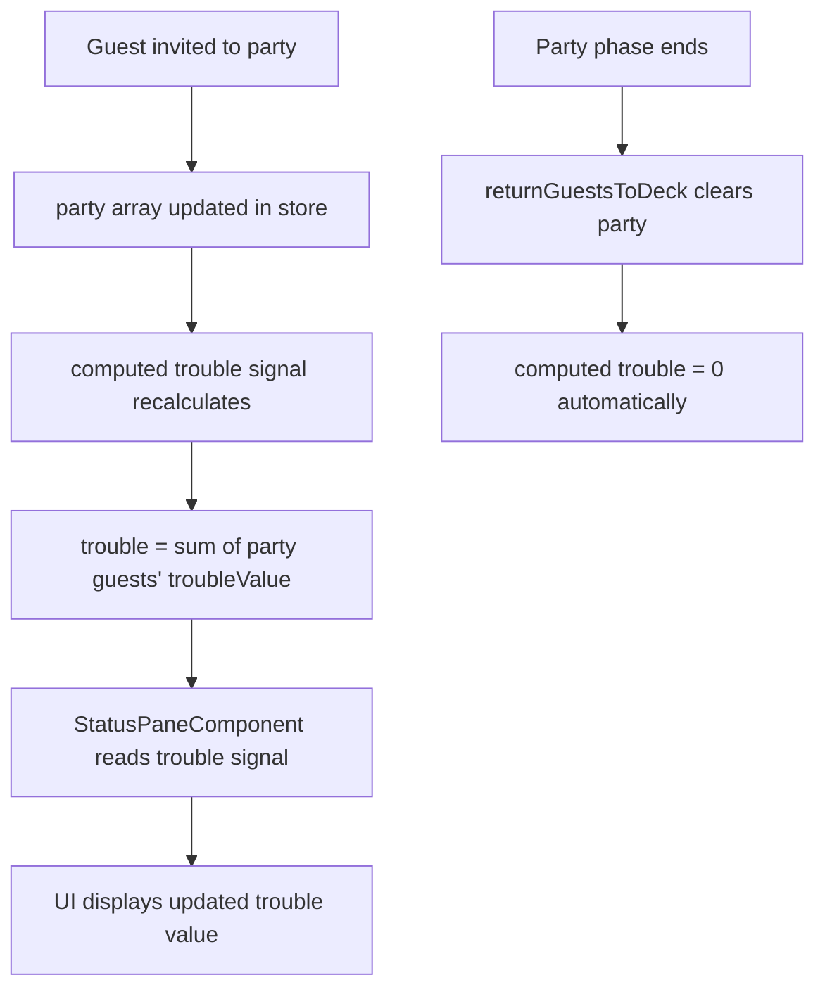

# Design Document: Wild Buddy & Trouble Resource

## Overview

This feature introduces the "Wild Buddy" guest type and the "trouble" resource to the party game. Wild Buddies are high-reward, high-risk guests that grant 2 popularity (vs 1 for Old Friends) but also generate 1 trouble. Trouble is a derived/computed value — the sum of `trouble_value` for all guests currently in the party — not stored state. It resets implicitly when the party empties at the end of the Party phase.

The starting deck expands from 6 to 8 guests: 4 Old Friends (Brian, Colin, Emily, Rachelle) and 4 Wild Buddies (Anthony, Teresa, Jacco, Jodie). The guest card header dynamically displays "Wild Buddy" or "Old Friend" based on guest type. The trouble value is shown in the status pane during the Party phase only, positioned below the turns remaining display.

### Key Design Decisions

1. **Trouble as Computed Signal**: Trouble is derived via `computed()` from the current party composition rather than stored as mutable state. This eliminates synchronization bugs and makes reset implicit — when the party empties, trouble is automatically 0.

2. **Extend GuestType Union**: Add `'WILD_BUDDY'` to the existing `GuestType` union type and extend `GUEST_TYPE_DEFAULTS` with the new type's properties, keeping the existing pattern intact.

3. **Add `troubleValue` to GuestProperties**: Extend the existing `GuestProperties` interface with a `troubleValue` field. All guest types define both `popularityValue` and `troubleValue` in their defaults.

4. **Conditional Trouble Display**: The status pane shows trouble only during the Party phase, using the existing `@if` pattern already used for the invite button.

5. **Deck Composition Change**: The `INITIAL_OLD_FRIENDS` constant is replaced with a typed `INITIAL_GUESTS` array that includes both guest types and their names, making the deck initialization type-aware.

## Architecture

### Modified Layers

```
Guest Model Layer
├── GuestType union: 'OLD_FRIEND' | 'WILD_BUDDY'
├── GuestProperties: { popularityValue, troubleValue }
├── GUEST_TYPE_DEFAULTS: defaults for both types
└── INITIAL_GUESTS: typed array of { type, name } for all 8 starting guests

GameStore Layer
├── State: unchanged (no new stored state for trouble)
├── Computed: + trouble (derived from party composition)
└── Methods: initializeGame() updated for new deck composition

UI Layer
├── StatusPaneComponent: + trouble display (Party phase only)
└── GuestCardComponent: header already handles type via template expression
```

### Data Flow for Trouble



### Integration Points

1. **Guest Model**: Extend `GuestType`, `GuestProperties`, `GUEST_TYPE_DEFAULTS`, replace `INITIAL_OLD_FRIENDS` with `INITIAL_GUESTS`
2. **GameStore**: Add `trouble` computed signal, update `initializeGame()` for new deck
3. **StatusPaneComponent**: Add trouble display below turns remaining, visible only during Party phase
4. **GuestCardComponent**: No changes needed — the existing template expression `guest.type === 'OLD_FRIEND' ? 'Old Friend' : guest.type` needs updating to handle `'WILD_BUDDY'` properly

## Components and Interfaces

### Modified Interfaces

#### GuestType (guest.model.ts)

```typescript
export type GuestType = 'OLD_FRIEND' | 'WILD_BUDDY';
```

#### GuestProperties (guest.model.ts)

```typescript
export interface GuestProperties {
  popularityValue: number;
  troubleValue: number;    // NEW: non-negative integer
}
```

#### GUEST_TYPE_DEFAULTS (guest.model.ts)

```typescript
export const GUEST_TYPE_DEFAULTS: Record<GuestType, GuestProperties> = {
  OLD_FRIEND: {
    popularityValue: 1,
    troubleValue: 0         // Old Friends generate no trouble
  },
  WILD_BUDDY: {
    popularityValue: 2,     // Wild Buddies grant 2 popularity
    troubleValue: 1         // Wild Buddies generate 1 trouble
  }
};
```

#### INITIAL_GUESTS (guest.model.ts)

Replaces `INITIAL_OLD_FRIENDS`. Each entry specifies type and name:

```typescript
export const INITIAL_GUESTS: readonly { type: GuestType; name: string }[] = [
  { type: 'OLD_FRIEND', name: 'Brian' },
  { type: 'OLD_FRIEND', name: 'Colin' },
  { type: 'OLD_FRIEND', name: 'Emily' },
  { type: 'OLD_FRIEND', name: 'Rachelle' },
  { type: 'WILD_BUDDY', name: 'Anthony' },
  { type: 'WILD_BUDDY', name: 'Teresa' },
  { type: 'WILD_BUDDY', name: 'Jacco' },
  { type: 'WILD_BUDDY', name: 'Jodie' }
] as const;
```

### Modified Store

#### GameStore — New Computed Signal

```typescript
withComputed((store) => ({
  // ... existing computed signals ...
  
  trouble: computed(() => {
    const party = store.party();
    return party.reduce((sum, guest) => sum + guest.properties.troubleValue, 0);
  })
}))
```

#### GameStore — Updated initializeGame()

```typescript
initializeGame(turnCount: number = 25): void {
  if (turnCount <= 0) {
    throw new Error('Turn count must be greater than zero');
  }
  
  // Create 8 guests from INITIAL_GUESTS (4 Old Friends + 4 Wild Buddies)
  const deck: Guest[] = INITIAL_GUESTS.map(({ type, name }) => ({
    type,
    name,
    properties: { ...GUEST_TYPE_DEFAULTS[type] }
  }));
  
  shuffleDeck(deck);
  
  patchState(store, {
    currentTurn: 1,
    currentPhase: GamePhase.BUY,
    totalTurns: turnCount,
    isGameComplete: false,
    popularity: 0,
    deck,
    party: [],
    showEmptyDeckMessage: false
  });
}
```

### Modified Components

#### GuestCardComponent — Updated Header Expression

The current template uses:
```html
{{ guest.type === 'OLD_FRIEND' ? 'Old Friend' : guest.type }}
```

This needs to be updated to a helper map or expanded conditional to properly display "Wild Buddy":

```typescript
// Add to component class
protected readonly GUEST_TYPE_LABELS: Record<string, string> = {
  OLD_FRIEND: 'Old Friend',
  WILD_BUDDY: 'Wild Buddy'
};
```

```html
<div class="card-header">{{ GUEST_TYPE_LABELS[guest.type] ?? guest.type }}</div>
```

#### StatusPaneComponent — Trouble Display

Add trouble display below turns remaining, visible only during Party phase:

```html
<aside class="status-pane">
  <div class="status-info">
    <h3>Popularity</h3>
    <p class="popularity-count">{{ gameStore.popularity() }}</p>
  </div>
  <div class="status-info">
    <h3>Turns Remaining</h3>
    <p class="turn-count">{{ gameStore.remainingTurns() }}</p>
  </div>
  @if (gameStore.currentPhase() === GamePhase.PARTY) {
    <div class="status-info">
      <h3>Trouble</h3>
      <p class="trouble-count">{{ gameStore.trouble() }}</p>
    </div>
    <button 
      class="invite-button"
      (click)="onInviteGuest()"
      aria-label="Invite Guest">
      Invite Guest
    </button>
  }
  <button 
    class="phase-button"
    (click)="gameStore.advancePhase()"
    [attr.aria-label]="gameStore.phaseButtonLabel()">
    {{ gameStore.phaseButtonLabel() }}
  </button>
</aside>
```

## Data Models

### Guest Type Properties

| Guest Type   | popularityValue | troubleValue |
|-------------|----------------|--------------|
| OLD_FRIEND  | 1              | 0            |
| WILD_BUDDY  | 2              | 1            |

### Starting Deck (8 guests)

| Name      | Type        |
|-----------|-------------|
| Brian     | OLD_FRIEND  |
| Colin     | OLD_FRIEND  |
| Emily     | OLD_FRIEND  |
| Rachelle  | OLD_FRIEND  |
| Anthony   | WILD_BUDDY  |
| Teresa    | WILD_BUDDY  |
| Jacco     | WILD_BUDDY  |
| Jodie     | WILD_BUDDY  |

### Trouble Computation

Trouble is a pure derived value:

```
trouble = Σ guest.properties.troubleValue for all guests in party
```

- When party is empty: trouble = 0
- After inviting 1 Wild Buddy: trouble = 1
- After inviting 2 Wild Buddies + 1 Old Friend: trouble = 2
- After party ends (guests returned to deck): trouble = 0 (implicit reset)

### State Shape

No new stored state is added. The `GameStoreState` interface remains unchanged. Trouble exists only as a computed signal:

```typescript
// Existing stored state — unchanged
interface GameStoreState extends GameState {
  deck: Guest[];
  party: Guest[];
  showEmptyDeckMessage: boolean;
}

// New computed signal — not stored
trouble: Signal<number>  // derived from party composition
```

### Guest Conservation Update

The total guest count changes from 6 to 8. The conservation invariant becomes:
```
deck.length + party.length === 8
```

## Correctness Properties

*A property is a characteristic or behavior that should hold true across all valid executions of a system — essentially, a formal statement about what the system should do. Properties serve as the bridge between human-readable specifications and machine-verifiable correctness guarantees.*

### Property 1: Guest Type Defaults Include Non-Negative Trouble Value

*For any* guest type in the `GuestType` union, `GUEST_TYPE_DEFAULTS` SHALL define a `troubleValue` that is a non-negative integer (>= 0).

This ensures every guest type has a well-defined trouble contribution, preventing undefined or negative trouble values from entering the system.

**Validates: Requirements 2.1, 2.2**

### Property 2: Trouble Equals Sum of Party Guests' Trouble Values

*For any* game state, the computed `trouble` value SHALL equal the sum of `guest.properties.troubleValue` for all guests currently in the `party` array.

This is the core invariant of the trouble system. Since trouble is a computed signal derived from party composition, this property must hold after any sequence of operations (invite, advancePhase, reset). It also implies that trouble is 0 when the party is empty (sum of empty array = 0), and that trouble recomputes correctly after each invite.

**Validates: Requirements 3.1, 4.1, 4.2, 4.4**

### Property 3: Trouble Displayed During Party Phase

*For any* game state where the current phase is `PARTY`, the StatusPaneComponent SHALL render an element displaying the current trouble value.

This ensures players can always see the trouble resource when making invite decisions during the Party phase.

**Validates: Requirements 6.1, 6.3**

### Property 4: Trouble Hidden During Buy Phase

*For any* game state where the current phase is `BUY`, the StatusPaneComponent SHALL NOT render the trouble display element.

This ensures trouble information is only shown when relevant (during party guest selection).

**Validates: Requirements 6.4**

### Property 5: Guest Card Header Matches Type Label

*For any* guest, the GuestCardComponent SHALL display a header that maps the guest's type to its human-readable label: `'OLD_FRIEND'` → `"Old Friend"`, `'WILD_BUDDY'` → `"Wild Buddy"`.

This ensures visual distinction between guest types on their cards.

**Validates: Requirements 7.1, 7.2**

### Property 6: All Guest Names Unique

*For any* game state, all guests across the deck and party combined SHALL have unique names — no two guests share the same name regardless of guest type.

This preserves guest identity throughout the game and ensures the `track guest.name` in the template works correctly.

**Validates: Requirements 8.1, 8.2**

### Property 7: Trouble and Popularity Independence

*For any* guest invited to the party, the change in computed trouble SHALL depend only on the guest's `troubleValue`, and the popularity change (applied at phase end) SHALL depend only on the guest's `popularityValue`. Neither resource's calculation SHALL reference the other resource's value or the other property of the guest.

This ensures the two resource systems remain decoupled and predictable.

**Validates: Requirements 10.1, 10.2, 10.3**

## Error Handling

### Invalid Guest Type

**Error Condition**: A guest with an unrecognized type is encountered.

**Handling Strategy**: TypeScript's type system prevents this at compile time via the `GuestType` union. The `GUEST_TYPE_DEFAULTS` record is typed as `Record<GuestType, GuestProperties>`, so any new type must have defaults defined. The `GUEST_TYPE_LABELS` map in the card component uses a fallback (`?? guest.type`) for safety.

### Trouble Computation Edge Cases

- **Empty party**: `reduce` on empty array with initial value 0 returns 0. No special handling needed.
- **All Old Friends in party**: Trouble is 0 since all `troubleValue` entries are 0. Correct by formula.
- **All Wild Buddies in party**: Trouble equals the count of Wild Buddies. Correct by formula.

### Deck Initialization

**Error Condition**: `INITIAL_GUESTS` contains duplicate names.

**Handling Strategy**: The `INITIAL_GUESTS` constant is defined at compile time with fixed values. A unit test verifies name uniqueness. No runtime validation needed since the data is static.

### Guest Conservation

The total guest count changes from 6 to 8. Existing tests that assert `deck.length + party.length === 6` must be updated to assert `=== 8`. The conservation invariant is maintained by the same invite/return mechanics.

## Testing Strategy

### Dual Testing Approach

- **Unit tests**: Verify specific examples (WILD_BUDDY defaults, starting deck composition, specific names), edge cases (empty party trouble = 0), and DOM structure (trouble display position).
- **Property tests**: Verify universal properties across all valid inputs (trouble computation, name uniqueness, type label mapping, resource independence).

Both are complementary — unit tests catch concrete regressions while property tests verify general correctness across the input space.

### Property-Based Testing Configuration

**Library**: fast-check (already installed in the project)

**Configuration**:
- Minimum 100 iterations per property test
- Each test tagged with comment referencing design property
- Tag format: `// Feature: wild-buddy-trouble-resource, Property {number}: {property_text}`
- Each correctness property implemented by a SINGLE property-based test

### Property Test Plan

1. **Property 1 test**: Iterate over all keys of `GUEST_TYPE_DEFAULTS`, verify each has a `troubleValue >= 0`.
   - Tag: `// Feature: wild-buddy-trouble-resource, Property 1: Guest Type Defaults Include Non-Negative Trouble Value`

2. **Property 2 test**: Generate random sequences of invite operations, verify `store.trouble()` equals the manual sum of `troubleValue` for all party guests after each operation.
   - Tag: `// Feature: wild-buddy-trouble-resource, Property 2: Trouble Equals Sum of Party Guests' Trouble Values`

3. **Property 3 test**: Generate random party states during Party phase, render StatusPaneComponent, verify trouble value is displayed.
   - Tag: `// Feature: wild-buddy-trouble-resource, Property 3: Trouble Displayed During Party Phase`

4. **Property 4 test**: Generate random game states during Buy phase, render StatusPaneComponent, verify trouble display element is absent.
   - Tag: `// Feature: wild-buddy-trouble-resource, Property 4: Trouble Hidden During Buy Phase`

5. **Property 5 test**: Generate random guests of either type with random names, render GuestCardComponent, verify header text matches the type label map.
   - Tag: `// Feature: wild-buddy-trouble-resource, Property 5: Guest Card Header Matches Type Label`

6. **Property 6 test**: Generate random sequences of game operations (invite, advancePhase), verify all guest names across deck + party are unique after each operation.
   - Tag: `// Feature: wild-buddy-trouble-resource, Property 6: All Guest Names Unique`

7. **Property 7 test**: Generate random party compositions, invite guests one at a time, verify that trouble change equals the invited guest's `troubleValue` and that popularity (at phase end) change equals the sum of `popularityValue` — with neither calculation affected by the other resource.
   - Tag: `// Feature: wild-buddy-trouble-resource, Property 7: Trouble and Popularity Independence`

### Unit Test Plan

**Model tests** (`guest.model.spec.ts`):
- WILD_BUDDY exists in GUEST_TYPE_DEFAULTS
- WILD_BUDDY has popularityValue of 2 and troubleValue of 1
- OLD_FRIEND has troubleValue of 0
- INITIAL_GUESTS has 8 entries: 4 OLD_FRIEND, 4 WILD_BUDDY
- Specific names: Brian, Colin, Emily, Rachelle (Old Friends); Anthony, Teresa, Jacco, Jodie (Wild Buddies)
- All names in INITIAL_GUESTS are unique

**Store tests** (`game.store.spec.ts`):
- After initializeGame(), deck has 8 guests
- Trouble is 0 when party is empty
- Trouble display position: below turns remaining in DOM

**Component tests**:
- StatusPaneComponent: trouble element present during Party phase, absent during Buy phase
- GuestCardComponent: "Wild Buddy" header for WILD_BUDDY type, "Old Friend" for OLD_FRIEND type

### Test File Organization

```
src/app/
  models/
    guest.model.spec.ts                    # Unit tests for guest type definitions
    guest.model.property.spec.ts           # Property 1 (type defaults)
  stores/
    game.store.spec.ts                     # Unit tests for store
    game.store.property.spec.ts            # Properties 2, 6, 7 (trouble computation, uniqueness, independence)
  components/
    status-pane.component.spec.ts          # Unit tests for status pane
    status-pane.component.property.spec.ts # Properties 3, 4 (trouble visibility)
    guest-card.component.spec.ts           # Unit tests for guest card
    guest-card.component.property.spec.ts  # Property 5 (header labels)
```
